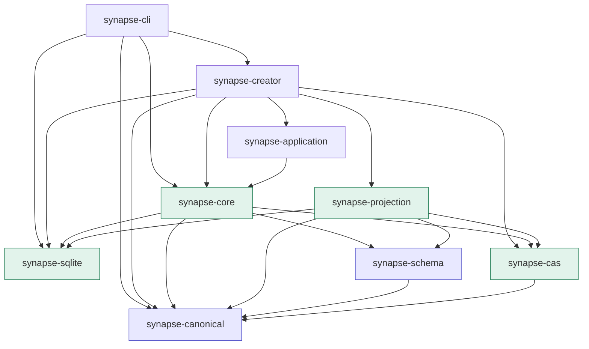

# Contributing to SynapseGit

SynapseGit Core は現在 Stage 0 draft である。特に OID、canonicalization、schema、Ref、archive の変更は、
既存 object の identity と復元性へ影響するため、code だけを先行変更しない。

## 開発環境

- Rust 1.85 以降
- Node.js 18 以降
- Python 3.10 以降（PPTX を再生成する場合のみ）

repository root で基本検証を実行する。

```bash
cargo fmt --all -- --check
cargo test --workspace --locked
cargo clippy --workspace --all-targets --all-features --locked -- -D warnings
cargo doc --workspace --no-deps --locked
node scripts/verify_core_fixtures.mjs
node scripts/verify_docs.mjs
git diff --check
```

複数 process / agent で Cargo を同時実行する場合は、壊れた incremental artifact と lock 競合を避けるため、
process ごとに target directory を分ける。

```bash
CARGO_TARGET_DIR=/tmp/synapsegit-$USER-target \
  cargo test --workspace --locked
```

## workspace map



| crate | 責務 |
|---|---|
| `synapse-canonical` | strict JSON、canonical bytes、OID、stable identity errors |
| `synapse-schema` | embedded Draft 2020-12 registry、concrete dispatch、local semantic validation |
| `synapse-cas` | filesystem ObjectStore、typed graph、closure、Tombstone、fsck |
| `synapse-sqlite` | transactional Ref compare-and-swap、reflog、logical archive snapshot |
| `synapse-projection` | disposable SQLite query index、explicit atomic rebuild、Ref-scoped timeline／Observation dependency／Analysis lineage／closure query |
| `synapse-application` | process-local authenticated Creative AI／narrow Human Decision route、one-shot permit、publication fence |
| `synapse-creator` | 3つのopaque fileからsession-local provenance、AI proposal、Human Decision、snapshot-bound reportを組み立てるcreate-only local Pilot orchestration |
| `synapse-core` | validated ingest、repository boundary、AI proposal／Human Decision admission、directory export / restore |
| `synapse-cli` | Coreのlocal commandと`creator-run`／`creator-report`を公開するStage 0 command-line interface |

依存方向を逆転させない。canonical identity layer は database、CLI、media adapter に依存しない。
`synapse-sqlite` は Ref と reflog の store であり、ProjectionStore ではない。
disposable SQLite query indexは別の`synapse-projection`に置き、正本やauthorizationへ使わない。
`synapse-creator`はApplication／Core／Projectionを組み合わせる上位orchestrationであり、これらの下位crateから
CreatorやCLIへ依存させない。

## 最初の動作確認

[Quickstart](docs/quickstart.md) は実 fixture を CLI で通し、put → Ref update → fsck → export → restore を確認する。
command の引数と出力は [CLI reference](docs/cli_reference.md) を参照する。

## 変更別 checklist

### OID または canonicalization

1. [`oid-profile.md`](spec/core/v0.1/oid-profile.md) を更新する。
2. positive / negative fixture と `golden.json` を更新する。
3. JavaScript verifier と Rust の独立実装が一致することを確認する。
4. 同じ `sg-oid-v1` で既存意味を変えてよい段階かを明示する。freeze 後は profile version を上げる。

`sg-oid-v1` はまだ Stage 0 draft であり、第二の独立 production implementation gate を通過していない。

### Record schema または local semantic rule

1. concrete schema と `record.schema.json` dispatcher を更新する。
2. set / sequence、identifier NFC、time、fixed-point annotation を明示する。
3. valid fixture、invalid case、claimed OID test を追加する。
4. [Core データモデル](docs/core_model.md) の catalog と protocol README を更新する。
5. repository graph の target type check が必要なら、Ref update / closure test も追加する。

object 単体で判定できる rule は ingest、参照先の存在・型を必要とする rule は Ref closure の責務に分ける。

### ObjectStore、Ref、archive

1. partial write、retry、concurrent writer、stale head を test する。
2. object publication より先に Ref を進めない。
3. Ref と reflog の atomicity を保つ。
4. export / restore 後に OID、closure、availability、Refs が一致することを確認する。
5. security assumption と残存リスクを [Security model](docs/security_model.md) へ反映する。
6. archive format を変更する場合は implementation-only change とせず、versioning と migration を記述する。

### CLI

`build-tree` と `commit` は JSON builder ではない。利用者が用意した body を、
それぞれ Tree / Commit family として validate + put する command である。
新 command または output を変える場合は process-level test、Quickstart、CLI reference を同時に更新する。

### Documentation

1. 実装済み、draft、planned を明記する。
2. normative statement は [`spec/core/v0.1`](spec/core/v0.1/README.md) へ置く。
3. diagram は GitHub-compatible Mermaid を優先する。
4. repository 内は相対 link を使い、`node scripts/verify_docs.mjs` を通す。
5. capability の状態が変わる場合は [docs index](docs/README.md) と root README を更新する。
6. 外部配布物の固定 URL が必要なら、`main` より release tag または commit permalink を選ぶ。

## error behavior

machine-readable error code は protocol と CLI の契約である。既存 code を prose message の都合だけで変更しない。
新しい rejection を追加するときは、どの layer が返すか、identity に影響するか、retry 可能かを明記し、
[`operations.md`](spec/core/v0.1/operations.md#11-stable-semantic-error-codes) と test を更新する。

## pull request の説明に含めるもの

- 何が変わり、どの不変条件を保つか
- normative spec / fixture / OID への影響
- migration または backward compatibility の扱い
- 実行した検証 command
- security、privacy、creator / Human Gate への影響
- 未解決事項と follow-up

設計の背景は [documentation index](docs/README.md)、動作確認は [Quickstart](docs/quickstart.md) を参照する。
