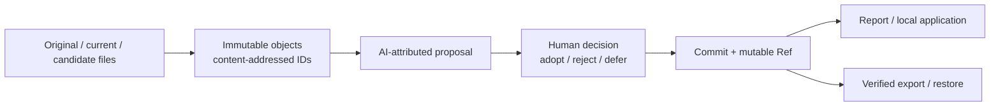

# SynapseGit

[English](./README.md) | [日本語](./README.ja.md)

[](https://github.com/howlrs/synapsegit/actions/workflows/ci.yml)


[](./LICENSE)

**人と AI が関わる創作の経緯と判断を、ローカルに残す provenance 基盤。**

SynapseGit は、素材ファイル、観測、AI に帰属させた提案、人の判断を、検証可能な
content-addressed history として記録する実験的な Git-like system です。複数の tool、
人、AI、場合によっては物理的な対象をまたぐ創作について、完成ファイルだけでは分からない
「何を意図し、何を観測し、何を退け、何を採用したか」を後から辿れるようにします。

Evidence、Analysis、Claim、Human Decision は意図的に分離します。draft profile の
OID が確認するのは byte identity であり、作者性、真実、著作権、許可、物理的変化を
証明するものではありません。


_実装済みの`synapse-local` project overviewです。`127.0.0.1`だけで配信され、
hosted serviceやmulti-user serviceではありません。_

## 現在このpreviewを活用できる人

v0.2.0 preview の主な対象は次の利用者です。

- local CLIを扱えるtechnical creator
- creative provenance、human-in-the-loop AI、content-addressed historyを
  評価する研究者・tool builder
- Core protocol、storage、application boundaryを検討するRust開発者

将来設計では、画家、建築家、施工・修復担当、デザイナー、作品の後任管理者も対象に
しています。ただしcapture tool、pixel-level比較、general-purposeなcreator UI、production
cloud serviceは未実装です。

## 3分で試す

tagged binaryの利用にRust toolchainは不要です。Ubuntu 22.04でbuildしたLinux x86_64
GNU向けで、glibc 2.34以降を必要とします。それ以外のplatformでは
[tagged sourceからのinstall](./docs/install.md#tagged-sourceからbuildする)を利用してください。

### 1. previewをinstallする

```bash
curl -LO https://github.com/howlrs/synapsegit/releases/download/v0.2.0/synapsegit-v0.2.0-x86_64-unknown-linux-gnu.tar.gz
curl -LO https://github.com/howlrs/synapsegit/releases/download/v0.2.0/SHA256SUMS
sha256sum --check SHA256SUMS
tar -xzf synapsegit-v0.2.0-x86_64-unknown-linux-gnu.tar.gz

mkdir -p "$HOME/.local/bin"
install -m 0755 synapsegit-v0.2.0-x86_64-unknown-linux-gnu/synapse "$HOME/.local/bin/synapse"
install -m 0755 synapsegit-v0.2.0-x86_64-unknown-linux-gnu/synapse-local "$HOME/.local/bin/synapse-local"
export PATH="$HOME/.local/bin:$PATH"

synapse --version
synapse-local --version
```

### 2. localの判断を一つ記録する

original、current、任意のtoolからexportしたcandidateの3画像を用意します。3番目のfileは
caller-suppliedなAI帰属outputとして記録されます。SynapseGit自身はAI modelを呼び出しません。

```bash
mkdir -p "$HOME/SynapseGit"

synapse creator-run "$HOME/SynapseGit/demo" session-1 \
  /path/to/original.png \
  /path/to/current.png \
  /path/to/candidate.png \
  --subject "My creative work" \
  --creator "Your name" \
  --decision defer \
  --rationale "Review this candidate later."

synapse creator-report "$HOME/SynapseGit/demo" session-1
```

`--decision`には`adopt`、`reject`、`defer`を指定できます。Pilotは3 fileをopaque Blobとして
保存し、provenanceと人の判断を記録し、repositoryを検査して、originalとcurrentのprimary
Blob bytesが同一かをreportします。pixelやEXIFは解析しません。

### 3. local画面で確認する

```bash
synapse-local \
  --project "demo=$HOME/SynapseGit/demo" \
  --label "demo=My first SynapseGit project"
```

processが表示した正確な`http://127.0.0.1:...`を開きます。上記でinstallしたv0.2.0のUIでは、
boundedな三file importとsame-process Human reviewもbrowserから実行できます。export、restore、
`fsck`、incomplete-session diagnosticsは引き続きCLIで行います。
[local application runbook](./deploy/local/README.md)、[install guide](./docs/install.md)、
[source Quickstart](./docs/quickstart.md)を参照してください。

## 現在動くもの

| 能力 | current `main`の状態 |
|---|---|
| `adopt`、`reject`、`defer`を含む3-file creator Pilot | boundedなlocal CLI flowとして実装済み |
| 人／AI帰属provenanceと比較情報を含むreport | 実装済み。AI outputはcaller-supplied |
| original／current比較 | primary Blobのbyte identityのみ。comparabilityは常にpartial |
| local browser UI | read表示とboundedな三file import／same-process `adopt`・`reject`・`defer`を実装済み。maintenanceはCLIのみ |
| content-addressed object、typed closure、Ref CAS、reflog | 実装済み、repository test対象 |
| `fsck`、checksum付きdirectory export、verified restore | local repository formatで実装済み |
| public multi-user service | architectureのみ。未実装 |
| pixel registration、視覚的／物理的な差分解析 | 未実装 |

「実装済み」は、このrepositoryのtestで検証される範囲を意味します。real-user認証、network
transport、production運用、一般利用者向けapplicationの完成を意味しません。

tagged v0.2.0の`synapse-local` binaryにはbrowser import／review sliceが含まれます。
review authorityはprocess-localで、restart後に再開できません。

## 仕組み



normative draftとJSON Schemaは[`spec/core/v0.1`](./spec/core/v0.1/README.md)にあります。
canonicalization、OID、schema validation、repository integrity、Ref update、現在のlocal
application route、archive verificationはRustが担当します。componentの詳細は
[runtime architecture](./docs/runtime_architecture.md)を参照してください。

## ドキュメント

| 目的 | 最初に読む資料 |
|---|---|
| Releaseをinstallする、tagからbuildする | [Installation](./docs/install.md) |
| sourceで完全なdemoを動かす | [Core Quickstart](./docs/quickstart.md) |
| creatorとAI-assisted use caseを知る | [使用ガイド](./docs/usage_guide.md) |
| loopback-only applicationを起動する | [Local application runbook](./deploy/local/README.md) |
| commandとerrorを調べる | [CLI reference](./docs/cli_reference.md) |
| 成熟度と次の作業を確認する | [Project status](./docs/project_status.md) |
| trust、privacy、security boundaryを確認する | [Security model](./docs/security_model.md) |
| protocolを実装する | [Core Protocol v0.1](./spec/core/v0.1/README.md) |
| releaseと配布方針を確認する | [Distribution guide](./docs/distribution.md) |
| 利用・Fork・contribution条件を確認する | [License](./LICENSE) / [日本語概要](./docs/license_ja.md) |
| 全資料から探す | [Documentation index](./docs/README.md) |

## 配布状況

- [`v0.2.0`](https://github.com/howlrs/synapsegit/releases/tag/v0.2.0)はprereleaseであり、
  production releaseではありません。
- 検証済みprebuilt artifactはLinux x86_64 GNU向けです。それ以外の対応可能なUnix-like
  environmentではtagged source buildを利用します。
- Stage 0ではcrates.ioとGHCRを配布channelにしません。
- Release assetにはSHA-256 checksumがあります。v0.2.0 archiveにはGitHub
  build-provenance attestationも付与します。
- object、archive、OID formatはdraftで、stable releaseまでに変わる可能性があります。

評価前に[changelog](./CHANGELOG.md)と
[v0.2.0 release notes](./docs/releases/v0.2.0.md)を確認してください。

## Security、support、license

`synapse-local`はloopbackのまま利用し、reverse proxyの背後へ公開したり、process-local browser
tokenをmulti-user認証として扱ったりしないでください。脆弱性の疑いはpublic Issueではなく、
[GitHub private vulnerability reporting](https://github.com/howlrs/synapsegit/security/advisories/new)から
報告してください。対応範囲と必要情報は[SECURITY.md](./SECURITY.md)にあります。

質問と再現可能な不具合の窓口は[SUPPORT.md](./SUPPORT.md)、変更への参加方法は
[CONTRIBUTING.md](./CONTRIBUTING.md)を参照してください。

Copyright (c) 2026 howlrs and K-Terashima. SynapseGitには独自の
[`SynapseGit Source-Available License 1.0`](./LICENSE)が適用されます。OSI承認の
open-source licenseではありません。GitHub Fork、Fork内でのsource改変、upstreamへの
Pull Request、および非商用評価のための管理下環境でのbuild／実行／testを許可します。
商用・production・hosted利用と、許可されたGitHub Forkの範囲外での再配布には、別途書面の
許可が必要です。元のarchiveに`LICENSE`が含まれていないv0.1.0にも、このlicenseを適用します。
[日本語概要](./docs/license_ja.md)は参考訳であり、root `LICENSE`が正本です。

Rust依存componentには[THIRD_PARTY_NOTICES.md](./THIRD_PARTY_NOTICES.md)に収録した
各third-party licenseが適用されます。
