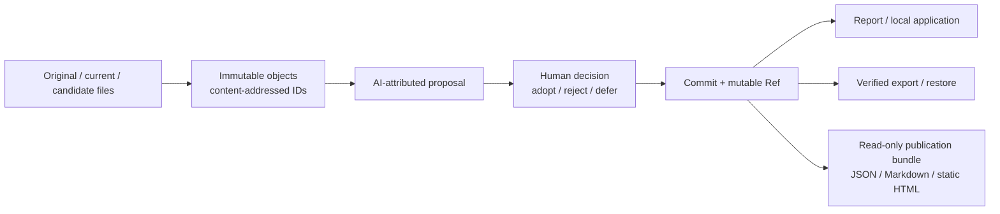

# SynapseGit

[English](./README.md) | [日本語](./README.ja.md)

[](https://github.com/howlrs/synapsegit/actions/workflows/ci.yml)


[](./LICENSE)

**人と AI が関わる創作の経緯と判断を、ローカルに残す provenance 基盤。**

SynapseGit は、素材ファイル、観測、AI に帰属させた提案、人の判断を、検証可能な
content-addressed history として記録する実験的な Git-like system です。複数の tool、
人、AI、場合によっては物理的な対象をまたぐ創作について、完成ファイルだけでは分からない
「何を意図し、何を観測し、何を退け、何を採用したか」を後から辿れるようにします。

Evidence、Analysis、Claim、Human Decision は意図的に分離します。draft profile の
OID が確認するのは byte identity であり、作者性、真実、著作権、許可、物理的変化を
証明するものではありません。


_実装済みの`synapse-local` project overviewです。`127.0.0.1`だけで配信され、
hosted serviceやmulti-user serviceではありません。_

## 現在このpreviewを活用できる人

v0.3.0 preview の主な対象は次の利用者です。

- local CLIを扱えるtechnical creator
- creative provenance、human-in-the-loop AI、content-addressed historyを
  評価する研究者・tool builder
- Core protocol、storage、application boundaryを検討するRust開発者

将来設計では、画家、建築家、施工・修復担当、デザイナー、作品の後任管理者も対象に
しています。ただしcapture tool、pixel-level比較、general-purposeなcreator UI、production
cloud serviceは未実装です。

## 3分で試す

tagged binaryの利用にRust toolchainは不要です。Ubuntu 22.04でbuildしたLinux x86_64
GNU向けで、glibc 2.34以降を必要とします。それ以外のplatformでは
[tagged sourceからのinstall](./docs/install.md#tagged-sourceからbuildする)を利用してください。

### 1. previewをinstallする

```bash
curl -LO https://github.com/howlrs/synapsegit/releases/download/v0.3.0/synapsegit-v0.3.0-x86_64-unknown-linux-gnu.tar.gz
curl -LO https://github.com/howlrs/synapsegit/releases/download/v0.3.0/SHA256SUMS
sha256sum --check SHA256SUMS
tar -xzf synapsegit-v0.3.0-x86_64-unknown-linux-gnu.tar.gz

mkdir -p "$HOME/.local/bin"
install -m 0755 synapsegit-v0.3.0-x86_64-unknown-linux-gnu/synapse "$HOME/.local/bin/synapse"
install -m 0755 synapsegit-v0.3.0-x86_64-unknown-linux-gnu/synapse-local "$HOME/.local/bin/synapse-local"
install -m 0755 synapsegit-v0.3.0-x86_64-unknown-linux-gnu/synapse-present "$HOME/.local/bin/synapse-present"
export PATH="$HOME/.local/bin:$PATH"

synapse --version
synapse-local --version
synapse-present --version
```

### 2. localの判断を一つ記録する

original、current、任意のtoolからexportしたcandidateの3画像を用意します。3番目のfileは
caller-suppliedなAI帰属outputとして記録されます。SynapseGit自身はAI modelを呼び出しません。

```bash
mkdir -p "$HOME/SynapseGit"

synapse creator-run "$HOME/SynapseGit/demo" session-1 \
  /path/to/original.png \
  /path/to/current.png \
  /path/to/candidate.png \
  --subject "My creative work" \
  --creator "Your name" \
  --decision defer \
  --rationale "Review this candidate later."

synapse creator-report "$HOME/SynapseGit/demo" session-1
```

`--decision`には`adopt`、`reject`、`defer`を指定できます。Pilotは3 fileをopaque Blobとして
保存し、provenanceと人の判断を記録し、repositoryを検査して、originalとcurrentのprimary
Blob bytesが同一かをreportします。pixelやEXIFは解析しません。

### 3. local画面で確認する

```bash
synapse-local \
  --project "demo=$HOME/SynapseGit/demo" \
  --label "demo=My first SynapseGit project"
```

processが表示した正確な`http://127.0.0.1:...`を開きます。上記でinstallしたv0.3.0のUIでは、
boundedな三file import、same-process Human review、creator Ref／headと安全な推奨actionを示す
read-only diagnostics、project keyの明示確認を必要とするserver-boundedなbackground `fsck`を
利用できます。export／restoreは引き続きCLIのみです。diagnosticsとmaintenanceはsessionの
resume、cleanup、history書換えを行いません。
[local application runbook](./deploy/local/README.md)、[install guide](./docs/install.md)、
[source Quickstart](./docs/quickstart.md)を参照してください。

## 現在動くもの

| 能力 | current `main`の状態 |
|---|---|
| `adopt`、`reject`、`defer`を含む3-file creator Pilot | boundedなlocal CLI flowとして実装済み |
| 人／AI帰属provenanceと比較情報を含むreport | 実装済み。AI outputはcaller-supplied |
| original／current比較 | primary Blobのbyte identityのみ。comparabilityは常にpartial |
| local browser UI | read表示、boundedな三file import／same-process `adopt`・`reject`・`defer`、read-only incomplete-session diagnostics、確認付きbackground `fsck`を実装済み。archive maintenanceはCLIのみ |
| generic regular-file artifact building block | current `main`のRust libraryとしてbounded deterministic mapper／checkout、sequential Proposal／Decision、host-authenticated one-shot approval、SQLite journal統合済みrestart／reconciliation境界、固定v1 public-safe contract、別local public projectionを実装。HTTP、CLI、browser UI、model invocation、multi-process control plane、production serviceは提供しない |
| content-addressed object、typed closure、Ref CAS、reflog | 実装済み、repository test対象 |
| `fsck`、checksum付きdirectory export、verified restore | local repository formatで実装済み |
| 人とAI向けのread-only履歴presentation | v0.3.0に収録。canonical JSON、Markdown、JavaScriptなしHTML、manifest、checksum、Synapse／GitHub target layoutをdeterministicなlocal bundleとして生成し、upload／network accessは行わない |
| public multi-user service | architectureのみ。未実装 |
| pixel registration、視覚的／物理的な差分解析 | 未実装 |

「実装済み」は、このrepositoryのtestで検証される範囲を意味します。current `main`のsource／
API-contract boundaryと明記したrowはuntaggedなsource／schema surfaceを表し、transport統合のtest完了を
意味しません。どちらもreal-user認証、network transport、production運用、一般利用者向けapplicationの
完成を意味しません。

current `main`には、sibling applicationがgenericなregular-file reviewを実装するための
評価用building blockもあります。`synapse-artifact`はregular-file manifest全体を検証し、Refを
進めずにnested site Treeへdeterministicに変換します。trusted workflowはprofile-owned repositoryを
初期化し、canonical Decisionのexact headごとにactive Proposalを最大一つpublishします。
completed Decisionで選ばれたsiteは次のProposalのverified accepted baseとなり、attemptごとにfreshな
deterministic Ref／immutable identityを持つため、過去のProposal historyは保持されます。

same-process pending authorityは引き続きnon-serializableかつone-shotです。
`decide_artifact_proposal`には、embedding hostがreviewerをauthenticateしserver-owned project ACLを
確認した後にだけ発行するopaque／expiringな`ArtifactDecisionApproval`も必要です。approvalはexactな
actor／session、security epoch、Proposal／expected Decision head、disposition、rationaleの有無とbytesへ
束縛され、Decision object／Ref mutationより前にburnされます。browser fieldや`ReviewId`から復元しません。
v1 workflowが扱うのはcaller-supplied AI-attributed bytesだけで、verified executionを表現できません。
SynapseGit自身はmodelを呼びません。

固定された
[`synapsegit.generic-artifact` v1 contract](./spec/application/generic-artifact/v1/README.md)の
opaque `ReviewId`はlookup locatorであり、authorityではありません。別SQLite journalと明示的な
orchestration境界は、Proposal CAS前にprivate intentを登録し、exact publication確認後だけpublic-safeな
locatorを確定します。Decision CAS前にはexact intentを保存し、live Ref／reflog reconciliationとboundedな
selected-site checkoutの後だけterminal outcomeをcommitします。exact retryはidempotentです。restart後は
trusted configとjournal factsをimmutable object／一貫したlive Ref stateへ照合してfresh application authorityを
構築します。credential、admitted handle、approval、registration、permitはserialize／restoreせず、reviewerは
再authenticationと新しいapprovalが必要です。final publicationは引き続き`HumanDecisionRuntime`のfull
validationとCASを通ります。

Core Ref／reflogとjournalのSQLite transactionは別なので、cross-database atomicityを主張せず、crash windowを
bounded reconciliationで解決します。Rust trusted workflow valueはgetter-onlyなprocess valueで、browserから
authorityとして渡すtransport DTOではありません。

これらはcurrent `main`のsource-level Rust／application-contract capabilityであり、tagged v0.3.0
binaryの機能ではありません。background serviceによる自動resume、HTTP／CLI route、model invocation、generic browser editor、
durable identity／ACL storage、multi-process linearizability、production利用、配布許可は提供しません。v0.3.0 Creator Pilotと
localhost UIは引き続き画像専用で、そのpending review authorityはsame-processかつrestart後に
resumeできません。

tagged v0.3.0の`synapse-local` binaryにはbrowser import／review、専用diagnostics、bounded browser
`fsck`が含まれます。review authorityとmaintenance job stateはprocess-localで、restart後に
再開できません。

v0.3.0 archiveには別binaryの`synapse-present`もあります。既存CASを変更せず、checkpoint済みで最大
512 MiBのRef SQLiteをprivate temporary copyへ取り込み、copy時とcopy後sourceのSHA-256一致を要求します。
SQLiteにはsource databaseを直接openさせません。sidecarまたはcopy中に変化するsourceは
`read_only_source_busy`で拒否します。
最大100 creator sessionsからGitHub-readyなlocal viewを生成できますが、GitHubへのupload／publish／
通信は行いません。private rationale、internal Actor ID、
repository path、raw assetは除外し、raw asset renderingは未実装です。public noteは別の
author-supplied textとして扱います。詳しくは[CLI reference](./docs/cli_reference.md#synapse-present-companion-cli)を参照してください。

さらにcurrent `main`は、versioned generic-artifact projection／local bundle APIを提供します。complete projectionは
上記bounded Decision checkoutからのみ構築し、pending／incomplete projectionはrepository／authority identifierを
含みません。canonical JSON、escaped Markdown、script-free HTML、manifest、checksums、local Synapse／GitHub
layoutをGit／network accessなしで生成します。remote Synapse／GitHub adapter、Git import／provenance、identity
mapping、GitHub App、hosted serviceは独立したroadmap作業であり、このsource-only sliceだけで
[#17](https://github.com/howlrs/synapsegit/issues/17)全体を実装したとは扱いません。

## 仕組み



normative draftとJSON Schemaは[`spec/core/v0.1`](./spec/core/v0.1/README.md)にあります。
canonicalization、OID、schema validation、repository integrity、Ref update、現在のlocal
application route、archive verificationはRustが担当します。componentの詳細は
[runtime architecture](./docs/runtime_architecture.md)を参照してください。

## ドキュメント

| 目的 | 最初に読む資料 |
|---|---|
| Releaseをinstallする、tagからbuildする | [Installation](./docs/install.md) |
| sourceで完全なdemoを動かす | [Core Quickstart](./docs/quickstart.md) |
| creatorとAI-assisted use caseを知る | [使用ガイド](./docs/usage_guide.md) |
| loopback-only applicationを起動する | [Local application runbook](./deploy/local/README.md) |
| commandとerrorを調べる | [CLI reference](./docs/cli_reference.md) |
| read-only local publication bundleを生成する | [CLI reference](./docs/cli_reference.md#synapse-present-companion-cli) |
| publicationの理解度を評価する | [complete／incomplete-only固定コーパス](./docs/evaluation/publication-comprehension/v1/) |
| generic regular-file contractをembedする | [Generic artifact v1](./spec/application/generic-artifact/v1/README.md) |
| 成熟度と次の作業を確認する | [Project status](./docs/project_status.md) |
| trust、privacy、security boundaryを確認する | [Security model](./docs/security_model.md) |
| protocolを実装する | [Core Protocol v0.1](./spec/core/v0.1/README.md) |
| releaseと配布方針を確認する | [Distribution guide](./docs/distribution.md) |
| 利用・Fork・contribution条件を確認する | [License](./LICENSE) / [日本語概要](./docs/license_ja.md) |
| 全資料から探す | [Documentation index](./docs/README.md) |

## 配布状況

- [`v0.3.0`](https://github.com/howlrs/synapsegit/releases/tag/v0.3.0)はprereleaseであり、
  production releaseではありません。
- 検証済みprebuilt artifactはLinux x86_64 GNU向けです。それ以外の対応可能なUnix-like
  environmentではtagged source buildを利用します。
- Stage 0ではcrates.ioとGHCRを配布channelにしません。
- Release assetにはSHA-256 checksumがあります。v0.3.0 archiveにはGitHub
  build-provenance attestationも付与します。
- object、archive、OID formatはdraftで、stable releaseまでに変わる可能性があります。

評価前に[changelog](./CHANGELOG.md)と
[v0.3.0 release notes](./docs/releases/v0.3.0.md)を確認してください。

## Security、support、license

`synapse-local`はloopbackのまま利用し、reverse proxyの背後へ公開したり、process-local browser
tokenをmulti-user認証として扱ったりしないでください。脆弱性の疑いはpublic Issueではなく、
[GitHub private vulnerability reporting](https://github.com/howlrs/synapsegit/security/advisories/new)から
報告してください。対応範囲と必要情報は[SECURITY.md](./SECURITY.md)にあります。

質問と再現可能な不具合の窓口は[SUPPORT.md](./SUPPORT.md)、変更への参加方法は
[CONTRIBUTING.md](./CONTRIBUTING.md)を参照してください。

Copyright (c) 2026 howlrs and K-Terashima. SynapseGitには独自の
[`SynapseGit Source-Available License 1.0`](./LICENSE)が適用されます。OSI承認の
open-source licenseではありません。GitHub Fork、Fork内でのsource改変、upstreamへの
Pull Request、および非商用評価のための管理下環境でのbuild／実行／testを許可します。
商用・production・hosted利用と、許可されたGitHub Forkの範囲外での再配布には、別途書面の
許可が必要です。元のarchiveに`LICENSE`が含まれていないv0.1.0にも、このlicenseを適用します。
[日本語概要](./docs/license_ja.md)は参考訳であり、root `LICENSE`が正本です。

Rust依存componentには[THIRD_PARTY_NOTICES.md](./THIRD_PARTY_NOTICES.md)に収録した
各third-party licenseが適用されます。
