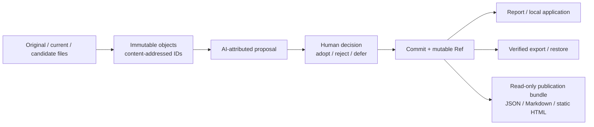

# SynapseGit

[English](./README.md) | [日本語](./README.ja.md)

[](https://github.com/howlrs/synapsegit/actions/workflows/ci.yml)


[](./LICENSE)

**AIが何を提案し、あなたが何を決めたかを、手元に記録する。**

SynapseGitは、元の状態（Original）、今の状態（Current）、AIが作った案（AI output）、
それに対するあなたの判断（採用・不採用・保留）を、検証できる履歴としてあなたのコンピューターに記録します。
コマンドの操作はAIエージェントに任せられますが、判断はあなたが行います。後から、あなた自身や作業を
引き継ぐ人が、何が提案され、何を選び、なぜそうしたかを確かめられます。

SynapseGitは、証拠、AIの提案、人の判断を分けて扱います。記録の識別子はファイルの内容が変わっていない
ことを確かめるもので、作者性、真実、著作権、許可、物理的な変化を証明するものではありません。


_実際の`synapse-local`の画面です。`127.0.0.1`だけで配信され、hosted serviceやmulti-user serviceでは
ありません。_

## 解決すること

完成したファイルだけでは、どう決めたかが分かりません。

- どれが元の参照で、手を加える前はどんな状態だったか
- どの出力がAIによるもので、AIに何を頼んだか
- 人はそれを採用したのか、採用しなかったのか、保留したのか。その理由は何か

SynapseGitは、それぞれを独立した記録として残し、最後に作られたファイルを自動で採用したことにはしません。

| 入力 | 提案 | 人の判断 | 確かめられる結果 |
|---|---|---|---|
| OriginalとCurrentのファイル | あなたが用意したAI output | `adopt`、`reject`、`defer` | report、timeline、整合性の確認、backup、ローカルの閲覧用bundle |

## 1つの例

画像付きの[15分 壁画チュートリアル](./docs/tutorial/README.ja.md)では、3枚の合成画像を使い、
実行するコマンド、実際のlocalhostの画面、困ったときの対処を順に確認できます。

| Original | Current | AI proposal |
|---|---|---|
|  |  |  |

画像は生成したfixtureであり、実在の作品や処置の証拠ではありません。
このrepositoryでは[2026-10-02版の画像](./docs/assets/image-generation.json)を使います。
v1.0.0 archiveにはこの3枚のtutorial画像を同梱します。以前のreleaseはその版の素材を保持するため、
sessionで使ったreleaseと素材の版を記録してください。

## 始める

### 1. installする

v1.0.0の配布archiveはRust toolchainなしで使えます。Linux x86_64（glibc 2.34以降）と
Apple SiliconのmacOSに対応します。他のplatformでは
[tagged sourceからbuild](./docs/install.md#build-from-a-tagged-source-release)できます。

```bash
curl -LO https://github.com/howlrs/synapsegit/releases/download/v1.0.0/synapsegit-v1.0.0-x86_64-unknown-linux-gnu.tar.gz
curl -LO https://github.com/howlrs/synapsegit/releases/download/v1.0.0/SHA256SUMS
sha256sum --check --ignore-missing SHA256SUMS
```

確認に失敗したら、そこで止めてください。build provenanceの確認、macOSの手順、3つのbinaryの置き場所は
[installation guide](./docs/install.md)にあります。

### 2. AIエージェントに準備を任せ、判断は自分でする

AIエージェントに[AIエージェント向けガイド](./docs/ai_agent_guide.ja.md)を渡します（release archiveにも
`AI_AGENT_GUIDE.ja.md`として入っています）。そのうえで、例えば次のように頼みます。

> 先にSynapseGitのAIエージェント向けガイドを読んで。この候補を`synapse inbox put`でInboxへ置き、
> `synapse-local`を起動してURLを教えて。判断は私がするので、代わりに選ばないで。

URLを開き、プロジェクトの「取り込む」ページで候補を確認して提案を作成し、画像を見比べてから、
採用・不採用・保留を選びます。その後、エージェントは`synapse creator-list`と
`synapse creator-report --format json`で結果を読み、`synapse export`でbackupを作れます。

### 3. コマンドから直接記録する

```bash
synapse init "$HOME/SynapseGit/demo"
synapse creator-run "$HOME/SynapseGit/demo" session-1 \
  /path/to/original.png /path/to/current.png /path/to/candidate.png \
  --subject "制作中の作品" --creator "あなたの名前" \
  --decision defer --rationale "この候補は後で見直す。"
synapse creator-report "$HOME/SynapseGit/demo" session-1
```

ブラウザで見るには、`synapse-local --project "demo=$HOME/SynapseGit/demo"`を実行し、表示された
`http://127.0.0.1:...`のURLを開きます。各コマンドは`--help`で使い方を表示します。

## 今できること

| できること | 場所 |
|---|---|
| Original、Current、AI outputと、あなたの判断と理由を記録する | ブラウザの「取り込む」ページ、`synapse creator-run` |
| AIエージェントに判断させずに候補をInboxへ置いてもらい、ブラウザで判断する | `synapse inbox put`と「取り込む」ページ |
| 2枚の画像を並べて、または重ねて、全体表示・100%・200%で見比べる | セッションの画面 |
| 任意の生成メモと、画像上のピンを付ける | 取り込みのformとセッションの画面 |
| 過去の判断を、日時とタイムラインで読み返す | セッションの画面、`creator-list`、`creator-report`（textまたはJSON） |
| 記録から次の案を試す。保留や中断した提案を新しいセッションで改めて判断する | セッションの画面 |
| 整合性を確認し、backupを作り、復元する | 「管理」ページ、`fsck`、`export`、`restore` |
| 非公開のメモを含まない、ローカルの閲覧用bundleを作る | `synapse-present`と公開用の制作ノート |
| 日本語または英語の画面で使う | headerの言語切り替え |

## しないこと

- **AIモデルを実行しません。** AI outputはあなたが用意したファイルです。SynapseGitはそれを外部で用意された
  もの（caller-supplied）として記録し、どのモデルが作ったかを主張しません。
- **画像ではなく、ファイルの内容を比べます。** 一致確認はbytesが同じかどうかを示します。同じ内容でも
  対象物が変わっていないことの証明にはならず、内容が違っても見た目や物理的な変化の証明にはなりません。
  位置合わせや差分解析はありません。
- **記録した判断は、そのセッションでは変えられません。** 同じ画像を新しいセッションで改めて判断でき、
  元の記録は残ります。
- **ローカルで1人が使うものです。** `synapse-local`は`127.0.0.1`だけで動きます。hosted serviceや
  multi-user serviceはなく、何もuploadしません。
- **platform:** v1.0.0 archiveはLinux x86_64とmacOS arm64用です。Windowsには対応しません。
  Linux ARM64はsourceからbuildします。

配布binaryではなく、Rust libraryとしてだけある機能もあります。実装者は
[実装の境界とlibraryだけの機能](./docs/implementation_boundaries.md)を参照してください。

## 仕組み


```mermaid
flowchart LR
    F["Original / current / candidate files"] --> O["Immutable objects\ncontent-addressed IDs"]
    O --> P["AI-attributed proposal"]
    P --> H["Human decision\nadopt / reject / defer"]
    H --> C["Commit + mutable Ref"]
    C --> R["Report / local application"]
    C --> A["Verified export / restore"]
    C --> V["Read-only publication bundle\nJSON / Markdown / static HTML"]
```

1. **観測**: 元の状態と今の状態のファイルを、そのまま残す。
2. **提案**: 出力をAIによるものとして記録する。どう作られたかは主張しない。
3. **判断**: 人が採用・不採用・保留を選ぶ。
4. **確認**: 識別子、履歴、repositoryの整合性を確かめる。
5. **提示**: 非公開のメモを含まない、ローカルの閲覧用bundleを作る。

詳しくは[Core Protocol](./spec/core/v0.1/README.md)と[runtime architecture](./docs/runtime_architecture.md)を
参照してください。

## ドキュメント

| 目的 | 最初に読む資料 |
|---|---|
| 画像付きの例を試す | [15分 壁画チュートリアル](./docs/tutorial/README.ja.md) |
| releaseをinstallする、tagからbuildする | [Installation](./docs/install.md) |
| AIエージェントにコマンドを任せる | [AIエージェント向けガイド](./docs/ai_agent_guide.ja.md) |
| 生成メモ、画像の比較、次の案を試す | [Creator操作ガイド](./docs/creator_workflow.md) |
| 公開用の文章とローカルのbundleを用意する | [公開用の制作ノート](./docs/presentation_sidecar.md) |
| プライバシーと信頼の限界を知る | [Security model](./docs/security_model.md) |
| コマンドとerrorを調べる | [CLI reference](./docs/cli_reference.md) |
| loopbackだけで動く画面を運用する | [Local application runbook](./deploy/local/README.md) |
| 何が互換のまま保たれるかを知る | [互換性方針](./docs/compatibility.md) |
| v1.0の範囲とリリース条件を見る | [v1.0 release plan](./docs/v1_release_plan.md) |
| Rust libraryを組み込む | [実装の境界](./docs/implementation_boundaries.md) / [Generic artifact v1](./spec/application/generic-artifact/v1/README.md) |
| すべての資料を見る | [ドキュメント一覧](./docs/README.md) |

## リリースと互換性

- SynapseGit v1.0.0はlocal single-user向けのreleaseです。各releaseはGitHubで公開し、SHA-256 checksumとbuild provenance
  attestationを付けます。crates.ioやcontainer registryでは配布しません。
- v1.0.0から、object、識別子、archiveの形式はv1.xの間固定され、公開したすべての版のrepositoryと
  archiveを読めます。[互換性方針](./docs/compatibility.md)を参照してください。
- 各releaseの変更は[CHANGELOG](./CHANGELOG.md)と[v1.0.0 release notes](./docs/releases/v1.0.0.md)にあります。
  重要なデータで試す前に、該当する資料を読んでください。

## Security、support、license

`synapse-local`はloopbackのまま利用し、reverse proxyの背後へ公開したり、process-local browser
tokenをmulti-user認証として扱ったりしないでください。脆弱性の疑いはpublic Issueではなく、
[GitHub private vulnerability reporting](https://github.com/howlrs/synapsegit/security/advisories/new)から
報告してください。対応範囲と必要情報は[SECURITY.md](./SECURITY.md)にあります。

質問と再現可能な不具合の窓口は[SUPPORT.md](./SUPPORT.md)、変更への参加方法は
[CONTRIBUTING.md](./CONTRIBUTING.md)を参照してください。

Copyright (c) 2026 howlrs and K-Terashima. SynapseGitには独自の
[`SynapseGit Source-Available License 1.0`](./LICENSE)が適用されます。OSI承認の
open-source licenseではありません。GitHub Fork、Fork内でのsource改変、upstreamへの
Pull Request、および非商用評価のための管理下環境でのbuild／実行／testを許可します。
商用・production・hosted利用と、許可されたGitHub Forkの範囲外での再配布には、別途書面の
許可が必要です。元のarchiveに`LICENSE`が含まれていないv0.1.0にも、このlicenseを適用します。
[日本語概要](./docs/license_ja.md)は参考訳であり、root `LICENSE`が正本です。

Rust依存componentには[THIRD_PARTY_NOTICES.md](./THIRD_PARTY_NOTICES.md)に収録した
各third-party licenseが適用されます。
