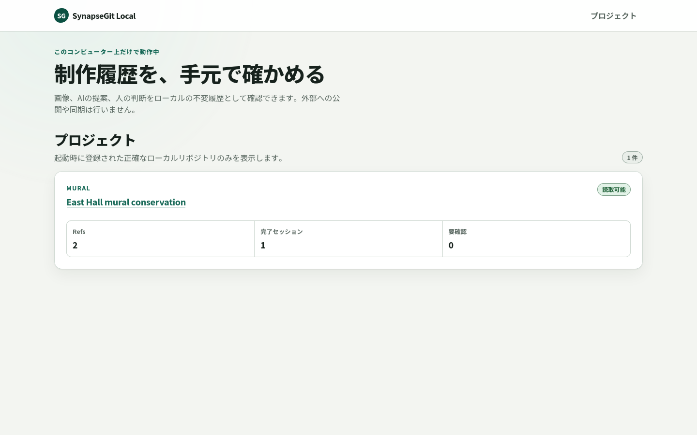
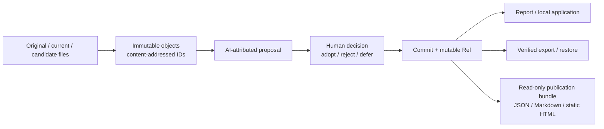

# SynapseGit

[English](./README.md) | [日本語](./README.ja.md)

[](https://github.com/howlrs/synapsegit/actions/workflows/ci.yml)


[](./LICENSE)

**Local-first provenance and decision history for creative work with humans and AI.**

SynapseGit is an experimental Git-like system that records source files,
observations, AI-attributed proposals, and human decisions as verifiable,
content-addressed history. It is designed for creative work that crosses tools,
people, AI systems, and sometimes physical objects—where a final file alone
does not explain what was intended, observed, rejected, or approved.

SynapseGit deliberately separates evidence, analysis, claims, and decisions.
An object identifier can verify byte identity under the draft profile; it does
not prove authorship, truth, copyright, permission, or physical change.



_The actual `synapse-local` project overview, served only from `127.0.0.1`.
It is not a hosted or multi-user service._

## Who can use this preview

The current v0.2.0 preview is most useful to:

- technical creators who are comfortable with a local command-line workflow;
- researchers and tool builders evaluating creative provenance,
  human-in-the-loop AI, or content-addressed history; and
- Rust developers exploring the Core protocol, storage, or application
  boundaries.

The longer-term design also targets painters, architects, construction and
conservation teams, designers, and future stewards of a work. Capture tooling,
pixel-level comparison, a general-purpose creator UI, and a production cloud
service are not implemented yet.

## Try it in three minutes

The tagged binary needs no Rust toolchain. It is built for Linux x86_64 GNU on
Ubuntu 22.04 and requires glibc 2.34 or newer. Other platforms can use the
[source installation](./docs/install.md#build-from-a-tagged-source-release).

### 1. Install the preview

```bash
curl -LO https://github.com/howlrs/synapsegit/releases/download/v0.2.0/synapsegit-v0.2.0-x86_64-unknown-linux-gnu.tar.gz
curl -LO https://github.com/howlrs/synapsegit/releases/download/v0.2.0/SHA256SUMS
sha256sum --check SHA256SUMS
tar -xzf synapsegit-v0.2.0-x86_64-unknown-linux-gnu.tar.gz

mkdir -p "$HOME/.local/bin"
install -m 0755 synapsegit-v0.2.0-x86_64-unknown-linux-gnu/synapse "$HOME/.local/bin/synapse"
install -m 0755 synapsegit-v0.2.0-x86_64-unknown-linux-gnu/synapse-local "$HOME/.local/bin/synapse-local"
export PATH="$HOME/.local/bin:$PATH"

synapse --version
synapse-local --version
```

### 2. Record one local decision

Choose three local image files: an original, the current state, and a candidate
output exported from any tool. The third file is recorded as caller-supplied
AI-attributed output; SynapseGit does not invoke an AI model.

```bash
mkdir -p "$HOME/SynapseGit"

synapse creator-run "$HOME/SynapseGit/demo" session-1 \
  /path/to/original.png \
  /path/to/current.png \
  /path/to/candidate.png \
  --subject "My creative work" \
  --creator "Your name" \
  --decision defer \
  --rationale "Review this candidate later."

synapse creator-report "$HOME/SynapseGit/demo" session-1
```

Use `adopt`, `reject`, or `defer` for `--decision`. The Pilot stores the three
files as opaque blobs, records provenance and the human disposition, checks the
repository, and reports whether the original and current blob bytes are
identical. It does not inspect pixels or EXIF data.

### 3. Inspect it locally

```bash
synapse-local \
  --project "demo=$HOME/SynapseGit/demo" \
  --label "demo=My first SynapseGit project"
```

Open the exact `http://127.0.0.1:...` URL printed by the process. The v0.2.0
binary supports bounded three-file import and same-process Human review in the
browser. Its `fsck`, export, and restore operations remain CLI-only, and it does
not include the dedicated incomplete-session diagnostics route. Current source
builds additionally show a read-only diagnosis with the current creator Ref/head
shape and provide an explicitly confirmed, server-bounded background `fsck` with
pollable results. Export and restore remain CLI-only. Neither addition resumes,
cleans up, or rewrites a creator session. See the
[local application runbook](./deploy/local/README.md), the
[installation guide](./docs/install.md), or the
[source Quickstart](./docs/quickstart.md).

## What works now

| Capability | Current `main` status |
|---|---|
| Three-file creator Pilot with `adopt`, `reject`, and `defer` | Implemented as a bounded local CLI flow |
| Human/AI-attributed provenance and a comparison-aware report | Implemented; AI output remains caller-supplied |
| Original/current comparison | Primary blob byte identity only; always partial comparability |
| Local browser interface | Read views, bounded three-file import, same-process `adopt` / `reject` / `defer`, read-only incomplete-session diagnostics, and confirmed background `fsck`; archive maintenance remains CLI-only |
| Content-addressed objects, typed closure, Ref CAS, and reflog | Implemented and covered by repository tests |
| `fsck`, checksum-bound directory export, and verified restore | Implemented for the local repository format |
| Read-only history presentation for people and AI | Implemented in current source as a deterministic local bundle: canonical JSON, Markdown, no-JavaScript HTML, manifest, checksums, and Synapse/GitHub target layouts; no upload or network access |
| Public multi-user service | Architecture only; not implemented |
| Pixel registration or visual/physical difference analysis | Not implemented |

“Implemented” means covered by this repository's tests. It does not mean that
real-user authentication, network transport, production operations, or a
general creator-facing application is ready.

The tagged v0.2.0 `synapse-local` binary includes the browser import/review
slice, but not the dedicated diagnostics or bounded browser `fsck` additions now
available in current source. Review authority and maintenance job state are
process-local and cannot be resumed after restart.

Current source also provides the separate `synapse-present` companion. It reads
the existing CAS without mutation and copies checkpointed Ref SQLite (up to
512 MiB) into a private temporary file, requiring the copy-time and post-copy
source SHA-256 to match; SQLite never opens the source database directly.
Sidecars or a changing source fail with
`read_only_source_busy`. It discovers at most 100 creator sessions and can
prepare a local GitHub-ready view, but it is not included in the published
v0.2.0 archive and does not upload, publish, or contact GitHub. Private
rationale, internal Actor IDs, repository paths, and raw assets stay omitted;
raw-asset rendering is not implemented, and a public note is separate
author-supplied text. See the [CLI reference](./docs/cli_reference.md).

## How it works



The normative draft and its JSON Schemas live under
[`spec/core/v0.1`](./spec/core/v0.1/README.md). Rust owns canonicalization,
object IDs, schema validation, repository integrity, Ref updates, the current
local application routes, and archive verification. Read the
[runtime architecture](./docs/runtime_architecture.md) for component details.

## Documentation

| Goal | Start here |
|---|---|
| Install a release or build from a tag | [Installation](./docs/install.md) |
| Run the complete source demo | [Core Quickstart](./docs/quickstart.md) |
| Understand creator and AI-assisted use cases | [Usage guide](./docs/usage_guide.md) |
| Run the loopback-only application | [Local application runbook](./deploy/local/README.md) |
| Look up commands and errors | [CLI reference](./docs/cli_reference.md) |
| Generate a read-only local publication bundle | [CLI reference](./docs/cli_reference.md#synapse-present-companion-cli) |
| Evaluate current maturity and next work | [Project status](./docs/project_status.md) |
| Review trust, privacy, and security limits | [Security model](./docs/security_model.md) |
| Implement the protocol | [Core Protocol v0.1](./spec/core/v0.1/README.md) |
| Understand releases and distribution | [Distribution guide](./docs/distribution.md) |
| Review use, Fork, and contribution terms | [License](./LICENSE) / [Japanese summary](./docs/license_ja.md) |
| Browse everything | [Documentation index](./docs/README.md) |

## Distribution status

- [`v0.2.0`](https://github.com/howlrs/synapsegit/releases/tag/v0.2.0) is a
  prerelease, not a production release.
- The supported prebuilt artifact is Linux x86_64 GNU. Tagged source builds are
  the current path for other supported Unix-like environments.
- crates.io and GHCR are intentionally not distribution channels for Stage 0.
- Release assets have SHA-256 checksums. The v0.2.0 archive also receives a
  GitHub build-provenance attestation.
- The object, archive, and OID formats remain draft and may change before a
  stable release.

See the [changelog](./CHANGELOG.md) and the
[v0.2.0 release notes](./docs/releases/v0.2.0.md) before evaluating the
preview with important data.

## Security, support, and license

Keep `synapse-local` on loopback; do not put it behind a reverse proxy or treat
its process-local browser token as multi-user authentication. Report a
suspected vulnerability through
[GitHub private vulnerability reporting](https://github.com/howlrs/synapsegit/security/advisories/new),
not a public issue. See [SECURITY.md](./SECURITY.md) for the supported scope and
report contents.

Questions and reproducible bugs are welcome through the paths in
[SUPPORT.md](./SUPPORT.md). Contributions should start with
[CONTRIBUTING.md](./CONTRIBUTING.md).

Copyright (c) 2026 howlrs and K-Terashima. SynapseGit uses the custom
[SynapseGit Source-Available License 1.0](./LICENSE), not an OSI-approved
open-source license. It permits GitHub Forks, source changes in those Forks,
upstream pull requests, and controlled local build/run/test for non-commercial
evaluation. Commercial, production, or hosted use and redistribution outside
the permitted GitHub Fork workflow require separate written permission. The
license also covers v0.1.0, although its original archive predates the bundled
license file. A non-authoritative [Japanese summary](./docs/license_ja.md) is
available; the root `LICENSE` is controlling.

Third-party Rust components remain under the terms collected in
[THIRD_PARTY_NOTICES.md](./THIRD_PARTY_NOTICES.md).
