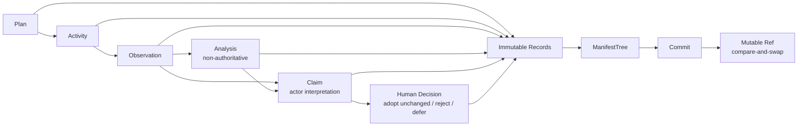
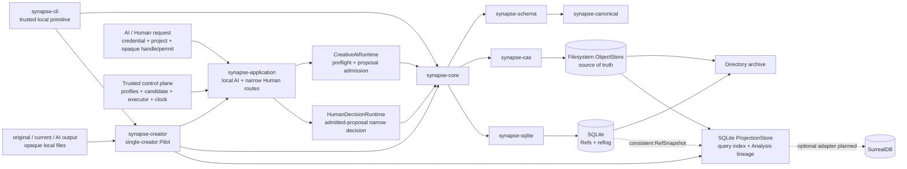

# SynapseGit

SynapseGit is a Git-like Core for preserving creative intent, evidence,
observations, interpretations, and decisions without treating a digital record
as physical truth.

**Core v0.1 / Stage 0 draft** — the local Rust repository path, Creative AI
proposal admission, process-local AI and narrow Human Decision routes, a
disposable SQLite query projection, and a bounded single-creator Pilot CLI are
implemented. The Pilot accepts three local image files without hand-authored
JSON; capture, pixel interpretation, image registration, and difference
analysis are not implemented.

> **Important:** `synapse-application` provides initial local Creative AI and
> narrow Human Decision routes: injected authentication, an exact project map/process ACL,
> candidate-independent Core preflight, one trusted executor, and a one-shot
> permit followed by full Core revalidation. `synapse-creator` uses those routes
> inside `creator-run` with fixed, process-local Pilot identities and a
> caller-supplied AI output. This is not OS-user authentication, HTTP/JWT, a
> durable or distributed authorization service, an OS sandbox,
> organization/quorum/release workflow, modified/partial adoption, or a general
> Projection route. `synapse update-ref` and `Repository::update_ref` remain
> low-level local trusted-operator primitives.

## Why it exists

Creative work crosses files, tools, people, AI systems, and sometimes physical
objects. A final artifact rarely explains what was intended, observed, tried,
rejected, or approved. SynapseGit stores those layers separately so later users
can recover a decision without turning analysis or testimony into “the truth.”



An OID proves byte identity under the draft profile. It does **not** prove
authorship, truth, capture time, copyright, permission, or contractual
conformance.

## What works now

| Capability | Status |
|---|---|
| Strict JSON, canonical bytes, domain-separated OIDs | Implemented |
| 15 concrete Record types and local semantic validation | Implemented |
| Filesystem ObjectStore, typed closure, Tombstone availability, `fsck` | Implemented |
| SQLite Ref compare-and-swap and reflog | Implemented |
| Validated ingest and checksum-bound directory export / restore | Implemented |
| Low-level local Core repository round-trip CLI; structured JSON is caller-supplied | Implemented |
| Local single-creator Pilot: three opaque images, generated provenance objects, AI/Human admission, decision, timeline/report, and restore verification without hand-authored JSON | Implemented bounded CLI/library flow |
| Fixed-viewpoint Observation dataset and image adapter | Planned |
| Creative AI proposal admission: exact capability set, snapshot/output binding, proposal-only, transaction-time expiry / `stale_base` | Implemented library boundary |
| Local authenticated Creative AI execution: exact project route/ACL, Core preflight, one-shot permit, trusted executor, post-execution reauthorization | Implemented process-local library boundary |
| Local authenticated narrow Human Decision: admitted-proposal handle, server-fixed candidate, one-shot permit, live ACL/profile fence, full Human Core validation | Implemented process-local library boundary |
| Human Decision admission: direct human/Policy binding, narrow disposition contract, atomic proposal + decision/base checks | Implemented library boundary |
| Rebuildable SQLite ProjectionStore baseline, including typed AnalysisResult lineage | Implemented library boundary; 22 crate tests |
| SurrealDB adapter and complete 8-query / benchmark comparison | Planned |

“Implemented” means covered by this repository's tests. It does not mean that
real-user authentication, network transport, deployment operations, image
analysis, or a creator-facing application are production-ready.

The initial application route authenticates before any project or repository
lookup, resolves an exact server-owned project map, and gives malformed,
unknown, and forbidden project selectors the same public semantic result. A
reusable authority profile supplies trusted authority, target Ref name, and
side-effect class while a one-time execution registration seals that profile
generation and the target's exact current-head expectation. Core preflight is read-only and
candidate-independent. Its sealed decision is wrapped by an opaque,
process-local permit that is burned before the injected executor runs. After
execution the route authenticates again, enters the project's FIFO
publication/ACL fence, rechecks live ACL/profile state, and keeps the fence
through full Core revalidation and Ref CAS.

`CreativeAiRuntime` still requires a checkpoint whose sole parent is the
ContextPack base, preserves every base non-Tree object, binds new output objects
against the candidate/base snapshot delta, and rechecks Grant time after
entering the Ref transaction. `HumanDecisionAuthority` separately fixes a
direct human, project, Policy, canonical decision Ref and exact current head,
and exact proposal Ref/head for the narrow Human library route. A successful AI
publication returns an instance/project/proposal-bound opaque
`AdmittedProposalHandle`. The trusted control plane borrows that handle to
register a server-fixed `HumanDecisionCandidate`; the evidence remains reusable
for a corrected registration after a denied attempt, while each registration
and permit is one-shot. Request calls then
`prepare_human_decision` and `publish_human_decision` with opaque one-shot state.
Human publication burns its permit, enters the same FIFO fence, rechecks live
ACL/profile/TTL, and invokes full `HumanDecisionRuntime` validation/CAS without
another executor, Core preflight, or reauthentication. Authenticator callbacks
run outside the fence and application/Repository locks; their result is a
point-in-time session decision. The fence linearizes process-local ACL/profile
changes, not instantaneous external credential-store revocation while queued.
Permit TTL bounds that window; production adapter/lease semantics remain a
deployment responsibility. HTTP/JWT,
durable/distributed ACL and permit state, the Projection application route,
multi-project CAS membership resolution, OS sandbox/egress enforcement, Grant
revocation, organization or quorum approval, modified/partial adoption, and
release approval remain unimplemented.

`synapse-projection::SqliteProjectionStore` is a disposable query index over a
verified filesystem ObjectStore and one caller-supplied consistent Ref
snapshot. Its explicit `rebuild` atomically replaces derived rows for current
Ref closures, excludes orphan objects, preserves missing diagnostics separately
from tombstoned availability/counts, and records a projection schema version and source fingerprint.
The baseline exposes Ref-scoped closure diagnostics, Subject
Observation/Activity timelines, Observation dependencies, and typed
AnalysisResult lineage across adapter, ordered inputs, transforms, derived
Blobs, and masks. Replay readiness means only that input, adapter/configuration,
and transform prerequisites are present; outputs and masks do not block an
attempt, and `Ready` never promises exact replay. It is not an
authorization source, ObjectStore, RefStore, archive input, or recovery
prerequisite. `creator-report` uses a fresh in-memory rebuild for one bounded
creator-session timeline, but there is no general projection CLI, automatic
refresh, or SurrealDB adapter yet, and the full eight-query and benchmark
decision remains open.
Like export, rebuild assumes a cooperative append-only ObjectStore with no
concurrent GC/removal. An object that disappears after being observed present
fails the rebuild and leaves the prior projection intact; it is not downgraded
to a new missing diagnostic. An embedding service must monitor rebuild failures
and projection fingerprint/freshness without using projection age as an
authorization input.

## Run the local round trip

Requirements: Rust 1.85+; Node.js 18+ only for the fixture verifier.

```bash
cargo build -p synapse-cli --locked
node scripts/verify_core_fixtures.mjs
```

The runnable [Quickstart](docs/quickstart.md) uses the included fixtures to:

```text
put Blob / Record / Tree / Commit
  -> verify Commit closure
  -> update Ref with expected head
  -> fsck
  -> directory export
  -> restore objects
  -> restore Refs last
```

For command syntax, output, limits, and errors, see the
[CLI reference](docs/cli_reference.md).

The local single-creator Pilot takes original, current, and caller-supplied AI
output files and creates the Subject, Observations, Activities, ContextPack,
proposal, and Human Decision without JSON authoring:

```bash
target/debug/synapse creator-run .synapse-creator mural-1 \
  original.png current.png ai-output.png \
  --subject "North wall mural" --creator "Aki" \
  --decision adopt --rationale "The proposal fits the intended palette."
target/debug/synapse creator-report .synapse-creator mural-1
target/debug/synapse export .synapse-creator creator-archive
target/debug/synapse restore creator-archive restored.synapse
target/debug/synapse creator-report restored.synapse mural-1
```

`creator-run` does not call an AI model or inspect pixels: all three files are
stored as opaque Blobs, and the third file is trusted local input labelled as
the AI proposal output. `adopt` selects that proposal unchanged; `reject` and
`defer` retain the base decision snapshot while preserving the proposal and its
AI provenance. `proposal_attributed_to_agent` is therefore attribution recorded
by the Pilot, while `ai_output_source=caller_supplied` states where the bytes
came from; neither proves that this command or a model generated them.

Each run creates fresh, session-local EntityIds from the operating system's
cryptographic random source. The Subject extension manifest preserves those IDs
for reporting and archive restore, but they are not stable identity for the same
person across sessions. The Pilot does not invent event time from local files:
Observation `capture_time` and Activity `valid_time` are `unknown`. Timeline rows
use strictly increasing recording timestamps with a `recorded_at` fallback and
must not be read as capture or AI-execution time. A report resolves both creator
Refs from one consistent Ref snapshot, revalidates the proposal and decision
lineage, and returns the base, proposal, and decision snapshots plus whether the
AI output was selected. Its text output separates
`proposal_attributed_to_agent`, `reviewed_by_human`, and `selected`; only
`adopt` selects the proposal. Generated DecisionFeedback defaults to reason
`unspecified`, private visibility, and prohibited training use. The command runs
`fsck`; archive export and restore remain separate. Sessions are create-only: a
failure after base Ref publication but before the Human Decision can leave
`creator_session_incomplete`, while a failure after Decision publication can
leave a complete session whose report must be retried. Neither state is resumed
or cleaned up automatically.

## Documentation

Start with the [documentation index](docs/README.md).

| Audience / goal | Document |
|---|---|
| Try the implementation | [Quickstart](docs/quickstart.md) |
| Understand the user and Pilot flow | [使用ガイド](docs/usage_guide.md) |
| Understand objects and Records | [Core data model](docs/core_model.md) |
| Look up terminology and common questions | [Glossary](docs/glossary.md) / [FAQ](docs/faq.md) |
| Understand storage and process boundaries | [Runtime architecture](docs/runtime_architecture.md) |
| Review trust and security limits | [Security model](docs/security_model.md) |
| Contribute code or docs | [Contributing](CONTRIBUTING.md) |
| Resume the current work | [作業引き継ぎ](docs/handoff.md) |
| Implement the protocol | [Core Protocol v0.1](spec/core/v0.1/README.md) |
| Implement compatible OIDs | [OID profile](spec/core/v0.1/oid-profile.md) |
| Implement Ref / graph semantics | [Operations](spec/core/v0.1/operations.md) |
| Implement local archive interchange | [Archive profile](spec/core/v0.1/archive-profile.md) |
| View intended-user scenarios | [Presentation guide](docs/presentations/README.md) |

The [Core concept](docs/core_concept.md) is the detailed design narrative.
The [initial Chrono-Synapse proposal](docs/init_plan.md) is historical source
vision, not the current Core specification.

## Runtime boundary



Rust owns canonicalization, OIDs, schema validation, storage integrity, Ref
updates, the initial local AI and narrow Human application routes, AI proposal and Human Decision
admission, projection rebuilding, and archive verification. TypeScript is intended
for UI / SDK work; Python is intended for media and AI adapters. Adapters submit
data to Core and do not define authoritative OIDs themselves. The embedding
application control plane, rather than AI-controlled input or CLI reflog
metadata, supplies the trusted authority profile, target, executor, and clock.
The creator Pilot supplies a fixed local control plane and rebuilds a bounded
timeline report; general Projection access still requires a separate embedding
route.

## Verify the workspace

```bash
cargo fmt --all -- --check
cargo test --workspace --locked
cargo clippy --workspace --all-targets --all-features --locked -- -D warnings
cargo doc --workspace --no-deps --locked
node scripts/verify_core_fixtures.mjs
node scripts/verify_docs.mjs
git diff --check
```

The current test suite covers 17 structured golden fixtures, the raw Blob
fixture, schema / semantic rejection, concurrent object publication, Ref races,
closure and Tombstone states, Creative AI proposal authorization, base-object
preservation and atomic base preconditions, Core preflight and the process-local
one-shot AI and narrow Human application routes, narrow Human Decision authorization,
duplicate-decision/race handling, candidate/output hardening and transaction-time expiry guards,
atomic projection rebuild/query behavior (3 unit + 19 integration tests), CLI round trip, resumable failed restore,
the single-creator three-image AI/Human workflow and restored report equality,
bounded archive inventory/distinct-head validation, and process-level export/update stress/smoke coverage.
The latter does not deterministically prove SQLite transaction overlap. Per-write-boundary crash injection and
startup cleanup of orphan archive staging and ObjectStore temporary files remain open.

The `sg-oid-v1` values remain draft fixtures until a second independent
production implementation passes the Stage 0 inter-language freeze gate.

## Explicit non-goals

Core v0.1 does not claim to provide:

- authorship, truth, copyright, or contract proof;
- a creativity, influence, contribution, or worker-productivity score;
- immutable truth, guaranteed permanence, or remote erasure;
- unauthorized model training or data resale;
- automatic AI control of decision / release history;
- Chrono-Engine historical-person reconstruction or automatic profit sharing.
