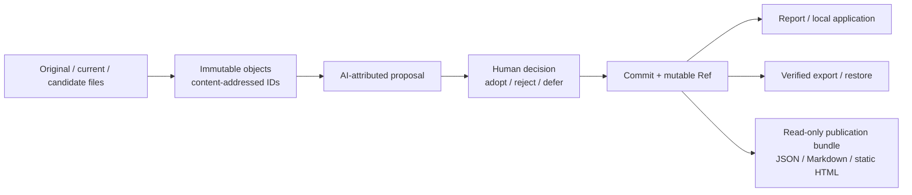

# SynapseGit

[English](./README.md) | [日本語](./README.ja.md)

[](https://github.com/howlrs/synapsegit/actions/workflows/ci.yml)


[](./LICENSE)

**Keep a local record of what an AI proposed and what you decided.**

SynapseGit records the original, the current state, an AI-made candidate, and
your decision about it (adopt, reject, or defer) as verifiable history on your
own computer. You can let an AI agent run the commands; the decision stays
yours. Later you, or someone you hand the work to, can see what was proposed,
what you chose, and why.

SynapseGit keeps evidence, AI proposals, and human decisions apart. Its
identifiers verify that file contents are unchanged; they do not prove
authorship, truth, copyright, permission, or physical change.


_The actual `synapse-local` page, served only from `127.0.0.1`. It is not a
hosted or multi-user service._

## The problem it solves

A final file rarely shows how it was decided:

- Which state was the original reference, and what did it look like before?
- Which output came from an AI, and what was it asked to do?
- Did a person adopt it, reject it, or set it aside, and why?

SynapseGit records each of these as its own step instead of treating the latest
generated file as accepted.

| Input | Proposal | Human Decision | Result you can check |
|---|---|---|---|
| Original and current files | An AI output you supply | `adopt`, `reject`, or `defer` | Report, timeline, integrity check, backup, and a local read-only view |

## One example

The illustrated [15-minute mural tutorial](./docs/tutorial/README.md) walks
through three synthetic images with exact commands, the real localhost pages,
and troubleshooting.

| Original | Current | AI proposal |
|---|---|---|
|  |  |  |

The images are generated fixtures, not evidence of a real artwork or treatment.
This repository uses the [2026-10-02 image revision](./docs/assets/image-generation.json).
Published v1.0.0-rc.1 archives keep the earlier images; use a fixed release's
bundled materials for its pilot and record the release and material revision.

## Get started

### 1. Install

The prebuilt archive needs no Rust toolchain. The published v0.13.1 archive is
for Linux x86_64 (glibc 2.34 or newer). The v1.0.0-rc.1 pilot is the first
release candidate with macOS on Apple Silicon; its fixed Linux and macOS
commands are in the [v1.0.0-rc.1 release notes](./docs/releases/v1.0.0-rc.1.md).
Other platforms can
[build from a tagged source](./docs/install.md#build-from-a-tagged-source-release).

```bash
curl -LO https://github.com/howlrs/synapsegit/releases/download/v0.13.1/synapsegit-v0.13.1-x86_64-unknown-linux-gnu.tar.gz
curl -LO https://github.com/howlrs/synapsegit/releases/download/v0.13.1/SHA256SUMS
sha256sum --check --ignore-missing SHA256SUMS
```

Stop if the check fails. The [installation guide](./docs/install.md) shows the
build-provenance check, the macOS steps, and where to put the three binaries.

### 2. Let your AI agent prepare, and decide yourself

Give your AI agent the [AI agent guide](./docs/ai_agent_guide.md) (it is also
bundled in the release archive as `AI_AGENT_GUIDE.md`). Then ask, for example:

> Read the SynapseGit AI agent guide first. Put this candidate in the inbox
> with `synapse inbox put`, start `synapse-local`, and give me the URL. I will
> decide, so do not choose for me.

Open the URL, go to the project's **Import** page, review the candidate,
create the proposal, compare the images, and choose Adopt, Reject, or Defer.
The agent can then read the result with `synapse creator-list` and
`synapse creator-report --format json`, and make a backup with
`synapse export`.

### 3. Or record directly from the command line

```bash
synapse init "$HOME/SynapseGit/demo"
synapse creator-run "$HOME/SynapseGit/demo" session-1 \
  /path/to/original.png /path/to/current.png /path/to/candidate.png \
  --subject "My creative work" --creator "Your name" \
  --decision defer --rationale "Review this candidate later."
synapse creator-report "$HOME/SynapseGit/demo" session-1
```

To look at it in the browser, run
`synapse-local --project "demo=$HOME/SynapseGit/demo"` and open the printed
`http://127.0.0.1:...` URL. Every command explains itself with `--help`.

## What you can do now

| You can | Where |
|---|---|
| Record an original, a current state, an AI output, and your decision with a reason | Browser Import page or `synapse creator-run` |
| Let an AI agent place candidates in an inbox without deciding, then decide in the browser | `synapse inbox put` and the Import page |
| Compare two images side by side or overlaid, at fit, 100%, or 200% | Session page |
| Add an optional generation note and pins on the images | Import form and session page |
| Read past decisions with times and a timeline | Session pages, `creator-list`, `creator-report` (text or JSON) |
| Try another candidate from a record, or review a deferred or interrupted one again in a new session | Session page |
| Check integrity, back up, and restore | Maintenance page, `fsck`, `export`, `restore` |
| Make a local read-only view without private notes | `synapse-present` and the public-text form |
| Use the pages in Japanese or English | Language switch in the header |

## What it does not do

- **It does not run AI models.** The AI output is a file you supply; SynapseGit
  records it as caller-supplied and does not claim which model, if any, made it.
- **It compares file contents, not pictures.** A match check shows whether the
  bytes are the same. Identical files do not prove the subject is unchanged,
  and different files do not prove a visual or physical change. There is no
  pixel registration or difference analysis.
- **A recorded decision is final for that session.** You can review the same
  images again in a new session; the earlier record stays.
- **It is local and single-user.** `synapse-local` serves only `127.0.0.1`.
  There is no hosted or multi-user service, and nothing is uploaded.
- **Platforms:** The published v0.13.1 archive is Linux x86_64. The
  v1.0.0-rc.1 pilot also provides macOS arm64. Windows is not supported;
  Linux ARM64 needs a source build.

Some workspace features exist only as Rust libraries, not in the packaged
binaries. Implementers can read
[Implementation boundaries and library-only features](./docs/implementation_boundaries.en.md).

## How it works


```mermaid
flowchart LR
    F["Original / current / candidate files"] --> O["Immutable objects\ncontent-addressed IDs"]
    O --> P["AI-attributed proposal"]
    P --> H["Human decision\nadopt / reject / defer"]
    H --> C["Commit + mutable Ref"]
    C --> R["Report / local application"]
    C --> A["Verified export / restore"]
    C --> V["Read-only publication bundle\nJSON / Markdown / static HTML"]
```

1. **Observe**: keep the exact original and current files.
2. **Propose**: record an output as AI-attributed without claiming how it was
   made.
3. **Decide**: a person adopts, rejects, or defers.
4. **Verify**: check identifiers, history, and repository integrity.
5. **Present**: derive a local read-only view without private notes.

The [Core Protocol](./spec/core/v0.1/README.md) and the
[runtime architecture (Japanese)](./docs/runtime_architecture.md) describe the
details.

## Documentation

| Goal | Start here |
|---|---|
| Try the illustrated example | [15-minute mural tutorial](./docs/tutorial/README.md) |
| Install a release or build from a tag | [Installation](./docs/install.md) |
| Let an AI agent run the commands | [AI agent guide](./docs/ai_agent_guide.md) |
| Record notes, review images, and try another candidate | [Creator workflow](./docs/creator_workflow.en.md) |
| Prepare public text and a local bundle | [Public-text workflow](./docs/presentation_sidecar.en.md) |
| Understand privacy and trust limits | [Privacy and trust summary](./docs/security_model.en.md) |
| Look up commands and errors | [CLI reference (Japanese)](./docs/cli_reference.md) |
| Run the loopback-only application | [Local application runbook (Japanese)](./deploy/local/README.md) |
| See what stays compatible | [Compatibility policy](./docs/compatibility.md) |
| See the v1.0 scope and release criteria | [v1.0 release plan (Japanese)](./docs/v1_release_plan.md) |
| Embed the Rust libraries | [Implementation boundaries](./docs/implementation_boundaries.en.md) / [Generic artifact v1](./spec/application/generic-artifact/v1/README.md) |
| Browse everything | [Documentation index](./docs/README.md#english-reader-path) |

## Releases and compatibility

- SynapseGit is a Stage 0 preview. Each release is published on GitHub with
  SHA-256 checksums and a build-provenance attestation; crates.io and container
  registries are not used.
- From v1.0.0, the object, identifier, and archive formats are frozen for
  v1.x, and repositories and archives from every published release stay
  readable. See the [compatibility policy](./docs/compatibility.md).
- What changed in each release is in the [changelog](./CHANGELOG.md), the
  [published v0.13.1 release notes](./docs/releases/v0.13.1.md), and the
  [v1.0.0-rc.1 pilot notes](./docs/releases/v1.0.0-rc.1.md). Read the
  applicable notes before using the preview with important data.

## Security, support, and license

Keep `synapse-local` on loopback; do not put it behind a reverse proxy or treat
its process-local browser token as multi-user authentication. Report a
suspected vulnerability through
[GitHub private vulnerability reporting](https://github.com/howlrs/synapsegit/security/advisories/new),
not a public issue. See [SECURITY.md](./SECURITY.md) for the supported scope and
report contents.

Questions and reproducible bugs are welcome through the paths in
[SUPPORT.md](./SUPPORT.md). Contributions should start with
[CONTRIBUTING.md](./CONTRIBUTING.md).

Copyright (c) 2026 howlrs and K-Terashima. SynapseGit uses the custom
[SynapseGit Source-Available License 1.0](./LICENSE), not an OSI-approved
open-source license. It permits GitHub Forks, source changes in those Forks,
upstream pull requests, and controlled local build/run/test for non-commercial
evaluation. Commercial, production, or hosted use and redistribution outside
the permitted GitHub Fork workflow require separate written permission. The
license also covers v0.1.0, although its original archive predates the bundled
license file. A non-authoritative [Japanese summary](./docs/license_ja.md) is
available; the root `LICENSE` is controlling.

Third-party Rust components remain under the terms collected in
[THIRD_PARTY_NOTICES.md](./THIRD_PARTY_NOTICES.md).
