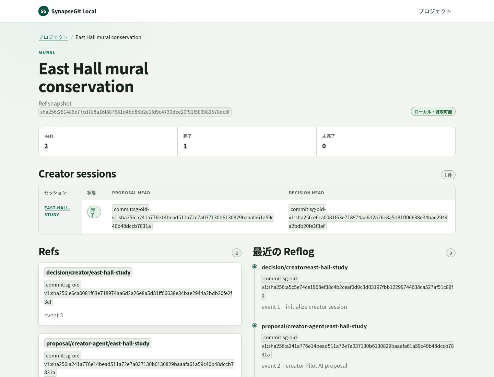

# Native localhost application

`synapse-local` is the first creator-facing SynapseGit application. It runs as
one native process on the user's machine and serves a browser UI only on IPv4
loopback (`127.0.0.1`). It is not a GitHub-like hosted service, a Cloud Run
deployment, or a Docker workload.

## Current implementation boundary

The v0.4.0 implementation provides:

- a startup-owned catalog of local repositories;
- project status, current Refs, and bounded reflog pages;
- creator-session discovery, report/timeline/evidence display, and bounded
  `original` / `current` / `ai-output` image reads; and
- a bounded three-file import that publishes a caller-supplied proposal and
  retains its exact review authority in the running process;
- Human `adopt` / `reject` / `defer` through that retained same-process
  authority;
- dedicated read-only incomplete-session diagnostics showing the current creator
  Ref/head shape and a safe recommended action without recovery or mutation;
- an exact-project-confirmed, server-bounded background `fsck` with process-local
  polling and last-result display; and
- server-rendered HTML with same-origin CSS and JavaScript compiled into the
  Rust binary.

The import, review, diagnostics, and browser `fsck` slices were introduced as
the v0.3.0 localhost milestone and remain the same image-specific application
surface in v0.4.0. The generic-artifact workflow included in the v0.4.0 tagged
source is not connected to this service or UI. The release archive remains
`synapse`, `synapse-local`, and `synapse-present`; it adds no generic-artifact
HTTP/CLI/UI, new binary, or remote publish path.

Each imported file is limited to 64 MiB and the three files to 192 MiB in
aggregate. At most two uploads stage concurrently, eight pending reviews are
retained per project, and 64 per process. The browser must finish a review in
the same running process: restart cannot reconstruct the admitted capability
from stored Ref/head identifiers and leaves the proposal explicitly incomplete.
The third file is caller-supplied; the application does not invoke an AI model.
Creator begin and decision mutations are serialized per catalog project inside
that process. Do not run another service instance, the CLI, or a direct
Repository writer against the same repository while this service owns it.

The v0.4.0 UI does **not** yet provide archive list/export/restore,
automatic resume, or cleanup. Archive export/restore remain CLI/library-only;
archive inspection/listing is still planned.
The dedicated diagnostics route and server-rendered view are read-only: displayed
Ref/head values are never accepted back as review authority and history is not
rewritten. The v0.4.0 project page also runs read-only `fsck` only after
the user types the exact project key. It returns `202 Accepted`, polls a random
process-local operation ID, and displays clean/dirty aggregate counts. A dirty
repository is a completed result with `clean=false`, not a failed job.

The maintenance profile is fixed at 100,000 Refs, 100,000 CAS objects, 1 TiB raw
bytes, 1,000,000 cumulative closure nodes, 10,000,000 cumulative closure edges,
and 100,000 Records / 1 GiB for Tombstone discovery. The process retains at most
256 job entries and 64 active jobs. It evicts only the oldest terminal result at
capacity; unknown, evicted, or post-restart IDs return `operation_state_lost`.
A browser disconnect does not cancel or retry the job, and `last_fsck` is also
process-local.

The tagged v0.4.0 binary includes the diagnostics and browser `fsck` additions
alongside three-file import/same-process review. JavaScript is
required for write and maintenance POST actions because unsafe API requests
require the process-local custom token header; server-rendered read and
diagnostics views remain available without it.



*Project dashboard — one localhost processで、creator session、現在のRefs、最近のreflogを確認する画面です。Public serviceやGCP CLI smokeの画面ではありません。*

## Build and start

Linux x86_64では、[`v0.4.0` preview release](../../docs/releases/v0.4.0.md)に
`synapse-local`を含む検証済みbinary archiveがある。downloadとchecksum検証は
[Installation guide](../../docs/install.md#install-the-linux-x86-64-release)を参照する。その他のplatformでは、
下記のsource buildを使用する。v0.4.0の配布済みbinaryには、三file import／same-process
Human review、dedicated read-only diagnostics、bounded browser `fsck`が含まれる。

Use a Rust toolchain compatible with the workspace MSRV, then run these
commands from the repository root:

```bash
cargo build --release --locked -p synapse-local-http --bin synapse-local

mkdir -p "$HOME/SynapseGit/demo"
./target/release/synapse-local \
  --project "demo=$HOME/SynapseGit/demo" \
  --label "demo=Demo project"
```

binary versionは`./target/release/synapse-local --version`で確認できる。

The repository directory must exist before startup. It may be an existing
SynapseGit repository or an empty directory; opening an empty directory creates
the local repository layout. The v0.4.0 binary and a current source build can
create a session from the project page. The CLI can use the same repository
path before starting the application or after stopping it; run
[`creator-run`](../../docs/usage_guide.md#手書きjsonなしのlocal-creator-pilot)
only while `synapse-local` is not running for that project.

The process prints an origin such as `http://127.0.0.1:8787`. Open that exact
URL in a browser. Press Ctrl-C in the terminal to stop it. The browser session
token is generated in memory and injected into the served application; it is
not printed in the URL or accepted as a query parameter.

`--project KEY=PATH` may be repeated. Keys must match
`[a-z][a-z0-9-]{0,63}`; duplicate keys and duplicate canonical paths are
rejected. `--label KEY=LABEL` is optional. The default port is `8787`; select a
different loopback port with `--port PORT`, or use `--port 0` for an
OS-selected development port.

```bash
./target/release/synapse-local \
  --project "mural=$HOME/SynapseGit/mural" \
  --project "restoration=$HOME/SynapseGit/restoration" \
  --port 8788
```

There is deliberately no `--host` option. The executable always binds to
`127.0.0.1` and rejects foreign Host/Origin/forwarding headers. Do not expose it
through a reverse proxy or treat its process-local browser token as multi-user
authentication. The local OS user and filesystem permissions remain trusted.

## Local versus cloud deployment

This native application is the preferred UI delivery path for the current
single-user milestone. Its localhost API is not the public cloud API contract.

The separate [GCP CLI smoke deployment](../gcp/README.md) runs a private,
one-shot CLI job against disposable files and has no UI or HTTP endpoint. It
only verifies OCI/cloud packaging and does not deploy this localhost server.
Likewise, the public multi-tenant architecture remains an unimplemented
production target.

See the [localhost application architecture](../../docs/localhost_application_architecture.md)
for the trust boundary and remaining maintenance slices.
