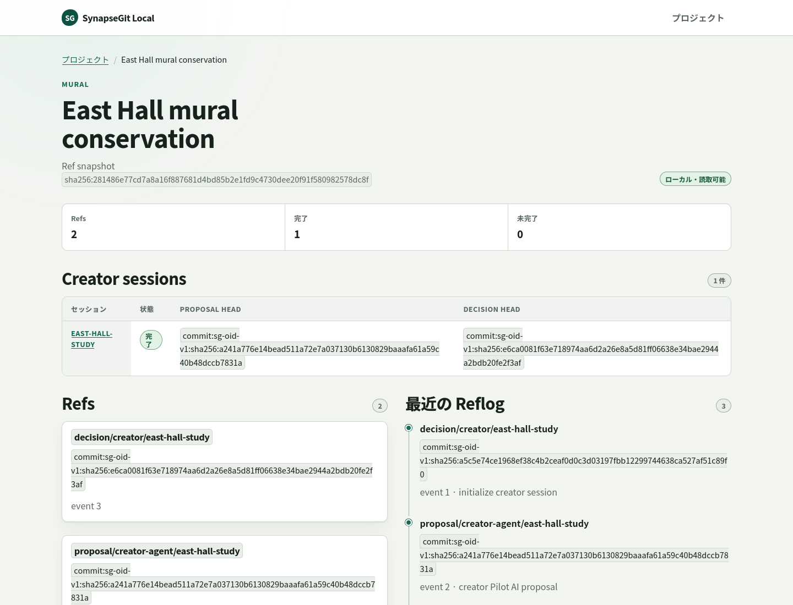
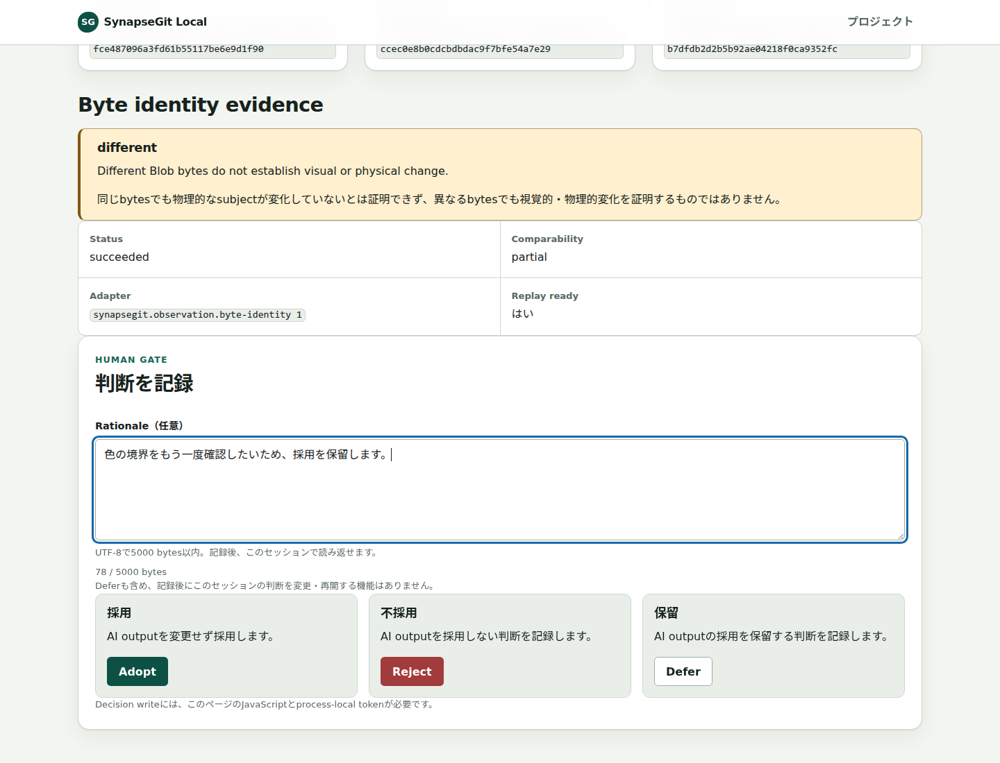
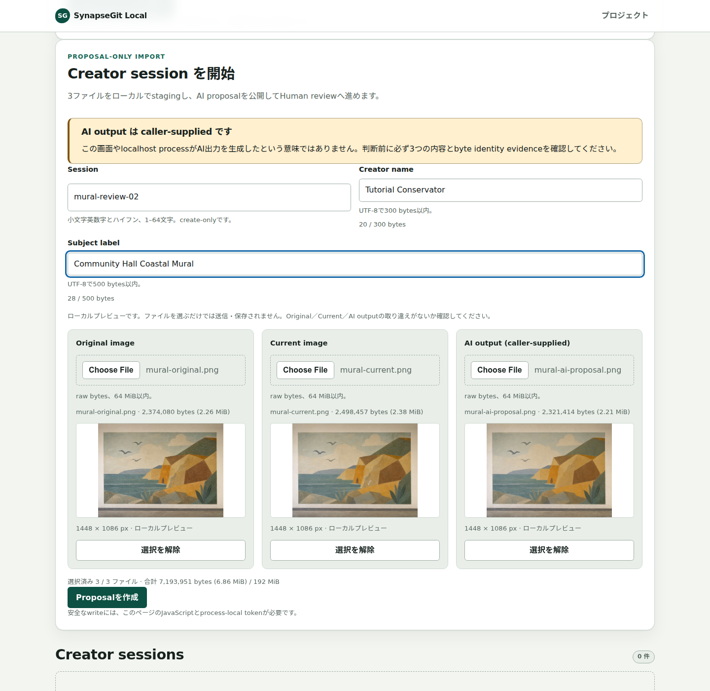
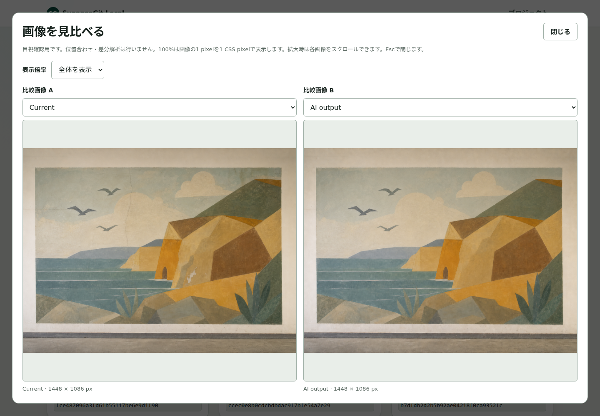

# Native localhost application

v0.8.0の生成メモ・判断ピン・派生セッション・公開用文章フォームは、[Creator操作ガイド](../../docs/creator_workflow.md)を参照してください。操作手順と公開v1の制限も説明しています。

`synapse-local` is the first creator-facing SynapseGit application. It runs as
one native process on the user's machine and serves a browser UI only on IPv4
loopback (`127.0.0.1`). It is not a GitHub-like hosted service, a Cloud Run
deployment, or a Docker workload.

## Current implementation boundary

The tagged v0.8.0 implementation provides:

- a startup-owned catalog of local repositories;
- project status, current Refs, and bounded reflog pages;
- creator-session discovery, report/timeline/evidence display, and bounded
  `original` / `current` / `ai-output` image reads; and
- a bounded three-file import that publishes a caller-supplied proposal and
  retains its exact review authority in the running process;
- Human `adopt` / `reject` / `defer` through that retained same-process
  authority;
- dedicated read-only incomplete-session diagnostics showing the current creator
  Ref/head shape and a safe recommended action without recovery or mutation;
- an exact-project-confirmed, server-bounded background `fsck` with process-local
  polling and last-result display; and
- server-rendered HTML with same-origin CSS and JavaScript compiled into the
  Rust binary.

The import, review, diagnostics, and browser `fsck` slices were introduced as
the v0.3.0 localhost milestone and remain the same image-specific application
surface in the tagged v0.8.0 binary. The generic-artifact workflow included in
the v0.8.0 tagged source is not connected to this service or UI. The release archive remains
`synapse`, `synapse-local`, and `synapse-present`; it adds no generic-artifact
HTTP/CLI/UI, new binary, or remote publish path.

Each imported file is limited to 64 MiB and the three files to 192 MiB in
aggregate. At most two uploads stage concurrently, eight pending reviews are
retained per project, and 64 per process. The browser must finish a review in
the same running process: restart cannot reconstruct the admitted capability
from stored Ref/head identifiers and leaves the proposal explicitly incomplete.
The third file is caller-supplied; the application does not invoke an AI model.
Creator begin and decision mutations are serialized per catalog project inside
that process. Do not run another service instance, the CLI, or a direct
Repository writer against the same repository while this service owns it.

The tagged v0.6.0 UI added a bounded, read-only archive listing view
(`GET /archives` plus a dashboard section) behind an optional
`--archive-root PATH` startup flag; the path must already exist and be a
directory. Without `--archive-root`, the UI behaves as before and does not
provide archive listing. The tagged v0.8.0 binary also enables
authenticated `POST /api/v1/projects/{projectKey}/archive-exports` when this
root is configured. The request accepts only an exact project confirmation and
a logical archive slug; the server uses its fixed Core-equivalent limits and
atomic no-replace publication. It also enables authenticated `POST
/api/v1/projects/{projectKey}/archive-restores`, which requires the logical
archive slug, exact target-project confirmation, and explicit empty-target
confirmation, then runs Core's server-fixed bounded exact-subset restore.
v0.8.0 also provides browser controls for both operations. Restore has no dynamic path or
target selector: it acts only on the open registered project, and its form is
rendered only when that dashboard snapshot has neither Refs nor reflog entries.
It requires a logical archive slug, exact target-project key, an explicit
empty-target checkbox serialized as `true`, and browser confirmation, then uses
the existing queued/polled operation API.
The dedicated diagnostics route and server-rendered view are read-only: displayed
Ref/head values are never accepted back as review authority and history is not
rewritten. The tagged v0.8.0 project page also runs read-only `fsck` only after
the user types the exact project key. It returns `202 Accepted`, polls a random
process-local operation ID, and displays clean/dirty aggregate counts. A dirty
repository is a completed result with `clean=false`, not a failed job.

The maintenance profile is fixed at 100,000 Refs, 100,000 CAS objects, 1 TiB raw
bytes, 1,000,000 cumulative closure nodes, 10,000,000 cumulative closure edges,
and 100,000 Records / 1 GiB for Tombstone discovery. The process retains at most
256 job entries and 64 active jobs. It evicts only the oldest terminal result at
capacity; unknown, evicted, or post-restart IDs return `operation_state_lost`.
A browser disconnect does not cancel or retry the job, and `last_fsck` is also
process-local.

Archive export uses the same fixed Ref, object, byte, closure, and Tombstone
ceilings, plus at most 100,000 reflog entries and 64 MiB of Ref/reflog variable
text. It returns the shared process-local operation poll path. A failed or lost
job is never retried automatically; inspect the archive listing before choosing
a new logical name.

Archive restore uses the same fixed inventory, byte, Ref/reflog, closure, and
Tombstone ceilings. It accepts no target path: the project must already be in
the startup catalog, have no Ref/reflog history, and contain either no objects
or only the exact subset left by an earlier attempt with the same archive.
Objects are restored before Refs, and Refs/reflog are published last in one
transaction. Poll a failed job before deciding whether to retry; never select a
different archive for a partial target. Starting restore also clears that
project's process-local `last_fsck`, including when the restore later fails.

The tagged v0.6.0 binary includes the diagnostics and browser `fsck` additions
(introduced in v0.3.0 and unchanged since) alongside three-file import/same-process
review. JavaScript is
required for write and maintenance POST actions because unsafe API requests
require the process-local custom token header; server-rendered read and
diagnostics views remain available without it.



*Project dashboard — one localhost processで、creator session、現在のRefs、最近のreflogを確認する画面です。Public serviceやGCP CLI smokeの画面ではありません。*

## Build and start

Linux x86_64では、[`v0.8.0` preview release](../../docs/releases/v0.8.0.md)に
`synapse-local`を含む検証済みbinary archiveがある。downloadとchecksum検証は
[Installation guide](../../docs/install.md#install-the-linux-x86-64-release)を参照する。その他のplatformでは、
下記のsource buildを使用する。v0.8.0の配布済みbinaryには、三file import／same-process
Human reviewに加え、dedicated read-only diagnostics、bounded browser `fsck`
（いずれもv0.3.0で導入し、v0.8.0でも変更なし）、任意の`--archive-root`起動flag指定時のみ
有効なbounded read-only archive listing（v0.6.0で追加）、および認証付きbounded archive
export／empty-target restore API（v0.7.0で追加）と、v0.8.0のproject-page browser controlが含まれる。

Use a Rust toolchain compatible with the workspace MSRV, then run these
commands from the repository root:

```bash
cargo build --release --locked -p synapse-local-http --bin synapse-local

mkdir -p "$HOME/SynapseGit/demo"
./target/release/synapse-local \
  --project "demo=$HOME/SynapseGit/demo" \
  --label "demo=Demo project"
```

binary versionは`./target/release/synapse-local --version`で確認できる。

The repository directory must exist before startup. It may be an existing
SynapseGit repository or an empty directory; opening an empty directory creates
the local repository layout. The tagged v0.6.0 binary and a current source build can
create a session from the project page. The CLI can use the same repository
path before starting the application or after stopping it; run
[`creator-run`](../../docs/usage_guide.md#手書きjsonなしのlocal-creator-pilot)
only while `synapse-local` is not running for that project.

The process prints an origin such as `http://127.0.0.1:8787`. Open that exact
URL in a browser. Press Ctrl-C in the terminal to stop it. The browser session
token is generated in memory and injected into the served application; it is
not printed in the URL or accepted as a query parameter.

`--project KEY=PATH` may be repeated. Keys must match
`[a-z][a-z0-9-]{0,63}`; duplicate keys and duplicate canonical paths are
rejected. `--label KEY=LABEL` is optional. The default port is `8787`; select a
different loopback port with `--port PORT`, or use `--port 0` for an
OS-selected development port.

```bash
./target/release/synapse-local \
  --project "mural=$HOME/SynapseGit/mural" \
  --project "restoration=$HOME/SynapseGit/restoration" \
  --port 8788
```

### Record and revisit a Human Decision (v0.8.0)



After creating a Proposal, inspect the three inputs and the byte-identity
limitations on its session page. The decision area explains each choice:

| Choice | Recorded outcome |
|---|---|
| Adopt | Select the supplied AI output unchanged |
| Reject | Record that the AI output is not adopted |
| Defer | Record that adoption is deferred; the AI output is not selected |

Write an optional rationale. The counter uses UTF-8 bytes, so Japanese text can
reach the 5000-byte limit before the 5000-character HTML limit. Oversized text
is marked invalid before confirmation or a request. Choosing a disposition
opens a confirmation with the project key, session, and outcome. Canceling
sends no decision and retains the rationale. While submitting, the form holds
its inputs fixed; a failed request restores the controls and preserves the
text. It does not automatically retry.

After a successful decision, **記録した判断** shows the outcome and the recorded
rationale. Newlines are preserved, markup is escaped, and an empty rationale
has an explicit empty state. This is the text returned by the verified local
report, which can include a CLI-supplied default; displaying it does not verify
its claims or establish who authored the text. The completed summary is also
available without JavaScript. It is a localhost read view, not a new public
publication of source-private rationale.

All three choices complete the single decision flow. **Defer does not allow
changing or reopening that session's decision in this Pilot.** Pending review
still requires the same server process, and restart recovery is unchanged.
These review and rationale display improvements are included in tagged v0.8.0.

### Check selected files before import (v0.8.0)



In **Creator session を開始**, choose the Original, Current, and caller-supplied
AI output files. Each card shows the selected name and exact byte size. A
local preview and decoded pixel dimensions appear for displayable rasters.
**選択を解除** clears just that role and returns focus to its file chooser.
The summary shows how many of the three files are selected and their total
size. File selection and previewing do not send an API request or save data.

Creator name and Subject label show their UTF-8 byte counts as you type. For
example, 100 copies of `あ` occupy 300 bytes; 101 copies exceed the Creator
name limit. Oversized text or a file larger than 64 MiB gets immediate inline
feedback and blocks submission until corrected. The existing server and
multipart limits still apply independently.

Preview eligibility uses a short PNG/JPEG/GIF/WebP signature check followed
by browser decoding, not the filename or browser-supplied MIME type. SVG,
other opaque data, empty files, and damaged rasters are never forced into an
inline preview; a preview failure does not reject their import. These are
local viewing hints, not server-verified evidence. The actual upload still
submits unchanged bytes through the existing authenticated multipart route.

Select **Proposalを作成** to start the import. Inputs and file-clear buttons
are disabled while the request is pending. A failed request restores those
controls and preserves the selection; it is not retried automatically.
Replacing or clearing a file, resetting the form, or leaving the page releases
its preview URL. This preflight UI requires JavaScript and is included in the
tagged v0.8.0 binary.

### Inspect image details before deciding (v0.8.0)



On a pending or completed creator session, select **画像を拡大して比較** after
at least two images finish loading. The dialog starts with Current and AI
output when both are displayable. Each pane can select Original, Current, or
AI output; unavailable roles remain disabled. Panes sit side by side on wide
screens and stack on narrow screens.

Choose **全体を表示**, **100%**, or **200%**. Fit shows each image in its own
pane without distorting its aspect ratio; it does not imply a shared physical
scale. At 100%, one browser-decoded image pixel occupies one CSS pixel. At
200%, that size doubles. Scroll each enlarged image independently with the
mouse, touch, or arrow keys after focusing its image region. **閉じる** or
Escape returns focus to the comparison button. Closing and reopening resets
to fit view. No decision is submitted by these controls.

This is manual visual inspection, not registration, difference analysis, or
proof of physical change. The viewer reuses the same authenticated, revocable
Blob URLs as the image cards and performs no additional API request. Only
successfully decoded inline PNG/JPEG/GIF/WebP responses enter it. Other media
retain their download-only behavior; corrupt or unsupported raster data shows
an error on its card. Comparison is unavailable without JavaScript and does
not add evidence access or recovery to incomplete sessions. The comparison
dialog is included in the v0.8.0 tagged binary.

### Enable archive maintenance

`--archive-root PATH` is optional and may be given at most once. It enables
the tagged v0.6.0 read-only archive listing view
(`GET /archives` plus a dashboard section), which bounded-scans the
directories directly under `PATH` and reports each as `valid`, `invalid`, or
`staging_or_unknown`. `PATH` must already exist and be a directory at
startup; a missing or non-directory path fails startup rather than starting
with an empty listing. Without `--archive-root`, archive listing always
returns an empty list — this is the same as a configured-but-empty root, so
the response alone cannot distinguish "not configured" from "configured but
empty".

On the tagged v0.8.0 binary, the same option also enables the archive export
and empty-target restore APIs and sets `archive_export=true` and
`archive_restore=true` in each project capability response. Without it, export
and restore requests fail before job reservation with `service_unavailable`.
v0.8.0 also renders project-page archive controls when that capability is
enabled. Its restore form is only shown for the open project while its displayed
Refs and reflog are empty. The browser cannot select a path or another target:
it submits the typed slug, exact target key, and explicit empty-target boolean
to the existing API, asks for confirmation, and polls its operation. On success
the page remains in place to show the creator-report equivalence reminder and a
link that explicitly reloads project history.

```bash
mkdir -p "$HOME/SynapseGit/archives"
./target/release/synapse-local \
  --project "demo=$HOME/SynapseGit/demo" \
  --archive-root "$HOME/SynapseGit/archives"
```

## Browser archive round trip

Use separate registered repositories for the source and restore target. Stop
any process that owns either repository before initializing it, then create the
empty target with the documented CLI spelling:

```bash
synapse init "$HOME/SynapseGit/restore-target"
mkdir -p "$HOME/SynapseGit/archives"
./target/release/synapse-local \
  --project "source=$HOME/SynapseGit/demo" \
  --project "restore=$HOME/SynapseGit/restore-target" \
  --archive-root "$HOME/SynapseGit/archives"
```

Open the source project and export a new archive through its Archive export
card. At the dashboard archive listing, manually copy a `valid` archive slug;
the restore page does not populate or choose it for you. Open the `restore`
project. If it shows Refs or reflog entries, do not use it: initialize and
register another empty target. Otherwise enter that slug, type `restore` as the
target key, check the empty-target confirmation, accept the browser prompt, and
wait for the queued restore job to reach terminal `archive_restore` / `restored`
with `report_equivalence_required=true`.

The successful form disables its inputs and submit button to prevent a repeated
restore from replacing the result with an error. The success panel stays
visible. Follow its explicit history reload link. Then
stop `synapse-local` before opening either repository with the CLI, and write
the text reports to separate files before comparing them:

```bash
session="session-1" # Replace with the creator session recorded in the source.
synapse creator-report "$HOME/SynapseGit/demo" "$session" > source-report.txt
synapse creator-report "$HOME/SynapseGit/restore-target" "$session" > restored-report.txt
cmp source-report.txt restored-report.txt
```

Use the same session name. `creator-report` emits key/value text, so `cmp`
checks the documented report output directly. A failed restore
may have copied the same archive's exact object subset. Core remains the
authority for target emptiness, inventory, and source checks; only retry that
same archive when its documented exact-subset condition holds. The browser does
not resume, clean up, or recover a failed, unknown, or review operation.

There is deliberately no `--host` option. The executable always binds to
`127.0.0.1` and rejects foreign Host/Origin/forwarding headers. Do not expose it
through a reverse proxy or treat its process-local browser token as multi-user
authentication. The local OS user and filesystem permissions remain trusted.

## Local versus cloud deployment

This native application is the preferred UI delivery path for the current
single-user milestone. Its localhost API is not the public cloud API contract.

The separate [GCP CLI smoke deployment](../gcp/README.md) runs a private,
one-shot CLI job against disposable files and has no UI or HTTP endpoint. It
only verifies OCI/cloud packaging and does not deploy this localhost server.
Likewise, the public multi-tenant architecture remains an unimplemented
production target.

See the [localhost application architecture](../../docs/localhost_application_architecture.md)
for the trust boundary and remaining maintenance slices.
