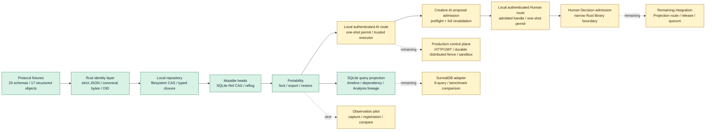

# SynapseGit documentation

このディレクトリは、SynapseGit Core を「試す」「評価する」「実装する」ための入口である。
現在の状態は **Core v0.1 / Stage 0 draft**。OID・schema・local repository の縦断経路は動作するが、
capture clientと画像比較はまだ実装されていない。Creative AI proposal publicationと、その手前の
process-localなauthenticated one-shot AI execution routeとadmitted-proposal-bound Human Decision route、trustedなauthenticated single humanによる
narrow `decision/*` admissionはRust library境界まで実装されている。
verified ObjectStoreとcaller-supplied Ref snapshotから作るdisposable SQLite query projectionも
Rust library境界まで実装されている。
AI routeのAuthenticator／exact project map／process ACLはinjectedまたはin-memoryなlibrary境界であり、
HTTP／JWT、durable／distributed ACL・permit、Projection application route、multi-project CAS
membership resolver、OS sandbox／egress、Grant revocation、organization／quorum／release approvalは未実装である。

## 読みたい内容から選ぶ

| 目的 | 最初に読む資料 | 次に読む資料 |
|---|---|---|
| 5分で実装を動かす | [Quickstart](./quickstart.md) | [使用ガイド](./usage_guide.md) |
| command と error を調べる | [CLI reference](./cli_reference.md) | [Security model](./security_model.md) |
| 何を解決するか知る | [使用ガイド](./usage_guide.md) | [Core 構想](./core_concept.md) |
| object と record の関係を知る | [Core データモデル](./core_model.md) | [Core Protocol](../spec/core/v0.1/README.md) |
| 用語・よくある疑問を調べる | [Glossary](./glossary.md) | [FAQ](./faq.md) |
| 保存・書込み境界を知る | [Runtime architecture](./runtime_architecture.md) | [Security model](./security_model.md) |
| 実装へ参加する | [Contributing](../CONTRIBUTING.md) | [Stage 0 execution plan](./stage0_execution_plan.md) |
| 仕様準拠実装を作る | [OID profile](../spec/core/v0.1/oid-profile.md) | [Operations](../spec/core/v0.1/operations.md) |
| archive 互換実装を作る | [Local archive profile](../spec/core/v0.1/archive-profile.md) | [Security model](./security_model.md) |
| 利用者別の説明資料を見る | [想定利用者別シナリオ](./presentations/README.md) | [使用ガイド](./usage_guide.md) |

## 現在地

| 能力 | 状態 | 根拠 |
|---|---|---|
| strict JSON、canonical bytes、OID | 実装済み | `synapse-canonical`、golden tests |
| concrete schema と semantic validation | 実装済み | `synapse-schema`、20 schemas |
| filesystem CAS、typed closure、Tombstone、fsck | 実装済み | `synapse-cas` |
| Ref compare-and-swap と reflog | 実装済み | `synapse-sqlite` |
| validated ingest、directory export / restore | 実装済み | `synapse-core` |
| end-to-end local CLI | 実装済み | `synapse-cli`、[Quickstart](./quickstart.md) |
| fixed-point Observation dataset と image adapter | 未実装 | [Stage 0 Workstream C](./stage0_execution_plan.md#workstream-c-fixed-point-observation-pilot) |
| AI proposal admission、exact capability、snapshot/output binding、transaction-time expiry／`stale_base` | library境界を実装済み / integration partial | `synapse-core::CreativeAiRuntime`、[Stage 0 Workstream D](./stage0_execution_plan.md#workstream-d-creator--creative-ai-value-slice) |
| authenticated one-shot AI execution、exact project map／ACL、Core preflight、post-execution reauthorization | process-local library境界を実装済み / production integration partial | `synapse-application`、[Operations §7.1](../spec/core/v0.1/operations.md#71-initial-local-authenticated-application-profile) |
| authenticated narrow Human Decision、admitted proposal handle、server-fixed candidate、one-shot permit | process-local library境界を実装済み / production integration partial | `synapse-application`、[Operations §8.1](../spec/core/v0.1/operations.md#81-initial-process-local-authenticated-human-decision-route) |
| narrow Human Decision admission、duplicate rejection、atomic proposal + decision/base check | library境界を実装済み / integration partial | `synapse-core::HumanDecisionRuntime`、[Operations §8](../spec/core/v0.1/operations.md#8-human-decision-admission-boundary) |
| SQLite ProjectionStore baseline（closure／timeline／Observation dependency／Analysis lineage） | library境界を実装済み | `synapse-projection::SqliteProjectionStore`、3 unit + 19 integration tests、[Runtime architecture](./runtime_architecture.md#sqlite-projectionstore-baseline) |
| SurrealDB adapter / 8-query・benchmark比較 | 未実装 | [Runtime architecture](./runtime_architecture.md#surrealdb採用spike) |

「実装済み」は、この repository の test で検証されている範囲を指す。production deployment、
認証、network transport、運用監視まで完成したという意味ではない。
AI application libraryはcredentialをproject lookupより先にAuthenticatorへ渡し、server-owned exact mapと
process ACLからrouteを選ぶ。request planeはcredential、project selector、opaque handle／permitだけで、
authorityやtargetを選べない。reusable profileとone-time registrationからCore preflightを行い、permitを
executor前にburnし、実行後reauth→project FIFO fence→live ACL/profile→full Core publicationの順で処理する。
candidateはcheckpointかつContextPack baseだけをparentに持ち、baseの全non-Tree objectを保持して
新規outputとcurrent base snapshotの差分を検査する。narrow Human Decision routeはsingle human、Policy、
proposal／baseをtrusted authorityに固定し、supported dispositionだけをcanonical `decision/*`へ記録する。
applicationでは成功したAI publicationだけがopaque admitted-proposal handleを返し、trusted control planeが
そのhandleをborrowしてserver-fixed decision candidateを登録する。handleはdenial後の修正版registrationへ
再利用できるが、registration／permitはone-shotである。Human requestはprepare/publishのopaque
handle／permitだけを使い、publish時にlive ACL/profile/TTLとfull Core validation/CASを再検査する。
Human publishの認証は冒頭の一回だけで、FIFO fence／state／Repository lock内からAuthenticatorを呼ばない。
resultはpoint-in-timeなsession decisionである。同fenceが線形化するのはprocess-local ACL／profile mutationで、
外部credential storeの即時revocationではない。permit TTLがwindowをboundedにし、production
adapter／credential lease semanticsはdeployment責任である。
local CLIの`update-ref`はこの経路を公開せず、trusted operator向け低水準primitiveのままである。
この初期application boundaryはAIとnarrow Human Decisionだけで、Projection route、HTTP／JWT、restartを越える
ACL／permit、multi-process fence、OS sandbox／egressは含まない。

## 資料の位置づけ

資料が食い違う場合は、次の順序で確認する。

1. [`spec/core/v0.1`](../spec/core/v0.1/README.md) の normative draft と JSON Schema
2. golden fixtures、Rust / JavaScript verifier、repository tests
3. [Runtime architecture](./runtime_architecture.md) と [Stage 0 execution plan](./stage0_execution_plan.md)
4. [Core 構想](./core_concept.md) と [使用ガイド](./usage_guide.md)
5. [Project Chrono-Synapse 初期企画](./init_plan.md)

`init_plan.md` は着想の出発点を残す source vision であり、Core v0.1 の現在仕様ではない。
Chrono-Engine、人物再現、自動利益分配は現行 Core の対象外である。

## 設計上の短い原則

- hash が証明するのは byte identity であり、作者性、真実、権利、撮影時刻ではない。
- Evidence、Analysis、Claim、Human Decision を別 object として残す。
- object は不変、Ref と availability は可変として分離する。
- AI proposal admissionは`proposal/*`だけを受理し、`decision/*`と`release/*`を
  `human_gate_required`で拒否する。別のnarrow Human Decision library routeだけが、trusted single humanの
  `adopted_unchanged`／`rejected`／`deferred`／`experiment_only`を`decision/*`へ記録する。
- filesystem / object-storage CAS を正本とし、query projection は再構築可能にする。
- projectionは一貫したRef snapshotから明示的に再構築する派生indexであり、authorization、archive、復旧の入力にしない。
- 欠測、遮蔽、比較不能を「変化なし」へ変換しない。

詳しい境界は [Core データモデル](./core_model.md) と
[Security model](./security_model.md) を参照する。

## 文書を更新するとき

- 実装状態を変えたら、このページの capability table と `README.md` を同時に更新する。
- OID、schema、Ref、archive の意味を変える場合は、先に normative spec と fixture を更新する。
- 構想または将来形は「未実装」「Pilot 仮説」などの状態を明記する。
- ASCII の関係図を追加する前に、GitHub で表示できる Mermaid を優先する。
- 相対 link と Mermaid fence は `node scripts/verify_docs.mjs` で検査する。
