# SynapseGit documentation

このディレクトリは、SynapseGit Core を「試す」「評価する」「実装する」ための入口である。
現在の状態は **Core v0.1 / Stage 0 draft**。OID・schema・local repository の縦断経路に加え、
ordered Observationのprimary Blob OIDだけを比べるdeterministic byte-identity baselineが動作する。
capture client、pixel-level registration／差分解析はまだ実装されていない。`synapse-creator`とCLIの
`creator-run`／`creator-report`は、original／current／AI outputの3画像から手書きJSONなしで履歴を作る
local single-creator Pilotを実装する。Creative AI proposal publicationと、その手前の
process-localなauthenticated one-shot AI execution routeとadmitted-proposal-bound Human Decision route、trustedなauthenticated single humanによる
narrow `decision/*` admissionはRust library境界まで実装されている。
verified ObjectStoreとcaller-supplied Ref snapshotから作るdisposable SQLite query projectionも
Rust library境界まで実装されている。
current sourceの`synapse-publication`／`synapse-present`は、existing CASをread-onlyで扱い、checkpoint済みで
最大512 MiBのRef SQLiteをprivate temporary copyへ取り込み、copy時とcopy後sourceのSHA-256一致を確認してから、
作者外の人とAI向けにcanonical `projection.json`、Markdown、JavaScriptなしHTML、manifest、checksum、Synapse／GitHub target
layoutを最大100 creator sessionsからlocal生成する。source SQLiteを直接openしない。private rationale、
internal Actor ID、repository path、raw assetは除外し、raw asset rendering、upload、network accessは行わない。
このbinaryは公開済みv0.2.0 archiveには含まれない。
single-user／loopback-onlyのcreator-facing image applicationはarchitectureとversioned HTTP contractに加え、
slices 1-4/6、slice 7のbounded `fsck`／job基盤、slice 8のread-only diagnostics部分のsafe facade、
server、route、UIまで実装されている。project status、Refs／reflog、creator sessionの
report／timeline／evidence／画像を閲覧でき、boundedな三file import、same-process Human review、project keyの
明示確認を伴うbackground `fsck`を実行できる。incomplete sessionではcurrent creator Ref／headと推奨actionを
表示するが、resume、cleanup、history書換えは行わない。archive list／export／restoreのAPI／UIは未実装である。
diagnosticsとbrowser `fsck`はcurrent sourceだけに含まれ、tagged v0.2.0 binaryには含まれない。この
application sliceはformal Core Stage 1ではなく、Core v0.1は引き続きStage 0 draftである。
public multi-tenant serviceについては、Google Cloudを主系、AWSをportability profileとする
[Cloud service architecture](./cloud_service_architecture.md)を決定した。これはCloud Run／Cloud SQL／Cloud Storageと
ECS Fargate／RDS PostgreSQL／S3の推奨構成、tenant isolation、durable command、SLO／DR、migration gateを定義する
production targetであり、cloud adapter、public API、production deploymentはまだ実装されていない。
一方、現行CLIのOCI packaging、private identity、Terraform、digest-pinned Cloud Run Job実行だけを確かめる
[isolated non-production GCP smoke deployment](../deploy/gcp/README.md)は完了している。public endpoint、
永続authority、GCS／PostgreSQL adapter、OIDC、tenant boundaryは含まれず、production architectureの実装完了を意味しない。
AI routeのAuthenticator／exact project map／process ACLはinjectedまたはin-memoryなlibrary境界であり、
HTTP／JWT、durable／distributed ACL・permit、Projection application route、multi-project CAS
membership resolver、OS sandbox／egress、Grant revocation、organization／quorum／release approvalは未実装である。
creator PilotのidentityとAI outputはtrusted local integrationが供給し、実利用者の本人確認やmodel実行を行わない。

## 読みたい内容から選ぶ

| 目的 | 最初に読む資料 | 次に読む資料 |
|---|---|---|
| Releaseをinstallし3分で試す | [Installation](./install.md) | [root README](../README.md#try-it-in-three-minutes) |
| sourceからCore全体を動かす | [Quickstart](./quickstart.md) | [使用ガイド](./usage_guide.md) |
| native localhost UIを起動する | [Localhost application runbook](../deploy/local/README.md) | [Localhost application architecture](./localhost_application_architecture.md) |
| 3画像のcreator Pilotを動かす | [使用ガイド](./usage_guide.md#現在このリポジトリで実行できること) | [CLI reference](./cli_reference.md) |
| 作者外へread-only履歴bundleを渡す | [Quickstart](./quickstart.md#4-作者外へ説明するlocal-bundleを生成する) | [CLI reference](./cli_reference.md#synapse-present-companion-cli) |
| command と error を調べる | [CLI reference](./cli_reference.md) | [Security model](./security_model.md) |
| 何を解決するか知る | [使用ガイド](./usage_guide.md) | [Core 構想](./core_concept.md) |
| object と record の関係を知る | [Core データモデル](./core_model.md) | [Core Protocol](../spec/core/v0.1/README.md) |
| 用語・よくある疑問を調べる | [Glossary](./glossary.md) | [FAQ](./faq.md) |
| 保存・書込み境界を知る | [Runtime architecture](./runtime_architecture.md) | [Security model](./security_model.md) |
| localhost画像applicationを実装する | [Localhost application architecture](./localhost_application_architecture.md) | [Runtime architecture](./runtime_architecture.md) |
| GCP本番構成とAWS移植構成を設計・実装する | [Cloud service architecture](./cloud_service_architecture.md) | [Security model](./security_model.md) |
| private GCP CLI smoke deploymentを再現する | [GCP CLI smoke deployment](../deploy/gcp/README.md) | [Cloud service architecture](./cloud_service_architecture.md) |
| 実装へ参加する | [Contributing](../CONTRIBUTING.md) | [Stage 0 execution plan](./stage0_execution_plan.md) |
| 成熟度と次の作業を確認する | [Project status](./project_status.md) | [Stage 0 execution plan](./stage0_execution_plan.md) |
| GitHub Releaseと公開導線を運用する | [Distribution guide](./distribution.md) | [Security policy](../SECURITY.md) |
| GitHub本体のmerge／security設定を監査する | [GitHub security baseline](../deploy/github/README.md) | [Security policy](../SECURITY.md) |
| 利用・Fork・contribution条件を確認する | [License](../LICENSE) | [日本語概要](./license_ja.md) / [Third-party notices](../THIRD_PARTY_NOTICES.md) |
| 質問・不具合・security報告先を探す | [Support](../SUPPORT.md) | [Security policy](../SECURITY.md) |
| 仕様準拠実装を作る | [OID profile](../spec/core/v0.1/oid-profile.md) | [Operations](../spec/core/v0.1/operations.md) |
| archive 互換実装を作る | [Local archive profile](../spec/core/v0.1/archive-profile.md) | [Security model](./security_model.md) |
| 利用者別の説明資料を見る | [想定利用者別シナリオ](./presentations/README.md) | [使用ガイド](./usage_guide.md) |

## 現在地

```mermaid
flowchart LR
    A["Protocol fixtures<br/>20 schemas / 17 structured objects"] --> B["Rust identity layer<br/>strict JSON / canonical bytes / OID"]
    B --> C["Local repository<br/>filesystem CAS / typed closure"]
    C --> D["Mutable heads<br/>SQLite Ref CAS / reflog"]
    D --> E["Portability<br/>fsck / export / restore"]
    E --> O["Observation byte identity<br/>ordered OID comparison / partial"]
    O --> CR["creator-run<br/>3 opaque images / no hand-written JSON"]
    CR --> J["Local authenticated AI route<br/>one-shot permit / trusted executor"]
    J --> G["Creative AI proposal admission<br/>preflight + full revalidation"]
    G --> HA["Local authenticated Human route<br/>admitted handle / one-shot permit"]
    HA --> I["Human Decision admission<br/>narrow Rust library boundary"]
    CR --> SM["Private GCP CLI smoke<br/>one-shot Job / no persistence"]
    E --> P["SQLite query projection<br/>timeline / dependency / Analysis lineage"]
    P --> RP["creator-report<br/>bounded timeline / process report"]
    RP --> UI["localhost image application<br/>read + import / review<br/>bounded fsck / diagnostics"]
    RP --> PB["PublicProjection + local bundle<br/>JSON / Markdown / no-JS HTML"]
    O -. next .-> F["Observation pilot<br/>capture / pixel registration / diff"]
    I -. remaining .-> H["Remaining integration<br/>Projection route / release / quorum"]
    J -. remaining .-> K["Production control plane<br/>HTTP/JWT / durable distributed fence / sandbox"]
    K -. target specified .-> CL["GCP primary / AWS portable<br/>architecture complete / unimplemented"]
    P -. remaining .-> Q["SurrealDB adapter<br/>8-query / benchmark comparison"]

    classDef done fill:#d9f2e6,stroke:#18794e,color:#123;
    classDef next fill:#fff4cc,stroke:#9a6700,color:#321;
    classDef partial fill:#fff4cc,stroke:#9a6700,color:#321;
    class A,B,C,D,E,O,CR,SM,P,RP,UI,PB done;
    class J,G,HA,I partial;
    class F,H,K,Q,CL next;
```

| 能力 | 状態 | 根拠 |
|---|---|---|
| strict JSON、canonical bytes、OID | 実装済み | `synapse-canonical`、golden tests |
| concrete schema と semantic validation | 実装済み | `synapse-schema`、20 schemas |
| filesystem CAS、typed closure、Tombstone、fsck | 実装済み | `synapse-cas` |
| Ref compare-and-swap と reflog | 実装済み | `synapse-sqlite` |
| validated ingest、directory export / restore | 実装済み | `synapse-core` |
| low-level local Core repository round-trip CLI（structured JSONはcaller-supplied） | 実装済み | `synapse-cli`、[Quickstart](./quickstart.md) |
| local single-creator Pilot（3 opaque画像、imported CaptureProfile、byte-identity Analysis、AI／Human route、adopt／reject／defer、timeline／report） | 実装済み / production integration対象外 | `synapse-creator`、`synapse-cli creator-run`／`creator-report`、creator／CLI process tests |
| provider-neutral PublicProjection／PublicationBundle（canonical JSON、Markdown、JavaScriptなしHTML、manifest、checksum、Synapse／GitHub local target） | current sourceで実装済み / remote publish対象外 | `synapse-publication`、`synapse-present export`／`preview`、publication integration tests、[CLI reference](./cli_reference.md#synapse-present-companion-cli) |
| single-user localhost image application（safe facade、loopback HTTP、server-rendered UI） | slices 1-4/6、slice 7のbounded fsck／job基盤、slice 8のread-only diagnostics部分を実装済み。archive API／UIは未実装 | [Localhost runbook](../deploy/local/README.md)、[Localhost application architecture](./localhost_application_architecture.md)、[OpenAPI contract](../api/local/v1/openapi.json) |
| public multi-tenant cloud service（GCP主系、AWS portability profile） | production architecture完了、実装未着手 | [Cloud service architecture](./cloud_service_architecture.md) |
| private non-production GCP CLI packaging smoke（one-shot Cloud Run Job） | OCI build／Terraform／digest-pinned実行を検証済み、public endpoint／永続化なし | [GCP CLI smoke deployment](../deploy/gcp/README.md) |
| deterministic Observation byte-identity baseline（ordered primary Blob OID、`partial`／`byte_identity_only`） | 実装済み / 意味解析対象外 | `synapse-observation`、Observation integration tests |
| fixed-point Observation dataset、repeatable／calibrated capture、pixel-level registration／diff adapter | 未実装 | [Stage 0 Workstream C](./stage0_execution_plan.md#workstream-c-fixed-point-observation-pilot) |
| AI proposal admission、exact capability、snapshot/output binding、transaction-time expiry／`stale_base` | library境界を実装済み / integration partial | `synapse-core::CreativeAiRuntime`、[Stage 0 Workstream D](./stage0_execution_plan.md#workstream-d-creator--creative-ai-value-slice) |
| authenticated one-shot AI execution、exact project map／ACL、Core preflight、post-execution reauthorization | process-local library境界を実装済み / production integration partial | `synapse-application`、[Operations §7.1](../spec/core/v0.1/operations.md#71-initial-local-authenticated-application-profile) |
| authenticated narrow Human Decision、admitted proposal handle、server-fixed candidate、one-shot permit | process-local library境界を実装済み / production integration partial | `synapse-application`、[Operations §8.1](../spec/core/v0.1/operations.md#81-initial-process-local-authenticated-human-decision-route) |
| narrow Human Decision admission、duplicate rejection、atomic proposal + decision/base check | library境界を実装済み / integration partial | `synapse-core::HumanDecisionRuntime`、[Operations §8](../spec/core/v0.1/operations.md#8-human-decision-admission-boundary) |
| SQLite ProjectionStore baseline（closure／timeline／Observation dependency／Analysis lineage） | library境界を実装済み | `synapse-projection::SqliteProjectionStore`、3 unit + 19 integration tests、[Runtime architecture](./runtime_architecture.md#sqlite-projectionstore-baseline) |
| SurrealDB adapter / 8-query・benchmark比較 | 未実装 | [Runtime architecture](./runtime_architecture.md#surrealdb採用spike) |

「実装済み」は、この repository の test で検証されている範囲を指す。production deployment、
認証、network transport、運用監視まで完成したという意味ではない。
AI application libraryはcredentialをproject lookupより先にAuthenticatorへ渡し、server-owned exact mapと
process ACLからrouteを選ぶ。request planeはcredential、project selector、opaque handle／permitだけで、
authorityやtargetを選べない。reusable profileとone-time registrationからCore preflightを行い、permitを
executor前にburnし、実行後reauth→project FIFO fence→live ACL/profile→full Core publicationの順で処理する。
candidateはcheckpointかつContextPack baseだけをparentに持ち、baseの全non-Tree objectを保持して
新規outputとcurrent base snapshotの差分を検査する。narrow Human Decision routeはsingle human、Policy、
proposal／baseをtrusted authorityに固定し、supported dispositionだけをcanonical `decision/*`へ記録する。
applicationでは成功したAI publicationだけがopaque admitted-proposal handleを返し、trusted control planeが
そのhandleをborrowしてserver-fixed decision candidateを登録する。handleはdenial後の修正版registrationへ
再利用できるが、registration／permitはone-shotである。Human requestはprepare/publishのopaque
handle／permitだけを使い、publish時にlive ACL/profile/TTLとfull Core validation/CASを再検査する。
Human publishの認証は冒頭の一回だけで、FIFO fence／state／Repository lock内からAuthenticatorを呼ばない。
resultはpoint-in-timeなsession decisionである。同fenceが線形化するのはprocess-local ACL／profile mutationで、
外部credential storeの即時revocationではない。permit TTLがwindowをboundedにし、production
adapter／credential lease semanticsはdeployment責任である。
CLIの`creator-run`だけが、fixed local Pilot Authenticator／profile／prepared Executorを組み立てて
AI／Human routeを一つのcreate-only sessionとして使用する。入力されたAI outputをcaller-supplied fileとして
agentへ帰属させて記録するだけで、model／connectorを起動せず、model生成の証明もしない。
`--creator`は表示名でありcredentialではない。
各sessionのEntityIdはOSの暗号学的乱数から新規生成し、Subject extensionのsession manifestへ保存する。
同じ人のsession間identityではない。base Ref公開後かつHuman Decision前のfailureはliveなincomplete sessionを残し、
`creator_session_incomplete`になる。Decision publication後のfailureはcomplete sessionを残し得る。
create-only Pilotはどちらも自動resume／cleanupや上書きを行わない。
low-level CLIの`update-ref`はこの経路を公開せず、trusted operator向け低水準primitiveのままである。
この初期application boundaryはAIとnarrow Human Decisionだけで、Projection route、HTTP／JWT、restartを越える
ACL／permit、multi-process fence、OS sandbox／egressは含まない。
`creator-run`は両Observationへ同じimported／reference-only CaptureProfileを付け、AI Actorとは別の
`software_tool` Actorがassertするbyte-identity AnalysisResultとimplementation／configuration Blobをbase snapshotへ
含める。そのAnalysisはoriginal→currentのordered inputを持ち、proposal／decision両Refから到達する。
`creator-report`は一般的なProjection application routeではない。一つのconsistent Ref snapshotから両creator
Refを解決し、同じsnapshotでin-memory `SqliteProjectionStore`をrebuildする。Subject manifestからsession-local
EntityIdを復元し、current proposal／Feedback／decision lineage、base／proposal／decision snapshot、両Refからの
Analysis lineageを再検証して、sessionのSubject timeline、3画像OID、byte identity、
`proposal_attributed_to_agent`、`ai_output_source=caller_supplied`、`reviewed_by_human`、adoptだけtrueの`selected`を
表示するlocal read pathである。Analysis一式がないlegacy-shaped creator snapshotは
`comparison=unavailable`として読むが、そのshapeは作成時期を証明しない。
生成するDecisionFeedbackは
`reason_codes=["unspecified"]`、`visibility=private`、`training_use_policy=prohibited`を既定にする。
byte-identity baselineは画像bytesのdecode、EXIF検査、registration、pixel difference analysisを行わず、
visual／physical changeを推論しない。成功結果も常に`partial`／`byte_identity_only`である。Observation
`capture_time`とActivity `valid_time`は外部時刻を推測せず`unknown`にする。timelineの各stageはrun内で単調増加するrecording timestampを
`recorded_at` fallbackとして表示し、撮影時刻、AI実行時刻、外部eventの物理順序を意味しない。

`synapse-present`はこのreport materialをprivate stable Ref SQLite copyから取得した一つのbounded Ref
snapshotから外向けPublicProjectionへ変換する。
Original／Current／AI-attributed proposal／Human Decision、未採用案の保持、comparison limitationをHuman／Machine
viewで一致させるが、正本、authorization、archive、remote publishではない。sidecarから加えた公開文は
`author_supplied`、OIDやlineageから検証した値は`verified_from_synapse`、表示用summaryは`derived_summary`として
区別する。private rationale等を除外してもOID／Ref／fingerprintは相関情報になり得るため、外部copyは明示的な
`--public`と生成bundleのreviewを経る。

## 資料の位置づけ

資料が食い違う場合は、次の順序で確認する。

1. [`spec/core/v0.1`](../spec/core/v0.1/README.md) の normative draft と JSON Schema
2. golden fixtures、Rust / JavaScript verifier、repository tests
3. localhost applicationについては、Coreの上記規範に従ったうえで、
   [OpenAPI contract](../api/local/v1/openapi.json)をroute／DTOの機械可読な正本、
   [Localhost application architecture](./localhost_application_architecture.md)をtrust boundary／実装制約の正本とする。
   両者が食い違う場合は実装を止め、contract verifierと両文書を同じ変更で修正する
4. cloud serviceについては、Coreの上記規範を維持したうえで、
   [Cloud service architecture](./cloud_service_architecture.md)をpublic trust boundary、provider mapping、
   tenancy、operation、SLO／DR、production gateの正本とする。cloud OpenAPIは未定義で、localhost contractを流用しない
5. [Runtime architecture](./runtime_architecture.md) と [Stage 0 execution plan](./stage0_execution_plan.md)
6. [Core 構想](./core_concept.md) と [使用ガイド](./usage_guide.md)
7. [Project Chrono-Synapse 初期企画](./init_plan.md)

`init_plan.md` は着想の出発点を残す source vision であり、Core v0.1 の現在仕様ではない。
Chrono-Engine、人物再現、自動利益分配は現行 Core の対象外である。

## 設計上の短い原則

- hash が証明するのは byte identity であり、作者性、真実、権利、撮影時刻ではない。
- Evidence、Analysis、Claim、Human Decision を別 object として残す。
- object は不変、Ref と availability は可変として分離する。
- AI proposal admissionは`proposal/*`だけを受理し、`decision/*`と`release/*`を
  `human_gate_required`で拒否する。別のnarrow Human Decision library routeだけが、trusted single humanの
  `adopted_unchanged`／`rejected`／`deferred`／`experiment_only`を`decision/*`へ記録する。
- filesystem / object-storage CAS を正本とし、query projection は再構築可能にする。
- projectionは一貫したRef snapshotから明示的に再構築する派生indexであり、authorization、archive、復旧の入力にしない。
- publication bundleは一貫したRef snapshotから作るread-only derived viewで、target固有layoutや外部hostを正本にしない。
- 欠測、遮蔽、比較不能を「変化なし」へ変換しない。

詳しい境界は [Core データモデル](./core_model.md) と
[Security model](./security_model.md) を参照する。

## 文書を更新するとき

- 実装状態を変えたら、このページの capability table、[Project status](./project_status.md)、
  `README.md`、`README.ja.md`を同時に更新する。
- OID、schema、Ref、archive の意味を変える場合は、先に normative spec と fixture を更新する。
- 構想または将来形は「未実装」「Pilot 仮説」などの状態を明記する。
- ASCII の関係図を追加する前に、GitHub で表示できる Mermaid を優先する。
- 相対 link と Mermaid fence は `node scripts/verify_docs.mjs` で検査する。
- localhost HTTP contract は `node scripts/verify_local_api.mjs` で検査する。
