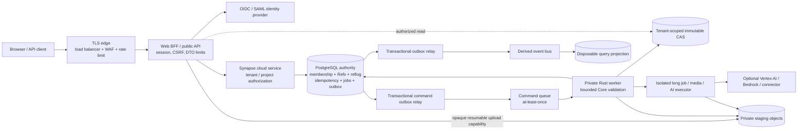
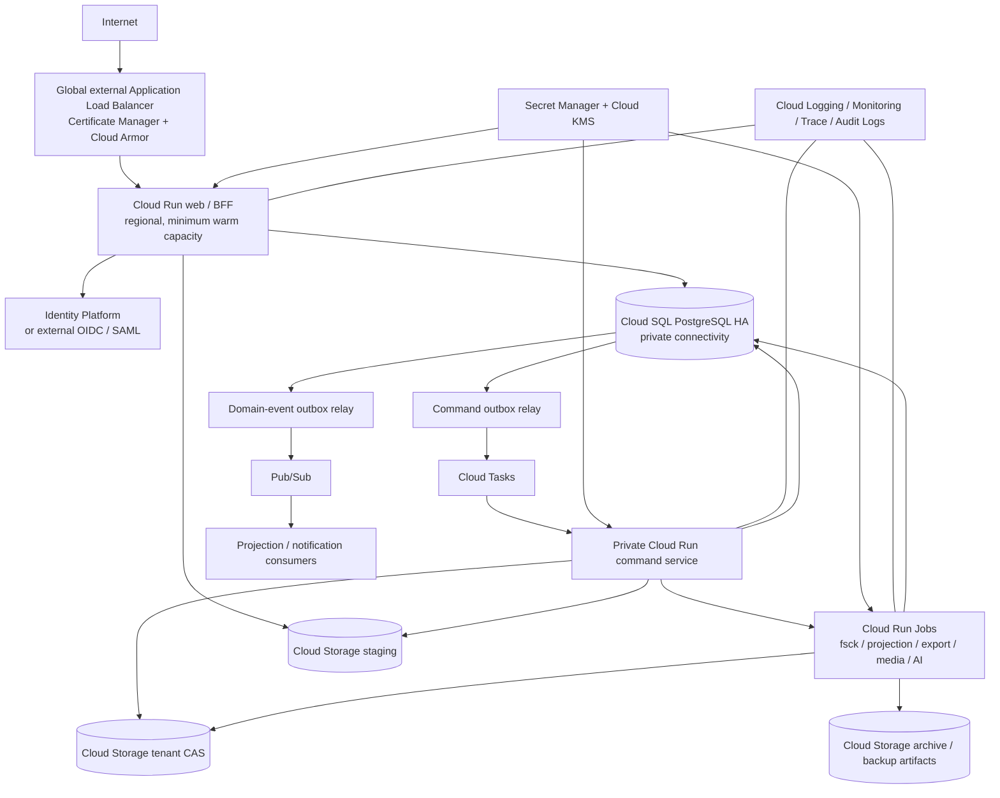
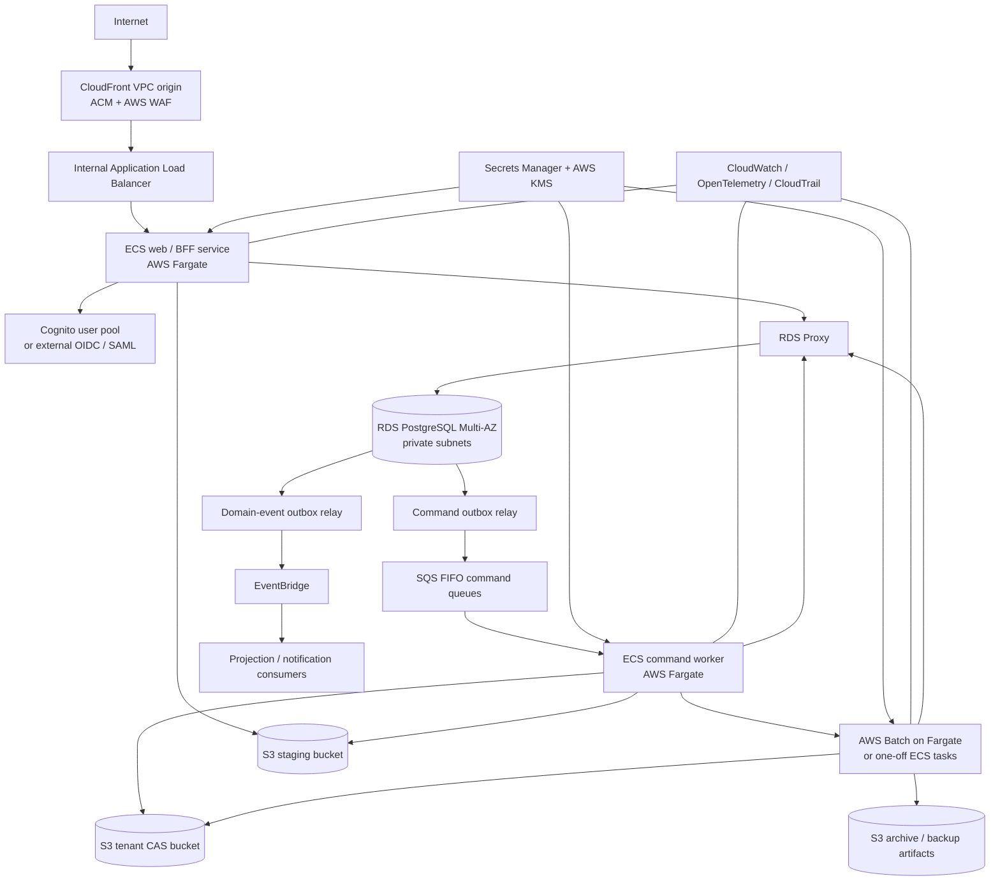
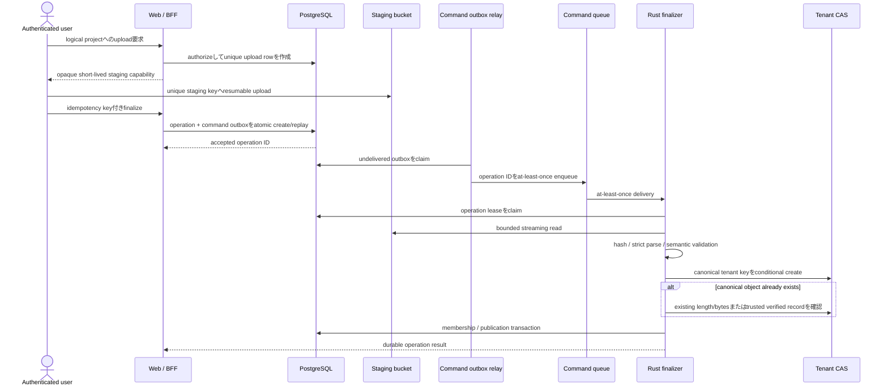

# SynapseGit cloud service architecture

Status: **production target proposal / 実装未着手**

Decision date: 2026-07-14

Primary deployment: **Google Cloud**

Portability profile: **Amazon Web Services (AWS)**

この文書は、SynapseGitをpublic／multi-user serviceとして提供するための推奨application／deployment仕様である。
Core v0.1 protocolを変更する文書ではない。OID、object、Ref、reflog、archiveの規範は引き続き
[`spec/core/v0.1`](../spec/core/v0.1/README.md)を正とする。

本文の **MUST**、**MUST NOT**、**SHOULD**、**MAY** はproduction実装への要求強度を表す。
cloud product名は2026-07時点の推奨baselineであり、deploy時には末尾のprovider公式資料で
availability、quota、security behaviorを再確認する。

> **Non-production packaging validation (2026-07-14):** 現行local CLIをprivate／one-shot
> Cloud Run Jobとしてisolated development projectへ展開し、OCI build、Artifact Registry、専用identity、
> Terraform deployment、digest-pinned実行を検証した。この[smoke deployment](../deploy/gcp/README.md)に
> public ingress、永続authority、GCS／PostgreSQL adapter、OIDC、tenant isolationは含まれず、
> Phase 1完了やproduction service実装を意味しない。

## Executive decision

最初のproduction deploymentは次のGCP profileをSHOULDとする。

| 責任 | Google Cloud主系 | AWS portability profile |
|---|---|---|
| public edge | Global external Application Load Balancer、Cloud Armor、Certificate Manager | CloudFront VPC origin、internal Application Load Balancer、AWS WAF、ACM |
| Web／BFF・同期API | Cloud Run services | ECS services on AWS Fargate |
| command worker | Cloud Tasksから呼ぶprivate Cloud Run service | SQSをconsumeするprivate ECS service on Fargate |
| 長時間operation | Cloud Run Jobs | AWS Batch on Fargateまたはone-off ECS task |
| transactional authority | Cloud SQL for PostgreSQL regional HA | Amazon RDS for PostgreSQL Multi-AZ + RDS Proxy |
| immutable bytes | private Cloud Storageのstaging／tenant CAS／archive bucket | private S3のstaging／tenant CAS／archive bucket |
| command配送 | Cloud Tasks。idempotency／順序の正本はPostgreSQL | SQS FIFO。idempotency／順序の正本はPostgreSQL |
| derived event | Pub/Sub | EventBridge、必要に応じてSNS／SQS |
| end-user identity | Identity Platformまたは外部OIDC／SAML IdP | Cognito user poolまたは外部OIDC／SAML IdP |
| secret／key | Secret Manager、Cloud KMS | Secrets Manager、AWS KMS |
| telemetry／audit | Cloud Logging、Monitoring、Trace、Audit Logs | CloudWatch、OpenTelemetry、CloudTrail |
| optional managed AI | 隔離Executor越しのVertex AI | 隔離Executor越しのAmazon Bedrock |

初期HTTP／command processはstateless containerにでき、長時間処理をJobsへ分けられるため、
GCPではCloud Runを標準とする。GKEは既定にしない。Kubernetes固有のschedule、常駐high-throughput pull worker、
特殊sandbox／sidecar、またはCloud Runでは満たせないnetwork／hardware requirementが実測で必要になった場合だけ
GKE Autopilotを比較する。AWSもECS on Fargateを標準とし、provider対称性だけを理由にEKSを採用しない。

projectのwrite authorityは**一つのhome regionに一つ**とする。region内HAは必須だが、
cross-region active-active Ref writeは行わない。cross-region replicaはDR用であり、明示的なwrite fence後にだけpromoteする。

現在のfilesystem CAS、SQLite RefStore、process-local ACL／permit／FIFO fence、
`AdmittedProposalHandle`を、autoscaleするpublic serviceへそのまま配置してはならない。
後述するdurable admitted-proposal receiptは、multi-instance Human Decisionを公開するためのrelease blockerである。

## Scope and assumptions

この提案は次を前提にする。

- public SaaSとして複数user、複数tenantを扱う。
- 各projectは一つのauthoritative home regionを持つ。
- GCPを先に実装・運用し、provider-facing portによりCore identityを変えずAWSへ移植可能にする。
- 最初のUIではserver-rendered／BFF modelを維持できる。
- 最初のimage flowは、load／abuse testが変更を承認するまで、現行の1 file 64 MiB、
  3 file operation合計192 MiBを上限にする。
- `caller_supplied` AI outputを正確に表示するbaselineを維持する。
- Projectionは破棄可能で、requestのauthorizeや正本repairには使わない。

この提案は現時点のSLA、compliance certification、multi-region active-active protocol、
AWS同時launchを約束しない。byte identityからvisual similarity、作者性、権利、capture time、
physical changeを推論するものでもない。

## Non-negotiable system invariants

1. strict parse、canonical bytes、semantic validation、OID計算の決定権はRust Coreが持つ。
   browser、queue message、object名、DB row、cloud checksumはCore identityを供給しない。
2. canonical objectはimmutableかつcreate-onlyで公開する。object versioningが有効でもoverwriteはcorrectness failureである。
3. Ref compare-and-swapと対応するreflog entryは、関係する全Ref preconditionを確認した後、
   一つのPostgreSQL transactionでcommitする。
4. canonical objectをdurableにしてからRefから到達可能にする。DB transaction失敗で未到達objectが残ることは許すが、
   sharedかもしれないcanonical objectをrequest pathから削除しない。
5. authority row、object membership、query、cache key、queue command、audit eventは、
   内部`tenant_id`と`project_id`でscopeする。
6. physical CAS keyは既定でtenantごとに分離する。cross-tenant deduplicationは、privacy、erasure、billing、
   existence oracleを別設計で承認するまで禁止する。
7. public write routeはlow-level `update-ref`、caller-selected authority、raw storage path、
   reusable permit、process-local Core handleを公開しない。
8. queue deliveryはat-least-onceとして扱う。idempotencyはqueue productの主張ではなくDB invariantである。
9. Projectionはverified CASとconsistent Ref snapshotからrebuildする。lagやfailureがCore authorityを変更しない。
10. projectでactiveなwriter epochは一つだけとする。failoverは旧epochをfenceするまでwriteを再開しない。
11. AI executionとmedia decodeはuntrusted workloadである。Ref authority、DB owner credential、
    unrestricted egress、canonical CAS write権限を渡さない。
12. Human Decisionはdurableなserver-owned admitted evidenceだけを入力にし、publication時にfull revalidationする。

## Logical architecture



browserはunique staging objectにだけuploadでき、canonical OID keyへはwriteできない。
trusted workerがstaging objectをbounded streamでRust validationへ通し、OIDを計算してcanonical objectを
conditional createする。PostgreSQLのmembership／Ref publicationは、その後にだけ実行する。

## Google Cloud deployment profile



Cloud Run serviceはregional resourceで、region内の複数zoneへ自動配置される。
second regionはload balancer背後へ別deployするのであり、DBやapplication stateをactive-activeにはしない。

### GCP component requirements

| component | 必須configuration |
|---|---|
| Load Balancer | HTTPS only、managed certificate、意図したCloud Run backendだけを公開、health／failover policyを試験する |
| Cloud Armor | managed baseline rule、upload／command／auth／reviewごとのrate limit、request-size policyを設定する |
| Web／BFF | `internal-and-cloud-load-balancing` ingress、supported pathではdirect `run.app` accessを無効化、server-side session、bounded body、DB connection予算に合わせたmaximum instances |
| command service | authenticated private ingress、Cloud Tasks専用service accountのaudience-bound ID tokenだけを受理し、user cookieを受理しない |
| Jobs | privilege classごとにjobを分け、timeout、retry、CPU／memory、service account、egress、scratch上限を固定する。retryはdurable operation ledgerを再度claimする |
| Cloud SQL | PostgreSQL regional HA、private connectivity、Cloud SQL Auth Proxy等のsupported接続、PITR、automated backup、deletion protection、hard connection budget |
| staging bucket | private、uniform bucket-level access、unique opaque key、terminal state後のcleanupとabsolute safety TTL、authority dataを持たない |
| CAS bucket | private、tenant-scoped key、conditional create、通常serviceのoverwrite／deleteを拒否、lifecycle deleteを無効化する。GCはbreak-glassでなく専用最小権限identityとreview済みplanを使う |
| archive bucket | CASと分離し、validation／completion marker後にだけimmutable artifactとして公開する |
| Pub/Sub | derived notificationだけに使い、consumerをidempotentにする。messageからRefやpermissionを復元しない |
| Secret／KMS | workloadごとにidentityを分け、image、Terraform output、environment dump、log、queue bodyへsecretを置かない |

CAS adapterはCloud Storage generation preconditionを使う。canonical createは`ifGenerationMatch=0`で行い、
precondition failureはexisting-object verificationへ進め、overwriteに変換しない。
resumable upload session URIとsigned URLはbearer capabilityなので、HTTPS、短い有効期間、unique staging key、
log redaction、method／objectの最小scopeを必須にする。CRC32C等のprovider checksumはtransfer integrity用であり、
SynapseGit OIDの代用にしない。

Cloud SQL Auth Proxyはconnection poolではない。`per-instance pool × Web／workerのmaximum instances + job上限`を
DBのreserved connection数以下へ固定し、超過時はautoscaleを止めてbackpressureするMUSTとする。
edition／regionでmanaged connection poolingを利用でき、contract／failover testを通せる場合は利用してよい。
PgBouncer等を使う場合も全instance合計のhard budgetを置き換えず、transaction／session pooling差をtestする。

### GCP project and network layout

productionとnon-productionは別GCP project、別DBとする。小規模な初期organizationでも次をSHOULDとする。

- production workload project: Cloud Run、Tasks、Pub/Sub、Artifact Registry、runtime secrets
- production data project: Cloud SQL、Storage。cross-project service identityは必要最小限
- security／audit project: central log sink、alert、break-glass administration
- 同じ境界を持つnon-production project群

Cloud SQLとprovider endpointはprivate connectivityを使う。public web trafficはload balancerだけから入る。
Cloud RunからはDirect VPC egress等のsupported pathを使い、AI／media jobのexternal accessはallowlistされた
egress proxy／routeへ限定する。inbound administrative SSHは持たず、auditedなcloud control-plane accessを使う。

## AWS portability profile



AWSでも可能な限り同じOCI imageとPostgreSQL schemaを使う。ECS task roleをworkloadごとに分け、
node／shared application credentialを使わない。ECSとRDSはprivate subnetへ置き、CloudFront VPC originから
internal ALBへ接続する。利用regionでVPC originを使えない場合は、public ALBをCloudFront managed prefix list、
secret origin header、HTTPSで制限する代替を別途reviewする。S3、ECR、Logs、Secrets、KMS、SQS等には
VPC endpointをSHOULDとする。

S3 canonical createは`If-None-Match: *`付きconditional `PutObject`を使い、bucket policyでも
non-conditional canonical writeを拒否する。presigned PUTは同じkeyを上書きできるので、browserにはunique staging keyだけを渡し、
canonical keyを渡さない。ETagはmultipart／encryptionでcontent digestとは限らないためCore OIDに使わない。

SQS FIFOの`MessageGroupId`はtenant／projectにしてよいが、delivery orderは補助である。
deduplication windowをdurable idempotency contractにせず、PostgreSQL unique constraintとoperation stateを正とする。

RDS PostgreSQL Multi-AZを直接のbaseline equivalentとし、RDS ProxyでFargate scale-out時のconnection stormを抑える。
Aurora PostgreSQL／Global Databaseは、実測したscale、failover、read replica要件がcost／behavior差を正当化する場合の
optional decisionとする。App Runner、EKS、Lambdaもbaseline dependencyではない。

production、non-production、security、log archiveはAWS Organizations配下の別accountをSHOULDとする。
cross-account roleはshort-livedかつauditedとし、CI／taskにIAM user access keyを置かない。

## Provider-independent application boundary

Core identityはprovider SDKに依存させない。cloud実装には、現在のlocal adapterより強いcontractを持つportが必要である。

| port | 必須semantics | current gap |
|---|---|---|
| `VerifiedObjectStore` | bounded streaming read、verified kind／OID、conditional create、paged bounded inventory、tenant storage scope | 現在の`ObjectStore`はobject／inventoryをmaterializeし、writeは`FileObjectStore`固有 |
| `RefAuthorityStore` | project writer fence、multi-Ref precondition、CAS + reflog + durable admission／outbox transaction、consistent paged snapshot | `synapse-sqlite`はconcrete local storeで、production PostgreSQL portではない |
| `UploadStagingStore` | unique object、bounded metadata、lease、signed／resumable capability、terminal cleanup | 未実装 |
| `IdentityResolver` | verified issuer／subjectからinternal userとtenant／project membership、role、authorization epochを解決 | process-local `Authenticator`とexact project mapだけ |
| `OperationStore` | idempotency key、request hash、state machine、lease、attempt、result／error、audit binding | localhost operation registryはprocess-localとして計画中 |
| `CommandDispatcher` | DB command outboxからoperation IDをat-least-once配送、delayed retry、dead-letter | 未実装 |
| `EventPublisher` | transactional outbox relay、idempotent derived consumer | 未実装 |
| `ProjectionStore` | source fingerprint／lagを持つdisposable query | SQLite baselineだけでauthenticated routeはない |

現在の`Repository`は`PathBuf + FileObjectStore + SqliteRefStore`へ固定されているため、
backend-neutralな`Repository<O, R>`または同等のportへ分離する。Core publicationは、verified publication planと
Ref authority transactionを分け、PostgreSQL unit of workへproposal CAS、reflog、admission、operation、outboxを参加させられる形にする。

package名はillustrativeであり、contractを優先する。

```text
crates/
  synapse-service        provider-neutral public use case / versioned DTO
  synapse-ref            production RefAuthorityStore contract
  synapse-object         production streaming object-store contract
  synapse-postgres       PostgreSQL authority / operation ledger / outbox
  synapse-gcp            Cloud Storage / Tasks / deployment adapter
  synapse-aws            S3 / SQS / deployment adapter
  synapse-cloud-http     public BFF / API; local loopback assumptionを持たない
```

cloud HTTP contractはlocalhost `api/local/v1`と別version／namespaceにする。
local contractはOS user、loopback listener、process tokenを信頼しており、productionでは無効な前提だからである。
authorizationとresource semanticsが完全に同じDTOだけを共通化してよい。

`synapse-creator`はpath入力の同期一括runをcompatibility wrapperとして残し、cloud use caseを
upload receipt／OID入力のproposal-only beginとdurable receipt入力のdecideへ分ける。
`synapse-observation`、`fsck`、Projection builderもbounded verified sourceへgeneric化し、algorithmと
`byte_identity_only` semanticsは変えない。

## Authority data model

PostgreSQLはmutable service stateのauthorityである。少なくとも次を保持する。

- tenants、verified identities、users、tenant memberships、projects、project memberships
- project writer epoch／fence、authorization／profile generation
- Refsとappend-only reflog
- object verificationとtenant／project membership
- upload sessionとstaging lease
- idempotency recordとdurable operation attempt
- transactional outbox
- Core contract実装後のdurable admitted-proposal evidence
- archive／export stateとDR replication observation

tenantを跨ぎ得るprimary／foreign keyは`tenant_id`を含めるか、同等のcomposite constraintで拘束する。
human-readable tenant slugはauthorization keyではない。database row-level securityはdefense in depthとしてMAYだが、
explicit tenant predicate、composite constraint、service test、least-privileged DB roleを置き換えない。

### Tenant-scoped object identity and membership

Core OIDはcanonical bytesのdigestのまま維持する。physical keyはidentityを変えず、次のようにする。

```text
cas/<opaque-storage-tenant-id>/<kind>/<digest-prefix>/<digest>
```

opaque storage tenant IDはrequestから受け取らない。verified `object_membership` rowだけがprojectへOID accessを与える。
OID、storage URL、同じbytesを知っていることはmembershipにならない。unknown／cross-tenant／forbidden lookupは同じ
public not-found semanticsとし、cross-tenant dedupの有無を漏らさない。

同一tenant内のproject間dedupはmembership check後にMAYとする。cross-tenantでは行わない。
provider-side encryptionはstored ciphertextを保護するが、plaintext Core OIDを変えない。
application-level per-tenant envelope encryptionは別のprotocol／adapter decisionであり、launch時に暗黙導入しない。

### Ref and reflog transaction

初期実装はdurable project fence rowでproject writeをserializeするSHOULDとする。
同等のrace proofなしにnarrow lockへ最適化しない。

```text
BEGIN
  tenant/projectのproject_write_fenceをlock
  active home regionとwriter_epochを検証
  lock待機後のtrusted database timeを取得
  membership、role/profile generation、expiry、idempotencyを再検証
  base/proposal/target Refをdeterministic orderでlockして比較
  required object-membershipがpublishableなままか確認
  old/new headとauthenticated actorを持つreflog eventを一件insert
  target Refをcreateまたはcompare-and-swap
  operation resultとtransactional outbox eventを保存
COMMIT
```

transaction中にprovider network call、model call、object upload、大規模graph walkを行わない。
full closure validationはimmutable verified objectに対してtransaction前に行う。短いtransaction内では、
同じtenant／project membership setがGCから保護され、全Ref preconditionが維持されていることを確認する。

stale expected headはRef、reflog、admission、outboxを変えずに失敗する。serviceが新headへ自動retry／rebaseせず、
callerがnew stateを取得して新しいdecisionを作る。

## Upload and canonical publication



1. BFFはtenant／projectの存在を解決する前にauthenticateし、opaque upload IDとunique provider keyを作る。
2. capabilityはintended method、object、size／range、短いtime windowだけを許す。log、analytics、error reportへ出さない。
3. stagingはauthorityではない。client-supplied OID、MIME、filename、checksum、completion claimはadvisoryである。
4. finalizerは固定上限で読み、Rustでcanonical OIDを計算し、structured objectをcanonical publication前に検証する。
5. canonical createはconditionalにする。別writerが勝った場合、existing verified recordまたはbounded byte comparisonが
   local create-if-absent contractを証明した場合だけ`AlreadyPresent`を受け入れる。mismatchはquarantineしてalertする。
6. DB publicationはcanonical durability後に行う。失敗時のobjectはunreachable orphanとして後でreconcileし、request pathで消さない。
7. 通常のstaging cleanupはterminal DB state、ownership lease／generationを確認して行い、ageやpathnameだけでdeleteしない。
8. これとは別に、upload／operationの最大許容時間とincident marginより長いabsolute safety TTLをprovider lifecycleへ設定する。
   TTL到達時はuploadをexpired terminalにするため、staging byteが失われてもauthorityは壊れない。TTL値はretention decisionで固定する。

canonical storageのdirect browser readは既定にしない。serviceがmembershipを確認してbounded streamするか、
application cookieを持たないdedicated sandbox media origin／provider originのvery short-lived read capabilityを発行する。
untrusted bytesをapplication originからactive contentとしてserveしてはならない。render可能formatはallowlistし、
`nosniff`、strict CORS／CSP、安全なcontent-type／content-dispositionを固定する。SVG／HTML等のactive formatはdownload-onlyとする。
raw storage keyやcross-tenant existenceを公開しない。

## Durable commands, retries, and events

全mutation requestにidempotency keyを必須にする。DBはauthenticated principal、tenant／project、route version、
normalized request、keyのhashを保存する。同じkeyを異なるcontentで使えば拒否し、同一contentなら同じoperation／terminal responseを返す。

operation state machineは少なくとも`accepted`、`leased`、`running`、`succeeded`、
`failed_retryable`、`failed_terminal`、`cancelled`を持つ。leaseはowner、generation、expiryを持ち、
current generationだけがresultをcommitできる。queue bodyはoperation IDとrouting metadataだけを持ち、
authorityやsigned user decisionを持たない。

operation rowと`command_outbox` rowは一つのDB transactionで作る。BFFからCloud Tasks／SQSへのdirect enqueueを
durability境界にしてはならない。relayはundelivered rowをclaimしてqueueへat-least-once送信し、provider応答が不明なら再送する。
低latencyのbest-effort direct wake-upを併用しても、outbox relayが最終的な回復経路である。

workerはSIGTERM／task stopを受けるとnew workを止め、side effectをcheckpointできる場合だけ現在attemptを完了する。
それ以外はcurrent generationを確認してleaseをrelease／短縮し、queueをNACK可能なら再配送させる。
leaseを失ったworkerはresult／Refをcommitできない。hard kill時もbounded lease expiryで別workerが再開する。

transport failure、expired worker lease、conditional create、idempotent read／rebuildはretryしてよい。
次はblind retryしない。

- 新しく観測したheadを使うRef conflict
- policy、proposal、baseが変わったHuman Decision
- side effectをdeduplicateできないAI／model call
- authority writeのpartial outcomeが不明なarchive restore

authority mutation transactionはoutbox rowもinsertする。relayがPub/Sub／EventBridgeへpublishし、
consumerはevent IDでidempotentにする。consumerはProjection、notification、analyticsを更新できるが、
eventからuserをauthorizeしたりsource-of-truth historyを生成したりしない。

## Human Decision production blocker

現在の`AdmittedProposalHandle`はopaque、non-Clone、`application_instance: u64`へ束縛され、
process-local stateに裏付けられる。一つのapplication instanceが一つのexact proposalをadmitした証拠であり、
restart、autoscale handoff、deployment、regional failoverを越えられない。

このhandleをserializeしたりprivate fieldをtokenへコピーしたり、Projection／Refから復元してはならない。
stickyなsingle instanceをscale-to-zero無効で動かしてもcrashで証拠を失うため、明示的なprivate alpha以外では不可である。

multi-instance Human Decisionをenableする前に、Core／applicationは次を満たすdurable admission compositionを定義する。

- proposal Ref CAS、proposal reflog、admission evidenceを一つのPostgreSQL transaction、
  または同等に証明されたatomic compositionでcommitする。
- durable rowをtenant、project、proposal Ref/head、trusted base Ref/head、policy／profile generation、
  authenticated principal／agent、issued time、expiry、writer epochへ束縛する。
- browserにはopaque random receipt IDだけを返し、authority fieldを返さない。
- review時にauthority DBからrowをload／lockし、live reviewer membership／profile／expiry、
  exact proposal／base／decision Refを再検査してfull Core validationを呼ぶ。
- 明示state machineに従い、**同じexact proposal head、base head、Policy、profile generation**に対する
  server-fixed Decision candidateの訂正または純粋なsystem retryだけがadmitted evidenceを再利用できる。
  proposal／base／Policy／profileが1 bitでも変われば旧receiptをinvalidateして新しいadmissionを要求する。
  successful canonical Decision CASは一つだけが勝つ。
- revoke、expire、restart、duplicate、concurrent review、deployment、DRをprocess-kill／race testする。
- Projection、queue message、signed URL、client JWT claimをreceiptのsourceにしない。

推奨はself-contained browser capabilityではなく、opaque database-backed `DurableAdmissionReceipt`である。
これにはCore／application transaction compositionの変更が必要で、cloud adapterだけでは解決しない。
実装完了までは、GCP production sliceがauthorized read、upload、report、proposal-onlyを提供してもよいが、
Human Decision endpointはdisableまたはprivate-alpha限定にするMUSTとする。

## Identity, authorization, and tenant isolation

web applicationはBFF経由のOIDC Authorization Code + PKCEを使う。BFFはissuer、audience、signature、expiry、nonce、
authentication contextを検証し、rotating opaque server-side sessionを作る。cookieは`Secure`、`HttpOnly`、host-scoped、
適切な`SameSite`にし、unsafe browser requestにはCSRF tokenとexact Origin checkを要求する。

Identity Platform tenantやCognito pool metadataはauthentication routingに使ってよいが、application membership DBを置き換えない。
verified issuer／subject pairをinternal userへmapし、tenant／project membershipはserver-sideで解決する。
token内tenant claimはrouting hintにすぎない。

初期roleはtenant administration、project ownership、creator publication、direct human review、read-only view、
service executionを分離するSHOULDとする。tenant admin、reviewer、break-glass、production operatorにはMFAを必須にする。
organization／quorum、release approval、modified／partial adoptionは別の未実装protocolであり、cloud loginだけでは有効にならない。

authorizationは次の全時点で行う。

1. tenant／project existenceを開示する前
2. upload／read capabilityを発行する前
3. durable operationを作る時
4. worker lease待機後
5. project fence取得後の短いpublication transaction内

uniform not-found response、bounded timing、tenant-scoped cache key、negative cross-tenant testにより、
OID、project slug、job ID、operation IDをexistence oracleにしない。

## Workload identity, secrets, encryption, and network policy

- web、command worker、job class、migration、projector、outbox relayごとにworkload identityと最小provider permissionを分ける。
- CIはworkload identity federationとshort-lived credentialを使い、service-account key／IAM access keyを禁止する。
- public／service-to-service pathはTLSを使い、内部callはprovider IAM token／audience-bound identity tokenでauthenticateする。
- DB emergency credential、external API secretはprovider Secret Managerへ置き、image rebuildなしでrotation可能にする。
- provider-managed encryptionをbaselineとする。CMEK／KMSはenvironment／data classごとのrecovery／rotation runbookを
  検証した場合にMAYとする。
- KMS administration、key use、security audit、break-glass roleを分離する。destroy scheduleはdual controlとbackup impact reportを要求する。
- canonical CASの通常serviceはdeleteできない。offline GC identityがretention／reachabilityを検査したgeneration-bound planだけを実行する。
- AI／media workerはdisposable scratch、CPU／memory／time／output上限、authority DB roleなし、deny-by-default egressとする。
  external connectorはallowlistし、SSRF／redirect escapeを防ぐ。

Cloud Armor／AWS WAFはedge abuseを減らすが、authentication、authorization、schema validation、resource accountingではない。
limitはBFF、operation store、Rust reader、graph verifier、DB、queue、jobでも独立に強制する。

## Projection and read consistency

source of truthはverified immutable CAS、PostgreSQL Refs／reflog／membershipである。
PostgreSQL read model、job内SQLite rebuild、将来SurrealDB adapterはいずれもdisposableとする。

各projection buildは次を記録する。

- tenant／projectとexact Ref snapshotまたはsnapshot version
- source fingerprintとprojection schema version
- build start／end、row／object count、bounded limit、diagnostics
- success／failureとlast consumed outbox／event position

review precondition、publication status等のstrong readはauthority storeへ送る。
timeline／searchはeventually consistentでよく、source versionを表示する。stale Projectionはaccessをgrantせず、
live Ref conflictを隠さず、archive completenessを証明せず、GCを駆動しない。

## Archive, backup, and erasure

現在のnormative archiveはlocal directory profileである。cloud bucket prefixをatomic local directoryと暗黙同一視せず、
tar／zip wrapperをversioned packaging profileなしに追加しない。

初期cloud serviceでは次を分離する。

- **provider backup／DR**: PostgreSQL PITR、object replication、operator用protected backup artifact。
  user portability archiveではない。
- **portable export job**: isolated scratchへ既存directory archiveをmaterialize／validateし、
  別versionのcloud delivery envelope仕様が完成した後だけ公開する。
- **import／restore**: offlineまたはexclusive project maintenance fence内で全OID／checksum／closureを検証し、
  mutable authorityを最後にrestoreする。

cloud delivery envelopeが決まるまで、任意object prefixやcompressed fileをCore archive profile準拠と表示しない。

logical erasureはaccess／membershipを除去し、Core protocolが必要とするTombstone policyを記録する。
physical deletion、replica、PITR、retained archive、legal hold、keyには別retention clockがある。
product noticeはこれらを正確に説明する。

## Availability, SLO, backup, and disaster recovery

以下は推奨internal targetであり、現在の保証やprovider SLAではない。product approval、load test、on-call／incident processが必要である。

| target | initial production recommendation |
|---|---|
| monthly API availability | authenticated readとaccepted commandで99.9% |
| regional topology | multi-zone web／worker + PostgreSQL regional HA |
| project write topology | 一つのauthoritative home region／writer epoch |
| regional disaster RPO | 15分以内 |
| regional disaster RTO | 4時間以内 |
| backup | PITR + scheduled retained backup、四半期ごとに実restore |
| DR exercise | 年2回以上のregional failover／failback |

Cloud SQL regional HAとRDS Multi-AZはinstance／zone障害を扱うが、regional DRを単独では満たさない。
DR regionにはasync PostgreSQL replicaまたはcurrent restore path、replicated CAS／archive、write-disabled deploy、
Secret／KMS access、tested traffic switchが必要である。async replicationはrecent commitを失い得るため、
promotion前にincident commanderがrecovery pointを明示する。

RPO 15分を目標にする場合、GCPでは選択region／data residencyに合うCloud Storage dual-region／replication、
AWSではS3 CRR／RTC等を構成し、DBとobject双方の実測lagを監視する。provider featureを有効にしただけで
SynapseGit全体のRPOが達成されたとは見なさない。

failoverは次の順序に固定する。

1. new write admissionを停止し、旧regionのcompute／queue consumer／DB accessをprovider control planeで停止・隔離する。
   旧DB内のepochだけではnetwork partition中の旧writerをfenceできない。
2. old data planeの停止を確認するか、外部control planeが発行するshort-lived regional writer leaseの期限と
   最大clock-skew marginが過ぎたことを確認する。どちらも証明できなければDR側のwriteをenableしない。
3. last durable DB recovery positionとobject replication watermarkを確定する。
4. DR PostgreSQLをpromote／restoreし、writer epochをincrementする。
5. recovery pointでvisibleな全Refのbounded closureがDR CASに揃っていることを検証する。
6. missing closureのprojectをquarantineし、不完全historyをserveしたりheadを黙って戻したりしない。
7. late object replicationをreconciliation workerがfixed recovery snapshotに対して再監査する。
   exact closureが揃った場合だけaudited transactionでquarantineを解除し、別headで推測repairしない。
8. DR writeをenableし、trafficを切り替え、conflict／queue／DB／replication metricを監視する。
9. failbackも新しいfenced migrationとして実行し、simultaneous writerにしない。

DB backupにreachable CAS bytesが揃わなければvalid SynapseGit recoveryではない。
逆にextra immutable CAS objectはauthority／membershipから到達しない限り安全なorphanである。

99.95%、RPO 5分、RTO 1時間等の上位targetは、costed designと実測済みconfigurationを別途必要とし、
DNS health checkの変更だけでは達成しない。

## Observability and operations

structured telemetryはrequest ID、trace ID、operation ID、deployment version、provider／region、job type、attempt、
pseudonymous tenant／project IDを使う。cookie、bearer token、signed upload URL、raw media、prompt／content body、secret、
unredacted credentialを記録しない。raw OIDはrestricted integrity logで必要な場合だけ記録する。

最低限、次をmetric／alert対象にする。

- request rate／latency／status、WAF／rate-limit rejection、session failure
- DB pool、lock wait、transaction latency、Ref conflict、writer epoch、replica lag、PITR／backup status
- upload age／bytes、finalization mismatch、conditional-create conflict、unreachable verified object、staging cleanup backlog
- queue age、lease expiry、retry／dead-letter、idempotency replay／mismatch、outbox lag
- Projection source version、rebuild duration／failure、lag
- AI／media job time、output bytes、timeout、denied egress、provider cost／quota
- DR object replication watermark、missing-closure audit count

alertにはrunbookとownerを対応付ける。audit trailはlogin／admin、membership／policy change、review／publication、
break-glass、KMS／key administration、deployment、DB migration、restore、GC、DR promotionを含む。
provider audit logはCore reflogやapplication decision evidenceを置き換えない。

## Delivery, infrastructure as code, and supply chain

infrastructureはTerraformで管理し、同じservice contractに対するGCP／AWS root moduleを分ける。
state、plan approval、apply permissionをenvironmentごとにscopeし、production changeはreview済みplanとauditable deployment identityを要求する。

provider adapterが別imageを必要としない限り、Cloud RunとECSで同じOCI imageをSHOULDとする。
buildはdependencyをpinし、SBOM、source／dependency／image scan、digest signatureを生成し、mutable tagではなくdigestでdeployする。
runtime imageはminimal、non-root、bounded scratch以外read-onlyで、cloud credentialを含まない。

DB migrationはexpand／contract sequenceを使う。専用migration jobがmigration lockを保持し、rollout中の現行applicationと
backward-compatibleにする。destructive migrationと未検証application deployを一度に行わない。
PostgreSQL DDLは短い`lock_timeout`／bounded `statement_timeout`を設定し、blocking lockを取得できなければretry／abortする。
indexは可能な範囲で`CREATE INDEX CONCURRENTLY`等のonline patternを使い、constraint validationとcolumn／index dropは
observed old-version trafficがなくなった後の別releaseで行う。
rollbackはcompatible imageまたはforward fixであり、committed Core historyのblind reversalではない。

rolloutはnon-production integration、production canary、bounded traffic increase、full deploymentの順に行う。
Ref CAS race、queue duplicate、process kill、object publication faultをpromotion前に試験する。

## Implementation sequence

### Phase 0: decisions and provider-neutral contracts

- tenancy、home region／data residency、retention、initial SLO、IdPを承認する。
- streaming object portとPostgreSQL authority portを定義する。
- localhost read実装にも必要な、一transactionのpaged Ref／reflog snapshot、snapshot-bound report／fingerprint、
  bounded verified Blob readerを先に実装する。
- durable admitted-proposal transaction compositionを仕様化する。
- threat model、data-flow inventory、cloud API error／idempotency contractを作る。

### Phase 1: GCP authority foundation

- isolated non-production GCP projectをTerraformでprovisionする。
- Cloud Storage staging／CAS adapterとPostgreSQL Ref／reflog、membership、operation、outbox storeを実装する。
- filesystem／SQLiteとGCS／PostgreSQLに共通contract testを通す。
- workload identity、secret、telemetry、backup、restore automationを追加する。

### Phase 2: private read and upload alpha

- BFF／OIDC、tenant／project authorization、safe read route、upload session、async finalize、operation status、
  Projection rebuildをdeployする。
- low-level Ref routeとraw structured-object routeを存在させない。
- `byte_identity_only`と`caller_supplied`表記を維持する。
- tenant isolation、abuse、load、fault、media-origin testを行う。

### Phase 3: proposal publication

- server-owned proposal candidateをCore preflight／full validationへ接続する。
- project writer fence、idempotent command processing、Ref／reflog／outbox transactionをrace testする。
- optional Vertex AI executionを隔離し、provider outputを作者性／correctnessの証明にせずactual provenanceを記録する。

### Phase 4: durable Human Decision

- Core／application durable admission receipt contractを実装する。
- restart、rollout、duplicate delivery、concurrent reviewer、expiry、revocation、stale base、failoverを検証する。
- GA gateを通るまでHuman endpointをenableしない。

### Phase 5: production and DR gate

- security review、incident response、on-call、dashboard、budget、backup restore、closure-aware DR、
  external penetration testを完了する。
- retention／privacy／security support statementを公開する。
- public production traffic前にregional recoveryとrollbackを実行する。

### Phase 6: AWS portability validation

- ECS／RDS／S3／SQS上に同じcontractをnon-production deployする。
- provider contract、CAS race、Ref transaction、identity isolation、restore、DR testを実行する。
- 意図したprovider差を文書化し、欠けたguaranteeをunsafe application shortcutで模倣しない。

### Phase 7: existing local repository migration

- local repositoryで`fsck`とdirectory archive exportを完了する。
- empty cloud projectへoffline importし、OID inventory、Refs、complete reflog、creator report、
  byte-identity evidence、archive checksumを照合する。
- read-only shadow期間後に明示cutoverし、filesystem／cloudへのdual writeは行わない。

## Release acceptance gates

public production releaseは、対象となる次のcheckを全てpassするまでblockする。

- concurrent canonical createが一つのimmutable objectとverified `AlreadyPresent`になり、overwriteしない。
- 同じexpected headの二つのRef updateで一つだけが成功し、対応reflogも一件だけ増える。
- staging、canonical create、DB transaction、outbox、cleanup間の全process-kill pointが、authority corruptionなしにreconcileする。
- DB operation commit後かつqueue enqueue前にrelayをkillしても、command outboxからoperationが最終的にdispatchされる。
- duplicate／reordered queue deliveryが一つのdurable logical resultへ収束する。
- workerのSIGTERM／hard killでstale lease holderがcommitせず、releaseまたはbounded expiry後に処理が再開する。
- staging lifecycle TTLがactive contractより短くならず、expired uploadだけをfail-safe deleteする。
- cross-tenant project／OID／upload／operation／session accessをcache／signed URLを含めuniformに拒否する。
- load／provider retry storm時にDB poolとautoscale上限が安定する。
- Projection削除／rebuildがauthorization／Core readへ影響しない。
- backup restoreでPostgreSQL authorityと全reachable CAS closureを再現する。
- DR promotion前に旧regionのdata-plane fenceまたはexpired external writer leaseを証明し、single writer epochを維持する。
- incomplete closureをquarantineし、late replication後のexact re-auditでだけreleaseする。
- AI／media workerがauthority credentialとunapproved egressへ到達できない。
- public routeにlow-level Ref update、raw authority、storage key、process-local handleが存在しない。
- durable admissionがrestart、rollout、duplicate delivery、regional recoveryを越えるまでHuman reviewを公開しない。
- security contact、supported version、incident response、retention、data deletion behaviorを公開・演習する。

## Cost and scaling guidance

productionの主要fixed costはHA PostgreSQL authorityであり、serverless compute／object storageで代替しない。
one home region、bounded Cloud Run／ECS concurrency、latency上必要なminimum warm web capacity、明示DB connection budgetから始める。
workerはqueue ageでscaleさせながらproject別／global concurrencyを制限する。

variable cost driverは保存／replicateするmedia、cross-region／internet egress、log volume、DB I/O／backup retention、
media processing、managed AI callである。budget／anomaly alertを必須にする。GKE／EKS、active-active DB、
global cross-tenant dedup、always-on graph storeは、計測したbenefitがoperation／correctness costを上回る場合だけ導入する。

## Open decisions

次はPhase 1または該当feature前にproduct／operationsの明示承認が必要である。

| decision | required by |
|---|---|
| primary／DR GCP region、tenantごとのdata residency option | Phase 1 |
| Identity Platformとexternal IdPの選択、enterprise federation scope | Phase 1 |
| retention、Tombstone、physical deletion、backup、legal hold期間 | Phase 1 |
| provisional 99.9%／RPO 15分／RTO 4時間target | production gate |
| cloud portable archive delivery envelope | public export／import |
| durable admitted-proposal Core／application contract | Human Decision |
| provider-managed encryptionとCMEK data class、key recovery owner | Phase 1 |
| Vertex AI／Bedrock、connector allowlist、content-safety policy | managed AI |
| AWS commercial launch時期とrequired parity | Phase 6 |

## Official provider references

Google Cloud:

- [Cloud Run resource model and regional multi-zone services](https://docs.cloud.google.com/run/docs/resource-model)
- [GKE and Cloud Run](https://docs.cloud.google.com/kubernetes-engine/docs/concepts/gke-and-cloud-run)
- [Deploying Cloud Run services to multiple regions](https://docs.cloud.google.com/run/docs/multiple-regions)
- [Cloud Run container contract](https://docs.cloud.google.com/run/docs/container-contract)
- [Cloud Run Jobs](https://cloud.google.com/run/docs/create-jobs)
- [External Application Load Balancer overview](https://docs.cloud.google.com/load-balancing/docs/https)
- [Cloud Armor security policies](https://docs.cloud.google.com/armor/docs/security-policy-overview)
- [Cloud Armor with Cloud Run](https://docs.cloud.google.com/armor/docs/integrating-cloud-armor)
- [Cloud Storage request preconditions](https://docs.cloud.google.com/storage/docs/request-preconditions)
- [Cloud Storage resumable uploads](https://docs.cloud.google.com/storage/docs/resumable-uploads)
- [Cloud Storage signed URLs](https://docs.cloud.google.com/storage/docs/access-control/signed-urls)
- [Cloud SQL for PostgreSQL high availability](https://docs.cloud.google.com/sql/docs/postgres/high-availability)
- [Cloud SQL point-in-time recovery](https://docs.cloud.google.com/sql/docs/postgres/backup-recovery/pitr)
- [Cloud SQL disaster recovery](https://docs.cloud.google.com/sql/docs/postgres/intro-to-cloud-sql-disaster-recovery)
- [Cloud SQL connection management](https://docs.cloud.google.com/sql/docs/postgres/manage-connections)
- [Cloud Tasks delivery and idempotent handlers](https://docs.cloud.google.com/tasks/docs/dual-overview)
- [Pub/Sub subscription delivery semantics](https://docs.cloud.google.com/pubsub/docs/subscription-overview)
- [Cloud Run service-to-service authentication](https://docs.cloud.google.com/run/docs/authenticating/service-to-service)
- [Identity Platform multi-tenancy](https://docs.cloud.google.com/identity-platform/docs/multi-tenancy-managing-tenants)
- [Secret Manager best practices](https://docs.cloud.google.com/secret-manager/docs/best-practices)
- [Cloud KMS envelope encryption](https://docs.cloud.google.com/kms/docs/envelope-encryption)
- [Cloud Storage lifecycle management](https://docs.cloud.google.com/storage/docs/lifecycle)

AWS:

- [CloudFront VPC origins](https://docs.aws.amazon.com/AmazonCloudFront/latest/DeveloperGuide/private-content-vpc-origins.html)
- [Amazon S3 conditional writes](https://docs.aws.amazon.com/AmazonS3/latest/userguide/conditional-writes.html)
- [Enforcing S3 conditional writes with bucket policies](https://docs.aws.amazon.com/AmazonS3/latest/userguide/conditional-writes-enforce.html)
- [Amazon S3 presigned URLs](https://docs.aws.amazon.com/AmazonS3/latest/userguide/using-presigned-url.html)
- [Amazon ECS task IAM roles](https://docs.aws.amazon.com/AmazonECS/latest/developerguide/task-iam-roles.html)
- [Amazon SQS FIFO queues](https://docs.aws.amazon.com/AWSSimpleQueueService/latest/SQSDeveloperGuide/sqs-fifo-queues.html)
- [Amazon RDS for PostgreSQL](https://docs.aws.amazon.com/AmazonRDS/latest/UserGuide/CHAP_PostgreSQL.html)
- [RDS Proxy](https://docs.aws.amazon.com/AmazonRDS/latest/UserGuide/rds-proxy.html)
- [RDS Multi-AZ failover](https://docs.aws.amazon.com/AmazonRDS/latest/UserGuide/Concepts.MultiAZ.Failover.html)
- [RDS cross-Region read replicas](https://docs.aws.amazon.com/AmazonRDS/latest/UserGuide/USER_ReadRepl.XRgn.html)
- [AWS Batch on Fargate](https://docs.aws.amazon.com/batch/latest/userguide/fargate.html)
- [Amazon Cognito](https://docs.aws.amazon.com/cognito/latest/developerguide/what-is-amazon-cognito.html)
- [Cognito multi-tenant application guidance](https://docs.aws.amazon.com/cognito/latest/developerguide/multi-tenant-application-best-practices.html)
- [AWS WAF](https://docs.aws.amazon.com/waf/)
- [AWS Secrets Manager best practices](https://docs.aws.amazon.com/secretsmanager/latest/userguide/best-practices.html)
- [AWS KMS least-privilege guidance](https://docs.aws.amazon.com/kms/latest/developerguide/least-privilege.html)
- [Amazon S3 replication](https://docs.aws.amazon.com/AmazonS3/latest/userguide/replication.html)
- [Amazon S3 lifecycle management](https://docs.aws.amazon.com/AmazonS3/latest/userguide/object-lifecycle-mgmt.html)
