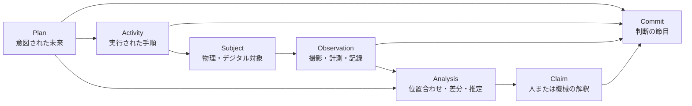

# SynapseGit Core 構想 v0.1

**物理・デジタル創作の「計画・手順・観測・判断」をつなぐ系譜基盤**

- Status: Draft
- Date: 2026-07-11
- Source vision: [init_plan.md](./init_plan.md)
- Scope: SynapseGit Coreのみ。Chrono-Engine、利益分配、人物再現は対象外。

---

## 1. Coreの定義

SynapseGit Coreは、創作物の完成データだけを保存するバージョン管理ではない。

建築、絵画、施工、造形、修復のように、物理世界で時間をかけて進行する創作について、次の四つを分離して記録する。

1. **Plan** — 何を実現しようとしたか
2. **Activity** — 実際に何を行ったか
3. **Observation** — その時点で何が観測されたか
4. **Claim** — 観測や資料から、誰が何を意味付けたか

Coreが保存するのは「現実そのもの」ではなく、現実へ戻るための証拠、関係、判断である。

> 原証拠は固定する。解釈は更新可能にする。物理的な変化と、画像に見えた差を混同しない。

---

## 2. 対象と非対象

### 2.1 Core v0.xで対象にするもの

- テキスト、SVG、ラスター画像などのデジタル表現
- 建物、敷地、キャンバス、立体物などの物理対象
- 建築設計、施工、描画、塗り重ね、修復などの手順
- 定点画像、作業前後画像、検査画像などの時系列観測
- 構想案、設計案、下絵などの分岐
- 判断時点、採用、却下、公開、引き渡しの履歴
- 構造差分、画像差分、計画対現況差分
- 出典、AI利用、作者宣言、異議、許諾の型付き記録
- Core外でも検証でき、空環境へ復元できる完全archive export

### 2.2 Coreで扱わないもの

- 創造性、著者性、影響度の客観的な自動判定
- 画像差分からの自動的な作者・作業者特定
- 歴史的人物の思考再現
- 推定貢献率に基づく自動利益分配
- 生体情報による創造性評価
- 全メディア共通の自動merge
- 物理対象のrollbackまたはcheckout
- BIM、CAD、ペイントソフトそのものの代替

---

## 3. 中核モデル



このモデルでは、写真は物理対象の状態そのものではなく、ある条件下で得られたObservationである。画像差分はAnalysisであり、物理変化の確定事実ではない。

### 3.1 主要オブジェクト

| オブジェクト | 役割 | 例 |
|---|---|---|
| `Project` | 履歴、権限、ポリシーの管理単位 | 建築プロジェクト、絵画制作、修復案件 |
| `Subject` | 時間を通じて追跡する対象の安定した識別子 | 建物西面、キャンバス、彫刻、設計テーマ |
| `Artifact` | 文書や表現の論理的なまとまり | 設計図、下絵、工程表、BIMモデル |
| `ArtifactVersion` | Artifactの不変な版 | SVG v3、設計図A-102改訂4 |
| `Blob` | 内容参照される不変のバイト列 | RAW画像、PNG、PDF、IFC、SVG |
| `ManifestTree` | logical slotからOIDへの永続的なMerkle map | Project snapshot、Artifact構成、Capture set |
| `ProcedureVersion` | 意図された手順の版管理されたグラフ | 下地→下描き→彩色、設計→施工→検査 |
| `Activity` | 実際に行われた行為 | 壁を施工、青色を重ね塗り、洗浄処置 |
| `Session` | 一続きの制作・施工・処置とCaptureを束ねる作業単位 | 7月11日の描画、北面施工、洗浄試験 |
| `ObservationSeries` | 同じ対象・視点・目的を追う観測系列 | 南面定点撮影、キャンバス正面撮影 |
| `Observation` | 一つの時点・範囲に関する観測記録 | 2026-07-11の撮影セット |
| `Capture` | センサーが生成した個々のデータ | RAW写真1枚、深度画像、温湿度値 |
| `CaptureProtocol` | 再現すべき撮影・計測条件 | 距離、時刻、照明、露出、許容位置誤差 |
| `CaptureStation` | 再現可能な撮影位置・向き・範囲 | 三脚位置、固定カメラ、壁面マーカー |
| `StationDeployment` | ある期間にStationへ設置された機器構成 | カメラ、レンズ、マウント、姿勢、設定 |
| `Calibration` | 幾何・色・時間・環境の校正情報 | レンズ、色票、尺度、時計、照明条件 |
| `SpatialFrame` | 領域と座標の意味を定める基準 | pixel、canvas-mm、site、BIM座標 |
| `SpatialTransform` | Frame間の変換と誤差 | pixel→canvas、camera→site |
| `Commit` | 復元可能なスナップショットと判断の節目 | 案の採用、作業日の終了、施工承認 |
| `Ref` | Commitを指す可変参照 | `decision/main`, `proposal/a`, `release/exhibition` |
| `Analysis` | 入力から再計算できる派生結果 | 位置合わせ、差分マスク、構造比較 |
| `Claim` | 誰かが対象について行う主張 | 「壁が追加された」「この変更を採用する」 |
| `ClaimReaction` | Claimを上書きしない追記型の反応 | endorse、dispute、withdraw、moderate |
| `Policy` | 閲覧、再利用、公開、保存の条件 | 非公開、改変可、AI学習不可 |
| `Assurance` | OIDを対象にした完全性・受領・署名等の表明 | hash verify、server receipt、external timestamp |
| `ContextPack` | AIへ渡した文脈とbaseの不変snapshot | 制約、Evidence、未解決事項、Policy |
| `DelegationGrant` | AIへ委任した能力・範囲・期限 | proposalだけ書込可、releaseはHuman Gate |
| `DecisionFeedback` | AI提案に対する人の採否と理由 | 一部採用、制約違反、project-local memory |
| `EvidenceGap` | 取得できなかった証拠と理由 | 事前撮影なし、遮蔽、時計不明 |
| `Tombstone` | 内容を削除・非公開化した事実 | 権利侵害による原画像削除 |

### 3.2 SubjectとArtifactの違い

- `Subject` は、物理物や概念など、履歴全体を通して同一と扱いたい対象である。
- `Artifact` は、その対象を計画、説明、観測、表現するための成果物である。
- 建物そのものはBlobにならない。建物を表した図面、BIM、写真がBlobまたはArtifactVersionになる。
- キャンバスの物理状態はcheckoutできない。過去の画像や測定を復元・表示できるだけである。
- 絵画Artifactと実物キャンバスは`embodied_by`、建築設計Artifactと建物Subjectは`realized_as`などの型付き関係で結ぶ。
- 一つの作品が複数の物理版を持つ場合や、同じ支持体へ別作品が重ねられた場合も、関係の有効期間を含めて表現する。

### 3.3 不変recordの共通Envelope

継続的な対象を指す論理IDと、その時点の記述内容を固定するcontent IDを分ける。

```text
RecordEnvelope
  entity_id          # 継続的な論理ID
  record_type
  schema_version
  valid_time?        # 型に意味がある場合の時刻・区間。Activityでは必須
  recorded_at        # システムへ記録した時刻
  asserted_by
  origin
  source_refs[]
  supersedes?        # 訂正対象。元recordは残す
  extensions
```

Envelopeのcanonical bytesからrecord OIDを計算する。自己参照を避けるため、OIDはhash対象のEnvelope内部に含めず、保存・取得時に`{ oid, body }`の外側で返す。Observationの出来事時刻は`payload.capture_time`を正とし、v0.1では競合するEnvelope `valid_time`を重ねない。

これにより、昨日の作業を今日入力した場合や、後日撮影時刻を訂正した場合も履歴を壊さない。

### 3.4 空間と領域

裸のpixel座標だけを保存せず、すべての領域に`SpatialFrame`を付ける。

- 画像pixel / sensor frame
- CaptureStation frame
- 絵画のcanvas-mm frame
- 建築のsite / floor / grid frame
- 図面page frame、BIM element、3D mesh frame

Frame間の`SpatialTransform`は、手法、適用期間、変換元・先、残差または誤差分布を持つ不変recordとする。対象の分割、結合、交換は、属性上書きではなく`part_of`, `split_from`, `joined_into`, `replaces`などの時間付き関係で表す。

### 3.5 履歴層を混ぜない

Coreはすべてを一つのCommit rootへ押し込まない。

| 層 | 保存方法 |
|---|---|
| Evidence | Blob、ArtifactVersion、Activity、Observation、CommitのDAG |
| Declaration | Evidence/Commitを参照する追記型record。訂正は`supersedes`、撤回は`withdraw` ClaimReaction |
| Possibility | Proposal Branch、未採用案、仮説とその状態遷移 |
| Reception | 批評、異議、endorsement、descendant link |
| Derived | Analysis専用。再計算可能で、Evidenceを上書きしない |

Decision Commitは、その判断時点で作者が明示的に結び付けたDeclarationだけを`bound_declaration_refs`として固定できる。後日追加されたDeclarationやReceptionによって、過去のCommit IDは変化しない。

Decisionが特定のAnalysisを根拠にした場合は、そのAnalysis OIDをDeclarationのevidenceとして固定する。将来のadapterで再解析して結論が変わっても、当時の判断根拠を置換しない。UIは「当時参照したAnalysis」と「現在の再解析」を並置する。

---

## 4. Coreの不変条件

1. **原証拠は上書きしない。** 訂正は新しいrecordと`supersedes`関係で残す。
2. **AnalysisはEvidenceではない。** 差分画像、AI要約、位置合わせ結果は派生物として扱う。
3. **物理対象と観測を同一視しない。** 写真の差は物理変化を直ちに意味しない。
4. **PlanとActualを同一視しない。** 設計図どおりに施工されたかは比較結果とClaimで表す。
5. **時刻を分離する。** 撮影はObservationの`capture_time`、入力はEnvelopeの`recorded_at`、受領・署名・外部timestampは対象OIDを参照するdetached Assuranceに分ける。
6. **欠測は無変化ではない。** 未撮影、遮蔽、低品質は`coverage`として残す。
7. **差分には比較条件が必要である。** 座標系、ROI、基準版、許容誤差を記録する。
8. **自動推定は自動的に事実へ昇格しない。** 人の確認は別Claimとして追加する。
9. **由来、影響、著者性、権利を別の型にする。** 一つのスコアへ畳み込まない。
10. **物理的なundoも新しいActivityである。** 過去の履歴を書き換えない。
11. **Derived dataは再計算可能にする。** 入力digest、adapter、version、設定digestを必須にする。
12. **削除後も削除を隠さない。** 内容を破棄してもTombstoneと到達関係を残す。
13. **Core外で復元できる。** 必須データを特定SaaSの内部IDだけに依存させない。
14. **Diffは方向を持つ。** `base → target`を必須にし、左右を入れ替えた結果と同一視しない。
15. **Analysis失敗も記録する。** 失敗理由を空の差分や「変化なし」へ変換しない。

---

## 5. Gitライクな意味論

### 5.1 借りるもの

- 内容参照による同一性と完全性
- immutableなsnapshot
- 親子関係を持つCommit DAG
- 安価なbranchとfork
- 複数parentを持つ採用履歴
- tag/releaseによる公表版
- 可搬なrepositoryと複数remote

### 5.2 創作向けに変えるもの

| Git概念 | SynapseGit Coreでの意味 |
|---|---|
| `commit` | ファイル保存ではなく、意味ある判断を含む復元可能な節目 |
| `branch` | デジタル案、工程案、解釈などの別の可能性 |
| `merge` | 案を採用・統合したという意思決定 |
| `tag` | 展示版、設計発行版、竣工版、修復完了版 |
| `pull request` | 案の採用提案、変更提案、後世からの継承提案 |
| `diff` | 構造差分、観測差分、計画対現況差分、意図差分 |
| `blame` | 廃止。根拠付きの`ContributionClaim`へ置換 |

### 5.3 物理対象に適用しない操作

- 写真同士をmergeして物理状態を確定しない。
- 物理対象に`checkout previous state`を表示しない。
- 物理的な履歴をrebaseしない。
- 分岐した設計案と、実際に存在した状態を同じbranch種別にしない。

物理対象については次の概念を使う。

- `MaterialEvent`: 現実に対象へ作用したActivity
- `ProposalBranch`: 起こり得る別案
- `AdoptionMerge`: 案の採用
- `Reconcile`: PlanとObservationの照合

---

## 6. 手順のモデル

建築や絵画の「手順」は単純な直線ではなく、依存関係、並行作業、任意工程、手戻りを持つ。そのため`ProcedureVersion`は順序付きリストではなく、有向グラフとして扱う。

### 6.1 ProcedureVersion

各Stepは少なくとも次を持つ。

- `step_id`
- `name`
- `depends_on[]`
- `expected_inputs[]`
- `expected_outputs[]`
- `completion_criteria[]`
- `optional`
- `role_requirements[]`
- `observation_requirements[]`
- `extensions`

### 6.2 Activity

実行記録はProcedureのStepと対応しても、対応しなくてもよい。

- 計画外作業を記録できる。
- Stepの省略、順序変更、再実行をDeviation Claimとして残せる。
- `reversibility`を`reversible`, `conditionally_reversible`, `irreversible`, `unknown`で記録できる。
- Activityの入力、出力、使用素材、道具、実行者はEvidenceまたはClaimとして型を分ける。
- 開始・終了時刻が不明な場合は区間または不明として記録し、推測で補完しない。

---

## 7. 定点画像と時系列観測

### 7.1 定点撮影で保存する情報

- SubjectとObservationSeries
- CaptureProtocol、CaptureStation、撮影時点のStationDeployment
- カメラ位置、向き、画角、距離、ROI
- カメラ、レンズ、焦点距離、解像度、向き
- 基準マーカー、尺度、色票
- 照明、天候、時刻、温湿度など取得可能な環境情報
- RAW原本と生成preview
- 顔、個人情報、機密領域のmask
- 撮影時刻の出所と信頼方法
- blur、露出、遮蔽、欠損の品質情報
- 自動取得、機器記録、手動importなどの取得経路
- protocolから外れた条件と、その比較可能性への影響
- 観測できなかった領域と欠損理由

EXIFなど機器由来情報は保存するが、それだけで信頼済み事実とは扱わない。

同じStation IDでも同じ撮影条件とは限らない。カメラ、レンズ、焦点距離、マウント、姿勢が変わった場合は新しいStationDeploymentまたはCalibrationを作り、旧設定を暗黙利用しない。

撮影要件を一律に強制せず、CaptureProfileを段階化する。

| Profile | 必須条件 | 許される主張 |
|---|---|---|
| `Imported` | 画像と取得経路 | 参考記録、限定的な外観比較 |
| `Repeatable` | Station、viewpoint、許容位置誤差 | 同一視点系列の候補差分 |
| `Calibrated` | 基準marker、scale、色・照明等の校正 | 定義された精度内の寸法・色比較 |

fiducialや色票を全利用者へ必須にはしない。一方、それらがないObservationから精密な寸法・色変化を主張できるとは表示しない。

### 7.2 差分パイプライン

```text
Raw Capture
  ↓ digest・形式検証
Quality Assessment
  ↓ blur / exposure / occlusion / coverage
Geometric Registration
  ↓ camera pose / homography / feature / marker
Photometric Normalization
  ↓ exposure / white balance / color target / illumination
Nuisance Masking
  ↓ 人物 / 工具 / 足場 / 反射 / 影 / 天候
Change Analysis
  ↓ pixel / perceptual / region / structure
Semantic Interpretation（任意）
  ↓ 「壁らしき領域」「塗り重ねの可能性」
Human Review
  ↓ confirm / reject / annotate / dispute
Claim or Decision Commit
```

各段階の入力、出力、変換行列、誤差、警告をAnalysisとして保存する。正規化画像だけを保存してRAWを捨ててはならない。

解析前の`assess`は、入力組を`comparable`, `partial`, `incomparable`のいずれかに分類し、reason codeを返す。`incomparable`は解析失敗ではなく正常な結果であり、空の差分や「変化なし」へ置き換えない。

位置合わせはtargetからbaseへの方向を持ち、overlap、inlier、残差、局所的な位置不確実性を返す。平面絵画や正対壁面ではhomographyを利用できるが、奥行きのある建築現場へ単一homographyを無条件適用しない。

キャンバスのたわみや温湿度による局所変形に対して、限定されたmesh warpやoptical flowを利用できる。ただし非剛体registrationは実際の変形や破損まで消す可能性があるため既定にせず、使用理由、拘束条件、warp field、最大変形量をAnalysisへ保存し、閾値超過時はwarningまたは`incomparable`を返す。剛体／射影差分と非剛体補正後差分を比較可能に残す。

正規化前後の差分を双方保持し、照明補正が退色、濡れ、乾燥、表面変化まで消していないか検証可能にする。

### 7.3 Change Field

差分を単純な二値maskにせず、各画素または領域を最低限、次の四状態で表す。

- `changed`
- `unchanged`
- `ambiguous`
- `unobservable`

併せて、validity mask、共通観測範囲、effect size、検出score、検出可能だった最小変化量、閾値を保存する。`unchanged`は十分な撮影品質と検出感度がある領域にだけ付与できる。

### 7.4 差分の種類

| 種類 | 問い | 扱い |
|---|---|---|
| `byte_identity` | 同じファイルか | 確定的 |
| `registered_pixel_diff` | 位置合わせ後に画素が変わったか | 観測差分 |
| `perceptual_diff` | 人の知覚上、見え方が変わったか | アルゴリズム依存 |
| `structural_diff` | 輪郭、領域、構成要素が変わったか | adapter依存 |
| `material_change_hypothesis` | 物理素材や形状が変わった可能性があるか | 推定Claim |
| `plan_conformance` | Planと観測は一致するか | 比較とClaim |
| `intent_diff` | 宣言された目的・制約が変わったか | 宣言間の差分 |

### 7.5 推定の階層

次の階層を同じlabelへ畳み込まない。

1. 測定 — 「この領域の色差が閾値を超えた」
2. 視覚解釈 — 「青色の層が追加されたように見える」
3. 工程解釈 — 「下塗り工程が完了した可能性がある」
4. 原因・意図 — 「奥行きを強めるため変更した」

2以降はClaimとして、根拠領域、代替解釈、解析器、確信度を持つ。reviewはClaim本文を更新せず、追記型ClaimReactionからactor・policy・時点ごとに投影する。

### 7.6 定点であっても残る誤差

- カメラの微小移動、レンズ交換、ズーム
- 日照、影、反射、濡れ、乾燥、塗料の光沢
- 人物、足場、工具、植生、車両による遮蔽
- 被写体の平面性不足によるparallax
- 圧縮、色管理、現像処理の差
- 撮影時刻や位置情報の誤り

したがってCoreは「差分あり」を「施工・描画あり」へ自動変換しない。

変化時刻を一枚の撮影時刻へ断定できない場合は、最後に未変化だったObservationと、最初に変化を確認したObservationの間の時間窓として表す。

---

## 8. 比較モデル

Coreはすべての比較を`ComparisonSpec`として明示する。

### 8.1 ComparisonSpecの最小要素

- `comparison_kind`
- `inputs[]`と各入力の`role`
- `subject_id`
- `baseline_policy`
- `coordinate_frame`
- `region_of_interest`
- `tolerances`
- `adapter_id`と`adapter_version`
- `configuration_digest`
- `requested_by`

### 8.2 比較の種類

1. **Revision Comparison** — 同じArtifactの版Aと版B
2. **Temporal Observation Comparison** — 同じObservationSeriesの時点AとB
3. **Plan–Actual Comparison** — 計画表現と観測された現況
4. **Before–After Activity Comparison** — Activity前後のObservation
5. **Cross-modal Comparison** — BIM/CAD/renderと写真、下絵とキャンバス
6. **Intent Comparison** — 判断基準、対象、目的、制約の変化

Analysis結果は入力の役割を失ってはならない。PlanとObservationを左右対称の画像二枚として処理しても、意味上の非対称性は保持する。

---

## 9. Evidence、Claim、Trust

### 9.1 単一の「信頼スコア」を持たない

Coreは少なくとも次の軸を別々に扱う。これらを全recordの可変fieldとして埋め込まない。

| 軸 | 値の例 |
|---|---|
| `origin` | 不変Envelope上の`tool_recorded`, `device_recorded`, `imported`, `self_declared`, `inferred` |
| `integrity` | OID再計算とdetached Assuranceから投影する`hash_verified`, `signature_verified`, `unverified`, `broken` |
| `coverage` | Observation/Analysis固有の`complete`, `partial`, `unknown`, `not_applicable` |
| `review` | ClaimReactionからactor・policy・時点別に投影する`unreviewed`, `endorsed`, `rejected`, `disputed`, `withdrawn` |

署名は「誰がそのClaimを行ったか」と「改ざんされていないか」を助けるが、Claimの内容が真実であることまでは保証しない。

撮影品質、時刻精度、Calibration品質、registration残差、変化検出score、semantic confidenceを一個の百分率へ集約しない。値がprobability、quality score、interval、ordinalのどれであるかを型として示し、未校正scoreを確率表示しない。

### 9.2 ClaimとReaction

Claimは存在した時点で`proposed`であり、本文と根拠は不変とする。その後の`acknowledge`, `endorse`, `dispute`, `reject`, `withdraw`, `moderate`は別のClaimReactionとして追記する。`claim_kind=review`は内容を伴う批評・評価、ClaimReactionは既存Claimへの処置であり、同じものではない。

単一の「現在状態」へ上書きせず、「誰が、どのpolicyの下で、いつどう反応したか」を投影する。withdraw権限とmoderation権限はPolicyで検証する。

他者が作成したClaimをSubject所有者が削除して正史を独占するのではなく、公式timelineからの分離、mute、異議、moderationを区別する。

### 9.3 完全性と署名が示す範囲

- content hash: 同じバイト列であること
- client signature: 対応する鍵がそのrecordへ署名したこと
- signed server receipt: そのserverが記載時刻に受領したと主張していること
- external timestamp: 対象digestがその時点までに存在したことを補強すること

いずれも、内容の真実、実際の撮影時刻、作者性、著作権を単独では証明しない。mandatoryなclient署名やexternal timestampはv0.1の利用条件にせず、assuranceを高める選択肢として後から追加できる契約にする。

---

## 10. CommitとRef

### 10.1 Commitに含めるもの

- 親Commit
- 復元可能なManifest
- 採用したArtifactVersion
- Evidenceとして固定するPlan、Activity、Observationへの参照
- その時点で明示的に結び付けたDeclarationと却下案への参照
- 作成者、作成時刻
- schema version

署名、`signed_at`, server `received_at`, external timestampはCommit OIDを参照するdetached Assuranceとし、署名対象自身への循環参照を作らない。

後日追加されたClaim、Reception、再解析結果はCommitを変更せず、Commit OIDを参照する別recordとして追記する。

Manifestは全`entity_id → record OID`を毎回フラットに列挙せず、規定済みのlogical slot/pathからOIDへの永続的な`ManifestTree`として表す。変更された部分だけ新しいtree nodeを作り、未変更subtreeは構造共有する。tree node、entry順序、path規則もcanonical hash profileへ含める。

Commitの`parents`は意味を持つsequenceで、sortしない。`parents[0]`をmainline/first parent、以降を追加のmerge入力とする。rootは0件、通常Commitは最大1件、mergeは2件以上とする。

### 10.2 Commit種別

- `checkpoint`: 復元用の節目
- `decision`: 採用・却下を伴う判断
- `merge`: 複数案の採用・統合
- `release`: 公開・引き渡し版
- `migration`: 形式移行または保存用変換

自動撮影や自動保存はObservationやArtifactVersionを生成できるが、公式Refを自動的に進めない。意味あるCommitへの昇格はユーザーまたは明示されたproject policyが行う。

### 10.3 Ref更新

Refのnamespaceを意味で分ける。

- `proposal/*`: 未採用の計画・表現案
- `decision/*`: 採用された判断の系列
- `release/*`: 公開・発行・引き渡し版
- `observed/{subject}/{series}`: 最新の記録済みObservation
- `material-events/{subject}`: 最新の記録済みMaterialEvent

`observed/*`と`material-events/*`は「現実の正史」ではなく、Coreが知っている最新recordを指す。`actual/*`という名前で真の物理状態を表現しない。

Refは`expected_head`を使ったcompare-and-swapで更新し、同時編集で履歴を消失させない。`expected_head`はCommit bodyではなくRef更新requestのmetadataである。更新前に`new_head`から到達するすべての必須OIDが存在し、参照closureが完全であることを検証する。競合時は新しいbranchを作るか、明示的なmergeを要求し、last-write-winsやserver automergeを行わない。

objectのupload順序は問わず、Ref更新時点でclosureが完全であることを保証する。

closure検証は参照先を次の三状態で返す。

- `present`: payloadまたはrecordが利用可能
- `tombstoned`: 削除recordへ解決できるがpayloadは利用不能
- `missing`: recordもTombstoneも解決不能

歴史上の参照に`tombstoned`が含まれてもDAG自体は解決可能とする。新しいrecordが削除済みpayloadを入力として装うことは禁止し、明示的な`references_redacted` edgeでTombstoneを参照させる。Analysisの実行入力に`tombstoned`または`missing`が含まれる場合は`incomparable`または実行不能を返す。

### 10.4 Content IDとcanonicalization

「canonical JSON」とだけ規定すると実装言語ごとにOIDが分裂するため、Core profileを固定する。

- structured inputはinvalid UTF-8、BOM、重複key、lone surrogateをparse前後の適切な段階で拒否する。
- 数値tokenはsafe integerの十進表記だけを許し、fraction、exponent、`-0`を拒否する。
- raw Blobは原バイト列をalgorithm-tagged SHA-256で識別する。
- timestampの表記、timezone、精度を固定する。
- 計測値、変換行列、確信度を未規定のJSON floating pointでhashしない。
- 数値は`integer + scale + unit`または規定したdecimal stringで表す。
- object keyはUTF-16 code-unit順で直接serializeし、配列は`set`か`sequence`かをschemaで明示する。
- free textはNFC/NFDを含め入力を保存し、canonicalizerが正規化しない。
- path segmentと識別子は投入前にNFCであることを要求し、非NFCを黙って変換せず拒否する。`..`, NUL、separator等も禁止する。
- schema外のextensionもhash対象か否かをprofileで明示する。
- 複数言語実装のgolden fixtureでOID一致を検証する。

安定した`entity_id`と不変なrecord OIDを混同しない。Ref、ACL、availabilityのような可変状態はcontent IDそのものへ埋め込まず、履歴付きの別recordとして扱う。規範的な詳細は[`spec/core/v0.1/oid-profile.md`](../spec/core/v0.1/oid-profile.md)に置く。

---

## 11. Adapter境界

Coreはメディア固有アルゴリズムを内蔵しすぎず、adapterの登録・実行・結果保存を担う。

### 11.1 Coreの責任

- ID、schema、content digest
- Blob、record、Commit、Refの永続化
- EvidenceとClaimの型分離
- adapter registryとjob orchestration
- Analysisの再現情報
- access control、削除、Tombstone
- archive export、空storeへのrestore、offline検証

### 11.2 Adapterの責任

- 形式のparseとcanonical representation生成
- capture quality評価
- 幾何・色のregistration/normalization
- media/domain固有diff
- preview、mask、overlay生成
- 能力、制約、非対応条件の宣言

### 11.3 Adapter Contract

adapterは最低限、次を宣言・返却する。

```text
AdapterDescriptor
  id / version
  implementation_digest
  supported_media_types
  supported_comparison_kinds
  coordinate_models
  capabilities
  deterministic_or_probabilistic
  required_inputs

AssessResult
  comparable | partial | incomparable
  reason_codes
  usable_regions / missing_regions
  capture_condition_delta

AnalysisResult
  input_digests
  adapter_id / adapter_version
  configuration_digest
  derived_blob_refs
  transforms_and_calibrations
  metrics_with_units
  confidence_and_coverage
  validity / occlusion / ambiguity masks
  raw_and_normalized_diff_refs
  warnings
  extension_payload
```

未知のextensionをCoreが失わずにexportできることを必須とする。

Core v0.1で実行するadapterはfirst-partyのallowlistに限定する。任意の第三者コード実行基盤は後段とし、adapter processにはCPU、memory、time、output sizeの上限を設ける。

---

## 12. 論理アーキテクチャ

```text
[Capture Client / Tool Connector / CLI]
                 │
                 ▼
        [Ingest & Record API]
          │              │
          ▼              ▼
 [Content-addressed]  [Metadata / DAG]
 [Object Storage]     [PostgreSQL]
          │              │
          └──────┬───────┘
                 ▼
       [Analysis Job Queue]
                 │
                 ▼
       [Versioned Adapters]
                 │
                 ▼
 [Timeline / Compare / Review / Export]
```

### 12.1 初期技術方針

- Metadata、DAG、Ref、Claim: PostgreSQL
- 原本、preview、mask、Analysis result: S3互換object storage
- 非同期解析: job queue + stateless worker
- ローカル撮影キュー: SQLite等のclient-side store
- 検索index、vector、graph projection: 再構築可能な派生index
- 暗号鍵: project/tenant単位のKMS管理

専用graph DB、vector DB、Kafka、blockchainはCore v0.1の前提にしない。

最低限、`objects`, `object_edges`, `refs`, `ref_events`, `claims`, `analysis_runs`, `receipts`, `erasure_requests`, `tombstones`を持つ。`object_edges`はRef closureの検証、export、GC、削除影響範囲の算出に使用する。

### 12.2 論理操作

- `putBlob`
- `finalizeBlob`
- `pushObjects`
- `putImmutableRecord`
- `createArtifactVersion`
- `appendActivity`
- `appendObservation`
- `createCommit`
- `advanceRef(expectedHead)`
- `requestAnalysis`
- `appendClaim`
- `reactToClaim`
- `setPayloadAvailability`
- `requestErasure`
- `exportProject`
- `verifyExport`

transportはHTTP API、CLI、将来のpeer syncへ割り当てられるが、Core protocolは特定transportに依存しない。

---

## 13. 削除、機密性、長期保存

建築図面、制作途中画像、撮影された人物、位置情報は高い機密性を持つ。完全履歴と公開を同義にしない。

### 13.1 データ分離

- 公開可能な系譜skeleton
- 暗号化された原本payload
- redacted preview
- access policy
- Analysisから取り除くべき機密mask

### 13.2 削除

- `unpublish/ref解除`, `private化`, `redacted replacement`, `payload purge`を別操作にする。
- object削除または暗号鍵破棄によりpayloadを利用不能にする。
- Tombstoneに対象、理由、実行主体、時刻、根拠を残す。
- payloadから生成されたpreview、tile、diff、search index、cacheも依存関係から列挙してpurgeする。
- 自動purgeは、原Evidenceの機密性を継承する再計算可能なDerived/Analysisへ限定する。
- 人が明示したClaim、Declaration、Decision Commit、Activityは自動purgeせず、参照EvidenceがTombstone化された`redacted evidence`状態として残す。Claim本文自体が削除対象である場合は別のerasure判断を行う。
- backupからの消去期限と、法的保全により消せない場合の状態をPolicyとして明示する。
- 削除済み内容を再取得可能であるかのように表示しない。
- exportや第三者remoteへ複製済みの内容は回収できないことを明示する。
- digest自体が機密情報の照合に使われ得る場合、公開skeletonへ露出しない。
- 削除対象OIDを参照するrecordは壊れたデータとして捨てず、`gone`または`tombstoned`として正常に解決する。

### 13.3 Uploadとmedia security

- クロステナントdeduplicationを行わない。
- tenant quota、object数、単一object size、展開後sizeに上限を持つ。
- upload URLまたはmultipart session発行時に申告size分の一時quotaを予約する。
- `finalizeBlob`されない孤児uploadは短いretentionの隔離prefixへ置き、lifecycle ruleで削除してquotaを返却する。
- finalize時に実size、digest、content typeを再検証し、予約超過や不一致を拒否する。
- 画像bomb、圧縮bomb、危険なSVG、壊れたICC/EXIF等をisolated workerで検査する。
- 原画像は既定でprivateとし、公開用にはEXIF、顔、位置情報を処理した別OIDの派生物を作る。
- adapter出力も無制限に信用せず、schema、size、content type、参照closureを検証する。

### 13.4 長期保存

- schemaとadapterのversionを固定してexportする。
- 原本と派生物を区別する。
- migrationは原本を置換せず、新しいArtifactVersionとMigration Commitを作る。
- Coreサービスが停止しても、manifest、関係、digest、availabilityを検証できる形式にする。

---

## 14. ドメイン利用例

### 14.1 建築・施工

1. Briefと敷地調査を登録する。
2. スケッチ、平面、BIM等をProposal Branchへ分岐する。
3. 採用案をAdoption Mergeとして記録する。
4. ProcedureVersionで予定工程を表す。
5. 施工Activityと、複数CaptureStationからの定点Observationを蓄積する。
6. 設計表現、直前の現況、今回の現況を三者比較する。
7. 差分領域を担当者が「計画どおり」「未承認変更」「遮蔽」「判定不能」と確認する。
8. 検査、設計変更、是正を新しいActivityとDecision Commitで残す。
9. 竣工時にAs-built Releaseを作る。

### 14.2 絵画制作

1. Brief、参考資料、下絵を登録する。
2. 色、構図、技法の案をProposal Branchにする。
3. 下地、下描き、彩色、塗り重ね等をProcedureVersionとして用意する。
4. 各制作セッションの前後で同一CaptureStationから撮影する。
5. 色票とマーカーを使い、位置・露出・色を補正する。
6. 差分maskをAIまたは画像adapterが下書きする。
7. 作者が意味ある変化、偶然、失敗、保留を選択してDecision Commitを作る。
8. 後日の修復は過去へ戻すのではなく、新しいMaterialEventとして続ける。

### 14.3 三者比較

物理創作では、二枚の画像比較だけでなく次の三者比較を標準UXにする。

```text
Plan（実現したかった状態）
  ↕ conformance
Previous Observation（直前に観測された状態）
  ↕ temporal change
Current Observation（現在観測された状態）
```

これにより「何が変わったか」と「何を変えるつもりだったか」を分離できる。

### 14.4 CaptureとCommitの体験

原則は「Captureは無意識に近く、Commitでは意味だけを人へ聞く」とする。

1. QR、対象tree、図面上の地点からCaptureStationを選ぶ。
2. 前回画像のghost overlayで位置、傾き、画角を合わせる。
3. blur、露出、遮蔽、位置ずれを撮影前後に警告する。
4. 画像、状態chip、任意の一言または音声を保存する。
5. セッション終了またはHold PointでCoreが「節目を残す」ことを提案する。
6. ユーザーは差分候補を実変化、照明、影、遮蔽物、濡れ・乾燥、不明へ分類する。
7. 採用理由、未解決事項、次の制約を必要最小限だけ確認してDecision Commitを作る。

作家・作業者はCaptureと一言、設計者・監督・修復責任者は採否と理由、記録担当は後から詳細分類を補完する。AI要約は編集可能な候補であり、確定理由にはしない。

UIではGit語を前面に出さない。

| 内部概念 | UI表示例 |
|---|---|
| Capture | 撮る／取り込む |
| Commit | 節目を残す |
| Branch | 案を分ける／試験区を作る |
| Merge | 採用する |
| Reconcile | 現況と照合する |
| Tag | 基準版として固定する |

基本画面は、対象・空間tree、画像／図面比較、`計画・判断・現況`の三lane timeline、節目cardで構成する。複雑な3D系譜表示はMVPに含めない。

打設、埋設、壁閉じ、解体、防水、封止、ワニス、不可逆な修復処置などはHold Pointとして扱い、直前Captureを促す。ただし緊急作業を記録不足だけで停止させず、後追い入力とEvidenceGapを許す。

---

## 15. Core v0.1 MVP

### 15.1 Primary pilot

最初は、平面対象かつ撮影条件を管理しやすい**絵画・壁画の制作セッション**をprimary pilotにする。

### 15.2 Generalization pilot

次に、parallax、天候、遮蔽が加わる**小規模建築・内装施工の一つの壁面または区画**で検証する。最初から建物全体や完全なBIM連携を対象にしない。

### 15.3 Integrated validation scenario

旗艦デモは「小規模な既存建築の改修と、壁画・仕上げの制作」とする。

1. 既存現況、スケッチ、PDF/SVG図面を取り込む。
2. 動線、材料、配色をProposal Branchに分け、一部をAdoption Mergeする。
3. 2〜3か所のCaptureStationを設定し、解体前を撮影する。
4. 下地の想定外状態を発見し、画像と音声でEvidenceGapと変更案を残す。
5. 代替詳細を承認、施工し、被覆前を撮影する。
6. 壁画の下描き、地塗り、塗り重ねをSession単位で記録する。
7. デジタル色試作の一部を本画へAdoption Mergeする。
8. 竣工現況、承認Plan、直前Observationを照合し、全履歴をexportする。

### 15.4 MVPに含めるもの

- Blob、ArtifactVersion、ManifestTree、Commit DAG、Ref
- RecordEnvelope、canonical OID、closure検証
- Subject、ProcedureVersion、Activity
- ObservationSeries、CaptureProtocol、CaptureStation、StationDeployment、Calibration、Observation、Capture
- SpatialFrame、SpatialTransform、領域Anchorの基本形
- RAW/PNG/JPEG ingest、thumbnail
- 固定または近似固定視点のquality評価
- 2D registration、photometric normalization、差分mask
- pairwise、rolling baseline、custom baseline比較
- Plan–Observation comparisonの基本形
- 人による差分領域のconfirm/reject/annotate
- Decision CommitとProposal Branch
- originと、detached Assurance・Observation/Analysis・ClaimReactionから投影したintegrity/coverage/review表示
- payload削除、Tombstone
- open archive export、offline verify、空のreference storeへのrestore
- cross-repository merge、partial fetch、federated importは含めない

### 15.5 MVPに含めないもの

- 3D再構成、3GS、点群の本格diff
- 建物全体のBIM自動照合
- 画像だけからの工程自動判定
- AI semantic diffと任意の第三者adapter実行
- 作業者、作者、貢献率の自動推定
- 自動merge
- 公開SNS、marketplace、token

---

## 16. 受入基準

### 16.1 系譜と復元

- すべてのCommitから、その時点のManifestを復元できる。
- すべてのAnalysisから、入力digest、adapter version、設定へ戻れる。
- exportを空のreference storeへrestoreし、同じCommit DAGとavailabilityを静的検証できる。
- 別repositoryの既存履歴との動的mergeはv0.1の受入条件にしない。
- 重複Blobは同一digestとして扱い、再送してもrecordが重複しない。

### 16.2 観測差分

- RAWと正規化画像を区別して保持する。
- registration error、coverage、quality warningを結果に含める。
- `comparable / partial / incomparable`とreason codeを返せる。
- 位置合わせ不能または遮蔽過多の画像を「変化なし」と判定しない。
- `changed / unchanged / ambiguous / unobservable`の四状態を表現できる。
- 差分領域を人がconfirm、reject、annotateできる。
- 確認前のsemantic resultを事実表示しない。

### 16.3 物理創作の意味論

- Plan Branchと物理Observationの履歴をUI・API上で区別できる。
- 写真をmergeして現実状態を作らない。
- undo相当の処置を新しいActivityとして記録できる。
- Procedureから外れた作業を消さずにDeviationとして表現できる。
- Plan、Previous Observation、Current Observationを三者比較できる。

### 16.4 信頼、削除、機密性

- self-declared、tool-recorded、inferredを区別できる。
- Claimへのendorse、dispute、withdraw、moderateを記録できる。
- payload削除後もTombstoneと系譜を検証できる。
- restricted原本とredacted previewへ異なる権限を設定できる。

### 16.5 制作体験

- 通常のCaptureには文章入力を要求しない。
- オフライン現場で画像、位置、状態chip、任意の音声を20秒程度で仮記録できることをUX目標にする。
- セッション終了時、差分候補から意味ある領域だけを選んでCommitできる。
- 通常の「節目を残す」は能動入力30秒以内を中央値目標にする。
- 記録をしない、曖昧なまま残す、後で説明する選択肢を持つ。
- 1か月後に、作者または担当者が「何が変わり、なぜ採用したか」を辿れる。
- 1か月後に別担当者が、重要変更の「何が・なぜ・どの案から採用されたか」を2分以内に説明できることをpilot目標にする。

---

## 17. 段階的ロードマップ

### Stage 0: Protocol spike（0〜4週）

実行順序とexit gateは[`docs/stage0_execution_plan.md`](./stage0_execution_plan.md)、規範的なdraftは[`spec/core/v0.1`](../spec/core/v0.1/README.md)に置く。

- 「対象無変更＋撮影条件変化」と「既知の対象変更」を含む実地capture pilot
- record envelopeとschema versioning
- canonical hash profileと複数言語golden fixtures
- Subject / Activity / Observation / Claimの不変条件
- fixed-point capture metadata
- painting control datasetと建築validation dataset
- registration、照明差、遮蔽の評価方法
- archive export → 空store restoreのround trip

### Stage 1: Core kernel（1〜3か月）

- local CAS、CLI、content-addressed object storage
- immutable record、Commit DAG、Ref CAS
- Procedure、Activity、Observation
- 最小API
- adapter registryとAnalysis job
- deletion/Tombstone
- closure検証、quota、危険media対策

### Stage 2: Observation MVP（3〜6か月）

- capture client
- 2D fixed-view adapter
- compare/review UI
- Decision Commit
- Plan–Observation comparison
- painting primary pilot
- small construction generalization pilot
- server CAS、ACL、multipart upload、offline sync

### Stage 3: Pilot hardening（6〜12か月）

- resumable uploadとoffline conflict recoveryのhardening
- 複数CaptureStation
- team review、claim moderation
- signed capture、trusted timestampの選択肢
- standard export mapping
- adapter SDK
- cross-repository import/merge、partial fetch、federation

---

## 18. 標準との関係

Coreの内部モデルを外部標準へ直接従属させず、lossless mappingまたはexport profileとして接続する。

- [Git Objects](https://git-scm.com/book/en/v2/Git-Internals-Git-Objects.html): content-addressed objectとCommit DAGの設計原則
- [W3C PROV-O](https://www.w3.org/TR/prov-o/): Entity / Activity / Agentと由来関係
- [C2PA 2.4](https://spec.c2pa.org/specifications/specifications/2.4/specs/C2PA_Specification.html): 公開メディア、ingredients、actions、署名付きClaim
- [ODRL](https://www.w3.org/TR/odrl-model/): Permission / Prohibition / Dutyの機械可読表現
- [BagIt](https://www.rfc-editor.org/info/rfc8493/) / [OCFL](https://ocfl.io/): 可搬パッケージと長期保存配置
- IFC / BCF等: 建築adapter側のdomain extension

C2PAや署名を「内容が真実である証明」と表示しない。ODRLを法的契約そのものとして扱わない。

---

## 19. 実装前のDecision Gates

| Gate | 推奨初期値 | 決める理由 |
|---|---|---|
| Primary pilot | 絵画・壁画 | 平面で基礎diffを検証しやすい |
| Generalization pilot | 小規模内装・壁面 | 物理現場のparallaxと遮蔽を検証できる |
| Capture model | 明示Capture + offline queue | 常時監視を避け、現場でも使える |
| Commit model | 人が承認するDecision Commit | 画像差分を判断と混同しない |
| Storage | PostgreSQL + S3互換 | Core v0.1に十分で移行しやすい |
| Analysis | versioned adapter | 将来の解析器で原証拠を再解釈できる |
| Privacy | private raw + redacted preview | 現場・制作途中の機密性を守る |
| Export | open manifest + blobs + schemas | SaaS終了後も継承できる |

次の実装判断は、Stage 0で固定するrecord envelope、ID規則、digest規則、最小schemaである。

---

## 20. クリエイターが得る利益

Coreの採用理由は履歴の量を増やすことではない。

> 今の判断を助け、案件を越えて経験を再利用し、将来の担当者が作品へ戻れる状態を作る。

「いつか役立つかもしれないアーカイブ」だけを対価に制作中の負担を要求しない。追加情報を一つ求める場合は、同じ作業中または直後に、比較、復元、報告、引き継ぎ、再利用のいずれかを返す。

### 20.1 時間軸ごとの利益

| 時間軸 | クリエイターの利益 | Coreが返すもの |
|---|---|---|
| 同一案件・今日 | 何を変え、なぜ採用し、次に何を守るかを取り戻せる | 三者比較、差分候補、Decision Commit、進捗card |
| 案件横断 | 手順、撮影条件、判断基準、失敗、未採用案を再利用できる | ProcedureVersion、CaptureProtocol、Claim、Proposal Branch |
| 長期・世代横断 | 改修、修復、再展示、形式移行時に当時の状態と判断へ戻れる | 原Evidence、作者Declaration、処置履歴、検証可能なarchive |

短期価値が成立しなければ、長期保存の価値だけで日常利用を求めない。

### 20.2 職種別の具体的利益

| 利用者 | 得られる利益 |
|---|---|
| 画家・壁画家 | 制作前後を同条件で比較し、塗り重ね、偶然、失敗、保留を区別する。色・構図案を安全に分岐し、未採用案を別作品の起点にできる |
| 建築家 | Brief、案、採用、設計変更、現場Observationをつなぎ、Plan・直前現況・現在現況を照合する。判断理由や是正方法を次案件へ再利用する |
| 施工・修復担当 | Hold Point前後、計画外作業、欠測を残し、報告・引き渡し資料を構成する。材料、処置、可逆性を将来の担当へ渡す |
| デザイナー | 複数ツールの成果物、参考資料、承認・却下を一つの判断系列で説明し、AI事業者や制作ツールを変えても文脈を持ち運ぶ |
| 制作チーム・後任 | 新規参加時に、完成物だけでなく制約、却下案、未解決事項、採用理由を短時間で把握する |

選択した履歴から、次の有償成果物を構成できる。

- クライアント向け制作過程・進捗pack
- 竣工・引き渡し時の`As-recorded` package
- 修復前後・処置記録
- 所有者、コレクター、美術館向け保存資料
- 原本と機密情報を除いた制作process portfolio

これらは記録を説明可能にする成果物であり、作者性、真正性、契約適合を自動証明する商品ではない。

### 20.3 既存ツール内履歴との差別化

| 観点 | 一般的な制作ツール履歴 | SynapseGit Core |
|---|---|---|
| 管理範囲 | 一つのapp、file、folder | toolを越えたArtifactと物理Subject |
| 履歴単位 | 自動保存、file版 | 復元可能な状態と意味ある判断 |
| 物理世界 | 写真や添付file | 撮影条件、比較可能性、欠測を持つObservation |
| 理由 | comment、chat、別文書 | Plan、Evidence、Declaration、Decisionを型付きで接続 |
| 未採用案 | 複製または削除 | Proposal Branch、却下理由、再採用履歴 |
| 将来利用 | providerや形式に依存 | open archive、offline verify、空store restore |

差別化の中心は画像解析単体ではなく、解析をEvidenceと混同せず、人の判断と将来の再解釈へ接続することである。

### 20.4 記録負担との交換条件

- 常時監視ではなく、session終了、承認、引き渡し、Hold Pointで記録を提案する。
- 通常Captureでは文章を要求せず、画像、対象、時刻、状態chip、任意の音声を基本にする。
- AIが報告・要約の下書きを作り、人は意味だけを確定できる。
- `Imported / Repeatable / Calibrated`の順に、主張の強さに応じて必要な記録負担を増やす。
- 作家・作業者、責任者、記録担当へ入力責務を分ける。
- 欠測、後追い、不明を失敗扱いせずEvidenceGapとして残す。
- 原本、redacted preview、公開releaseの範囲を利用者が制御する。
- projectごとに通知頻度、snooze、記録不要区間を設定できる。

### 20.5 経済価値と料金の根拠

顧客が支払うのはCommit数ではなく、次の業務価値である。

```text
利用価値
  = 短縮できた検索・説明・報告時間
  + 回避できた再撮影・手戻りの期待費用
  + 別案件で再利用できた設計・手順の価値
  + 置き換えた保管・引き渡し作業の費用
```

推奨料金は、local repositoryとverifyを低額またはopenにし、cloud workspace、active project、storage、analysis compute、長期stewardship、integrationを有償化する。Capture、Commit、Claim件数では課金せず、現場参加者やreview guestを低額にして記録欠損を誘発しない。「永久保存」は販売せず、更新可能な保管契約、定期verify、migration、exportを提供する。

顧客dataの販売、無断AI学習、創造性・貢献度scoreを収益源にしない。

### 20.6 価値KPI

| 目的 | KPI |
|---|---|
| 判断復元 | 1か月後に「何が・なぜ変わったか」を説明できる率 |
| 引き継ぎ | 新担当者が重要変更を説明するまでの時間。pilot目標2分以内 |
| 報告効率 | 進捗、引き渡し、処置記録の作成時間削減 |
| 記録負担 | Capture中央値20秒、通常Commit中央値30秒、dismiss率 |
| 案件横断 | Procedure、CaptureProtocol、branch、判断基準の再利用率 |
| 長期継承 | offline verify、空store restore、根拠到達の成功率 |
| 事業性 | pilotからの有償継続、別案件展開、休眠archive継続率 |

Commit数、Capture数、差分面積、夜間活動、AI案採用率を創造性や個人生産性のKPIにしない。

### 20.7 監視化と過大表示を避ける

- hidden screen recording、keystroke、常時音声・映像を取得しない。
- 顔、背景位置、生体情報から作業者を特定しない。
- Capture頻度や差分量から努力、能力、勤務時間を推定しない。
- 作業者ranking、創造性score、個人別生産性scoreを提供しない。
- 「作者を証明」「現実を完全記録」「真正性を保証」などと表示しない。
- 「誰が何をClaimし、どのEvidenceと結び付けたか」「どの範囲を誰がreviewしたか」と表示する。
- 写真中心の成果物は無条件に`As-built`と呼ばず、`As-recorded`または確認範囲付きの`reviewed as-built`とする。

---

## 21. クリエイティブAIが得る利益

ここでいうAIの利益は権利や法的人格ではなく、推論品質、再利用性、安全に委任できる範囲が向上するという機能的利益である。

> AIには履歴を理解できる文脈と、安全に試せる分岐を与える。正史を決める権限は与えない。

### 21.1 AIとクリエイターの相互利益

| 利用者 | 得られる利益 |
|---|---|
| クリエイター | 背景を毎回説明せず、既知の却下案を繰り返されず、複数案を安全に比較できる。AI利用、作者修正、採用判断を分離して説明できる |
| クリエイティブAI | Brief、制約、素材、過去Diff、採否理由をOID付き構造として受け取り、Proposal Branch上で大胆に試せる |
| 制作チーム | 人と複数AIの担当、入力、出力、批評、統合経路を追跡し、別のAIへ文脈を持ち運べる |
| Core | data囲い込みではなく、文脈編成、比較、判断、可搬な制作記憶を継続価値にできる |

`generated_by AI`, `selected_by human`, `modified_by human`, `approved_by human`を分離する。これは制作上の役割と由来であり、法的著作者性や貢献率の自動判定ではない。

### 21.2 Creative Agent Contract

```text
Creator Intent / Evidence / Policy
                ↓
       immutable ContextPack
                ↓
      AI-only Proposal Branch
                ↓
 Artifact + Diff + AI Claim + AIRun
                ↓
          Human Review Gate
       reject / partial / adopt
                ↓
         DecisionFeedback
                ↓
   reviewed project-local memory
```

AIへchat履歴を丸ごと渡さず、`base_commit`, `expected_ref_head`, Plan、制約、Evidence、採否、未解決事項、Policy、DelegationGrantを束ねたcontent-addressed `ContextPack`を渡す。実行中にbase Refが進んだ場合は`stale_base`として残し、黙ってrebaseしない。

Blob内の文章は資料であり、CreatorがContextPackへ明示的に束縛した指示だけを命令として扱う。資料中のprompt injectionでPolicyを上書きさせない。

### 21.3 AI提案と採否学習

AI提案は完成物だけでなく、次を返す。

- `base_commit → proposal_commit`の方向付きDiff
- 変更したArtifact、領域、Anchor
- 維持した制約、提案理由、期待効果
- 使用Evidence、参考素材、ContextPackのOID
- 不確実性、仮定、代替案、要確認箇所
- 権利、安全、施工可能性等の警告

AI renderはPlan/Proposal ArtifactでありObservationではない。画像からの物理変化推測は`material_change_hypothesis` Claimに留める。

採否は基盤model再学習ではなく、まずproject-localな判断記憶と提案順位へ反映する。非選択を「嫌い」と推定せず、一度の却下を永続嗜好にしない。AIが推測した嗜好はPreferenceHypothesis Claimとし、人が確認した場合だけDeclarationまたはPolicyへ昇格する。

他project、他顧客、基盤model学習への利用は既定で禁止し、用途、対象record、期間、撤回、対価またはcreditを示す明示opt-inを必要とする。

### 21.4 安全な操作境界

AIへ既定で許可できるもの:

- Policy範囲内のrecordとredacted payloadを読む。
- ContextPackを読む。
- ArtifactVersionとAI専用Proposal Branchを作る。
- AI Claimを追加する。
- first-party allowlist内のAnalysisを要求する。
- project-local memoryを参照する。

常に人の承認を必要とするもの:

- `decision/*`, `release/*`を進める。
- AI案を採用、公開、引き渡し版にする。
- 人間名義のClaimを作る、またはAI Claimをconfirmed扱いにする。
- ACL、Policy、保持期限、許諾を変更する。
- 外部送信、第三者export、削除、鍵破棄、支払い、投稿を行う。
- 物理対象へ作用する機械を動かす。
- restricted rawや別project記憶を使用する。
- model学習へdataを提供する。

AI Actorは既存Evidenceを上書きできず、`asserted_by=human`を発行できない。人がAI Claimを承認しても元Claimを書き換えず、人による別Claim、Review Activity、Decision Commitを追加する。

### 21.5 複数AIと可搬な記憶

Generator、Critic、Verifier、Synthesizer、Orchestratorは同じArtifactを直接上書きせず、`proposal/{agent_actor_id}/{run_id}`へ分岐する。受け渡しは暗黙の会話ではなくOID付きArtifact、Claim、ContextPackで行う。AI間の多数決を真実とせず、不一致を人へ提示する。

長期記憶はmodel内部の非公開要約ではなく、CoreのEvidenceから再構築可能なMemorySetVersionとして管理する。利用者は記憶の出典、訂正、撤回、期限、visibilityを制御できる。AI providerを変更しても制作記憶を保持できる。

### 21.6 AI価値KPI

| 軸 | KPI |
|---|---|
| 文脈効率 | 制約の再説明時間、過去判断探索時間、ContextPack作成時間 |
| 提案適合 | 採用・部分採用・却下・保留の内訳、採用版までの修正量、却下pattern再発率 |
| 追跡可能性 | AI ArtifactからAIRun、ContextPack、base/input OIDへ到達できる割合。目標100% |
| 人間統制 | AI由来採用版にDecision ClaimとHuman Gateがある割合。目標100% |
| 安全 | AIによる公式Ref更新、gate bypass、無許可egress。目標0件 |
| 記憶品質 | 古い・矛盾した記憶の検出、訂正済み誤りの再発、利用者評価 |
| 経済性 | AI費用／採用判断、判断までの時間、再利用Artifact・Decision数 |

AI採用率だけを最適化しない。却下、保留、探索、批評にも創作価値がある。

### 21.7 Stage 0への反映

Stage 0では、全面的なAI実行基盤を作らず、将来を塞がない次の契約を固定する。

- AIを識別できる`Actor`
- AI runを表す`Activity`
- AI由来を保持する`Claim`
- content-addressed `ContextPack`
- AI専用権限を表す`DelegationGrant`
- 採用・修正・却下を表す`DecisionFeedback`
- proposal専用Ref namespaceとHuman Gate
- AI runを含むOID golden fixture

最小縦切りは、固定CommitからContextPack生成、AI Proposal Branch、DiffとClaim、人による採否、DecisionFeedback、次回Contextへの反映、archive verifyである。

---

## 22. 実装言語と保存境界

Coreの第一候補はRustとする。Gitライクな正本はfilesystem/object storage上のCASに置き、ローカルRef・reflog・既定indexはSQLiteで開始する。SurrealDBはActor–Activity–Observation–Claim–ContextPackの横断探索に有力だが、OIDやarchiveの正本にはせず、CASから再構築できるProjectionStoreとしてSQLiteと並行spikeする。

UI/SDKはTypeScript、画像解析とCreative AI adapterはPythonを許容するが、canonical bytesとOIDの決定権はRust Coreへ集約する。詳細な比較、書込み順序、SurrealDB採用条件、Stage 1 crate境界は[`docs/runtime_architecture.md`](./runtime_architecture.md)に定める。
