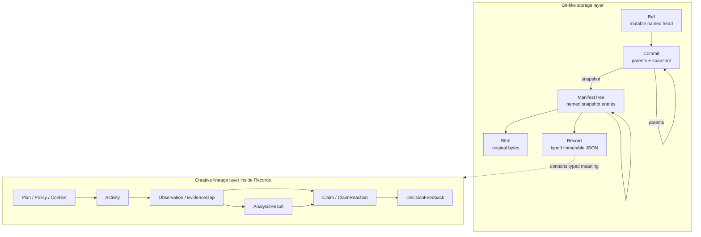
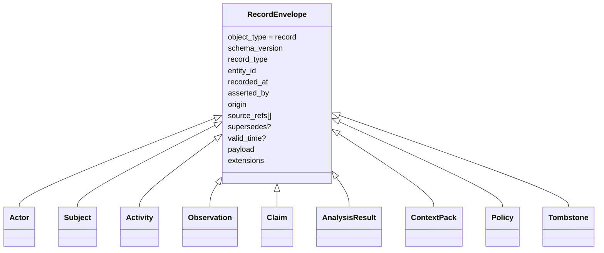
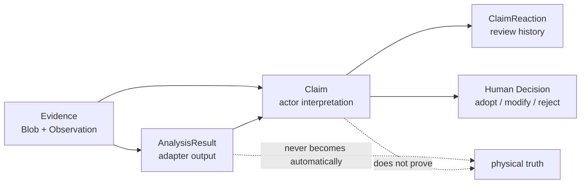
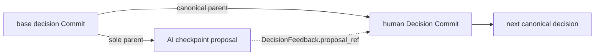
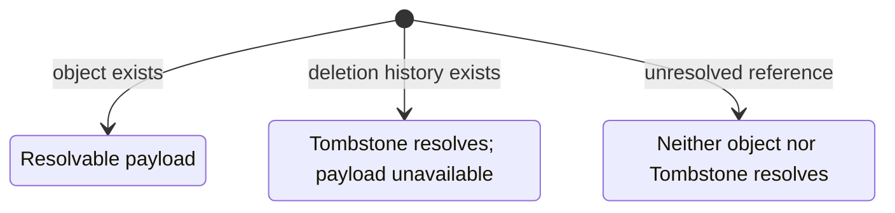

# SynapseGit Core データモデル

この文書は、Core v0.1 の object graph と意味層を短く把握するための案内である。
正確な制約は [`spec/core/v0.1`](../spec/core/v0.1/README.md) の normative draft と JSON Schema を参照する。

Status: **Core v0.1 / Stage 0 draft** 
Audience: 利用者、adapter / Core 実装者 
Document type: informative overview

## 二つの層を分ける

SynapseGit は「保存のための object」と「創作を説明する semantic Record」を分ける。

- storage layer は「どの byte と関係を保存したか」を決定する。
- semantic layer は「何を計画し、行い、観測し、解釈し、判断したか」を表す。
- Analysis は再実行可能な派生結果、Claim は actor の解釈、DecisionFeedback は人間の採否であり、同じものではない。

## object family

| family | OID prefix | 内容 | 可変性 |
|---|---|---|---|
| Blob | `blob:sg-oid-v1:sha256:` | 原 byte。media type や filename は含めない | 不変 |
| Record | `record:sg-oid-v1:sha256:` | concrete schema を持つ typed JSON | 不変 |
| ManifestTree | `tree:sg-oid-v1:sha256:` | path segment から Blob / Record / Tree への対応 | 不変 |
| Commit | `commit:sg-oid-v1:sha256:` | parent sequence、snapshot Tree、transition / declaration refs | 不変 |
| Ref | OID ではない | `proposal/*` 等の名前から Commit head への入口 | CAS 更新 |
| Reflog | OID ではない | Ref 更新の old/new、actor、message、時刻 | 追記 |

structured object の OID は canonical JSON と domain-separated preimage から計算する。
OID 自体はその body に埋め込まない。

ここでの「CAS」は二つの意味を持つため区別する。

- **content-addressed storage**: OID で immutable object を保存する ObjectStore
- **compare-and-swap**: current head が expected head と一致するときだけ Ref を更新する操作

## immutable RecordEnvelope

すべての concrete Record は共通 Envelope を持つ。

`entity_id` は同じ概念対象を版を越えて追う安定 ID、Record OID は特定の不変版を指す。
新しい版は古い body を上書きせず、必要に応じて `supersedes` で接続する。

## concrete Record catalog

| Record | 役割 | 主な関係 |
|---|---|---|
| `Actor` | 人、team、tool、AI の identity / capability | Activity、Claim、Assurance から参照 |
| `Subject` | 時間を通して追跡する物理・デジタル対象 | Observation、Activity、Claim の対象 |
| `Activity` | 実際に行った行為または AI run | input/output、before/after Observation、ContextPack |
| `Observation` | 条件付きで観測された Evidence | Subject、media Blob、CaptureProfile、station、calibration |
| `CaptureProfile` | `imported` / `repeatable` / `calibrated` の条件 | Observation の主張可能範囲を制約 |
| `AnalysisResult` | adapter が生成する非権威的な派生結果 | input、adapter、mask、metric、comparability |
| `Claim` | actor が Evidence 等へ与えた意味・主張 | subject、evidence、alternative、AI run |
| `ClaimReaction` | 既存 Claim への endorse / dispute / reject 等 | Claim と追加 Evidence |
| `EvidenceGap` | 欠測、不明、記録不能を明示 | Subject、time / region、related refs |
| `Assurance` | signature、receipt、external timestamp 等の detached 検査 | target OID と signer |
| `Policy` | permission / prohibition / Human Gate の snapshot | ContextPack、AI execution |
| `DelegationGrant` | principal が AI 等へ委任する能力の上限 | actor、resource、writable Ref prefix |
| `ContextPack` | AI run へ渡す content-addressed context | base Commit / Ref、Policy、Grant、Evidence |
| `DecisionFeedback` | proposal の adopt / modify / reject / defer | proposal と human rationale |
| `Tombstone` | payload が利用不能になった事実と理由 | target、replacement、derivative refs |

## Evidence、Analysis、Claim、Decision

この分離は Core の中心的な safety boundary である。

たとえば画像差分が `changed` を返しても、照明、遮蔽物、registration error の可能性がある。
比較不能や欠測を `unchanged` へ潰さず、`partial` / `incomparable`、
`ambiguous` / `unobservable` を残す。

## Commit DAG と Ref

Commit の `parents` は sequence であり、`parents[0]` が first parent である。
Ref は `expected_head` 付き compare-and-swap でのみ更新する。

Human Decision Commitはproposalをmerge parentにしない。canonical decision headをsole parentに持ち、
review対象proposalはdirect transitionのDecisionFeedbackから参照する。

図の `main` は説明上の名前である。protocol 上は意味ごとに namespace を分ける。

| namespace | 意味 | AI の既定 rule |
|---|---|---|
| `proposal/*` | 未採用案、AI / human の探索 branch | 指定 prefix のみ書込み可 |
| `decision/*` | 人が採用した判断系列 | 直接更新不可 |
| `release/*` | 公開・引き渡し版 | 直接更新不可 |
| `observed/*` | Core が知る最新 Observation | 「現実そのもの」ではない |
| `material-events/*` | 記録済み MaterialEvent | 「物理状態の正史」ではない |

`synapse-application`はinitial local AI requestをcredential、project selector、opaque handle／permitへ
限定する。injected Authenticatorをproject lookup前に実行し、exact project map／process ACL、reusable
authority profile、target current-headをsealするone-time registrationからcandidate-independent Core preflightを行う。opaque permitは
exclusive TTLを持ちExecutor前にburnされる。実行後はreauthしてからproject FIFO publication／ACL fenceへ
入り、live profileからauthorityを再構築してfull Core transactionまで保持する。
AI成功時は`AiPublicationReceipt`がCore decisionとsame-instance／project／proposal Ref/head-boundな
`AdmittedProposalHandle`を返す。Human control planeはreusable profileとserver-fixed Decision
Commit／Feedback／messageを用意し、handleをborrowしてone-time registrationを作る。Human requestはcredential、
exact project、opaque registration／permitだけを渡す。permitはapplication TTLだけを持ち、認証成功後にburnされ、
same FIFO fence内のlive ACL／profile再検査から`HumanDecisionRuntime`のfull validation／CASまで進む。
handleはdenial後の修正版registrationへ再利用できるが、registrationとpermitはone-shotである。

`synapse-core::CreativeAiRuntime`はAI proposal publicationについて、許可された
`proposal/*`だけを受理し、`decision/*`／`release/*`を`human_gate_required`で拒否する。
`preflight_proposal(AiPublicationTarget)`はcandidateなしでauthorityとlive base／target expectationをread-checkし、
sealed non-Clone `AiPreflightDecision`を返す。`publish_preflighted`はそのdecisionとnarrow
`AiGeneratedProposal`をconsumeし、authority／timeと下記candidateをすべて再検証する。preflightはRef予約でも
application credential／ACL permitでもない。
Stage 0のAI candidateは通常のCommit DAG全体より狭く、`commit_kind=checkpoint`かつ
`parents=[ContextPack.base_commit]`に限定する。candidate／base snapshot deltaの新規outputを
Activityへ束縛し、新規Recordはagent assertedなAnalysisResult／Claimだけを許す。candidateは
base snapshotの全non-Tree objectを保持し、Treeだけを置換／再配置できる。

別の`HumanDecisionRuntime`はtrusted authenticated single human、Human Actor／Policy、project、
canonical decision Ref、proposal、Context baseを固定し、`publish_decision`でnarrow Human Gateを実行する。
single humanはAI responsible principal／ContextPack・Grant asserter／Grant direct principalと同一で、
proposal transitionは一つのAI Activity、decision transitionは一つのDecisionFeedbackに限定される。
`adopted_unchanged`はproposal snapshot、`rejected`／`deferred`／`experiment_only`はbase snapshotを
使う。`adopted_modified`／`partially_adopted`、release、organization／quorumは未実装である。
同じproposalをcanonical lineageで再決定できず、proposal preconditionとtrusted decision/base headのtarget CASはatomicに扱う。
applicationはprocess-localなAIとnarrow Human Decisionだけを公開し、Projection routeは持たない。
HTTP／JWT、durable／distributed ACL・permit、multi-process fence、concrete human credential／persistent
membership、OS sandbox／egressは引き続き未実装である。
現在のlocal CLI `update-ref`はAI／Human admission routeを公開せず、namespace authorizationを行わない
trusted operator primitiveである。

## disposable query projection

`synapse-projection::SqliteProjectionStore`は上記object familyを増やさない。verified
`FileObjectStore`とcallerが取得した一つのconsistent `RefSnapshot`を読み、current Ref headから
到達するobjectとtyped edgeをSQLiteへ派生indexとして明示的にrebuildする。orphan CAS objectは
含めず、同じOIDが複数Refから到達する場合はobject rowをdedupeしつつRef reachabilityを保持する。
Core v0.1のTombstone解決だけはstore-wide Record scanを使うため、unreadable／digest-corruptな
orphan Recordはrowへ含めないままrebuildをfail-closedにし得る。

Stage 0 baselineは次をqueryできる。

- `RefScope`で絞ったSubjectのObservation／Activity timeline
- ObservationからCaptureProfile、Station／StationDeployment、Calibration、Environment、Mediaへのdependency
- `RefScope`内のAnalysisResultからadapter implementation／configuration、ordered input、transform、
  derived Blob、typed maskへのlineageと各availability
- Refごとのclosure summary、missing issue、tombstoned availability／count
- projected object、projection schema version、source fingerprint

Observation timelineはcapture instant／intervalを優先し、Activityはvalid instant／intervalを優先する。
該当値がない場合だけ`recorded_at`をfallbackとして使い、そのtime basisも結果へ残す。

Analysis replay readinessはinput、adapter implementation／configuration、transformがpresentかだけを
集約する。derived Blob／maskは既存resultのoutputなのでreplay attemptをblockしない。`Ready`でも
byte-identical replay、adapter runtime互換性、結果の意味的同値を保証しない。

projectionはimmutable object、Ref、Reflog、Recordの意味を変更しない。authorization source、
ObjectStore、RefStore、archive input、recovery prerequisiteとして使わず、古くなれば破棄して再構築する。
`RefScope`もACLではないため、service authorizationを先に行う。
SurrealDB adapterと代表8 query全部のbackend比較は未実装である。

## availability と Tombstone

参照先は二値ではなく三状態で解決する。

- `present`: payload / Record を利用できる。
- `tombstoned`: 削除の履歴は解決できるが payload は利用できない。
- `missing`: object も Tombstone も解決できない。

replacement は別 OID の新しい object であり、削除済み byte の復活ではない。
hash は削除を不可能にしない。公開済み archive や third-party copy を回収できることも保証しない。

## 次に読む

- canonical OID の厳密な規則: [OID profile](../spec/core/v0.1/oid-profile.md)
- Ref、closure、AI boundary の規範: [Operations](../spec/core/v0.1/operations.md)
- local 実装の component と書込み順: [Runtime architecture](./runtime_architecture.md)
- 信頼・攻撃面・未実装境界: [Security model](./security_model.md)
