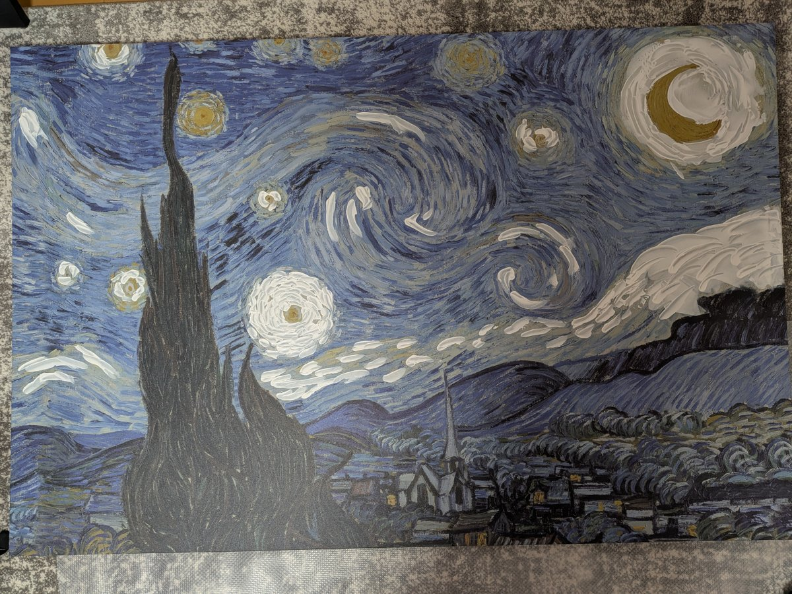

# Starry Night overpaint: a public SynapseGit case

[日本語](./README.ja.md) | [Source case repository](https://github.com/howlrs/synapsegit-starry-night/tree/45db60e3497f5392a9fb93135698021d23e42059) | [Public bundle](https://github.com/howlrs/synapsegit-starry-night/tree/45db60e3497f5392a9fb93135698021d23e42059/synapsegit/bundle) | [SynapseGit tutorial](../../tutorial/README.md)

At each painting stage, what did the creator observe and what next step did the
workflow suggest? This case maps real acrylic-painting photos and a stage map to
Original, Current, and AI output. Preparing those images and recording the
creator's decision are separate steps.

Creator **howlrs**, a SynapseGit developer, is repainting an IKEA Vincent van Gogh
*The Starry Night* replica with white, blue, and black acrylic in five values.
Claude Code supplied value examples and stage maps through a caller-described
workflow. This case does not verify model execution or attribute the maps to a
particular model; they are caller-supplied AI outputs.

## One concrete reviewable step

`step2-lightblue` is the light-blue stage. The three images answer different
questions: what existed before painting, what existed immediately before this
stage, and what was proposed for this stage.

| Original: unpainted replica | Current: after stage 1, white | AI output: stage-2 map |
|---|---|---|
|  |  |  |
| Baseline photo | Observed state before stage 2 | Proposed places to paint light blue |

The photographs are published display copies (1200×900), with different bytes
from the registered photos. The stage map is copied unchanged from the public
proposal file. Their byte checksums are in
[assets/SHA256SUMS](./assets/SHA256SUMS); that verifies the illustrations here,
not SynapseGit Core objects or OIDs. See the pinned [workflow](https://github.com/howlrs/synapsegit-starry-night/blob/45db60e3497f5392a9fb93135698021d23e42059/docs/synapsegit-workflow.md)
for the actual input hashes. Each image links to its public, pinned source.

Stages 2 and 3 were painted in sequence, so there is no photo between them.
Stage 3 uses the same pre-stage-2 Current photo: an acknowledged approximation,
not an unobserved state filled in later.

## Why separate three images and a decision

| Role | In this case | A reviewer can ask |
|---|---|---|
| Original | The unpainted replica photo | What was the reference state? |
| Current | A photo after the white stage | What was observed before this proposal? |
| AI output | A value/stage map | What did the workflow suggest next? |
| Human Decision | Stage-2 proposal adopted | The creator reviewed the images and conveyed this decision in conversation |

The creator's painted photo is never relabeled as AI output. A finished stage
can instead become Current for the next proposal. That discipline keeps
screen-based proposals readable alongside physical work.

## Snapshot: 2026-10-09

Five candidates—the five-value plan, white, light blue, mid blue, and blue
stages—each have a recorded Human `adopt` decision. The pinned public bundle
contains the public projection for those completed sessions. Adopt selects the
recorded proposal bytes unchanged. It does not establish that the creator
followed the map, modified an output, or changed the painting physically.
The creator reviewed the three images and conveyed the decisions in conversation;
an agent recorded them through the CLI. The public bundle passed the integrity
checks in `synapse-present 1.0.0 preview`.

The creator is the developer. This example provides no independent-user Pilot
evaluation or customer outcome evidence.

SynapseGit can establish byte identity for recorded files. It cannot establish
a physical change, an author, or that a model made the map. Read that limit
with the status above.

## Try the same shape of workflow

1. Work through the [tutorial](../../tutorial/README.md) for a complete,
   synthetic three-image example.
2. Supply one local set of three images: Original reference, Current
   observation, and proposed output. Keep private originals local.
3. Follow the [creator workflow](../../creator_workflow.en.md), then make a Human Decision after review.

For evaluation, use this checkout's [Installation guide](../../install.md).
This case was recorded with v1.0.0, while this checkout documents v1.2.0.
See the [compatibility policy](../../compatibility.md) for the v1.x promise to
read earlier releases.

For usage or evaluation questions, follow the channels in [Support](../../../SUPPORT.md)
without attaching private images. Commercial or production use requires separate
written permission; see the [License](../../../LICENSE).

## Pinned source notes

Facts here are fixed to case commit [`45db60e`](https://github.com/howlrs/synapsegit-starry-night/tree/45db60e3497f5392a9fb93135698021d23e42059): [README](https://github.com/howlrs/synapsegit-starry-night/blob/45db60e3497f5392a9fb93135698021d23e42059/README.md), [recording policy](https://github.com/howlrs/synapsegit-starry-night/blob/45db60e3497f5392a9fb93135698021d23e42059/RECORDING.md), [workflow](https://github.com/howlrs/synapsegit-starry-night/blob/45db60e3497f5392a9fb93135698021d23e42059/docs/synapsegit-workflow.md), [progress note](https://github.com/howlrs/synapsegit-starry-night/blob/45db60e3497f5392a9fb93135698021d23e42059/progress.md), and [public bundle](https://github.com/howlrs/synapsegit-starry-night/tree/45db60e3497f5392a9fb93135698021d23e42059/synapsegit/bundle).
