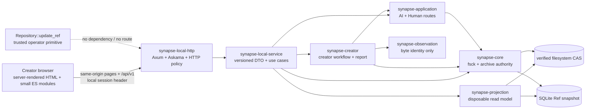

# SynapseGit localhost application architecture

Status: approved implementation design; slices 1-4/6, the fsck/job part of slice 7, and the read-only diagnostics part of slice 8 implemented in current source

Decision date: 2026-07-14

Implementation status: slices 1-4 and 6, the bounded `fsck`/job foundation of
slice 7, and the read-only diagnostics portion of slice 8 are implemented in
current source. `synapse-local-service` and `synapse-local-http` provide the exact
project catalog, bounded read facade, loopback HTTP boundary, server-rendered
project/session views, bounded three-file staging, process-local pending
authority, Human `adopt` / `reject` / `defer`, a dedicated read-only diagnosis,
and an explicitly confirmed background `fsck` with pollable process-local state.
The third file remains caller-supplied; no model is invoked. Archive list, export,
and restore remain unimplemented in the browser application. The diagnostics and
browser `fsck` additions are current-source-only and are not included in the
tagged v0.2.0 binary. Core v0.1 remains a Stage 0 draft; this application slice is
not the formal Core roadmap's Stage 1.

This document defines an application-level contract. It does not change the
normative Core protocol, canonical bytes, OIDs, Ref semantics, or archive
profile in [`spec/core/v0.1`](../spec/core/v0.1/README.md).

## Decision

The first creator-facing image application is a single-user process bound to
IPv4 loopback. It is not a public GitHub-like service. Rust remains the only
authority for validation, OID creation, publication, projection rebuild,
`fsck`, export, and restore.

The application has two Rust packages:

- `synapse-local-service`: a transport-neutral, trusted localhost facade over
  the existing Core, Creator, Application, Observation, and Projection crates;
- `synapse-local-http`: the Axum HTTP/static-asset binary, depending on
  `synapse-local-service` but not directly on `synapse-core` or
  `synapse-sqlite`. [Askama 0.14.0](https://docs.rs/askama/0.14.0/askama/)
  renders type-checked HTML templates while
  preserving the workspace's Rust 1.88 MSRV.

The first UI uses server-rendered semantic HTML with progressive enhancement:
plain CSS and small browser-native ES modules for local file previews, fetch
submissions, polling, and focused interaction. It has no client router,
component framework, hydration runtime, CDN, npm runtime dependency, or
generated frontend distribution. Templates and assets are compiled into the
Rust binary, so `cargo build` remains the complete packaging path.

This fits the bounded screens: project dashboard, Ref/history navigation,
three-file import, image/evidence review, Human disposition, diagnostics, and
archive operations. TypeScript/Vite, canvas UI, or a component framework remain
available later if pixel comparison or editing makes client state materially
more complex; they are not justified by the first milestone.

## Product and trust boundary

The localhost application may:

- list server-configured projects, current Refs, reflog entries, creator
  sessions, timeline rows, comparison evidence, and report state;
- accept original, current, and caller-supplied AI output files without
  caller-authored JSON;
- publish a proposal and then accept `adopt`, `reject`, or `defer` through the
  existing admitted-proposal Human application route;
- run explicit, confirmed `fsck`, directory export, and empty-target restore
  operations after their HTTP resource limits are in place;
- diagnose incomplete sessions without rewriting or deleting their history.

It must not:

- expose `Repository::update_ref`, the CLI `update-ref`, raw object PUT, or an
  arbitrary Commit/head publication route;
- accept Repository paths, archive paths, expected heads, new heads,
  Actor/Policy/Grant OIDs, capabilities, authority profiles, application
  handles, registrations, permits, or clocks from HTTP write/control input;
- accept a caller-selected Ref name for mutation. The read-only reflog filter
  may accept one exact, UTF-8-byte-bounded Ref name;
- treat the ProjectionStore as authority, archive input, or recovery state;
- claim pixel, visual, appearance, or physical change from byte identity;
- listen on a non-loopback address or become a public/multi-user service by a
  command-line override.

The local OS user and filesystem permissions remain trusted. A random browser
session token protects the HTTP surface from ambient browser requests; it is
not OS-user authentication and does not isolate another process running as the
same user.

## Component boundary



The transport crate's missing direct dependency on Core/SQLite is an explicit
defence against accidentally turning a low-level primitive into an endpoint.
`synapse-local-service` is trusted application code and owns the remaining
capability-bearing dependencies. Its public types never contain `Repository`,
`RefUpdate`, `AdmittedProposalHandle`, registration, or permit values.

## Package layout

Slices 1-3 created the following paths. Later slices extend the same packages
with write, maintenance, diagnostic, and end-to-end boundaries:

```text
api/
  local/v1/openapi.json           versioned localhost HTTP contract
crates/
  synapse-local-service/
    src/                          catalog, read model, creator workflow, DTOs
    tests/                        facade integration and archive/report tests
  synapse-local-http/
    assets/                       plain CSS and browser-native ES modules
    templates/                    Askama server-rendered HTML
    src/                          pages, API, HTTP policy, job bridge, binary
    tests/                        transport and process tests
scripts/
  verify_local_api.mjs            dependency-free OpenAPI contract checks
```

Both Rust packages use edition 2024, `publish = false`, the workspace MSRV, and
`#![forbid(unsafe_code)]`. The HTTP package pins an Askama release compatible
with that MSRV and depends on the service package plus transport libraries. The
service package owns domain-to-DTO conversion so transport serialization does
not spread into Core types.

## Project catalog and filesystem scope

Projects are an exact, server-owned startup catalog. The initial binary accepts
one or more trusted `project_key = repository_path` registrations before
listening. It canonicalizes and validates the configuration, rejects duplicate
keys and paths, and then keeps the mapping private. HTTP clients select only a
`project_key` matching `[a-z][a-z0-9-]{0,63}`. Responses may include a configured
display label but never the raw filesystem path.

Archive operations use a separately configured server-owned archive root and a
logical archive name with the same bounded slug profile. A request cannot send
an absolute path, `..`, a separator, a symlink target, or an alternate
Repository root. Export keeps Core's no-replace publication. Restore targets
only a configured empty project or a startup-configured empty restore slot; it
does not create a caller-selected path. Retry after a failed restore follows
the Core archive profile's exact-subset rule.

No HTTP route adds, removes, or remaps catalog entries. Dynamic catalog and
shared-CAS membership are beyond this milestone.

## HTTP contract

The machine-readable draft is
[`api/local/v1/openapi.json`](../api/local/v1/openapi.json). All application
operations are below `/api/v1`. Each operation carries an
`x-synapse-implementation-slice` marker so a designed route is not mistaken for
an implemented one.

| Slice | Route group | Purpose |
|---|---|---|
| 2 | `GET /health`, `/projects`, project `status`, `refs`, `reflog` | process and repository read state |
| 2 | `GET .../creator-sessions`, session detail, session images | complete/incomplete discovery, report, timeline, evidence, bounded media |
| 4 | `POST .../creator-sessions` | stream the three files and publish through the creator proposal boundary |
| 6 | `POST .../creator-sessions/{session}/decisions` | Human `adopt` / `reject` / `defer` through the admitted proposal route |
| 7 | `POST .../operations/fsck`; `GET .../operations/{id}` | implemented in current source: explicit, confirmed bounded fsck job and process-local polling |
| 7 | `POST .../archive-exports`, `archive-restores`; `GET /archives` | planned: archive jobs and inspected archive summaries |
| 8 | `GET .../creator-sessions/{session}/diagnostics` | implemented in current source: incomplete-session diagnosis without automatic mutation |

There is intentionally no generic object PUT/GET, no generic Commit route, no
`update-ref`, no profile/ACL/permit administration, and no arbitrary projection
query. A complete session image read resolves `original`, `current`, or
`ai-output` through a validated current creator report. During same-process
pending review, it resolves the role through the retained trusted pending
receipt only after rechecking its proposal/base Ref heads and reachable tree
entries. If that pending capability is gone, the session becomes incomplete and
the slice 8 diagnostics route describes its current Ref/head shape without
reconstructing authority; a caller can never use an orphan Blob OID as a read
capability.

### Response consistency

Each project read operation begins with one `RefSnapshot`. A response that uses
Projection data rebuilds from that same snapshot and returns:

- a deterministic snapshot watermark derived from ordered Ref names, heads,
  and update event IDs;
- the Projection source fingerprint when a rebuild was needed;
- the exact Ref names from which timeline or analysis data was reachable.

The initial service does not cache Projection results. It serializes and
rebuilds each Projection-backed response from its captured snapshot, then
returns the existing `projection-source-v1:sha256:<hex>` source fingerprint.
This avoids treating a Ref-only watermark as a CAS-generation or Tombstone
invalidator. A future cache requires an explicit store-generation signal in
addition to snapshot identity; cache age is never authorization or freshness
evidence. Rebuild failure returns a safe structured error and does not affect
CAS or Refs.

The existing SQLite reflog API materializes the full log and cannot provide the
promised bounded page or a page captured with the Ref snapshot. Before exposing
the slice 2 reflog route, the read-store boundary gains a transaction-scoped
`after_event_id + LIMIT + 1` query that returns the page and Ref snapshot from
one backend read transaction. The facade must not emulate this by loading the
whole reflog or by performing two independently raced reads.

The project status route does not run repository-wide `fsck` implicitly.
Creator begin, decision, and report operations do run a repository-wide
integrity check, but use Core's bounded fsck entry points with fixed creator
limits: 10,000 Ref roots, 25,000 CAS objects, 4 GiB of inventoried raw bytes,
250,000 cumulative closure nodes, 2,500,000 cumulative closure edges, and a
25,000 Record / 512 MiB Tombstone scan. Begin reserves its own bounded growth
and all eight per-project pending-review decisions, checks the exact prospective two-Ref snapshot, and only then
publishes. Decision likewise checks its prospective replacement head before
CAS. Core publication validators use the fixed bounded Tombstone profile too;
they do not fall back to the legacy complete-inventory scan. Limit exhaustion
therefore fails before normal publication. If response reconstruction still
fails after a committed CAS because the repository changed concurrently, the
service returns HTTP 200 with the exact durable receipt in a `committed`
response, releases the consumed review slot, and never retries publication.

The existing `creator_report(path, session)` captures its own Ref snapshot and
does not return Projection metadata, so the facade must not wrap it with an
independently captured `SnapshotContext`. Slice 2 first adds a creator-library
entry point that accepts one caller-supplied `RefSnapshot` and returns the
report plus the exact Projection source fingerprint produced by that rebuild.
The CLI function remains a compatibility wrapper that captures once, calls the
new entry point, and uses the same fixed creator integrity limits.

### Versioned DTOs and errors

HTTP DTOs are owned by `synapse-local-service`; the server never parses CLI
stdout. OIDs remain opaque strings. UTC nanosecond values that exceed safe JSON
integer precision are decimal strings.

OpenAPI `maxLength` counts Unicode code points for text, while the existing
creator boundary limits UTF-8 bytes. Every affected field therefore also fixes
`x-synapse-max-utf8-bytes`, and the facade checks encoded bytes before calling
Creator. Multipart file properties follow OpenAPI 3.1 raw-binary semantics
(no JSON string type or `contentEncoding`), with explicit part content types
and octet-counting `maxLength` limits. `x-synapse-max-raw-bytes` repeats the
enforced ceiling for generic tooling that does not implement OAS raw-binary
length semantics.

Errors use `application/problem+json` with `type`, `title`, `status`, stable
`code`, safe `detail`, `request_id`, and `retryable`. Existing semantic codes,
including `creator_session_*`, `creator_report_invalid`, `fsck_failed`,
`archive_invalid`, `archive_not_empty`, `resource_limit`, `ref_conflict`,
`stale_base`, and `storage_error`, remain distinguishable. Filesystem paths,
credentials, tokens, internal handles, SQL text, and raw nested error messages
are logged locally but omitted from responses.

Facade-only failures such as `local_request_denied`, `project_not_found`, and
`operation_state_lost` are stable application-contract codes. They do not add
or reinterpret a Core protocol error code.

Unknown project selectors return the same public not-found problem shape. This
is consistent response semantics, not a constant-time or traffic-analysis
guarantee.

## Browser and HTTP safety

Loopback is a network boundary, not a complete browser security policy. The
server therefore applies all of the following:

1. Bind the listener to `127.0.0.1` by default. If a port is configurable, the
   host is not; any resolved/non-loopback listener is rejected before startup.
2. Print and serve one canonical origin, `http://127.0.0.1:<port>`. Reject every
   other `Host`, forwarded-host, or proxy-style request. Do not trust
   `X-Forwarded-*`.
3. Generate a high-entropy process-local browser token at startup, inject it
   into the non-cacheable bootstrap document, and require it in the custom
   `X-Synapse-Local-Token` header for every `/api/v1` request except health.
   Never put the token in a URL, cookie, or log.
4. Send no permissive CORS headers and reject cross-origin preflight. For every
   unsafe method, additionally require the exact canonical `Origin` and reject
   `Sec-Fetch-Site` values other than `same-origin`; the token remains required
   when Fetch Metadata is absent.
5. Keep every GET/HEAD operation read-only. Multipart and JSON writes require
   exact content types, bounded field lengths, streaming body limits, and the
   custom token header.
6. Serve only same-origin scripts/styles with a restrictive Content Security
   Policy (`default-src 'none'; base-uri 'none'; script-src 'self'; style-src
   'self'; img-src 'self' blob:; connect-src 'self'; object-src 'none';
   frame-ancestors 'none'; form-action 'self'`),
   `Cross-Origin-Resource-Policy: same-origin`, `X-Content-Type-Options:
   nosniff`, `Referrer-Policy: no-referrer`, and `Cache-Control: no-store` for
   bootstrap/API data.
7. Run synchronous filesystem/SQLite work on bounded blocking workers. Limit
   concurrent operations per project and serialize creator begin/decision
   mutations behind one process-local writer gate per catalog project so a
   prospective capacity check and its Ref publications cannot race another
   localhost writer. Long maintenance calls return an operation ID and never
   occupy an async executor thread. A browser disconnect does not cancel or
   imply rollback.

The custom request header and exact Origin checks follow the same-origin CSRF
controls described by the [OWASP CSRF Prevention Cheat
Sheet](https://cheatsheetseries.owasp.org/cheatsheets/Cross-Site_Request_Forgery_Prevention_Cheat_Sheet.html).
Host validation also prevents an attacker-chosen hostname from becoming the
application origin. These controls are required even though the listener is
loopback-only.

## Image handling and evidence wording

Uploaded fields stream into private, bounded temporary files and are then
passed to the Rust creator facade. A request never supplies a server path. The
initial HTTP limit is 64 MiB per file and 192 MiB across the three required
file parts; duplicate file/text fields, extra fields, and excessive field count
fail during streaming. An RAII owner removes staging on success, error, client
disconnect, and handler cancellation. Process-crash leftovers remain a
diagnostic and packaging-slice concern and must not be removed by an age-only
cleanup.

The writer gate is cooperative and process-local. While the localhost service
owns a catalog project, operators must not run an independent CLI, a second
service instance, or a direct Repository writer against the same repository.
Cross-process repository writer fencing remains outside this localhost slice.

Core Blobs remain opaque. For inline display, the service may classify only a
small allowlist of raster signatures (PNG, JPEG, GIF, and WebP), set the exact
media type plus `nosniff`, and allow rendering only in an `` element.
Unknown bytes and SVG are download-only `application/octet-stream`; the UI does
not navigate to, frame, or embed their URL. Signature classification is not
image decoding, EXIF validation, pixel analysis, or proof that the bytes are
safe. The security model continues to disclose that there is no dedicated
malicious-media decode sandbox.

Every image route first obtains a verified Blob length through a bounded
Core/service reader and returns `resource_limit` without a body when it exceeds
64 MiB; the HTTP crate never opens a CAS path directly. This also covers large
sessions created by the CLI before the web limit existed.

Because an `` request cannot carry the required custom session header, a
same-origin ES module fetches an allowed raster through the authenticated API,
checks the response type, assigns a short-lived `blob:` object URL to ``,
and revokes it after use. Local previews enforce the same 64 MiB bound before
creating an object URL. The CSP permits `blob:` only for images. For an explicit
unknown/SVG download, the module instead verifies the attachment response,
creates a separate short-lived URL used only by an `<a download>` action, and
revokes it immediately afterward; it never inserts that URL into an image,
frame, or navigation link.

Every comparison view must show, together and without a collapsed “unchanged”
label:

- `status` and `comparability`;
- `outcome` as Blob byte identity only;
- reason `byte_identity_only` and all warnings;
- ordered original/current Observation and media OIDs;
- adapter/version, implementation/configuration OIDs, tool attribution,
  reachability, and replay prerequisite availability;
- the warning that identical bytes do not establish an unchanged physical
  subject and different bytes do not establish visual or physical change.

`comparison=unavailable`, `incomparable`, missing, tombstoned, and failed states
are never converted into “no change”. `recorded_at` fallback is labelled as
recording order, not capture or AI-execution time.

## Two-step creator workflow

The compatibility `run_creator_session` still accepts a disposition and
completes proposal and Human publication in one synchronous call. Creator
orchestration is now split underneath that wrapper so a review UI does not need
to collapse the two phases:

1. `begin_creator_session`: validate the repository and inputs, create the base
   and byte-identity evidence, publish the AI proposal, and return trusted
   process-local pending state;
2. `decide_creator_session`: borrow that pending state, build the server-fixed
   Human candidate, and register/prepare/publish `adopt`, `reject`, or `defer`;
3. the existing `run_creator_session`: a compatibility wrapper that invokes
   both steps consecutively for the CLI.

`synapse-creator` returns an opaque, non-serializable, non-Clone one-shot
`PendingCreatorSession`; `synapse-local-service` owns it in the pending registry.
Its private state owns the exact
`Application<PilotAuthenticator, PreparedExecutor, SystemAuthorizationClock>`
instance, its admitted proposal handle, the Human authority profile, continued
recording clock, and server-built lineage context needed to construct a
decision candidate. Retaining only the handle is insufficient because it is
bound to that exact `Application` instance. The service exposes only a random
`review_id` bound to the project, session, proposal head, and server instance.
A refresh can recover the review ID from the same running service. A process
restart cannot recreate this pending state: the session is shown as incomplete,
automatic resume/cleanup is not attempted, and history is not overwritten.
This preserves the current application boundary rather than pretending a
Ref/head tuple is an admitted proposal capability.

Pending ownership is linearized inside the service, not the HTTP handler. The
service reserves a finite project/process slot before publication; the blocking
creator call fills that reserved slot with the exact pending value after the AI
proposal commits and before returning its receipt. Reservation failure returns
`resource_limit` before any proposal publication. Client disconnect or handler
cancellation cannot drop a successfully published handle between publication
and registry insertion.

The initial compiled ceilings are eight pending reviews per project and 64 per
process. Entries have an exclusive internal state machine:
`reserved -> ready -> deciding -> consumed | outcome_unknown`. Only one request
can move `ready` to `deciding`; concurrent attempts receive a stable busy
problem. Input rejected before the transition leaves the entry ready. Success
removes it only after the receipt and completed report are revalidated. A known
no-publication application denial may return to ready only after both live Refs
are rechecked; panic, storage ambiguity, or any unexpected Ref state becomes
`outcome_unknown` and is never retried automatically. Pending/outcome-unknown
entries have no age-based eviction; the UI must complete available reviews or
diagnose the session, and restart still converts retained history to the
documented incomplete state.

The service does not reconstruct admission from Projection rows or a stored
Ref/head after restart: those values are not the same-instance capability that
the Human route requires, and Projection is not authority. Durable portable
admission would require a separately designed signed/validated Core or
application contract and remains outside this milestone.

The third image remains caller-supplied input attributed to the local Pilot's AI
Actor. Both API and UI display `ai_output_source=caller_supplied`; neither
claims that the localhost process or a model generated it. Creator identity is
still local/session-scoped.

## Maintenance operations

Current source implements this contract for `fsck`; export and restore remain
planned. Maintenance POST operations use project-scoped concurrency gates and
confirmation values. A POST validates and reserves the operation, starts the
synchronous Core method through a bounded blocking worker, and returns
`202 Accepted` plus a random operation ID.
`GET .../operations/{id}` returns `queued`, `running`, `succeeded`, `failed`, or
`outcome_unknown` and the final versioned receipt when known.

The implemented operation registry is process-local, holds at most 256 entries
and 64 active jobs, and is not authority. Reserving a new job at the entry limit
evicts the oldest terminal result; it never evicts an active job. A worker join
failure may become `outcome_unknown` while the registry entry survives.
After restart the server cannot recognize an old ID; every syntactically valid
unknown/expired ID returns the same safe `operation_state_lost` not-found
problem instead of fabricating a final state. In either case the UI treats the
affected project or archive outcome as unknown until it rechecks Refs, `fsck`,
archive presence/checksums, or restore state. A browser disconnect does not
cancel the detached job, and the service never automatically retries an
operation after disconnect or restart.

The compatibility `Repository::fsck` still inventories the whole CAS without
an operation-wide inventory/byte limit. Core now also provides bounded current-
and exact-snapshot fsck entry points. Current source calls only
`fsck_with_limits` for maintenance and pins a server-owned profile equal to the
current Core defaults: 100,000 Ref roots, 100,000 CAS objects, 1 TiB of raw
object bytes, 1,000,000 cumulative closure nodes, 10,000,000 cumulative closure
edges, and a 100,000 Record / 1 GiB Tombstone scan. HTTP input cannot raise these
limits. The user must type the exact project key before reservation. A completed
dirty check is a successful job with `clean=false` and aggregate counts, not a
failed worker; path and issue details are not returned. The most recent completed
result is exposed as process-local `last_fsck` and is lost on restart.

Archive listing must not duplicate Core's private manifest parser in the
facade. The remaining archive portion of slice 7 must first add a read-only Core
archive inspection function that reuses the restore parser, checksum checks, and
resource limits without writing objects or Refs. `GET /archives` reports
`valid`, `invalid`, or `staging_or_unknown` only from that inspected result.

The inspection, listing, and restore paths share server-fixed operation-wide
limits for archive-root entries, manifest/object count, aggregate object bytes,
Refs, reflog entries/text, and closure work. Restore checks those limits before
or while streaming and before Ref publication; the browser cannot raise them.
Existing per-object and manifest limits alone are not sufficient for HTTP
exposure.

- `fsck` is safe to retry and never mutates authoritative history.
- export takes a logical non-existing archive name, preserves no-replace
  publication, and treats a published-destination plus durability error as an
  outcome requiring inspection rather than blind retry;
- restore names a configured empty target project and existing logical archive,
  rechecks emptiness immediately before mutation, restores objects first and
  Refs last, and supports only Core's documented exact-subset retry after a
  failed attempt.

The implemented `fsck` UI requires the exact project key and polls the returned
operation ID. Planned export and restore UI likewise requires the user to type or
select the exact project/archive logical name. It never offers “overwrite” or
edits object/SQLite files to recover an error.

## Implementation slices

Each independently useful slice is one commit. “Slice” here is application
sequencing and does not advance the formal Core stage.

1. **Implemented:** architecture, machine-readable API contract, package layout, and contract
   verification.
2. **Implemented:** `synapse-local-service` read DTOs and read-only loopback API for projects,
   status, Refs, reflog, creator-session discovery/report, evidence, and images.
3. **Implemented:** Askama/semantic-HTML shell, project dashboard, history navigation,
   progressive ES-module enhancement, and same-origin asset serving.
4. **Implemented:** bounded three-file staging and proposal-only publication through
   `begin_creator_session`, with finite process/project registry ownership of the opaque pending
   capability before the HTTP response is returned.
5. **Planned:** expanded Image and Observation/evidence views with explicit byte-identity limits.
6. **Implemented:** pending proposal review and Human `adopt` / `reject` / `defer` through the
   exact admitted application route, including exclusive decision state and fail-closed ambiguity.
7. **Partially implemented:** current source implements exact project confirmation, server-fixed
   bounded `fsck`, a finite process-local operation registry/poll route, `last_fsck`, and the
   confirmation/poll/result UI. Archive inspection/listing, export, and empty-target restore remain
   planned. The browser `fsck` addition is not in the tagged v0.2.0 binary.
8. **Partially implemented:** tagged Linux x86_64 packaging, checksum publication, and release
   documentation are implemented. Current source also implements the dedicated read-only
   incomplete-session diagnostics service DTO/method, GET route, and server-rendered
   Ref/head/recommended-action view; this diagnostics addition is not in the tagged v0.2.0 binary.
   Complete browser end-to-end coverage remains planned.

## Verification and acceptance

Slice 1 verifies the OpenAPI document without third-party tooling and runs the
existing documentation/Mermaid checks. Later slices add:

- service tests proving DTOs use one Ref snapshot, reflog paging stays inside
  the same bounded read transaction, and comparison DTOs preserve
  `partial` / `byte_identity_only` / warning semantics;
- route inventory tests proving no `update-ref`, raw object PUT, authority,
  profile, registration, or permit route exists;
- process tests proving non-loopback startup, foreign Host/Origin, missing or
  wrong token, permissive CORS, over-limit upload, and unsafe media responses
  fail closed;
- API-to-Core integration tests for complete and incomplete sessions, all three
  Human dispositions from the retained exact `Application` instance,
  stale/conflicting state, inventory-limited `fsck`, read-only archive
  inspection, no-replace export, empty-target restore, and restored-report
  equivalence;
- browser end-to-end tests for project navigation, three-file selection,
  authenticated fetch-to-image rendering, evidence warnings, pending proposal
  review, diagnostics, confirmations, and errors;
- `cargo fmt`, workspace tests, Clippy `-D warnings`, Rustdoc `-D warnings`,
  browser module tests, contract/docs/Mermaid verification, and
  `git diff --check`.

Current service/route/template tests cover the fixed maintenance profile, exact
confirmation, clean and dirty count-only results, registry capacity/state loss,
polling, process-local `last_fsck`, and the rendered `fsck` form/result. Archive
acceptance and complete browser end-to-end coverage remain pending.

The localhost milestone is complete only when the executable refuses
non-loopback binding, no caller authors JSON or raw Ref mutations, the restored
report is equivalent, failures do not silently overwrite history, and the UI
never upgrades byte identity into a visual or physical claim.

## Deferred

- public/multi-user HTTP, OIDC/JWT/MFA, TLS termination, durable/distributed
  identity/ACL/profile/permit state, tenant isolation, shared-CAS membership,
  rate limiting, KMS, and production operations;
- actual model/provider, paint-tool, capture-device, and file-watcher
  connectors;
- pixel registration, masks, calibrated capture, or visual/physical change
  analysis;
- organization/quorum/release and modified/partial-adoption workflows;
- automatic incomplete-session resume/cleanup or history rewrite;
- SurrealDB adapter and the complete eight-query performance comparison.
