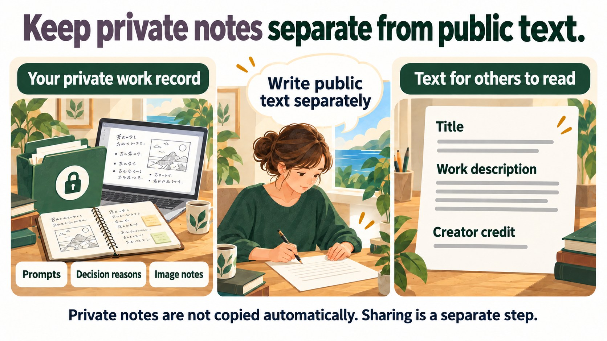

# Public-text workflow

[日本語](./presentation_sidecar.md)

[](./assets/private-public-notes.en.png)

_Concept illustration of public-text preparation. Downloading the text does
not share images or private creation notes._

This v0.8.0 feature is included in the v1.2.0 release executable. It lets you
prepare author-supplied public text for one complete, non-derived Creator
session. It is deliberately separate from the private Creator record and from
bundle generation.

## Create `presentation.toml`

On the `synapse serve` project page, open the public-text form and select a
complete session made with the normal three-image import. A session derived by
reusing Original and Current is refused by the frozen public v1 format, so
that reused Current is not presented as a newly observed state.

Enter a work title, summary, public display name, session title, captions for
the three images, and a public decision note. All fields are optional. When you
choose a session, the work title and public display name are prefilled with the
Subject and Creator recorded for that session as suggestions (a Subject longer
than 300 bytes is not suggested). You can edit or clear them, and your own
edits are not overwritten. While suggestions are shown, checking and downloading
require the "I reviewed the current visible values" checkbox, and editing the
title or display name clears it. The other fields start empty. The form never
autofills a private rationale, prompt, generation note, or decision pin.

## What a public bundle includes

The bundle can expose the session identifier, disposition, selected-role facts,
Blob/Ref OIDs and other technical identifiers that may be correlatable. It does
not automatically publish the recorded subject label or creator display name,
generation notes, rationale, decision pins, internal Actor IDs, repository path,
or raw asset bytes. To show a title or creator credit, explicitly write
`title = "Work title"` and `creator_display_name = "Public credit"`; both are
author-supplied public text, not verified copies of the recorded values.

Use the preview action to apply the existing `PresentationInput` validation.
It displays only your supplied text; it is not a verified preview of a final
bundle. Editing invalidates an earlier preview. The download action writes a
browser download named `presentation.toml`; it does not write Core objects or
Refs, include raw images or thumbnails, generate a bundle, or contact an
external service. Form drafts are not persisted, and the form cannot import a
TOML file.

Limits use UTF-8 bytes:

| Field | Limit |
|---|---:|
| Each title or public display name | 300 |
| Summary | 8,192 |
| Public decision note | 5,120 |
| Each image caption | 1,024 |
| Whole generated TOML | 64 KiB |

Summaries and public decision notes can contain line breaks. Other fields are
single-line. The existing validator rejects its defined control and direction
control characters; the TOML serializer escapes quotes, backslashes, and line
breaks. Empty fields are omitted.

## Generate and inspect a local bundle

Bundle creation remains a separate CLI operation. Stop every writer that uses
the same repository as `synapse serve` and ensure the Ref SQLite database is
checkpointed. Substitute your local source, a destination that does not yet
exist, and the selected session ID:

```sh
synapse present export SOURCE BUNDLE --session SESSION --presentation presentation.toml
synapse present preview BUNDLE
```

`preview` verifies an existing bundle and prints its entry point. If it reports
`read_only_source_busy`, stop writers and check the database checkpoint. A
complete derived session is refused, as is a whole-project export containing
one. Existing public v1 bundles remain verifiable.

The bundle operation is local and read-only with respect to the source
repository. Review the output before copying it outside your control. For the
privacy boundary and identifier caveat, read the [privacy and trust summary](./security_model.en.md).
The command and error reference is the [CLI reference (Japanese)](./cli_reference.md).
