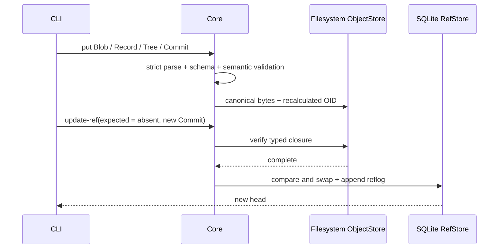

# SynapseGit Core Quickstart

この手順では、Stage 0 fixture を使って local repository を作り、Commit を Ref へ公開し、
`fsck`、directory export、別 repository への restore までを実行する。

Status: **実装済みの local CLI を対象**<br>
Audience: 利用を試す人、実装へ参加する人<br>
所要時間: 初回 dependency build を除いて1分以内

## 前提

- Rust 1.85 以降
- Bash などの POSIX-compatible shell
- repository root で command を実行すること
- Node.js 18 以降は fixture verifier を実行するときだけ必要

network service、database server、SurrealDB は不要である。SQLite は bundled build を使用する。
workspaceにはprocess-local authenticated Creative AI route、そこから成功したproposalに限定した
narrow Human Decision application route、disposable SQLite ProjectionStore libraryも含まれるが、
このQuickstartと現在のCLIはどれも起動・公開しない。

## 1. build する

```bash
cargo build -p synapse-cli --locked
```

CLI binary は `target/debug/synapse` に生成される。protocol fixture 自体も検証する場合は次を実行する。

```bash
node scripts/verify_core_fixtures.mjs
```

## 2. end-to-end demo を実行する

以下は repository root から Bash でそのまま実行できる。

```bash
SG=target/debug/synapse
DEMO=\"$(mktemp -d)\"
REPO=\"$DEMO/repository\"
ARCHIVE=\"$DEMO/archive\"
RESTORED=\"$DEMO/restored\"
FIX=spec/core/v0.1/fixtures

\"$SG\" init \"$REPO\"

for name in \
  actor-ai actor-creator-a policy delegation-grant \
  context-pack ai-activity
do
  \"$SG\" put-record \"$REPO\" \"$FIX/$name.json\"
done

\"$SG\" put-blob \"$REPO\" \"$FIX/proposal.txt\"
\"$SG\" build-tree \"$REPO\" \"$FIX/base-tree-a.json\"
\"$SG\" commit \"$REPO\" \"$FIX/base-commit.json\"
\"$SG\" build-tree \"$REPO\" \"$FIX/proposal-tree.json\"
HEAD=\"$(\"$SG\" commit \"$REPO\" \"$FIX/proposal-commit.json\")\"

\"$SG\" update-ref \
  \"$REPO\" \
  proposal/agent/demo \
  - \
  \"$HEAD\" \
  --actor demo-user \
  --message \"Quickstart proposal\"

\"$SG\" fsck \"$REPO\"
\"$SG\" export \"$REPO\" \"$ARCHIVE\"
\"$SG\" restore \"$ARCHIVE\" \"$RESTORED\"
\"$SG\" refs \"$RESTORED\"
\"$SG\" fsck \"$RESTORED\"

echo \"demo data: $DEMO\"
```

主な期待出力は次のとおりである。OID は省略表示している。

```text
objects=11 verified=11 closures=1 issues=0
proposal/agent/demo  commit:sg-oid-v1:sha256:21f1e5...
```

`ARCHIVE` は単一 file ではなく、manifest、checksum、objects、Refs、reflog を含む **directory archive** である。

## この demo で起きること



- 同じ canonical object または Blob の再投入は同じ OID を返す。
- Ref 作成時の `-` は「現在 head が存在しないこと」を expected value にする。
- 既存 Ref の更新では、`-` の代わりに current Commit OID を渡す。
- expected value が stale なら `ref_conflict` となり、Ref と reflog は変更されない。
- Ref 更新前に、新しい Commit から必要 object へ到達できるかを検証する。
- restore は checksum、OID、schema、closure を再検証し、Ref を最後に復元する。

## 重要な現在の境界

> **CLI は authentication / authorization を実装していない。**

`--actor` は reflog metadata であり、本人性を検証しない。現 CLI は呼出者が
`decision/*` や `release/*` を更新することも技術的には防がない。
一方、Rust libraryの`synapse-application`はAI requestをcredential、project selector、opaque handle／permitへ
限定し、injected Authenticator、exact project map／process ACL、Core preflight、exclusive-TTL one-shot permit、
single trusted Executor、実行後reauth／project FIFO fenceを実装する。`synapse-core::CreativeAiRuntime`は
AI proposal admission、exact capability／snapshot-output binding、checkpoint／single-base-parent、
base non-Tree preservation、decision/release拒否、transaction-time expiry／atomic `stale_base`をfull revalidationする。
AI成功時の`AiPublicationReceipt`はsame-instance/project/proposal-boundな`AdmittedProposalHandle`を返す。
同じapplicationのHuman control planeはそのhandleをborrowし、reusable Human profileとserver-fixed candidateを
one-time registrationへ束縛する。Human requestはcredential、exact project、opaque registration／permitだけを渡し、
application TTL、live ACL／profile、FIFO fenceを通って`HumanDecisionRuntime`のfull validation／CASへ進む。
handleはdenial後の修正版registrationへ再利用できるが、registrationとpermitはone-shotである。
`HumanDecisionRuntime`はtrusted authenticated single human、Policy、proposal／baseを固定し、supported
dispositionだけをcanonical `decision/*`へatomicに記録する。
このQuickstartとCLIはどのrouteも使わず、`update-ref`をlocal trusted operator primitiveとして実行する。
applicationはHTTP／JWT serverではなく、Projection routeを持たない。concrete credential／persistent human
membership、restartを越えるACL／permit、multi-process fence、organization／quorum、release／modified／partial
workflow、ExecutorのOS sandbox／egress、Grant revocationは未実装である。

library routeのtestだけを実行する場合は次を使う。

```bash
cargo test -p synapse-application --locked
```

`synapse-projection::SqliteProjectionStore`はRust libraryとして実装済みだが、CLI commandと
automatic refreshは未実装である。caller-suppliedなconsistent Ref snapshotから明示的にrebuildする
派生indexであり、Subject timeline、Observation dependency、Analysis lineage等をqueryできる。
`RefScope`はACLではなく、authorization、RefStore、archive、recoveryの代わりにはならない。
詳細は [Security model](./security_model.md) を参照する。

## command 一覧

```text
synapse init <repo>
synapse put-blob <repo> <file> [--claimed <oid>]
synapse put-record <repo> <file> [--claimed <oid>]
synapse build-tree <repo> <file> [--claimed <oid>]
synapse commit <repo> <file> [--claimed <oid>]
synapse put-object <repo> <file> [--claimed <oid>]
synapse update-ref <repo> <ref> <expected-oid|-> <new-oid> [--actor <id>] [--message <text>]
synapse refs <repo>
synapse fsck <repo>
synapse export <repo> <archive-dir>
synapse restore <archive-dir> <repo>
```

`cargo run` を使う場合は Cargo と CLI 引数の間に `--` が必要である。

```bash
cargo run -p synapse-cli -- --help
```

## よくあるエラー

| code | 主な原因 | 対応 |
|---|---|---|
| `usage_error` | 引数不足、structured input size 超過 | `synapse --help` と file size を確認する |
| `schema_invalid` | concrete schema または semantic rule 不一致 | `record_type`、required field、set order を確認する |
| `oid_mismatch` | `--claimed` と再計算 OID が不一致 | body と object family を確認する |
| `closure_missing` | Commit から必要 object へ到達できない | Ref 更新前に依存 Blob / Record / Tree / parent を投入する |
| `ref_conflict` | expected head が current head と異なる | `refs` で current head を読み、branch または明示 merge を選ぶ |
| `resource_limit` | input または graph が実装上限を超えた | input を分割し、既定上限を [Security model](./security_model.md) で確認する |
| `archive_invalid` | checksum、manifest、OID、closure の不一致 | archive を変更せず export 元から作り直す |
| `archive_not_empty` | restore 先に object または Ref が存在する | 新しい空 repository path を使う |
| `fsck_failed` | integrity issue が見つかった | 元 data を保全し、手編集せず原因を調査する |

## 次に読む

- object graph と Record の役割: [Core データモデル](./core_model.md)
- Pilot で利用者へ返す価値: [使用ガイド](./usage_guide.md)
- 書込み・保存 backend の境界: [Runtime architecture](./runtime_architecture.md)
- CLI 開発と test: [Contributing](../CONTRIBUTING.md)
