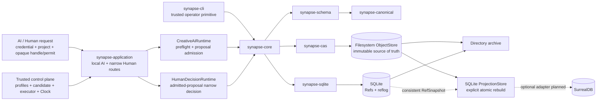

# SynapseGit Core runtime architecture

Status: Stage 0 decision draft

Decision date: 2026-07-11

## 結論

Core実装言語は**Rust**とする。local repository pathに加え、process-localなauthenticated one-shot AI executionとnarrow Human Decision routeを`synapse-application`、Creative AIのpreflight／proposal publication admissionを`synapse-core::CreativeAiRuntime`、narrow Human Decision admissionを`HumanDecisionRuntime`としてRustに置く。ただし正本をSurrealDBへ閉じ込めず、Gitライクな不変objectをfilesystem/object storage上のCASに置く。ローカルのRef・reflogはSQLite、共有serviceのRefStoreはPostgreSQLを候補とする。query用には`synapse-projection::SqliteProjectionStore` baselineを実装済みである。これはverified ObjectStoreとcaller-suppliedな一貫したRef snapshotから破棄・再構築する派生indexで、SurrealDB adapterと全8 query／benchmark比較は未実装である。



この境界では、DBを交換してもOID、Commit DAG、archiveは変わらない。SurrealDBの採否は作品履歴を賭ける不可逆な選択ではなく、検索・グラフ探索の便益で判断できる可逆な選択になる。

現在実装済みの範囲と実行コマンドは[Quickstart](./quickstart.md)と
[CLI reference](./cli_reference.md)を参照する。

## Gitから踏襲するもの

Gitらしさの中核は使用言語やRDBではない。Git自身がcontent-addressable filesystemとしてobjectを扱い、Ref更新では現在値がold OIDと一致した場合だけnew OIDへ進める。SynapseGitも次を踏襲する。

- canonical bytesに対するcontent address
- Blob / Record / Tree / Commitの不変object
- first-parentを持つCommit DAG
- `expected_head`付きRef compare-and-swap
- reflog、fsck、到達closure、export/restore
- objectを先に永続化し、closure確認後にRefを進める書込み順序

参考: [Git objects](https://git-scm.com/book/en/v2/Git-Internals-Git-Objects.html)、[git-update-ref](https://git-scm.com/docs/git-update-ref.html)

## 候補比較

| 構成 | local/offline | graph探索 | Ref CAS | 復元性 | 判断 |
|---|---:|---:|---:|---:|---|
| Rust + filesystem CAS + SQLite | ◎ | ○。baseline実装済み | ◎。transaction | ◎。index再構築可 | **Stage 1既定** |
| Rust + filesystem CAS + SurrealDB | ◎。embedded可 | ◎。型付きedge・arrow traversal | ○。競合試験が必要 | ○。projection限定なら◎ | **並行spike** |
| Rust + object CAS + PostgreSQL | △。server前提 | ○。recursive CTE | ◎ | ◎ | 共有service候補 |
| TypeScriptだけでCore | ○ | DB次第 | DB次第 | △ | UI/SDKには採用、OID正本には不採用 |
| PythonだけでCore | ○ | DB次第 | DB次第 | △ | adapter/AI workerには採用、OID正本には不採用 |

SQLiteは公式にversion-control system、media editing、CAD等のapplication file formatを用途として挙げ、ACID transactionとgraphを辿れるrecursive CTE、online backupを持つ。最初のローカル実装に必要な性質が少ない運用部品で揃う。[SQLite appropriate uses](https://www.sqlite.org/whentouse.html)、[transactions](https://www.sqlite.org/transactional.html)、[recursive CTE](https://sqlite.org/lang_with.html)、[backup](https://www.sqlite.org/backup.html)

SurrealDBはRust SDKからin-memoryまたはfile-backed embedded databaseとして実行でき、relationをmetadata付きedgeとして保持・探索できる。Actor–Activity–Observation–Claim–ContextPackの横断には明確な適性がある。[Rust embedding](https://surrealdb.com/docs/reference/rust/embedding)、[graph relations](https://surrealdb.com/docs/learn/data-models/graph/creating-relations)

一方、2026-07時点の公式資料ではSurrealKVはbetaで、保守的なon-disk productionにはRocksDBが推奨される。また2.xから3.xにはmanual対応を含むbreaking changesがある。したがってDB内部表現をarchive正本にせず、projectionを再生成できることを採用条件にする。[storage engines](https://surrealdb.com/docs/build/embedding/storage-engines)、[2.x to 3.x migration](https://surrealdb.com/docs/build/migrating/from-old-surrealdb-versions/2x-to-3x)

## 言語の責任分担

### Rust: OID決定権を持つCore

- strict UTF-8/JSON parser、duplicate keyとnumber token検査
- canonical serializer、SHA-256、OID
- filesystem ObjectStore、streaming Blob ingest、flushed temporary fileからのno-replace hard-link publication
- schema/semantic validator、Commit closure、Ref CAS
- Creative AI proposal admission、immutable authorization chain、trusted ClockによるGrant期限検査
- exact project map／process ACL、Core preflight、one-shot permit、trusted Executor、post-execution reauthorizationを持つlocal AI application route
- trusted single human／Policy／proposal／baseを束縛するnarrow Human Decision admission
- SQLiteのgeneric cross-Ref preconditionによるatomic `stale_base`判定
- current Ref closureだけを索引するdisposable SQLite ProjectionStore
- CLI、fsck、archive export/restore
- C ABI/WASMまたはservice APIを通した他言語連携

OIDを生成する実装を一つに絞るのは、他言語を排除するためではなく、初期段階でcanonicalizationの分裂を防ぐためである。golden fixtureが安定した後、独立した第二実装で相互検証する。

### TypeScript: Creator-facing application

- desktop/web UI、capture review、Diff viewer
- project workflow、branch/merge interaction
- Coreが返したOIDを扱うclient SDK

### Python: mediaとCreative AI adapter

- image registration、mask、photometric analysis
- BIM/CAD/画像adapter
- model provider連携、ContextPack consumer

Python/TypeScript workerはArtifactやAnalysis bodyをCoreへ提出するが、自前serializerのdigestを正本にしない。Coreがcanonicalize・validateしてOIDを返す。

## Authenticated application and Creative AI publication境界

### Initial authenticated application routes

`synapse-application`はframework-neutralな同期Rust libraryであり、Creative AI execution/publicationと、
同じapplication instanceがadmitしたproposalに対するnarrow Human Decisionだけをrouteする。
requestはcredential、project selector、server-issued opaque execution handle／permitだけを持ち、Repository path、
actor／principal、authority OID、ContextPack、capability、base／target Ref、Clock、Executorを選べない。

処理順序は次である。

1. injected `Authenticator`で認証してからproject／handle／Repositoryをlookupする。
2. caller文字列をpathへjoinせず、server-owned exact project mapとprocess-lifetime ACLでrouteする。
   malformed／unknown／forbidden projectは同じ`project_access_denied` code／messageにする。この保証は
   semantic responseだけで、constant-timeやtraffic／storage side channelまで保証しない。
3. reusable `AuthorityProfile`とone-time `ExecutionRegistration`から`AiExecutionAuthority`と
   `AiPublicationTarget`を構築し、candidate非依存の`preflight_proposal`を行う。
4. sealed Core decisionをapplicationのopaque stateful permitへ束縛する。deadlineはapplication TTLとGrant expiryの
   早い方で、exclusiveに`now < not_after`の間だけ有効であり、registrationは一 permitだけを発行できる。
5. permitを再利用不能にburnしてから、applicationに一つだけinjectedされたtrusted `Executor`を起動する。
6. Executor完了後に再認証し、その後project FIFO publication／ACL fenceへ入る。fence内でlive ACLと
   unsuspended profileを再読してauthorityを再構築し、`publish_preflighted`のfull Core revalidationと
   Ref transactionが終わるまで保持する。ACL／profile mutationも同じfenceを使う。

このfenceは一process内のpublicationとACL/profile変更の順序を定める。project map、ACL、profile、
registration、permitはprocess-lifetime memoryで、restart後にhandle／permitは無効になる。productionでは
durable authenticated control planeと全processにまたがるfair／linearizable fenceが必要である。
HTTP／JWT、Projection application route、OS sandbox／connector／egress、Grant revocationは
このinitial sliceに含まれない。

公開request methodは`prepare_ai(credential, project, &RegisteredExecutionHandle)`と
`execute_and_publish_ai(credential, &AiExecutionPermit)`である。`Application::new`、project ACL grant／revoke、
authority profile register／replace／suspend、`register_execution`はtrusted control planeだけが呼ぶ。

AI publication成功時の`AiPublicationReceipt`はCore `AuthorizationDecision`に加え、non-Cloneでredactedな
`AdmittedProposalHandle`を返す。このhandleはapplication instance／project／proposal Ref/headへ束縛される。
Human control planeはreusable `HumanAuthorityProfileConfig`を登録し、new Decision Commit／Feedback／messageだけの
`HumanDecisionCandidate`とadmitted handleを`register_human_decision`へ渡す。handleはborrowされてexact proposalを
証明し、non-Clone `RegisteredHumanDecisionHandle`へ束縛される。Core denial等の後は同じhandleで修正版を
再登録できるが、各registrationとpermitはone-shotである。

Human requestは`prepare_human_decision(credential, project, &registration)`でprocess ACL／live profile／
admitted-proposal bindingをFIFO fence内で確認し、one-shot `HumanDecisionPermit`を得る。
`publish_human_decision(credential, &permit)`はauthentication後にmatching permitをburnし、同じfence内で
live ACL／profile／TTLを再検査して`HumanDecisionRuntime::publish_decision`のfull validation／CASまで保持する。
Human routeに追加Executorやcandidate-independent Core preflightはなく、publish冒頭の認証後にreauthもしない。
AI／HumanともAuthenticator callbackはFIFO fence、application state lock、Repository lockの外で動き、resultは
point-in-timeなsession decisionである。線形化するのはprocess-local ACL／profile mutationだけであり、queued
requestに対する外部credential storeの即時revocation fencingは保証しない。permit TTLがwindowをboundedにし、
production auth adapter／credential lease semanticsはdeployment責任である。

### Core preflight and publication

`CreativeAiRuntime`は、AI modelやconnectorを起動するexecutorではなく、生成済みproposal Commitを
`proposal/*`へ公開するCore admissionである。`preflight_proposal(AiPublicationTarget)`はActor、Context、
Grant、Policy、base snapshot、project／resource／prefix、exact capability × runtime、expiryをcandidateなしで
検査し、live base→target expectationをread-onlyで確認する。返す`AiPreflightDecision`はsealed／non-Cloneで
Refを予約しない。またcredential／ACL／TTLを含むapplication permitそのものではない。

trusted Executorは`AiGeneratedProposal(new_head, activity_oid, message)`だけを返す。
`publish_preflighted`はCore decisionをconsumeし、authority／target／side effect／capability／Grant／Policy／
base／expiry bindingをfreshに再検証し、preflight以後のbackward Clockを拒否してから、下記candidate／output／
transaction guard／base precondition／CASをすべて実行する。

1. embedding serviceがproject単位Repository／routeを選び、authenticated actor、authorized project／principal／human-gated base Ref、authority snapshot OID、ContextPack OID、実行前に認可したcapabilityのexact set、runtime capabilityを固定した`AiExecutionAuthority`とtrusted Clockを渡す。
2. target Refをlexical validationし、proposal namespaceだけを許す。decision/releaseはcandidateを読まずHuman Gateへ留保し、他namespaceも拒否する。
3. untrusted`AiProposalUpdate`からauthorityとContextPackを選ばせず、candidate Commitとrequired closureを検証する。
4. AI Activity、ContextPack、DelegationGrant、Policy、agent／principal Actorをschema再検証し、author、principal、project、base Ref、OID cross-linkを照合する。baseのcurrent snapshot Treeにagent Actor、self-asserted human／organization principal Actor、Grant、Policyのexact OIDを要求し、ancestor-only bindingを拒否する。
5. candidateを`commit_kind=checkpoint`かつsingle parent `[ContextPack.base_commit]`に限定する。base snapshotの全non-Tree objectをcandidate snapshotにも要求し、Treeの置換／再配置だけを許す。candidate／base closureとsnapshot deltaを比較し、admission Activity／固定ContextPack以外の新規non-TreeをActivity output closureへ束縛する。generated output closureはexplicit output closureからContextPack selected input closureを差し引き、explicit rootsを再追加するため、input-only bytes／Record assertion／typeを二重評価しない。Tree-only residualを除き、base snapshot外のselected inputをcandidate snapshotへ置く場合はoutput宣言が必要である。output Recordはagent assertedなAnalysisResult／Claimだけを許し、Claimの`payload.ai_run_ref`は省略してcurrent Activity `output_refs`をprovenance正本とする。Tombstone、control Record、nested Commitを拒否し、generated output closureと新規TreeのbytesをOID dedupeしてGrant上限へ適用する。
6. Activity requested capabilityがpre-authorized exact setと一致すること、typed output／roleから導出したcapabilityを含むことを確認し、全memberをActor × Grant × Policy × runtime capabilityで再評価する。opaque Blobの意味に必要なcapabilityはCoreで推論できないため、embedding serviceが実行前に分類する。
7. Grantの初回not-before／expiry検査を通過したrequestだけについてSQLite `BEGIN IMMEDIATE`へ入る。直後かつRef state read前にtrusted Clockを再読し、lock待機中のexpiry crossingとbackward clockをfail-closedにする。その後、ContextPackのbase Ref expectationとproposal target Ref CAS／reflogを一transactionで検査・更新する。base `stale_base`をtarget `ref_conflict`より先に評価し、unauthorized＋staleはbase stateを開示せずauthorization errorにする。

concreteなcredential方式、HTTP／CLI network exposure、durable／distributed ACL・permit、Projection route、release／organization／quorum承認route、modified／partial adoption、multi-project CAS membership／classification resolver、AI実行前のOS sandbox／egress／physical-effect制御、Grant revocationは未実装である。新しいTreeだけでbaseのnon-Tree objectを保持しながら再配置するcandidateはproposalとして許可されるが、採用には次のHuman Decision境界が必要である。local `synapse update-ref`と`Repository::update_ref`はこのadmissionを通らないtrusted operator primitiveで、untrusted callerへ公開しない。

## Human Decision admission境界

`HumanDecisionRuntime`はcredential verifierではない。initial application routeがinjected authenticationとproject access確認を終え、live `HumanAuthorityProfileConfig`、server-fixed candidate、同一instanceの`AdmittedProposalHandle`からtrusted `HumanDecisionAuthority`を構築する。authorityはauthenticated human、project、Human Actor／Policy OID、canonical `decision/*` Refとcurrent head、exact proposal Ref/head、trusted Clockを固定する。proposalのAI Activity／ContextPack／Grant／base chainはそのtrusted proposalから解決する。untrusted requestはopaque registration／permitだけで、`HumanDecisionUpdate`のnew Decision Commit、DecisionFeedback、messageもcontrol planeが固定する。

1. Human Actorをself-assertedな`actor_kind=human`へ限定し、authenticated reviewerがAI Activityのresponsible principal、ContextPack／Grant asserter、Grant direct principalと同一であることを要求する。Human Actor／Policyのexact OIDがContext baseのcurrent snapshotにあり、Policyがreviewer asserted、Policy OIDがContextPack `policy_snapshot_ref`と一致し、そのscopeとproposal chainのprojectがtrusted projectへ一致することを検査する。
2. proposalをcheckpoint／single Context-base parent／exactly one `proposal_ready` AI Activity transitionとして再検証し、Activityのside effectを`none`／`project_internal`に限定してActivityとGrantの`before_decision_ref` requirementを要求する。low-level Ref primitiveで作られたheadをRef名だけでprior AI admission済みとはみなさない。ただしoriginal runtime capability／sandbox／execution-time Grant state／AI Actor×Policy intersectionは再構成できず、CreativeAiRuntime経由だったことを証明する境界でもない。embedding serviceはCreativeAiRuntime admission済みと把握するproposalだけをtrusted Human authorityへ選ぶ責任を持つ。proposal snapshotはbaseの全non-Tree objectを保持し、新しいActor／Policy／Grant／Tombstone／nested Commitを導入できない。
3. Policy action `publish`をcanonical decision Refへ評価する。denyはgate／allowより強く、exact／terminal `/**`以外や評価不能conditionはfail-closedである。このrouteが満たすgateは`before_decision_ref`だけで、別gateは`human_gate_required`となる。default-deny Policyにdecision allow／gateがなければ拒否する。committed golden Policyはこの理由でHuman runtime fixtureではない。
4. new Commitをhuman-authored `commit_kind=decision`、trusted current decision headをsole parent、exactly one self-declared DecisionFeedback transition、empty `bound_declaration_refs`として検証する。このprofileはcanonical decision Refを新規作成しない。`adopted_unchanged`だけがproposal snapshotを採用し、`rejected`／`deferred`／`experiment_only`はContext base snapshotを保持する。`adopted_modified`／`partially_adopted`はprovenance profileが未定義なため拒否する。
5. canonical decision lineageに同じproposal Commitを指すDecisionFeedbackが既にあれば再決定を拒否する。lineage検査はtrusted current decision headへ束縛し、concurrent publicationはtarget CASにより一件だけが成功する。
6. ContextPack base Ref/headをtrusted canonical decision Ref/headへ一致させる。immutable authorization後の同一`BEGIN IMMEDIATE` transactionでbackward Clock guard、proposal Ref/head precondition、decision target CAS、authenticated reflogを順に処理する。decision target CASがlive Context-base checkも兼ね、proposal／decision mismatchはいずれも`ref_conflict`となる。Human routeは`stale_base`を返さず、unauthorized requestへlive stateを開示しない。

`publish_decision`は成功時に`DecisionDisposition`を含む`HumanDecisionReceipt`を返す。applicationはinjected authenticationとprocess ACLを先に実行するが、concrete credential、organization代理、quorum／MFA、network／CLI route、release approval、modified／partial workflowはこの境界に含まれない。normative ruleは[Operations §8](../spec/core/v0.1/operations.md#8-human-decision-admission-boundary)を参照する。

## SQLite ProjectionStore baseline

`synapse-projection::SqliteProjectionStore`はverified `FileObjectStore`と一つの
caller-supplied `RefSnapshot`だけをsourceとして、derived SQLite rowを明示的に
`rebuild`する。Ref snapshotの取得と一貫性はcallerの責務であり、object／Ref publicationに
追随するtriggerやbackground refreshはない。したがってprojectionはRefStoreより遅れ得る。

rebuildはcurrent Ref headからclosureを辿り、一つのSQLite transactionで旧projectionを
置換する。複数Refから到達する同一OIDはdedupeし、各query resultにはRef reachabilityを保持する。
current headから到達しないorphan CAS objectは意図的に除外する。projection metadataは
schema version `2`、`projection-source-v1:sha256:...` fingerprint、Ref／object／edge／
incomplete Ref件数を持ち、異なるprojection schema versionはopen時に拒否する。
schema v1 databaseは自動migrationせず`projection_schema_unsupported`で拒否し、正本のCASと
consistent Ref snapshotからv2 projectionを新規rebuildする。
ただしCore v0.1のTombstone resolutionはstore-wideなRecord OID scanを行う。有効でreachable
closureやそのTombstone解決に無関係なorphanはrow／fingerprintから除外される一方、そのscanで
unreadableまたはdigest-corruptなorphan Recordを見つけた場合はfail-closedでrebuildを拒否する。
Projectionはnon-empty rebuildごとに`PreparedClosureVerifier`を一つ作り、Record familyだけを
`ProjectionLimits.tombstone_scan`のinclusiveなobject件数／canonical stored bytes上限で走査する。
同じresolver snapshotを全Ref closureで共有し、同一headのclosure reportも再利用する。上限超過は
`resource_limit`で旧projectionを保持する。empty Ref snapshotはscanしない。永続cacheはまだなく、
各rebuildのI/OはRecord件数に線形なので、大規模storeでのincremental index／運用benchmarkは残る。

Stage 0 baselineの公開queryは次である。

- `get_object`: availabilityを含むprojected object
- `subject_timeline`: subject、任意のObservationSeries、`RefScope`で選んだRefに到達するObservation／Activity timeline。
  Observationはcapture time、Activityはvalid timeを優先し、必要時だけ`recorded_at`をfallbackにする
- `observation_dependencies`: CaptureProfile、Station／StationDeployment、Calibration、
  Environment、role／ordinal付きMedia dependency
- `analysis_lineage`: explicit `RefScope`内の一つのAnalysisResultについて、adapter id／version／
  determinism／seed、implementation／configuration、ordered input role、transform、derived Blob、
  typed mask、各objectのkind／availability、到達Refを返す
- `closure_summaries`／`closure_issues`: Refごとのcomplete state、missing issue、tombstoned availability／count

`AnalysisReplayReadiness::Ready`はordered input、adapter implementation／configuration、transformが
すべてpresentというavailability summaryだけを意味する。derived Blob／maskは保存済みresultのoutputなので
replay attemptをblockしない。missingとtombstoned prerequisiteは別々または両方としてblockを表現する。
`Ready`はadapterが`deterministic`を宣言していてもbyte-identical replay、実行環境、意味的同値を保証しない。

このbaselineはcrate内の3 unit testと19 integration testで、atomic rollback、schema v2 rejection／
rebuild、snapshot／scope validation、global derived-row limit、idempotent fingerprint、multi-Ref／orphan
exclusion、timeline／Observation dependency、typed Analysis lineage、全replay readiness state、stale row
removalとerror precedenceに加え、Tombstone scanのexact count／byte境界、超過時の旧projection保持、
orphan resolver、corrupt orphan、empty-snapshot no-scanを検証している。

missingなclosure targetはissue rowへ残し、tombstoned targetは別availability／summary countとして
区別する。tombstonedだけならclosureはcompleteになり得る。一方、corrupt byte、
schema/type不整合、cycle、resource-limitによるtruncationはrebuildを中断し、以前のprojectionを
query可能なまま残す。ProjectionStoreはauthorization source、object source of truth、RefStore、
archive input、recovery prerequisiteのどれでもない。authorization／publication／restoreは必ず
ObjectStoreとRefStoreの正本を直接使う。

rebuild中のObjectStoreはarchive exportと同じcooperative append-only運用を前提とし、concurrent
GC／removalを許さない。rebuildが一度presentとして観測したobjectがcommit前に消えた場合、
新しいmissing diagnosticへ格下げせずoperationをfailし、旧projectionを維持する。embedding serviceは
rebuild failureとprojection metadataのfingerprint／freshnessをmonitorし、stale projectionを
authorizationやpublication可否の入力にしてはならない。

`RefScope`はquery filterであり、ACL／tenant boundaryではない。`analysis_lineage`はglobal projectionに
存在しないAnalysisResultを`projection_analysis_unknown`、index済みだが選択Refから到達しないものを
`projection_analysis_not_reachable`として区別する。この差はobject存在のoracleになり得るため、serviceは
callerのproject／Ref accessをprojection queryより先に認可し、認可済みcallerだけへerrorを返す。

## 永続化の書込み境界

local writeは次の順序に固定する。

1. Blobまたはcanonical objectを同一filesystemのtemporary fileへstreamする。
2. hashとschema/semantic ruleを検証する。
3. fileと必要なdirectoryをflushし、no-replaceのatomic hard linkでOID pathを公開する。
4. candidate Commitのclosureを検証する。
5. application AI routeはpreflight→permit burn→Executor→reauth→project FIFO fence→live ACL/profile再構築を行う。その後Core publicationでは`BEGIN IMMEDIATE`直後にtrusted Clock guardを実行し、Grantが有効な場合だけRef preconditionへ進む。Human Decision publicationではimmutable authorization後にbackward Clock guard、proposal Ref precondition、trusted decision/base headのtarget CASへ進む。
6. Refとreflogを同じSQLite transactionでcompare-and-swap更新する。

SQLite RefStoreはtarget RefのCASに加え、任意のRef expectationを同じtransaction内で検査できる。
Creative AI routeはこれをContextPack base Refのpreconditionとして使い、base mismatchを
`stale_base`、proposal target mismatchを`ref_conflict`として区別し、どちらもRef／reflogを変更しない。
Human Decision routeはContext baseをcanonical decision Ref/headへ固定し、proposal Refをprecondition、同じcanonical decision Refをtarget CASとして使う。proposalとdecision/baseの検査、reflogを一transactionへ束縛する。

projection rebuildはこのpublication transactionの一部ではない。callerがpublication後に
一貫したRef snapshotを取得し、必要な時点で別operationとして実行する。rebuild失敗は正本の
object、Ref、reflogをrollbackまたは変更しない。

途中停止時は未到達objectが残り得る。現在の実装は通常のmissing / corrupt closureをRef更新前に拒否するが、Tombstone解決を含む既知のvalidator制限があるため、保証範囲は[Security model](./security_model.md#現在の既知制限)も参照する。garbage collectionは未実装であり、将来はgrace period後の別operationとする。

## SurrealDB採用spike

SQLite baselineは、同じCASとRef snapshotからのatomic rebuild、Ref-scoped closure diagnostics、
Subject timeline、Observation dependency、typed AnalysisResult lineage／replay readinessを実装済みである。
これは下記1のdiagnostic部分、2、3のdependency部分、4を先に検証した状態であり、8 queryすべての
SQLite surfaceやSurrealDB parityを完成したという意味ではない。
Stage 0 exit gateとしてStage 1へ進む前に、SurrealDB adapterを追加し、同じ入力から次の代表queryを
両backendで実装・測定する。

1. CommitからBlobまでのclosureと欠落理由
2. SubjectのObservation/Activity timeline
3. ObservationからCaptureProfile・Calibrationへの到達
4. Analysisの入力、adapter、派生物、再実行候補
5. ClaimのEvidence、代替Claim、actor別Reaction
6. AI ArtifactからAIRun、ContextPack、Policy、DelegationGrantへの到達
7. 削除対象からpreview・mask・embedding等の派生物列挙
8. Creator/AIの`generated_by`, `selected_by`, `modified_by`, `approved_by`分離

比較するのは単純benchmarkだけではない。

- 10万edge規模でのp50/p95 latencyと起動時間
- queryとprojection adapterの実装量・理解しやすさ
- concurrent Ref CAS race testの正しさ
- schema migrationと旧projectionの破棄・再構築時間
- empty storeへのrestore後に全OIDとquery結果が一致すること
- binary size、memory、backup、障害復旧の運用負荷

SurrealDBは、横断queryの実装単純性または性能がSQLiteより実測で明確に優れ、かつprojection再構築・競合試験を通る場合に既定へ昇格する。それまでは価値あるoptional adapterとして扱う。

## 現在のrepository構成

```text
crates/
  synapse-canonical   strict parser / canonical bytes / OID
  synapse-schema      JSON Schema + semantic validation
  synapse-cas         filesystem CAS / typed closure / Tombstone / fsck
  synapse-sqlite      local RefStore / reflog / CAS / generic Ref preconditions
  synapse-projection  disposable SQLite query index / explicit atomic rebuild
  synapse-application local authenticated Creative AI + narrow Human Decision routes
  synapse-core        validated repository / AI proposal + Human Decision admission / archive
  synapse-cli         put / trusted-operator update-ref / fsck / export / restore
```

`synapse-sqlite`が保存するのはRefsとreflogであり、query projectionではない。
`synapse-projection`は別SQLite file／connectionに破棄可能な派生rowを保存する。

## 未実装の候補構成

```text
  synapse-graph       graph traitをCAS crateから分離する場合
  synapse-ref         RefStore traitを複数backendへ広げる場合
  synapse-surreal     optional ProjectionStore spike
workers/
  image-analysis/     Python adapter
apps/
  desktop/            TypeScript UI
```

最初の実装単位`put-object → verify OID → build tree → commit → CAS ref → fsck → export/restore`、`authenticate → exact project ACL → Core preflight → one-shot execution → reauth/fence → full proposal publication → admitted handle`、`authenticate human → registered admitted proposal/candidate → one-shot permit → full supported disposition/CAS`、`consistent RefSnapshot + CAS → atomic SQLite projection rebuild`はlocal Rust縦切りとして実装済みである。ただしapplication routeはAIとnarrow Human Decisionだけのprocess-local libraryである。SurrealDB導入はこの正本経路から分離し、optional projection adapterとして並行検証する。

`build-tree`と`commit`は現在、利用者が用意したJSONをfamily指定でvalidate + putするCLIであり、directory走査やCommit bodyの自動生成は行わない。archiveは単一fileではなくchecksum付きdirectoryである。詳細は[Local directory archive profile](../spec/core/v0.1/archive-profile.md)を参照する。
