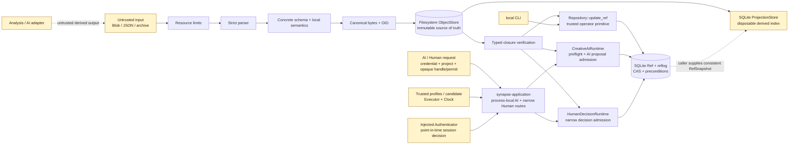
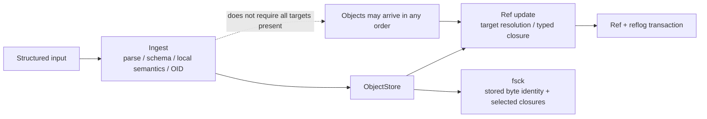
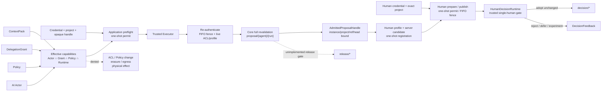

# SynapseGit Core security and trust model

この文書は Stage 0 local implementation の trust boundary と、利用者が誤解してはいけない保証範囲をまとめる。
脅威モデルの完成版や production deployment guide ではない。

Status: **Stage 0 draft** 
Implemented scope: local object / Ref / archive integrity path, process-local authenticated Creative AI and narrow Human Decision routes, Core admissions, and disposable SQLite projection libraries 
Planned scope: single-user IPv4-loopback image application architecture and HTTP contract; no server or route is implemented yet 
Production target: GCP primary / AWS portability architecture is specified; cloud implementation is not started 
Out of current implementation scope: concrete HTTP/JWT identity、durable/distributed authorization state、OS sandbox/egress、production tenant isolation

## 何を確認でき、何を確認できないか

| mechanism | 確認できること | 確認できないこと |
|---|---|---|
| content OID | 同じ profile で再計算した byte identity | 作者性、内容の真実、権利、許可 |
| schema / local semantics | Core v0.1 が受理する形と object 内の制約 | 現実世界の正しさ、参照先の存在 |
| Commit closure | snapshot から必要 object が解決可能か | 各 Claim が真実か |
| Ref CAS + reflog | stale update の拒絶と更新履歴 | actor の本人性。認証は別 layer |
| `CreativeAiRuntime` | trusted inputに対するAI proposal publicationの能力・object binding・namespace・base整合 | 人間の本人認証、AI実行前のegress/side effect防止、Human Gate承認そのもの |
| `synapse-application` initial routes | AIではexact project ACL、Core preflight、exclusive-TTL permit、trusted Executor、実行後reauthを、Humanではsame-instance admitted proposal、server-fixed candidate、one-shot permitを束縛し、両方をlive profile／FIFO fenceからCore full validationへ接続 | Authenticator実装自体の強度、HTTP/JWT、restartを越えるACL／permit、multi-process ordering、OS sandbox／connector／egress、Projection route、organization／quorum／release／modified／partial |
| `HumanDecisionRuntime` | trusted single-human authorityに対する`decision/*`のidentity／Policy／proposal／base／disposition／duplicate／atomic CAS整合 | credential本人確認、ACL、organization代理、quorum／MFA、modified／partial／release approval |
| `synapse-creator` Pilot / report | fixed local stateからCore-validなbase、AI proposal、Human Decisionを作り、取得した一つのRef snapshotに対するcurrent lineageとtimelineを監査表示する | OS userや`--creator`の本人性、caller-supplied fileのAI生成、Application routeを実際に通ったこと、cross-Ref transaction、reportをauthorization sourceとして使うこと |
| planned localhost application | exact startup catalog、safe facade、loopback／Host／Origin／browser-token boundaryを通して既存routeとread modelだけを公開する設計 | 現時点ではruntime保証なし。OS-user authentication、same-user process isolation、public／multi-user service、malicious media sandbox |
| planned cloud service | tenant-scoped immutable CAS、PostgreSQL Ref/reflog transaction、durable command、OIDC、single-writer regional DRをGCP主系／AWS移植profileで要求する設計 | 現時点ではruntime保証なし。cloud adapter、public API、tenant isolation、durable admission、deploymentは未実装 |
| `SqliteProjectionStore` | supplied Ref snapshotのcurrent closure、derived query row、Analysis lineage／prerequisite availability、missing診断とtombstoned availability／count、source fingerprint | authorization、ACL／tenant isolation、exact replay、最新Refとの自動同期、objectの正本性、archive／recovery completeness |
| detached Assurance | signer / service が何を検査・主張したか | Claim 本文の真実 |
| archive checksum / restore | package 内 byte と graph の整合性 | sender identity、機密性、外部 copy の回収 |

checksum と OID は attacker authentication ではない。攻撃者が object graph と manifest を丸ごと作り直せる場合、
内部的に整合した別 archive を作れる。署名済み配布 profile は未定義である。

## local trust boundary

現状は local OS user と repository directory permission を信頼する。
production ingest は `synapse-core` を通す。`synapse-cas` の `*_unchecked` API は、
既に検証済みの canonical bytes を保存する低水準境界であり、外部入力へ直接公開しない。
initial application routeはcredentialをinjected `Authenticator`へ渡してからproject／handle／Repositoryを
lookupし、exact server mapとprocess-lifetime ACLからrouteする。malformed／unknown／forbidden projectは
同じpublic code／messageにするが、これはsemantic anti-oracleであってconstant-time／traffic-analysis保証ではない。
request planeはcredential、project selector、opaque execution handle／permitだけで、AI自身がRepository path、
actor／principal、authority OID、ContextPack、capability、base／target Ref、Clock、Executorを選べない。
Human Decisionでは同じapplicationがdirect humanを認証し、成功したAI publicationのnon-Clone
`AdmittedProposalHandle`をcontrol plane registrationでborrowする。reusable Human profileとserver-fixed
candidateからhuman、Human Actor／ContextPack Policy、canonical decision Ref、proposal／base chainを
`HumanDecisionAuthority`へ固定する。untrusted requestはopaque registration／permitだけである。

planned localhost applicationはpublic HTTP securityの代替ではない。実装時はlistenerをliteral `127.0.0.1`へ固定し、
exact `Host`／unsafe requestの`Origin`／Fetch Metadata、process-local custom-header token、no-CORS、CSP／`nosniff`、
bounded streaming uploadを同時に要求する。HTTP requestはserver-owned project／archive logical keyだけを選び、raw path、
write targetのRef／head、OID、authority profile、registration／permitを選べない。read-only reflog filterだけは
500 UTF-8 bytes以内のexact Ref名を受ける。transport crateはlocal service facadeだけへ依存し、
Core／SQLiteへ直接依存しない。詳細は[Localhost application architecture](./localhost_application_architecture.md)を参照する。

tokenはambient browser request対策であり、本人認証ではない。同じOS userのprocess、browser extension、same-origin XSSを
隔離しない。認証headerを付けられない``へAPI URLを直結せず、64 MiB以下の許可rasterだけを認証付きfetchから
短命な`blob:` URLへ変換し、CSPの`img-src`だけで許可する。download-only bytesも認証付きfetchから`<a download>`専用の
短命URLへ渡し、表示／navigationへ流用しない。既存の大Blobを含め、serverもimage responseを64 MiBで拒否する。
uploadは各64 MiB／aggregate 192 MiB、exact 3 file partsに固定し、
non-crash cancellationをRAII cleanupする。pending reviewはhandleだけでなく同じ`Application` instanceとtrusted lineage contextを
保持し、proposal publication前に有限slotを予約して、HTTP response前にservice registryへ所有権移管する。同じreviewのdecisionは
排他状態遷移で一度だけ進め、panic／storage ambiguityを自動retryしない。admitted proposal handleは再起動後にProjection／Refから
再構成せず、incomplete sessionとして診断する。
Projectionはadmissionのauthorityではない。upload／archive stagingのcrash orphanもageだけで自動削除せず、所有権と
競合を証明するcleanup設計までは残存させる。

public cloudはこのlocal trust boundaryを拡張せず、別のtrust profileとして実装する。
[Cloud service architecture](./cloud_service_architecture.md)はGCP主系／AWS portability profile、tenant isolation、
stagingからconditional CAS create、PostgreSQL CAS＋reflog＋outbox、durable command、OIDC、SLO／DRを定義する。
特にprocess-local `AdmittedProposalHandle`はrestartを越えないため、proposal CASと同じauthority transactionへ参加する
durable admission receiptが完成するまでmulti-instance Human Decisionを公開しない。

## validation stage

- ingest は object 単体で判定できる schema、NFC、set、time、fixed-point 等を検査する。
- graph 参照先は object upload 順序を許すため、Ref 更新時に resolve して検査する。
- `fsck` は全 stored object の pathname、OID、canonical bytes を検査し、current Ref head の closure を辿る。
- Ref が一つもない `fsck` は stored Commit 全件を root にする。
- `fsck` は全 structured object へ JSON Schema を再適用するものではない。Core ingest / restore を通した object は投入時に schema 検証済みである。

## 既定 resource limit

| resource | default |
|---|---:|
| structured input / canonical bytes | 16 MiB |
| JSON nesting depth | 128（hard ceiling 256） |
| JSON nodes | 100,000 |
| one container の members / items | 50,000 |
| Blob | 512 MiB |
| closure objects | 100,000 |
| closure edges | 1,000,000 |
| closure depth | 512 |
| closure dynamic reference-role metadata | 64 MiB（hard ceiling） |
| archive export objects | 100,000 |
| archive export raw object bytes | 1 TiB |
| archive export distinct-head validation nodes | 1,000,000 |
| archive export distinct-head validation edges | 10,000,000 |
| archive export Tombstone Record scan | 100,000 Records / 1 GiB |
| archive export Refs / reflog entries | 100,000 / 100,000 |
| archive export Ref/reflog variable text | 64 MiB |
| export / restore manifest | 64 MiB |
| manifest checksum file | 256 bytes |

現在の CLI からこれらを変更できない。library caller は `ArchiveExportLimits` により、object件数、
raw object bytes、distinct-head validation nodes／edges、Tombstone scan、Ref／reflog snapshotの
archive export既定値を小さくも大きくも置き換えられるため、これらの既定値はhard ceilingではない。
生成manifestの64 MiBとclosureのdynamic reference-role metadata 64 MiBは固定のhard ceilingである。
後者はTree path、RecordのJSON Pointer、Record constraintなど、closure report内で同時に保持し得る
copyをallocation前に課金する。
CLI が structured file を読む段階で 16 MiB を超えた場合は`resource_limit`ではなく
`usage_error`を返す。

## 実装済みの durability / concurrency property

### ObjectStore

- Blob は bounded streaming で SHA-256 を計算する。
- structured object は schema 検証済み canonical bytes と OID を再照合する。
- temporary file を flush / `sync_all` した後、hard link の create-if-absent で OID path を公開する。
- parent directory を sync する。
- 同一 object を並行投入しても一つだけが `Created` となり、他は byte 一致を確認して `AlreadyPresent` となる。
- archive export 用の complete inventory scan は全4 familyを検査し、retained OIDと走査workを
  operation-wideなobject件数上限で止める。

### RefStore

- candidate Commit closure を SQLite write transaction の前に検査する。
- AI routeは`BEGIN IMMEDIATE`直後、Ref preconditionやstate readより前にtrusted Clockを再読し、
  Grantの`recorded_at` not-beforeとexclusiveな`expires_at`を再検査する。writer lock待機中の失効と
  backward clockはfail-closedにする。
- `BEGIN IMMEDIATE` 内で current head と expected head を比較する。
- generic Ref preconditionも同じ`BEGIN IMMEDIATE`内で検査でき、AI routeはContextPackの
  base Refとproposal target Refを一つのserializable updateとして扱う。
- Ref update と reflog append は同じ transaction で commit / rollback する。
- 同じ expected head の並行更新は一つだけが成功する。

### Application publication/ACL fence

- reusable `AuthorityProfile`とone-time `ExecutionRegistration`を分離し、一registrationから一permitだけを発行する。
- Core preflight decisionはsealed／non-Cloneだが、credential／ACL／TTLを表すapplication permitとは別である。
- permitはstateful、opaque、process-localで、application TTLとGrant expiryの早い方をexclusive
  deadline (`now < not_after`) に使う。
- permitをExecutor起動前にburnする。Executor／Clock／Core failureを含む全失敗で再利用しない。
- Executor完了後のAuthenticator再実行はFIFO fence取得前に行う。fence内でlive ACLとprofile suspensionを
  再検査し、live profileからauthorityを再構築してCore transaction完了まで保持する。
- 同一projectのACL／profile mutationも同じFIFO fenceを使う。これはsingle-process orderingであり、
  restart recoveryや複数process間のlinearizabilityを保証しない。
- successful AI publicationだけがinstance／project／proposal Ref/head-bound
  `AdmittedProposalHandle`を返す。Human registrationはこのnon-Clone handleをborrowし、reusable Human profileと
  server-fixed `HumanDecisionCandidate`へ束縛するため、requestはlow-level proposal Refやdecision candidateを選べない。
  handle evidenceはdenial後の修正版registrationへ再利用できるが、registrationとpermitはone-shotである。
- Human preparationは追加Executor／Core preflightを行わずone-shot `HumanDecisionPermit`を発行する。
  TTLはapplication deadlineだけで`now < not_after`を要求する。publicationはauthentication後にpermitをburnし、
  same FIFO fence内でlive ACL／profile／TTLを再検査して
  `HumanDecisionRuntime`のfull immutable validation／CASまで保持する。invalid Human permitも
  `execution_permit_invalid`を使い、Core errorはburn後のfinal publicationだけから透過する。
- AI／HumanともAuthenticator callbackはFIFO fence、application state lock、Repository lockの外で実行し、
  resultはpoint-in-timeなsession decisionである。Human publishは外部Executorがないため認証は冒頭の一回だけで、
  reauthしない。同じfenceで線形化するのはprocess-local ACL／profile mutationであり、queued requestに対する
  外部credential storeの即時revocation fencingは主張しない。permit TTLがwindowをboundedにし、production
  auth adapter／credential lease semanticsはdeployment責任である。
- application public errorは`authentication_required: authentication required`、
  `project_access_denied: project access denied`、`execution_permit_invalid: execution permit invalid`、
  `execution_failed: execution failed`、`configuration_invalid: application configuration invalid`、
  `service_unavailable: application service unavailable`へdetailを閉じる。Core codeはmatching permitを
  authenticated attemptがburnした後のfinal publicationからだけ透過する。AI preflight Core rejectionは
  configuration error、storage／resource failureはservice unavailableへ正規化する。Humanには別Core preflightがない。

### SQLite ProjectionStore

- callerが取得した一つのconsistent `RefSnapshot`とverified `FileObjectStore`だけを入力にする。
- explicit rebuildはcurrent headsから到達するobjectだけをindexし、orphan CAS objectを除外する。
- derived rowの全置換は一つのSQLite `BEGIN IMMEDIATE` transactionでcommit / rollbackする。
- schema versionとsource fingerprintを保存し、対応しないschema versionをopen時に拒否する。
- missing targetはRef-scoped issueへ残し、tombstoned targetは別availability／summary countとして区別する。tombstonedだけなら、Ref head自身ではないclosureはcompleteになり得る。
- corrupt byte、schema/type不整合、cycle、resource truncationはrebuildを拒否し、直前のprojectionをquery可能なまま保つ。
- archive exportと同様にcooperative append-only ObjectStoreを前提とし、rebuild中のconcurrent GC／removalを許さない。一度presentと観測したobjectが消えた場合はmissingへ格下げせずrebuildを失敗させる。
- validなunrelated orphanはprojected row／fingerprintから除外する。ただしCore v0.1のTombstone解決はstore-wide Record scanを行うため、unreadable／digest-corruptなorphan Recordもfail-closedでrebuildを拒否し得る。
- Analysis replay `Ready`はinput、adapter implementation／configuration、transformのavailabilityだけを集約する。derived output／maskはblockせず、adapter実行可能性、environment、byte-identical／semantic replayを保証しない。

ProjectionStoreはpublication transactionに自動追随せず、RefStoreより古いsnapshotを表し得る。
そのためauthorization、Ref CAS、archive export／restore、recovery判断はprojection resultを使わず、
ObjectStoreとRefStoreを直接検査する。query consumerがfreshnessを必要とする場合は、使用した
`RefSnapshot`とprojection metadataのsource fingerprintをoperation境界で管理し、rebuild failureと
fingerprint／freshnessの古さをmonitorする。ただしその古さをauthorization判断に使わない。

`RefScope`はACL／tenant boundaryではない。特に`analysis_lineage`はglobalにnot-indexedと、index済みだが
selected Refからnot-reachableを別errorにするため、未認可callerには存在oracleとなる。serviceは
projectionを呼ぶ前にauthoritative project／Ref accessを検査し、認可後だけquery result／errorを返す。

### directory archive

- export は Ref と reflog を同じ SQLite read transaction で先に snapshot する。
- current Refとcomplete reflogの全distinct `new_head`を、一つのbounded Tombstone catalogで検証する。
- 全distinct headのclosure nodes／edgesをoperation-wideに合算する。同じhead OIDは一度だけ検証するが、
  異なるheadが共有closureを再走査したworkは再課金する。各headには残りbudgetとRepository
  `GraphLimits`の小さい方を渡すため、設定値はinclusiveなstrict work boundになる。
- append-only ObjectStore の inventory を OID 順に copy し、object raw checksum と manifest checksum を保存する。
- Blob は streaming、structured object は bounded memory で処理する。
- destinationと同じparent内にprocess IDと時刻nonceを含むper-export staging directoryを作る。
  通常のerror returnでは`Drop` cleanupするが、process crash後のorphanは回収しない。
- final publicationはLinux、Android、Apple、Redoxでatomic `RENAME_NOREPLACE`を使う。それ以外の
  target（Windowsを含む）はno-replaceを証明できないため`storage_error`でfail closedする。
- rename成功後にparent directoryをsyncする。syncが失敗するとdestinationが既に公開されていても
  APIは`storage_error`を返し得るため、これはcommitted-but-errorでありcrash durabilityは不確定である。
- restore は pathname を信用せず、regular file、checksum、claimed OID、schema、closure を再検証する。
- object phase の途中失敗は archive OID 集合の subset を残し得るが、Ref はまだ公開しない。
- 同じ archive の完全な subset なら restore を再開できる。Refs / reflog は最後に一 transaction で復元する。

archive は単一 file や圧縮形式ではなく directory である。現在のlayoutとvalidation ruleは
[Local directory archive profile](../spec/core/v0.1/archive-profile.md)にnormative draftとして定義する。

## Creative AI boundary

上図のうち、application preflightからone-shot execution／reauthorization／publicationへ至るinitial AI route、
admitted proposal handleからone-shot Human publicationへ至るnarrow route、各Core full admissionは実装済みである。
applicationはProjection queryを公開しない。

- authenticated actor、project、principal、human-gated base Ref、authority snapshot、固定ContextPackを
  Actor、AI Activity、ContextPack、DelegationGrant、Policy、candidate Commit間でcross-checkし、
  Activityのrequested capabilityを`AiExecutionAuthority`のpre-authorized exact setと一致させた後、
  全memberをActor × Grant × Policy × runtime capabilityで再交差検証する。
- Grantの期限、data class、project resource、writable Ref prefix、output byte上限を検査する。
- base Commitのcurrent snapshot Tree traversalがagent／principal Actor、Grant、Policyのexact OIDを含むことを
  検査する。ancestorだけのpresenceは認めず、principalはself-assertedなhuman／organizationからagentへの
  direct Stage 0 Grantに限定する。
- candidateは`commit_kind=checkpoint`、parentsがexactly `[ContextPack.base_commit]`でなければならない。
  既存proposalを更新するときもcurrent proposalをparentにせず、merge／proposal chainはStage 0対象外である。
- candidate／base closureと両snapshotのdeltaを照合し、base snapshotの全non-Tree objectを
  candidateでも保持する。Tree OIDだけは置換／再配置できる。admission Activity／固定ContextPack以外の
  新しいnon-Tree objectをActivity output closureへ束縛する。
  generated output closureはexplicit output rootsのclosureからContextPack selected input closureを差し引き、
  explicit rootだけを再追加する。input-only dependencyのbytes／assertion／typeをoutputとして二重評価せず、
  explicit outputにしたRecordはagent assertedなAnalysisResult／Claimだけを許す。Tree-only residualを除き、
  base snapshot外のselected inputをcandidate snapshotへ配置する場合もActivity output宣言が必要である。
  Tombstone、authority/control Record、nested Commitを拒否し、output上限はgenerated output closureと
  新規Tree bytesをOID dedupeして数える。
- current Activityが生成するClaimは`payload.ai_run_ref`を省略し、Activity `output_refs`からClaimへのedgeを
  provenance正本とする。同じActivityへのback-referenceはcontent-addressed OID cycleになり、旧runへの参照も
  current production provenanceを誤表示するため拒否する。
- AI routeは`proposal/*`だけを受理する。`decision/*`／`release/*`は
  candidateを読まず`human_gate_required`、他namespaceは`authorization_denied`で拒否する。
- ContextPackのexpected baseはproposal Ref CAS／reflogと同じSQLite transactionで検査し、
  mismatchを`stale_base`としてatomicに拒否する。
- error precedenceはRef lexical validation、namespace gate／proposal-only、candidate closure、
  残りのauthorization／初回expiry、transaction Clock guard、`stale_base`、target `ref_conflict`の順である。
  authorization／expiryを通過したrequestだけがlive base preconditionへ進む。
  unauthorizedかつstaleなrequestは`authorization_denied`となり、base stateを漏らさない。
- Policy selectorはexactまたはterminal `/**`だけをsegment boundaryで評価する。当該actionの
  unsupported selectorと評価不能なmatching conditional allowはfail-closedにする。
  ruleが適用されない場合は明示された`default_effect`を尊重し、fixtureと運用推奨はdenyである。
- initial authorization後もSQLite `BEGIN IMMEDIATE`直後にtrusted Clockを再検査し、lock待機中の
  expiry crossingやbackward clockで権限が延命されないようfail-closedにする。

同じapplicationから呼ばれる`HumanDecisionRuntime`は、AI routeが満たせないHuman Gateのうちnarrow
`decision/*` profileだけを実装する。成功したAI routeのopaque handleをcontrol planeがborrowし、
server-fixed candidateを登録した場合だけrequest permitを発行できる。handleはdenial後の修正版へ
再利用できるが、registrationとpermitはone-shotである。

- trusted `HumanDecisionAuthority`がauthenticated single human、project、Human Actor／Policy OID、canonical decision Refとexact current head、exact proposal Ref/head、Clockを固定する。AI Activity／ContextPack／Grant／base chainはtrusted proposalから解決する。untrusted updateはnew Decision Commit、DecisionFeedback、messageだけで、authorityやexpectationを選べない。
- Human Actorをself-asserted `actor_kind=human`へ限定し、authenticated reviewerがAI responsible principal、ContextPack／Grant asserter、Grant direct principalと同一であることを要求する。Human Actor／Policy exact OIDのbase snapshot presence、reviewerによるPolicy assertion、Policy OIDとContextPack policy binding、Policy scope、proposal chainのproject一致も検査する。
- Policy `publish`をdecision Refへ評価し、denyをgate／allowより優先する。このrouteが満たすのは`before_decision_ref`だけで、別gateは`human_gate_required`となる。golden Policyはdecision ruleなしのdefault denyなのでHuman runtime conformance fixtureではない。
- proposal Commitのtransitionをexactly one AI Activity、Decision Commitのtransitionをexactly one self-declared DecisionFeedbackへ限定し、Decision Commitの`bound_declaration_refs`をemptyにする。Activity／Grantは`before_decision_ref`を要求しなければならない。`adopted_unchanged`はproposal snapshot、`rejected`／`deferred`／`experiment_only`はbase snapshotだけを許す。`adopted_modified`／`partially_adopted`はhuman modification provenance未定義として拒否する。
- DecisionFeedback `source_refs`は根拠Evidenceのcitationとして許可するが、authorityやdeclaration bindingではない。Policy／Actor／Grantをciteしてもeffective authorityはtrusted exact OIDとprotected base snapshotだけから決まり、empty必須のCommit `bound_declaration_refs`とは意味が異なる。
- proposalのadoption-criticalなAI Activity／Context／Grant／output bindingを再検証し、新しいauthority/control Record、Tombstone、nested Commitを拒否する。ただしoriginal runtime capability／sandbox／execution-time Grant state／AI Actor×Policy intersectionやCreativeAiRuntime経由を証明しない。embedding serviceはCreativeAiRuntime admission済みと把握するproposalだけをtrusted Human authorityへ選ぶ責任を持つ。canonical decision lineageに同じproposalのDecisionFeedbackがあれば再決定も拒否する。
- ContextPack baseをtrusted canonical decision Ref/headへ一致させ、immutable authorizationをlive Ref readより先に完了する。その後backward Clock guard、proposal Ref precondition、decision/base target CAS／reflogを同一transactionで処理する。Human routeのproposal／decision競合は`ref_conflict`であり`stale_base`ではない。unauthorized requestへlive stateを開示しない。

Core admissionはpublication-time validationである。その手前のapplication routeはAuthenticatorと
trusted Executorをinjected dependencyとして順序付けるが、concrete identity方式やOS sandboxではない。

local `creator-run`はこのapplication routeをfixed in-process Pilot stateで利用する。agent／human credentialは
command内部の固定値で、OS userや`--creator`の本人性を検査しない。第三fileはcaller-supplied AI outputで、
commandはmodelを実行せず、agentへのattributionもmodelによる生成証明ではない。sessionのbase decision Refだけは
trusted bootstrapとして低水準`Repository::update_ref`で作り、その後のproposalとfinal Human Decisionを
Application／Core admissionへ渡す。このbootstrapをuntrusted caller向けのHuman Gate代替として公開してはならない。
各runのEntityIdはOSの暗号学的乱数から新規生成するsession-local IDであり、同じ人をsession横断で認証・識別しない。
Subject extensionのsession manifestはreport／restore用のdiscovery metadataで、credentialやglobal identity registryではない。
Pilotが生成するDecisionFeedbackはreason `unspecified`、private visibility、training use prohibitedを既定にするが、
local Blob／archive自体を暗号化したりhost filesystem accessを制限したりはしない。

creator reportは一つのconsistent Ref snapshotから両creator headを解決し、同じsnapshotでlineage検証とProjection
rebuildを行う。timelineの`recorded_at` fallbackはrun内の単調なrecording順序だけで、capture／AI execution timeの
証拠ではない。reportはcurrent object graphの監査表示であり、credential、Application admission receipt、
authorization decisionではない。base Ref公開後かつHuman Decision前にfailureしたsessionはliveなpartial historyとして
保全され、`creator_session_incomplete`になる。Human Decision CAS後は後続fsck／reportが失敗してもcomplete publicationが
残り得る。create-only Pilotはどちらの状態も自動resume／cleanup／上書きしないため、callerはcurrent Refsを診断する。

creator Pilotのcomparisonは、専用software-tool Actorがassertするordered original／current Observationの
byte-identity AnalysisResultである。verified primary Blob OIDだけを比較し、pixel／EXIFをdecodeせず、画像registration、
visual similarity、physical changeを判定しない。`identical`は同じBlob bytes、`different`は異なるBlob bytesという
限定的な結果であり、「物理対象が不変」「外観または物理状態が変化した」へ昇格させない。CLIは
`comparison_analysis`、`comparison_adapter`、`comparison_status`、`comparison_comparability`、`byte_identity`、
`comparison_reason_codes`、`comparison_replay_ready`、`comparison_warning`としてこの証拠と制限を表示する。
`comparison_replay_ready=true`はinputとadapter implementation／configuration等のprerequisite object availabilityを
Projectionが集約した結果だけで、adapter runtime、environment、determinism、byte-identical／semantic exact replayの
保証ではない。comparison entryを持たないlegacy-shaped creator sessionは`comparison=unavailable`と表示し、
結果や作成時期を推測しない。

- `--actor`は任意のreflog metadataで、本人性を検証しない。
- 現CLIは`CreativeAiRuntime`を公開せず、allowed syntaxの全Ref namespaceを低水準
  `Repository::update_ref`経由で更新できる。local trusted operatorだけに提供する。
- applicationのprocess-lifetime exact project ACLとAI／narrow Human routeは実装済みだが、HTTP／JWT、durable／distributed ACL・permit、
  multi-process fence、Projection application route、organization／quorum／MFA、release approval、
  modified／partial workflow、Grant revocation、OS sandbox／egress／physical-effect enforcementは未実装である。
- Coreはopaque Blobの意味や用途からrequired capabilityを推論できない。embedding serviceがmodel／tool
  実行前にworkloadを分類し、exact capability setを認可する責任を持つ。
- 新しいTreeだけでbaseの全non-Tree objectを保持しながら再配置するcandidateはActivity output宣言なしでも
  proposalとして許可される設計上のresidualである。narrow human adoptionは可能だがreleaseは別workflowである。

## Tombstone と erasure

Tombstone は「target payload が利用不能である」という履歴を残す Record である。

- object deletion、key destruction、derived purge を実行する CLI はまだない。
- Tombstone が存在しても、既に export または third party へ渡した copy を消せない。
- digest 自体が既知内容の照合に使われ得るため、公開可否を別途判断する。
- current closure validator は Tombstone で解決した非root node を complete と扱う。Ref headのroot Commitはreadable byteが必要で、Tombstoneだけでは解決しない。live payload が必要な操作は availability を別途確認する。
- ProjectionのStage 0実装は、non-empty rebuildごとにRecord familyを件数／累積bytes上限内で一度だけ走査し、同じTombstone resolver snapshotとduplicate-head reportを全Refで共有する。永続incremental indexは未実装である。

## 現在の既知制限

| 領域 | 制限 |
|---|---|
| fsck coverage | Ref がある場合は current heads が closure root。全 reflog head の closure や全 object の schema を再検査しない |
| crash recovery | archive／ObjectStoreのwrite boundaryごとのprocess-kill／fault-injectionとstartup orphan cleanupは未実装。archiveはprocess ID＋時刻nonceのstaging、ObjectStoreはtemporary object fileをcrash後に残し得る |
| concurrent export | cooperative append-only ObjectStore が前提。CLI process同士のexport-vs-update testは復元可能なRef／reflog prefixを検査するstress／smokeであり、SQLite transactionが必ずoverlapしたことのdeterministic proofではない |
| export publication | Linux、Android、Apple、Redoxはatomic `RENAME_NOREPLACE`を使う。その他target（Windowsを含む）は`storage_error`でfail closedする。local OS user／directory permissionを信頼するため、権限を持つhostile processによる他のpathname mutation全般を防ぐものではない |
| portability | non-Unix の directory sync は no-op。hard-link 対応 filesystem が前提。archive exportのfinal publicationはatomic no-replaceを実装したtargetだけをsupportする |
| very large repository | export object inventory、raw object bytes、全distinct headの累積closure nodes／edges、Tombstone Record scan、Ref／reflog entries・variable text、生成manifestはbounded。manifestとdynamic reference metadata以外はcaller-changeable defaultsであり、値を広げるcallerがwork／memoryを管理する |
| export acknowledgement | no-replace rename後のparent directory sync失敗では、destinationが公開済みでもAPIは`storage_error`を返し得る。callerはcommitted-but-errorとしてdestinationを再検証し、durability未確認と扱う |
| media security | image bomb、malicious SVG、EXIF / ICC parsing sandbox は未実装 |
| confidentiality | archive と local Blob は Core 自体では暗号化されない |
| AI application identity | injected `Authenticator`のresultを信頼する。concrete credential format、JWT validation、MFA、credential database／rotationは実装しない |
| application state durability | exact project map、ACL、profile、registration、permit、FIFO fenceは一process内だけ。restartでhandle／permitは失効し、multi-process linearizabilityは未実装 |
| application semantic anti-oracle | malformed／unknown／forbidden projectは同じcode／messageだが、timing、traffic、filesystem side channelの同一性までは保証しない |
| tenant / project isolation | exact project mapとprocess ACLはあるが、shared multi-project CASのobject membership／classification resolverは未実装 |
| AI execution enforcement | trusted Executorはpermit後にだけ起動されるが、model process isolation、connector access、egress、SSRF、物理作用をOS／networkで阻止しない |
| opaque Blob capability | CoreはBlob byteの意味や意図した利用を判定しない。embedding serviceが実行前にexact capability setを認可する |
| AI Tree-only restructure | baseの全non-Tree objectを保持する限り、新規Treeによる再配置をproposalとして許可する。path-level preservationを意味しない |
| AI Grant lifecycle | immutable Grantの期限はtrusted Clockで検査するが、live revocation list／key rotation／delegation chain enforcementは未実装 |
| Human Decision identity | applicationはinjected Authenticatorとprocess ACLを使い、same-instance admitted proposalを要求するが、credential format／MFA／persistent membership DBを実装しない |
| admitted proposal handle | successful AI publicationのsame-process evidenceだけ。portable receipt、signature、restart後のproofではなく、別application instance／projectへ移せない |
| Human Decision scope | `decision/*`と4 dispositionだけ。organization／quorum、release、`adopted_modified`／`partially_adopted`は未実装 |
| creator Pilot identity / attribution | EntityIdはOS CSPRNG由来のsession-local ID、`--creator`はself-declared表示名、AI outputはcaller-supplied。Subject manifestとagent attributionはcross-session identity、credential、model生成証明ではない |
| creator byte-identity comparison | verified primary Blob OIDだけを比較する`partial` evidence。pixel／EXIF decode、画像registration、visual／physical change判定、同じbytesからの物理的不変推論を提供しない。legacy-shaped sessionの`comparison=unavailable`は結果不明を表し、そのshapeは作成時期を証明しない |
| creator Pilot partial failure | base Ref公開後かつHuman Decision前はincomplete sessionをlive historyとして残す。Decision publication後はcomplete sessionを残し得る。create-only実装はどちらも自動resume／cleanupしない |
| low-level Ref primitive | `Repository::update_ref`とCLIはauthorizationを迂回できるため、untrusted AI callerへ公開してはならない |
| query projection | explicit rebuildのみで自動refreshはない。caller-supplied Ref snapshotの一貫性、cooperative append-only/no-removal運用、failed rebuildとfingerprint／freshnessの監視は上位層の責務。projectionの古さを認可へ使わない。SurrealDB adapterと全8-query／benchmark比較は未実装 |
| projection orphan scan | validなunrelated orphanはrow／query／fingerprintへ入らないが、store-wide Tombstone探索中のunreadable／digest-corrupt Recordはreachableでなくてもrebuildをfail-closedにする。`ProjectionLimits`はRecord件数／累積stored bytesをboundし、一つのsnapshotを全Refで共有する。永続cacheはなく、大規模storeではscan I/O／benchmark監視が必要 |
| projection query isolation | `RefScope`はquery filterだけでACLではない。Analysisのnot-indexed／not-reachable error差は存在を漏らし得るため、service authorization後だけ公開する |
| Analysis replay readiness | prerequisite availabilityのsummaryだけ。output／maskのavailability、adapter runtime互換性、determinism、byte-identical／semantic replayを保証しない |

## archive を扱うとき

- restore 先には専用の空 repository、または同じ archive の失敗 restore だけが残した exact subset を使う。
- restore 実行 user に不要な filesystem 権限を与えない。
- restricted data は archive 配布前に別途暗号化し、access / retention を管理する。
- checksum を sender signature と表示しない。
- export 後の copy は Core から remote erase できないことを利用者へ明示する。
- `fsck` failure 時は元 directory を保全し、object file や SQLite を手編集しない。

## 未実装の security layer

productionで必要なcontrolとrelease gateは
[Cloud service architecture](./cloud_service_architecture.md)に仕様化したが、以下は現在も未実装である。

- concrete HTTP/JWT／MFA identity、credential database／rotation
- durable／distributed project ACL、profile、registration、permit、multi-process publication fence
- multi-project CAS membership／classification resolver
- Projection authenticated application route、organization／quorum workflow
- release approvalとmodified／partial human adoption workflow
- pre-execution sandbox、connector、external egress、physical-effect enforcement
- Grant revocation、credential／key rotation、delegation chain enforcement
- public／multi-user HTTP transport、TLS、rate limiting（loopback-only contract自体も現時点では未実装）
- encrypted-at-rest payload、KMS、key rotation
- signed release / signed archive distribution profile、trusted timestamp
- malicious media decode isolation
- security issue の非公開報告窓口と response policy

repository を公開運用する前に、連絡先、embargo、supported versions、response policy を
root `SECURITY.md` として追加する。
