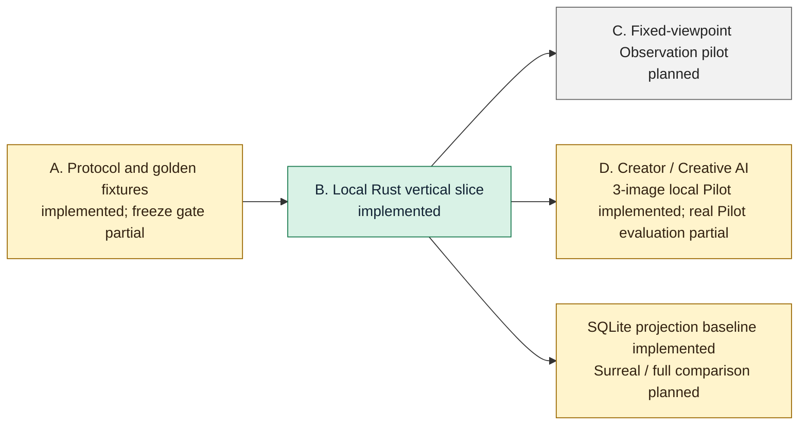

# SynapseGit Core Stage 0 execution plan

Status: in progress — protocol、local Rust vertical slice、process-local authenticated AI + narrow Human Decision application routes、Core admissions、SQLite projection baseline、local single-creator Pilot implemented

Target: four-week protocol and vertical-slice spike

## Progress summary



| Workstream | 状態 | 未完了の中心 |
|---|---|---|
| A: protocol freeze | partial | 第二の独立production実装によるfreeze gate |
| B: Rust Core vertical slice | implemented | archive object／Ref／reflog inventory、raw／text bytes、distinct-head累積closure work、Tombstone scan、manifest bounds、process-level export/update stress／smoke、Linux／Android／Apple／Redoxのno-replace publicationは実装済み。write-boundary crash fault-injectionとarchive／ObjectStore orphanのstartup cleanupが残る |
| C: Observation pilot | planned | dataset、image adapter、評価report |
| D: Creator / Creative AI | partial | local single-creator `creator-run`／`creator-report`、injected Authenticator／exact project ACL、one-shot AI Executor route、same-instance admitted proposalに限定したnarrow Human route、両Core admissionは実装済み。実利用者Pilot、実model／tool integration、benefit評価が残る。HTTP/JWT、durable/distributed state、general Projection route、release／modified／quorum、OS sandbox／egress、revocationはproduction/shared-service側の残作業 |
| ProjectionStore spike | partial | SQLite baselineのatomic rebuild、bounded shared Tombstone scan、closure／timeline／Observation dependency／Analysis lineageは3 unit + 19 integration testsで実装済み。SurrealDB adapter、完全な8-query parity／benchmark判断が残る |

## Outcome

Stage 0の終了条件は、UIの完成でもAI機能の多さでもない。次の一文を実データで成立させることである。

> CreatorとCreative AIが同じ制作履歴を利用しながら、AIはproposalだけを作り、人が公式判断を持ち、固定点Observationを含む履歴を別環境へ同じOIDで復元できる。

## Workstream A: protocol freeze

### Week 1

- `spec/core/v0.1`のOID preimage、strict JSON、timestamp、fixed-point、set/sequenceをRustへ実装する。
- JS verifierとはコードを共有せず、17 structured fixtureとBlobのOIDを一致させる。
- duplicate key、invalid UTF-8、BOM、lone surrogate、float/exponent/`-0`をparse前に拒否する。
- `record.schema.json`で具象recordをdispatchし、`operations.md`のsemantic error codeを固定する。
- RustとJSの相互fixtureが一致した時点で`sg-oid-v1`をfreeze候補にする。

OID freeze前なら破壊的修正を許す。freeze後は同じprefixの意味を変更せず、新profileへversionを上げる。

## Workstream B: Rust Core vertical slice

### Week 1–2

最初のCLI経路を一本だけ完成させる。

```text
put-blob / put-record
  -> build-tree
  -> commit
  -> update-ref <ref> <expected-oid|-> <new-oid>
  -> fsck
  -> export
  -> empty-store restore
```

この経路は現在`crates/synapse-core`と`crates/synapse-cli`で実装済みである。具象schema検証、atomic filesystem CAS、typed closure、Tombstone、SQLite Ref CAS／reflog、fsck、checksum付きdirectory export／empty-store restoreをworkspace testとCLI process testで検証する。`crates/synapse-application`のprocess-local authenticated AI route、same-instance admitted proposalに限定したnarrow Human route、Core Creative AI proposal／Human Decision publication boundaryもRust libraryとして実装済みである。`crates/synapse-projection`にはcurrent Ref closureだけを対象にするSQLite baselineも実装済みである。さらに`crates/synapse-creator`とCLIは、3画像から手書きJSONなしで一つのcreate-only creator sessionを作り、AI／Human route、Projection timeline、`fsck`、archive／restore後のreport一致をprocess testで通す。narrow Stage 0の残作業は第二の独立実装によるprotocol freeze、fixed-point Observation pilot、実利用者によるcreator benefit評価、SurrealDB adapterを含む全8 query／benchmark decision spikeである。HTTP/JWT、durable/distributed authorization、general Projection application route、OS sandbox／egress、release／modified／quorum workflowは、公開・複数利用者を対象にするときのproduction/shared-service gateとして分離する。

この経路の実行可能な手順は[Quickstart](./quickstart.md)、Pilotでの意味は
[SynapseGit Core使用ガイド](./usage_guide.md)にまとめる。

実装境界は[`runtime_architecture.md`](./runtime_architecture.md)に従う。

- filesystem CASを正本にする。
- SQLite transactionでRefとreflogをCAS更新する。
- projectionはcaller-suppliedな一貫したRef snapshotとCASから明示的に再生成し、一SQLite transactionで全derived rowを置換する。正本のwrite transactionやarchiveへ含めない。
- projection rebuild中はarchive exportと同じcooperative append-only／no concurrent GC境界を守り、failed rebuildとsource fingerprint／freshnessをserviceで監視する。stale projectionをauthorizationへ使わない。
- object書込みはtemporary file、flush、no-replace hard-link publication、closure検証、Ref更新の順にする。archive staging directoryの最終公開だけはrenameを使う。
- upload quota、object count/depth上限、巨大JSON/zip bomb等のresource limitを最初から置く。

### CLI acceptance

| Acceptance | 状態 | 根拠・残作業 |
|---|---|---|
| 同じBlob / Recordの再投入は同じOID | implemented | canonical / CAS idempotency tests |
| OIDとbody不一致を拒否 | implemented | claimed OID tests |
| stale `expected_head`でRefとreflogを動かさない | implemented | SQLite / repository race tests |
| 各書込み境界のprocess強制終了後も公開済みRefを保護 | partial | atomic publicationとtransaction testsはあるが、全境界のfault-injectionは未実装 |
| directory exportをrestoreし、OID / DAG / availability / Refsが一致 | implemented | repository / CLI round-trip tests。失敗object phaseのresumeも検証済み |

## Workstream C: fixed-point Observation pilot

### Week 2–3

二つの小さなdatasetだけを作る。

1. **Painting control**: 平面キャンバスまたは壁画を固定stationから反復撮影する。
2. **Building validation**: 小規模な一壁面・一区画を近似固定視点で撮影する。

各datasetに最低限含める条件:

- 対象無変更で照明だけ変更
- 対象無変更でcamera位置を許容範囲内・範囲外へ変更
- 既知領域への小変更
- 遮蔽、反射、blur、露出不良
- CaptureProfileの`imported`, `repeatable`, `calibrated`比較
- Plan、Previous Observation、Current Observationの三者比較

Python adapterはOIDを決めず、入力OID、adapter/version/configuration digest、結果BlobをRust Coreへ返す。出力は`comparable/partial/incomparable`とreason code、`changed/unchanged/ambiguous/unobservable` maskを必須にする。

### Observation acceptance

- 対象無変更＋照明差を物理変更として断定しない。
- registration失敗、遮蔽過多、欠測を「変化なし」に変換しない。
- base→target方向を交換したAnalysisが別の意味として残る。
- RAW、preview、normalized image、maskが別OIDで追跡できる。
- 既知変更領域に対する見逃し・誤検出と、条件別の限界を報告できる。

## Workstream D: Creator / Creative AI value slice

### Week 3–4

最初は外部modelの品質競争をしない。fixtureまたは単純adapterでもよいので、権限と履歴の縦切りを完成させる。

```text
Decision Commit
  -> ContextPack + Policy + DelegationGrant
  -> authenticate + exact project ACL
  -> Core preflight + one-shot permit
  -> trusted Executor -> AI Activity
  -> reauthenticate + project FIFO publication fence
  -> proposal/{agent}/{run}
  -> AI Activity + proposal output
  -> admitted proposal handle + server-fixed Human candidate
  -> authenticate human + exact project ACL + one-shot permit
  -> human adopt unchanged / reject / defer
  -> DecisionFeedback
  -> next ContextPack
```

Protocol上、AIの有効能力はActor、Grant、Policy、runtime capabilityの積集合とする。AIは`decision/*`, `release/*`, policy、外部egress、erasure、物理作用を直接変更できない。base Refが進んだ出力は`stale_base`として残し、自動rebaseしない。現在はExecutor起動をone-shot permitの後へ順序付けるapplication boundaryまで実装したが、Executor自体を隔離するOS sandbox／network egress制御までを意味しない。

### 現在の実装境界

`synapse-creator`とCLIの`creator-run`／`creator-report`は、このWorkstreamの最初のboundedな
local single-creator経路を実装する。`creator-run`はoriginal／current／AI outputの3 fileをopaque Blobとして
格納し、Subject、2 Observation、import Activity、ContextPack、Policy、DelegationGrant、AI Activity、
proposal Commit、DecisionFeedback、Decision Commitを自動作成する。proposal publicationとHuman Decisionは
`synapse-application`のAI／Human routeを通り、`adopt`はproposal snapshotをunchangedで選択し、`reject`／
`defer`はbase snapshotを維持する。AI proposal Refとoutput provenanceはどのdecisionでも残る。

このPilotは外部modelを呼ばず、3番目のfileをtrusted local integrationが用意したAI outputとして記録する。
画像bytesをdecodeせず、EXIF検証、capture、registration、difference analysisを行わない。外部時刻を
推測せず、Observation `capture_time`とActivity `valid_time`は`unknown`にする。fixed local
Authenticator／profile／prepared Executorをprocess内で構築するため、`--creator`表示名の本人確認、OS user認証、
HTTP／JWT、durable ACLを提供しない。EntityIdは各runでOSの暗号学的乱数から生成するsession-local IDであり、
同じcreatorのsession間identityではない。Subject extensionのPilot-private manifestがこれらを保持するため、
reportとarchive restoreは同じIDを再発見できる。sessionはcreate-onlyである。base Ref公開前の書込みはimmutable
orphanになり得るが、base Ref公開後かつHuman Decision前のfailureはliveなincomplete sessionを残す。この場合は
`creator_session_incomplete`となる。Decision publication後のfailureはcomplete sessionを残し得る。
どちらも自動resume／cleanupや上書きを行わない。

`creator-report`は一つのconsistent Ref snapshotからproposal／decision Refを解決し、同じsnapshotでin-memory
SQLite Projectionをrebuildする。current proposal／Feedback／decision lineageを再検証し、base／proposal／decision
snapshotとAI outputの選択状態を返す。text reportはSubject timeline、3画像OID、
`proposal_attributed_to_agent`、`ai_output_source=caller_supplied`、`reviewed_by_human`、adoptだけtrueになる
`selected`、dispositionを表示して`fsck`がcleanでなければ拒否する。attributionは第三fileの生成証明ではない。
DecisionFeedbackの既定はreason `unspecified`、private visibility、training use prohibitedである。timelineの各stageは
run内で単調増加するrecording timestampと`recorded_at` fallback basisを持ち、撮影時刻やAI execution timeを示さない。
一般的なProjection routeではない。
CLIの別commandでexport／restoreした後も同じreportを再構築できることをcreator／CLI process testで検証する。

`synapse-application`はAI requestをcredential、project selector、opaque execution handle／permitだけへ限定する。
Authenticatorをproject lookup前に呼び、server-owned exact project map／process ACLを使う。reusable
authority profileとone-time registrationからcandidate-independent Core preflightを行い、exclusive-TTL permitを
Executor前にburnする。Executor後はAuthenticatorを再実行してからproject FIFO publication／ACL fenceへ入り、
live ACL／profileからauthorityを再構築し、full Core publication transactionまでfenceを保持する。
malformed／unknown／forbidden projectは同一のsemantic code／messageである。

AI publication成功時はCore decisionと、application instance／project／proposal Ref/headへ束縛された
`AdmittedProposalHandle`を`AiPublicationReceipt`で返す。Human control planeはreusable
`HumanAuthorityProfileConfig`とserver-fixed `HumanDecisionCandidate`を用意し、そのhandleをborrowして
one-time registrationを作る。Human requestはcredential、exact project selector、opaque registration／permitだけを
渡す。prepareは同じFIFO fence内でlive ACL／profileと登録を検査しapplication TTLのpermitを発行する。
publishは認証後にpermitをburnしてからlive ACL／profile／TTLを再検査し、fenceを
`HumanDecisionRuntime`のfull validation／proposal precondition／canonical decision CASまで保持する。
Humanには別ExecutorもCore preflightもない。admitted handleはdenial後の修正版registrationへ再利用できるが、
registrationとpermitはone-shotであり、canonical一決定はCore lineage／CASが保証する。

`synapse-core::CreativeAiRuntime`はread-onlyな`preflight_proposal`と、sealed decisionをconsumeして生成済みAI proposalをRefへ公開する`publish_preflighted`を実装する。

- embedding serviceがproject単位Repository／routeを選び、authenticated actor、authorized project／principal／human-gated base Ref、Actor／principal／ContextPack snapshot、実行前に認可したcapabilityのexact set、runtime capabilityを固定した`AiExecutionAuthority`とtrusted Clockを渡す。
- untrusted requestにContextPackやauthorityを選ばせず、Actor、AI Activity、ContextPack、DelegationGrant、Policy、candidate Commitのidentity、project、principal、base Ref、OID cross-linkを照合する。
- Grant有効期間、data class、resource selector、writable prefixを検査し、base Commitのcurrent snapshot Treeにagent Actor、principal Actor、Grant、Policyのexact OIDを要求する。ancestor-only bindingは拒否し、principalはself-assertedなhuman／organizationからagentへのdirect Grantに限定する。
- candidate Commitを`commit_kind=checkpoint`、parentsがexactly `[ContextPack.base_commit]`のsingle-parentに限定する。proposal更新でもcurrent proposalをparentにせず、merge／proposal chainは後続scopeとする。
- candidate／base closureとsnapshot deltaを検査し、base snapshotの全non-Tree objectをcandidateでも保持する。Treeだけは置換／再配置できる。admission Activity／固定ContextPack以外の新規non-TreeをActivity output closureへ束縛する。generated output closureはexplicit output closureからContextPack selected input closureを差し引き、explicit rootsを再追加するため、input-only dependencyをquota／assertion／typeへ二重適用しない。Tree-only residualを除きbase snapshot外のselected inputをcandidate snapshotへ置く場合はoutput宣言を要求する。output Recordはagent assertedなAnalysisResult／Claimだけを許し、produced Claimは`payload.ai_run_ref`を省略してcurrent Activity `output_refs`をprovenance正本とする。Tombstone、control Record、nested Commitを拒否し、generated output closureと新規Tree bytesをOID dedupeした合計へGrant output上限を適用する。
- Activity requested capabilityをpre-authorized exact setと一致させ、typed output／roleに必要なcapabilityを含めたうえでActor × Grant × Policy × runtimeの積集合を再評価する。Policyの明示的`default_effect`を尊重し、fixture／運用推奨はdefault denyで、unsupported selectorと評価不能なmatching conditional allowはfail-closedにする。opaque Blobの意味はCoreで推論できないため、embedding serviceがmodel／tool実行前にcapabilityを分類・認可する。
- Ref lexical validation直後に`proposal/*`だけを受理し、AIによる`decision/*`／`release/*`更新をcandidateを読まず`human_gate_required`で拒否する。
- proposal namespace、candidate closure、残りのauthorization／初回not-before・expiry後にだけSQLite `BEGIN IMMEDIATE`へ進み、直後かつRef state read前にtrusted Clockを再検査する。lock待機中のexpiry crossing／backward clockをfail-closedにした後、ContextPack base Refをproposal target CAS／reflogと同じtransactionのpreconditionとして評価し、`stale_base`をatomicに拒否する。target `ref_conflict`はその後に評価し、unauthorized＋staleはauthorization errorを返す。

新しいTreeだけでbaseの全non-Tree objectを保持しながら再配置するcandidateはStage 0 proposalとして許可する設計上のresidualである。AIが採用を確定できるという意味ではなく、decisionへの反映は次のHuman Decision route、releaseへの反映は未実装の別routeを必要とする。

`HumanDecisionRuntime`は、上位層が認証済みとするsingle human、project、Human Actor／Policy、canonical `decision/*` Refとexact current head、exact proposal Ref/headをtrusted `HumanDecisionAuthority`へ固定してから、new Decision Commit／Feedback／messageだけの`HumanDecisionUpdate`を検査する。authenticated reviewerをAI responsible principal／ContextPack・Grant asserter／Grant direct principalへ一致させ、Human Actor／ContextPack Policyのbase snapshot binding、proposalのexactly one AI Activity transition、Decision Commitのexactly one self-declared Feedback transitionとempty `bound_declaration_refs`、project、Policy `publish`、supported snapshot contract、canonical lineageのduplicateを検証する。Context baseをtrusted decision Ref/headへ一致させ、proposal preconditionとdecision/base target CAS／reflogをatomicに処理する。`adopted_unchanged`はproposal snapshot、`rejected`／`deferred`／`experiment_only`はbase snapshotだけを許し、`adopted_modified`／`partially_adopted`はprovenance未定義として拒否する。

application libraryはAIとnarrow Human requestの両方でinjected Authenticatorとprocess ACLを実行するが、concrete HTTP／JWT、credential database、persistent human membership、restartを越えるACL／permit、multi-process fenceは実装しない。general Projection application route、organization／quorum、release approval、modified／partial adoption、multi-project CAS membership／classification resolver、model process sandbox／connector／egress制御、Grant revocationも未実装である。CLI `creator-run`はこのrouteをfixed local Pilotとして内部利用するが、一般的なadmission commandではない。`Repository::update_ref`とCLI `update-ref`はlocal trusted operator向け低水準primitiveとして残る。

### Creative AI acceptance

| Acceptance | 状態 | 根拠・残作業 |
|---|---|---|
| pre-authorized exact setをActivity requestと一致させ、Actor／Grant／Policy／runtime intersectionを再評価 | implemented library boundary | authorization integration tests。serviceが実行前にtrusted capabilityを供給し、unsupported selector／conditional allowをfail-closed |
| AI proposalのobject／project／current base snapshot bindingをcross-check | implemented library boundary | ancestor-only authority bindingを拒否し、direct human／organization principalを要求 |
| checkpoint／single-base-parentとcandidate snapshot deltaを制限 | implemented library boundary | baseの全non-Treeを保持し、merge／proposal chain、undeclared new object、Tombstone／control Record／nested Commitを拒否 |
| generated output closure quotaとRecord allowlistを強制 | implemented library boundary | selected input closureを除外してexplicit rootsを再追加し、new Tree bytesとOID dedupe。Recordはagent asserted AnalysisResult／Claimのみ、produced Claimは`ai_run_ref` absent |
| proposal-onlyとdecision/release拒否を強制 | implemented library boundary | AI routeは`authorization_denied`／`human_gate_required`。別のnarrow Human routeだけが`decision/*`を扱う |
| Grant expiry crossingとlive base mismatchでRef／reflogを動かさない | implemented library boundary | `BEGIN IMMEDIATE`直後のClock guard、SQLite generic preconditionとrace tests、`stale_base` mapping |
| authenticate→exact project ACL→candidate-independent preflight→one-shot execution→reauth/fence→full publication | implemented process-local library boundary | `synapse-application` tests。opaque non-Clone permit、exclusive TTL、burn-on-all-failures、live profile rebuild、project FIFO ACL/publication ordering |
| admitted proposal→server-fixed Human candidate→authenticate／ACL→one-shot permit→full decision publication | implemented process-local library boundary | `synapse-application` tests。same-instance handle、one-time registration、application-only TTL、live profile generation／ACL fence、Core error passthrough／CAS |
| direct human／Policy／proposal chainを束縛しsupported dispositionを記録 | implemented library boundary | `HumanDecisionRuntime` integration tests。duplicate lineage、atomic proposal precondition + decision/base CAS raceを検査 |
| 3 opaque画像から手書きJSONなしでproposal／Human Decision／timelineを作りarchive restore後もreportを再現 | implemented local Pilot boundary | `synapse-creator` workflow testsとCLI process test。adopt／reject／defer、人とAIのprovenance分離、`fsck`、restored report equalityを検査。実model・pixel analysis・real-user authenticationは対象外 |
| production authenticated serviceとexecution enforcement | not implemented | HTTP/JWT、durable/distributed ACL・permit、general Projection route、organization／quorum／release、OS sandbox／egress、revocationが未実装 |

### Creator benefit hypotheses

| 仮説 | Pilot metric |
|---|---|
| 記録が制作を中断しない | Captureの能動入力中央値20秒以内 |
| 節目を残す負担が小さい | Commitの能動入力中央値30秒以内 |
| 判断根拠を再発見できる | 1か月後に重要変更を本人が2分以内に説明 |
| 引継ぎと報告が速くなる | report/handoff作成時間を現行手順と比較 |
| 却下案も再利用できる | proposal再利用件数と再探索時間 |
| archiveがservice外で生きる | 空store restore成功率100% |

各annotation要求には即時の見返りを付ける。例として領域選択からDiff report、音声理由からDecision rationale、CaptureProfile入力から撮影ガイドを即座に返す。Commit件数やannotation量をcreator評価や料金指標にしない。

### Creative AI benefit and safety hypotheses

| 仮説 | Pilot metric |
|---|---|
| chatより正確なproject contextを受け取れる | AI Artifactからbase/input/Policy OIDへ到達100% |
| 却下理由を次回に利用できる | reviewed DecisionFeedbackを次Contextへ含めた割合 |
| 複数AIが履歴を壊さず探索できる | proposal Ref外へのunauthorized write 0件 |
| staleな案を正史へ混ぜない | base mismatch検出100% |
| creator dataを勝手に学習へ出さない | opt-inなしのexternal training/egress 0件 |
| 人の決定権を保つ | decision/release RefのAI直接更新0件 |

AI採用率は成功指標にしない。却下、保留、探索、批評にも価値があるためである。

## SQLite / SurrealDB decision spike

Stage 0ではどちらかへ履歴を固定しない。SQLite baselineはverified filesystem CASと一つの
consistent Ref snapshotから、current reachable objectだけをatomic rebuildするところまで実装済みである。
orphanを除外し、projection schema version／source fingerprint、missing closure diagnosticsとtombstoned availability／count、
Ref-scoped Subject Observation/Activity timeline、Observation dependencies、typed AnalysisResult lineageと
availability-only replay readinessを索引する。projection schemaはv2で、v1を自動migrationせずCAS／Ref
snapshotからrebuildする。corrupt／schema-invalid／
type-invalid／cyclic／resource-truncated inputでは旧projectionを保持する。
valid orphanはrow／query／fingerprintから除外するが、global Tombstone解決のRecord scanは
orphan Recordも検査する。Projectionは件数／累積bytesを明示上限化したresolver snapshotを
rebuildごとに一度だけ作り、全Refと同一headで共有する。上限超過／corrupt orphanでは旧projectionを
保持する。永続incremental Tombstone indexと大規模store benchmarkは残作業である。

代表query #4はadapter／configuration、ordered input、transform、derived Blob、typed mask、
Ref reachabilityを返す。replay `Ready`はinput／adapter／configuration／transformのpresentだけを意味し、
output／maskはblockせず、exact replayを保証しない。

残るspikeではSurrealDB adapterを実装し、同じ入力について`runtime_architecture.md`記載の8 query、
起動／p50／p95、migration／rebuild、実装量、運用負荷を比較する。SQLite baselineが先に実装されたことは
SurrealDBの採否を決定したことも、8 query parityを満たしたことも意味しない。

SurrealDBを既定へ昇格する条件:

- OID、Commit、exportの正本がDBから独立している。
- 全projectionを空から再構築できる。
- concurrent CAS試験で履歴消失がない。
- SQLiteより横断queryの実装または性能に明確な利益がある。
- version migration失敗時もCASとRefsから復旧できる。

条件を満たさなくても、分析・可視化用の任意adapterとして残せる。

## Explicit non-goals

- 建物全体のBIM自動照合
- 3D/point cloud/3GSの本格diff
- AIによる作者・貢献率・工程完了の自動認定
- public social network、marketplace、token
- cross-repository mergeとfederation
- 「永久保存」「作者証明」「現実の完全な正史」という販売表現
- creator dataの広告利用、無断model training、創造性score

## Exit gate

次の全項目を満たした時だけStage 1へ進む。

| Exit condition | 状態 |
|---|---|
| RustとJSが全golden OID、canonical length、canonical SHA-256で一致 | implemented |
| 具象schema、local semantic validation、stable error codeが実行される | implemented |
| local ObjectStore、SQLite Ref CAS、reflog、fsck、export / restoreの縦切りが動く | implemented |
| present / tombstoned / missing closureを表現・round tripできる | implemented。既知validator制限は[Security model](./security_model.md#現在の既知制限)参照 |
| 第二の独立production実装がOID / schema / semanticsで一致 | planned |
| Painting control datasetで観測条件差と既知変更を区別して報告 | planned |
| Creative AI flowがruntimeでproposal-onlyとHuman Gateを強制 | partial。3-image local creator process test、process-local authenticated AI route、same-instance admitted proposalに限定したnarrow Human application route、両Core admissionは実装済み。HTTP/JWT、durable/distributed state、general Projection route、release／modified／quorum、OS sandbox／egressは未実装 |
| Creator benefit metricを採取し、記録負担を評価 | planned |
| SurrealDBを測定結果からdefault / optional / deferへ決定 | planned |

Stage 0で性能やUIが未完成でもよい。OIDの意味、履歴の復元性、人とAIの決定境界が曖昧なままStage 1へ進まない。
