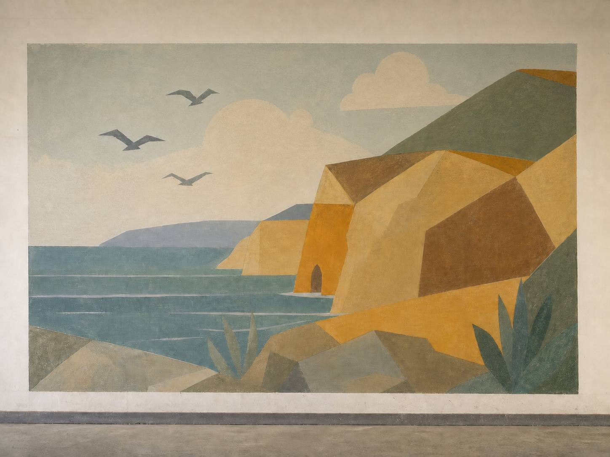
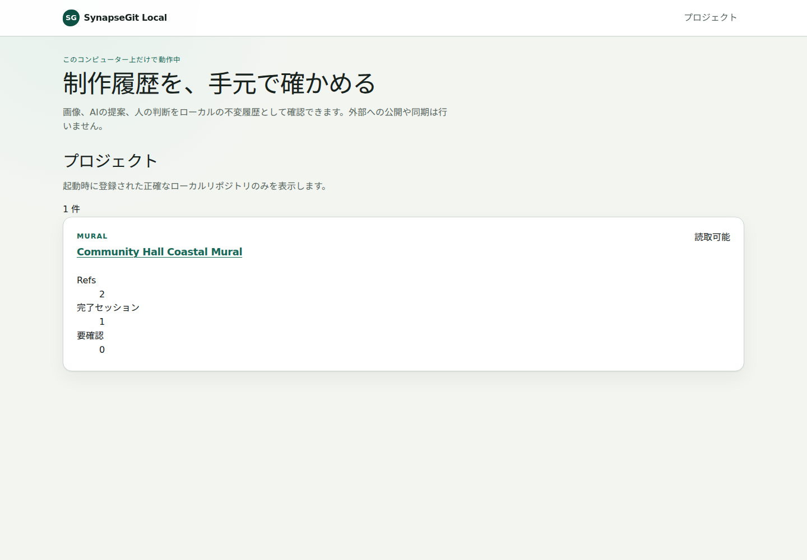
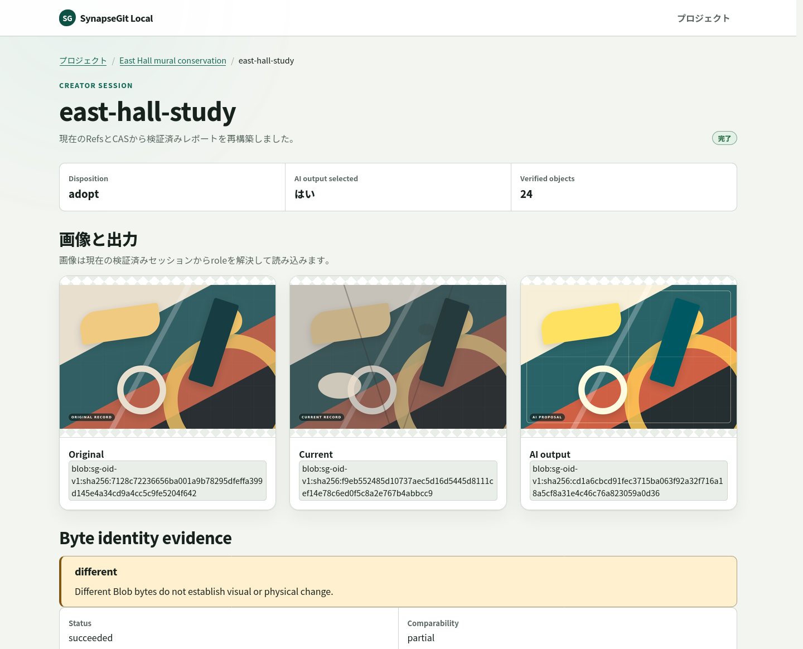

# SynapseGit 15分 壁画チュートリアル

[English](./README.md) | [READMEへ戻る](../../README.ja.md)

このチュートリアルでは、syntheticな壁画保存修復の判断を最初から最後まで記録します。
3つの画像状態を保持し、1つをAI帰属の提案として記録し、人が判断し、localhost画面で
結果を確認し、read-onlyなpresentation bundleを生成します。

model、cloud service、GitHub API、実在作品は使用しません。3画像は、このrepositoryの
tutorial用に生成したsynthetic fixtureです。

## 作成する履歴

| Original reference | Current observation | AI-attributed proposal |
|---|---|---|
|  |  |  |
| 過去の参照状態 | 亀裂、剥落、変色が見える状態 | 控えめなdigital処置案 |

SynapseGitは、これらをopaqueなbytesとして保存します。上記の説明はtutorialの文脈として
人が書いたもので、現在のbyte-identity adapterが画像から解釈した内容ではありません。

## 準備

[Installation guide](../install.md)に従って、`synapse`、`synapse-local`、
`synapse-present`をinstallします。

```bash
synapse --version
synapse-local --version
synapse-present --version
```

新しいrepository pathを選び、そのpathを所有している`synapse-local`がないことを確認します。

```bash
export SYNAPSE_TUTORIAL_REPO="$HOME/SynapseGit/mural-tutorial"
test ! -e "$SYNAPSE_TUTORIAL_REPO"
```

すでに存在する場合は別のpathを選んでください。このtutorialは既存repositoryを削除・置換
しません。

## 1. 提案とHuman Decisionを記録する

sample pathを解決できるよう、cloneしたSynapseGit repository rootで実行します。

```bash
synapse creator-run "$SYNAPSE_TUTORIAL_REPO" mural-treatment-01 \
  docs/tutorial/assets/mural-original.png \
  docs/tutorial/assets/mural-current.png \
  docs/tutorial/assets/mural-ai-proposal.png \
  --subject "Community Hall Coastal Mural" \
  --creator "Tutorial Conservator" \
  --decision adopt \
  --rationale "Adopt the restrained inpainting proposal as the next documented state."
```

出力にはimmutableなBlob IDと、Proposal／Decision Ref headが表示されます。sessionごとに
新しいActorやRecordを作るため、OIDとtimestampはこの文書の例とは異なります。

このcommandが行ったことは次のとおりです。

1. 3つのexact fileをcontent-addressed Blobとして保存
2. originalとcurrentのObservationを記録
3. 3番目のfileをcaller-suppliedなAI帰属Proposalとして記録
4. `adopt`をHuman Decisionとして記録し、proposalを変更せず選択
5. command完了前にrepository integrityを検査

`AI-attributed`は、SynapseGitが画像を生成・認証したという意味ではありません。callerが
供給したoutputへ、限定された帰属を記録しています。

## 2. Decision reportを読む

```bash
synapse creator-report "$SYNAPSE_TUTORIAL_REPO" mural-treatment-01
```

次のfieldを確認します。

```text
disposition=adopt
selected=true
ai_output_source=caller_supplied
comparison_comparability=partial
byte_identity=different
comparison_warning="Different Blob bytes do not establish visual or physical change."
fsck=clean
```

この組み合わせは意図したものです。SynapseGitは、どのbytesを保存し、どれを選択したかを
検証できます。一方、亀裂が実在すること、処置案が妥当であること、modelが提案を生成した
こと、誰かが権利を所有することは推論しません。

## 3. 実際のlocalhost UIで確認する

```bash
synapse-local \
  --project "mural=$SYNAPSE_TUTORIAL_REPO" \
  --label "mural=Community Hall Coastal Mural"
```

terminalに表示されたexactな`http://127.0.0.1:...` originを開きます。reverse proxyで
外部公開しないでください。



_tutorial fixtureを読み込んだ実際の`synapse-local`画面です。2 Refs、完了session 1件、
review待ち0件を表示しています。_

projectと完了sessionを開き、次を確認します。

- Original、Current、AI outputの3画像
- Human `adopt` Decisionとrationale
- Proposal／Decision Ref
- comparison limitationとreplay readiness
- 4 eventのtimeline

同じ実装UIによる詳しい完了session画面も参照できます。



同じrepositoryへCLIを使う前に、terminalでCtrl-Cを押して停止します。

## 4. local presentationをexport・verifyする

人とmachineが読めるbundleを生成します。

```bash
synapse-present export "$SYNAPSE_TUTORIAL_REPO" \
  "$HOME/SynapseGit/mural-tutorial-public" \
  --session mural-treatment-01 \
  --presentation docs/tutorial/presentation.toml \
  --github
```

previewとverifyを行います。

```bash
synapse-present preview "$HOME/SynapseGit/mural-tutorial-public"
```

`preview`はfixed inventory、checksum、schema、canonical projection、manifest link、
target copyを検証します。bundleにはcanonical JSON、Markdown、JavaScriptなしHTML、
manifest、checksum、local target layoutが含まれます。どちらのcommandもGitHubへ
接続・publishしません。共有前に生成されたexact bytesを確認してください。

## 5. 別のHuman Decisionを試す

新しいrepository pathを選び、step 1のdecisionを変更します。

- `--decision reject`: proposalを退け、base stateを維持
- `--decision defer`: 選択を延期し、base stateを維持

sessionはcreate-onlyです。同じrepository内で`mural-treatment-01`を再利用しないでください。

## このtutorialが示すもの

| 示すもの | 示さないもの |
|---|---|
| 入力fileのexact byte identity | pixel registrationやvisual similarity |
| AI帰属ProposalとHuman Decisionの分離 | verified model execution |
| immutable objectとmutable Ref head | 作者性、真実、権利、許可 |
| `adopt`／`reject`／`defer`による人の選択 | 現実の保存修復作業 |
| local report、UI、integrity check、presentation | hosted collaborationやremote publish |

## Troubleshooting

- **`synapse: command not found`** — [Installation guide](../install.md)でPATHを確認します。
- **repository／sessionがすでに存在する** — 新しいrepository pathまたはsession slugを
  選びます。Pilotは既存のcreative historyを上書きしません。
- **browserへ接続できない** — terminal processを動かしたまま、表示されたexact loopback
  URLを開きます。
- **restart後にsessionがincompleteになる** — tagged v0.6.0 binaryのpending Human review
  authorityはsame-processです。UIから診断し、表示identifierからauthorityを再構築しないでください。
- **見た目が違うのに`byte_identity=different`しか表示されない** — 現在の保守的な
  boundaryどおりです。

詳細は[CLI reference](../cli_reference.md)、[Usage guide](../usage_guide.md)、
[Security model](../security_model.md)へ進んでください。
