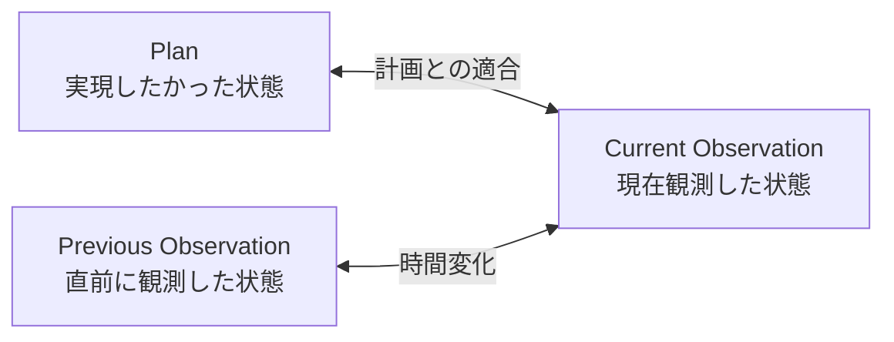

# SynapseGit Core 使用ガイド

Status: **Core v0.1 / Stage 0 draft**

このガイドは、SynapseGit Coreの想定利用者、Pilotでの使い方、現在このリポジトリで実行できる範囲をまとめる。現時点では完成済みの制作アプリやcapture clientを提供していない。利用フローの図は構想とPilot仮説を含む。

対象はSynapseGit Coreのみであり、Chrono-Engine、歴史的人物の思考再現、自動利益分配はこのガイドとCore v0.1の対象外である。

## 関連資料

- [Documentation index](./README.md)
- [5分Quickstart](./quickstart.md)
- [想定利用者別シナリオ（PPTX・日本語）](./presentations/synapsegit_user_scenarios_ja.pptx)
- [PPTXの利用・再生成手順](./presentations/README.md)
- [Core構想](./core_concept.md)
- [Coreデータモデル](./core_model.md)
- [Core Protocol v0.1](../spec/core/v0.1/README.md)

## 想定利用者と最初に返す価値

| 利用者 | 最初の利用場面 | その場で返すもの |
|---|---|---|
| 画家・壁画家 | 制作session前後を同じ視点から記録する | 前後比較、差分候補、制作process pack |
| 建築家 | Plan、直前現況、現在現況を照合する | 設計変更理由、採用・是正・保留の判断card |
| 施工・修復担当 | Hold Pointや不可逆な処置の前後を残す | 進捗・処置報告、EvidenceGap、引き渡し資料 |
| デザイナー | 複数tool・参考資料・AI案の採否をつなぐ | Proposalの比較、却下理由、可搬なContextPack |
| 制作チーム・後任 | DecisionまたはReleaseから重要変更を辿る | 根拠、制約、未解決事項、未採用案への到達 |

Coreは既存の制作ソフト、BIM/CAD、ペイントツールを置き換えない。それらを横断して、物理対象、成果物、観測、判断を接続する。

## Pilotでの基本的な使い方

### 1. 一つの対象を選ぶ

最初から建物全体や制作活動全体を対象にしない。キャンバス、壁画、小規模な壁面、内装の一区画など、時間を通して追跡する一つの`Subject`を選ぶ。

### 2. 記録する節目を決める

常時監視ではなく、次のような意味のある節目を選ぶ。

- 制作sessionの開始・終了
- 案の承認、設計変更、検査
- 解体、被覆、防水、封止、ワニス等のHold Point
- 修復処置の前後
- 公開、引き渡し、基準版の固定

緊急対応や記録不能な範囲は、作業を止める理由にせず、後追い記録と`EvidenceGap`を許す。

### 3. Capture Profileを選ぶ

| Profile | 最低限残す条件 | 利用できる比較 |
|---|---|---|
| `Imported` | 画像と取得経路 | 参考記録、限定的な外観比較 |
| `Repeatable` | station、viewpoint、許容位置誤差 | 同一視点系列の候補差分 |
| `Calibrated` | marker、scale、色・照明等の校正 | 定義された精度内の寸法・色比較 |

精密な主張が不要な通常Captureへ、校正作業を一律に要求しない。一方、条件が不足するObservationから精密な色・寸法変化を確定表示しない。

### 4. 撮る・取り込む

通常Captureでは長文を要求せず、画像、対象、時刻、状態chip、任意の一言または音声を基本にする。Pilot UX目標は能動入力中央値20秒以内であり、現時点の実績値ではない。

### 5. 三者を比較する



画像差分は`Analysis`であり、物理変化の確定事実ではない。registration失敗、遮蔽、blur、露出不良、欠測を「変化なし」へ置き換えない。

### 6. 人が意味を確定する

差分候補を、実変化、照明、影、遮蔽物、濡れ・乾燥、不明などへ分類する。採用理由、未解決事項、次に守る制約を必要最小限だけ確認し、Decision Commitとして節目を残す。Pilot UX目標は通常Commitの能動入力中央値30秒以内である。

### 7. 報告・引き継ぎ・archiveへ返す

選択した履歴から、進捗、制作process、処置記録、As-recorded、引き継ぎ資料を構成する。現在のlocal Coreはchecksum付きdirectory archiveをexportし、空repository、または同じarchiveの失敗restoreが残したexact object subsetへrestoreできる。画像・報告UIを含むPilot体験は未実装である。

## Creative AIを使う場合

```mermaid
flowchart LR
    Q["credential + project + opaque handle"] --> B["Application preflight<br/>one-shot permit"]
    C[ContextPack + Policy + DelegationGrant] --> B
    B --> A["trusted Executor<br/>AI run"]
    A --> Z["reauth + FIFO fence<br/>live ACL/profile"]
    Z --> P["Core full revalidation<br/>proposal/*"]
    P --> H["AiPublicationReceipt<br/>admitted proposal handle"]
    H --> HC["Human profile + server-fixed candidate<br/>registration"]
    HC --> HP["human credential + exact project<br/>one-shot application permit"]
    HP --> G["HumanDecisionRuntime<br/>full validation / CAS"]
    G -->|adopt unchanged| D["decision/*"]
    G -->|reject / defer / experiment| F[DecisionFeedback]
    P -. unimplemented release gate .-> R["release/*"]
    F --> N[Next ContextPack]

    A -. protocol forbids .-> D
    A -. protocol forbids .-> R
```



> **実装境界:** `synapse-application`は、injected Authenticator、exact project map／process ACL、
> candidate-independent Core preflight、exclusive-TTL one-shot permit、single trusted Executor、実行後
> reauthentication／FIFO fenceを持つlocal AI routeを実装する。`synapse-core::CreativeAiRuntime`は
> preflightと生成済みAI proposalのfull publication時に
> Actor × Grant × Policy × runtime capability、object／project binding、proposal-only、
> exact capability照合、snapshot/output binding、decision/release拒否、transaction-time expiry／
> atomic `stale_base`照合を実装する。同じapplicationのnarrow Human routeはAI成功時の
> same-instance admitted proposal handle、reusable Human profile、server-fixed candidate、one-shot
> registration／permitを束縛して`HumanDecisionRuntime`のfull `decision/*` admissionへ接続する。
> HTTP／JWT、durable／distributed ACL・permit、release／modified／quorum approval、OS sandbox／egress、
> Grant revocation、Projection application routeは未実装で、現在のlocal CLIはどのrouteも公開しない。

- AI requestはcredential、project selector、opaque execution handle／permitだけを送る。applicationは認証後に
  exact server mapとACLでprojectを選び、reusable profileとone-time registrationからauthority／targetを構築する。
  malformed／unknown／forbidden projectは同じpublic semantic resultで、requestからactor、OID、Ref、capability、
  repository path、Clock、Executorを選べない。
- Core preflightはcandidateなしでauthorityとlive base／target expectationをread-checkするが、Refを予約しない。
  permitはExecutor前にburnされる。Executor完了後は再認証してからFIFO fenceへ入り、live ACL／profileを再確認し、
  Coreがauthority／candidate／output／Grant／base／target CASをすべて再検証する。
- AI成功時の`AiPublicationReceipt`はCore decisionと、application instance／project／proposal Ref/headへ
  束縛されたnon-Clone `AdmittedProposalHandle`を返す。Human control planeはこのhandleをborrowして
  reusable profileとserver-fixed Decision Commit／Feedback／messageをone-time registrationへ束縛する。
  denial後は同じhandleで修正版を再登録できるが、registrationとpermitは再利用できない。
- Human requestはcredential、exact project selector、opaque registration／permitだけを渡す。prepareは
  live ACL／profileを検査してapplication TTLだけのpermitを発行し、publishは認証後にburnしてから
  同じFIFO fence内で再検査し、Core full validation／proposal precondition／decision CASまで保持する。
  Human routeに追加ExecutorやCore preflight、publish中のreauthはない。Authenticator callbackはfence／state／
  Repository lockの外で動くpoint-in-time decisionである。fenceはprocess-local ACL／profile mutationを
  線形化するが、外部credential storeの即時revocation fencingは保証しない。permit TTLがwindowをboundedにし、
  production adapter／lease semanticsはdeployment責任である。
- AI routeはGrantの期限、data class、resource、writable Ref prefix、output上限と、
  Activity／ContextPack／Policy／Commit cross-linkを検査する。
- candidateはcheckpointかつContextPack baseだけをparentに持つ。base snapshotの全non-Tree objectを
  保持し、current base snapshotとの差分でoutputを束縛する。新規Recordはagent assertedなAnalysisResult／Claimだけを許す。
- Coreはopaque Blobの用途からcapabilityを推論しないため、embedding serviceがmodel／tool実行前に
  exact setを分類・認可する。GrantはSQLite transaction開始直後にも時刻を再検査する。
- AI routeは`proposal/*`だけを作り、`decision/*`と`release/*`を
  `human_gate_required`で拒否する。別のHuman Decision routeはsingle human、Policy、proposal／baseを固定し、
  `adopted_unchanged`、`rejected`、`deferred`、`experiment_only`だけをcanonical `decision/*`へ記録する。
- Human reviewerはAI responsible principal／ContextPack・Grant asserter／Grant direct principalと同一で、
  proposalはexactly one AI Activity、decisionはexactly one DecisionFeedback transitionに限定される。
- Human Decision routeは同じproposalのcanonical再決定を拒否し、Context baseをtrusted decision Ref/headへ
  一致させたうえでproposal Ref preconditionとdecision/base target CASを一transactionで検査する。
  modified／partialとreleaseは未実装である。
- 新しいTreeだけによる既存snapshot objectの再配置は、baseのnon-Tree objectを保持する限りproposalとして許可される。
- 採用、公開、引き渡し、Policy変更、削除、外部送信、物理作用は人の承認を必要とする。
- `generated_by AI`, `selected_by human`, `modified_by human`, `approved_by human`を分離する。
- DecisionFeedbackは既定でproject-localとし、明示opt-inなしに外部model学習へ使用しない。
- AIの採用率だけを成功指標にしない。却下、保留、探索、批評も履歴として価値を持つ。

## 現在このリポジトリで実行できること

実行可能なend-to-end手順は[Quickstart](./quickstart.md)、全commandの契約は[CLI reference](./cli_reference.md)を参照する。基本検証はリポジトリrootで次を実行する。

```bash
node scripts/verify_core_fixtures.mjs
cargo test --workspace --locked
```

現在のRust実装は、strict JSONとOIDだけでなく、具象schema／local semantic validation、filesystem ObjectStore、Commit／Tree／Record closure、Tombstone availability、SQLite Ref CAS／reflog、process-local authenticated AI executionとadmitted-proposal-bound Human Decision application route、両Core admission、fsck、checksum付きdirectory export／restoreまでを実行できる。加えて`SqliteProjectionStore` libraryは、caller-suppliedな一貫したRef snapshotからcurrent reachable closureをatomic rebuildし、Ref-scoped Subject timeline、Observation dependency、typed AnalysisResult lineage、missing closure issue、tombstoned availability／countをqueryできる。Analysis replay readinessはinput／adapter implementation／configuration／transformのavailabilityだけを表し、exact replayを保証しない。production経路はschema検証後にcanonical bytesだけをObjectStoreへ渡す。低水準APIは検証前であることを示すため`*_unchecked`の名前を維持する。

最小CLI経路は次のとおりである。

```bash
cargo run -p synapse-cli -- init .synapse
cargo run -p synapse-cli -- put-blob .synapse path/to/file
cargo run -p synapse-cli -- put-record .synapse path/to/record.json
cargo run -p synapse-cli -- build-tree .synapse path/to/tree.json
cargo run -p synapse-cli -- commit .synapse path/to/commit.json
cargo run -p synapse-cli -- update-ref .synapse proposal/agent/run-1 - <commit-oid>
cargo run -p synapse-cli -- fsck .synapse
cargo run -p synapse-cli -- export .synapse archive-dir
cargo run -p synapse-cli -- restore archive-dir restored.synapse
cargo run -p synapse-cli -- refs restored.synapse
```

Ref作成時の`-`は「現在headが存在しないこと」を表す。更新時は`-`の代わりに現在のCommit OIDを指定する。staleなOIDならRefとreflogを一切変更せず`ref_conflict`を返す。`put-record`、`build-tree`、`commit`はobject familyも検査し、`put-object`は三つのstructured familyを自動dispatchする。

このCLI例の`update-ref`はlocal trusted operator primitiveであり、`synapse-application`／`CreativeAiRuntime`／`HumanDecisionRuntime`の認証・trusted authority・Policy検査を通らない。AIと対応するnarrow Human Decisionを組み込むcallerはprocess-local application routeを使い、低水準CLIをuntrusted callerへ直接渡してはならない。

ProjectionStoreも現在はRust APIだけで、CLI commandや自動refreshはない。query結果は派生cacheであり、
authorization、Ref更新、archive、recovery判断に使わない。fresh resultが必要なcallerは一貫した
Ref snapshotを取得し、明示的にrebuildしてからqueryする。rebuild中はObjectStoreをcooperative
append-onlyとして扱い、GC／removalを並行させない。serviceはfailed rebuildとfingerprint／freshnessを
監視するが、projectionの古さを認可判断に使わない。
`RefScope`はACLではなくquery filterである。serviceはauthoritative access checkをqueryより先に行い、
Analysisのnot-indexed／not-reachable error差を認可済みcallerだけへ返す。

exportはdirectory archiveを新規作成し、object bytes、Ref snapshot、完全なreflog、各object checksum、manifest checksumを含める。公開前にcurrent Refとreflogの全 distinct `new_head` のclosureを検証する。restoreはRef／reflogが空で、CASが空または同じarchive OID集合のexact subsetであるrepositoryを受け付ける。pathnameを信用せず全OIDを再計算し、closureを再検証してからRefを復元する。formatは[Local directory archive profile](../spec/core/v0.1/archive-profile.md)を参照する。

## まだ実行できないこと

- 実際のcapture client、画像registration、compare UI
- concrete HTTP／JWT／MFA、credential database、durable／distributed ACL・permit、multi-process fence
- Projection authenticated application route
- multi-project CAS membership／classification resolver
- organization／quorum／MFA、release approval、modified／partial adoption workflow
- AI ExecutorのOS sandbox／connector／egress制御、Grant revocation
- ProjectionStore CLI／自動refresh、SurrealDB adapter、SQLiteとの全8-query／性能比較

これらは[Stage 0 execution plan](./stage0_execution_plan.md)の残りのexit gateに従って実装する。

## 表示・評価でしないこと

- 「作者を証明」「現実を完全記録」「契約適合を自動証明」と表示しない。
- 差分量、Capture数、Commit数、夜間活動から創造性、努力、勤務時間、生産性を評価しない。
- hidden screen recording、keystroke、常時音声・映像、顔識別を利用しない。
- 「改ざん不能」「永久保存」と販売しない。hashで確認できるのは、含まれる記録のbyte同一性である。
- 写真中心の記録を無条件に`As-built`と呼ばず、`As-recorded`または確認範囲付きの表現を使う。

## リンク運用

repository内のMarkdownはfork、review branch、offline checkoutでも辿れる相対linkを使う。生成済みPPTX内の配布導線は現在GitHubの`main` URLを使用する。release資料として固定配布する場合は、`main`よりrelease tagまたはcommit permalinkへ更新する。

リポジトリはprivateであるため、反映後もリンクの閲覧にはGitHub上のリポジトリ権限が必要である。権限を持たない外部利用者へは、PPTXまたはPDFを別の許可済み経路で配布する。
