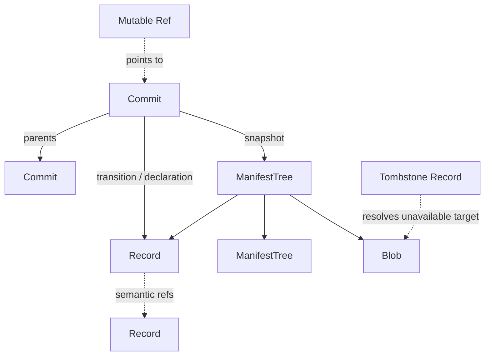
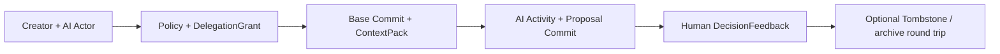

# SynapseGit Core Protocol v0.1

Status: Stage 0 draft

This directory turns the architectural decisions in
[`docs/core_concept.md`](../../../docs/core_concept.md) into testable protocol
artifacts.

The four-week implementation and pilot gate is tracked in
[`docs/stage0_execution_plan.md`](../../../docs/stage0_execution_plan.md); the
runtime/storage decision is in
[`docs/runtime_architecture.md`](../../../docs/runtime_architecture.md).

Normative Stage 0 draft artifacts are:

- [`oid-profile.md`](./oid-profile.md) for accepted structured input and identity;
- [`operations.md`](./operations.md) for ingestion stages, graph, Ref, deletion,
  Creative AI, Human Decision, and rebuildable projection semantics;
- [`archive-profile.md`](./archive-profile.md) for the current local directory
  interchange format;
- [`schemas/`](./schemas/) for concrete object shape and schema annotations.

Fixtures are conformance examples and test vectors. They do not add a rule that
is absent from the prose profile or schemas. `README.md` and files under
`docs/` are informative unless they explicitly say otherwise.

## Scope

The v0.1 draft defines:

- deterministic content IDs for structured Core objects;
- an immutable `RecordEnvelope` without a self-referential OID field;
- typed records for actors, subjects, activities, observations, claims,
  capture profiles, analysis results, Creative AI context and delegation,
  policy, detached assurance, evidence gaps, and tombstones;
- content-addressed manifest trees and commits;
- initial synchronous, process-local authenticated Creative AI and narrow Human
  Decision application profiles with exact project routing, one-shot permits,
  admitted-proposal binding, and Core admission separation;
- a non-authoritative, rebuildable query-projection boundary;
- golden fixtures proving canonicalization and OID stability.

It does not yet define:

- HTTP transport, JWT or another concrete credential profile, or durable and
  distributed authorization state;
- repository federation or cross-repository merge;
- a production JSON Schema registry;
- media adapter execution;
- a SurrealDB projection adapter or completed eight-query backend comparison;
- C2PA, W3C PROV, ODRL, BagIt, or OCFL export profiles.

## Object families

| Object | OID prefix | Canonical content |
|---|---|---|
| Raw blob | `blob:sg-oid-v1:sha256:` | Original bytes, unchanged |
| Immutable record | `record:sg-oid-v1:sha256:` | Synapse Canonical JSON |
| Manifest tree | `tree:sg-oid-v1:sha256:` | Synapse Canonical JSON |
| Commit | `commit:sg-oid-v1:sha256:` | Synapse Canonical JSON |

The OID is transport metadata. It is never embedded in the bytes from which
that same OID is calculated. APIs return objects as `{ "oid": ..., "body":
... }`.



## Schemas

- `schemas/common.schema.json`
- `schemas/record-envelope.schema.json`
- `schemas/record.schema.json` — required concrete-record dispatcher
- `schemas/actor.schema.json`
- `schemas/subject.schema.json`
- `schemas/activity.schema.json`
- `schemas/observation.schema.json`
- `schemas/claim.schema.json`
- `schemas/claim-reaction.schema.json`
- `schemas/capture-profile.schema.json`
- `schemas/analysis-result.schema.json`
- `schemas/context-pack.schema.json`
- `schemas/delegation-grant.schema.json`
- `schemas/decision-feedback.schema.json`
- `schemas/policy.schema.json`
- `schemas/assurance.schema.json`
- `schemas/evidence-gap.schema.json`
- `schemas/tombstone.schema.json`
- `schemas/manifest-tree.schema.json`
- `schemas/commit.schema.json`

## Verification

From the repository root:

```bash
node scripts/verify_core_fixtures.mjs
cargo test --workspace --locked
```

The verifier checks that all schema and fixture files are valid JSON, that only
property order, insignificant whitespace, and equivalent JSON string escapes
collapse to the same canonical bytes, and that SHA-256 OIDs match committed
golden values. Free-text NFC and NFD spellings intentionally remain distinct;
non-NFC path keys are rejected.

The fixture graph is a minimal creator/Creative AI flow:



The Rust validator embeds this schema registry for offline Draft 2020-12
validation and adds valid fixtures for the eight record families not represented
in the golden graph. Repository tests exercise filesystem publication, typed
Record closure, Tombstone availability, Ref CAS and generic preconditions,
Creative AI preflight/proposal admission, the initial authenticated one-shot AI
application route, Human Decision admission, disposable SQLite
projection rebuild/query behavior, fsck, and archive restore.

It also covers duplicate keys, invalid UTF-8, BOM, number-token restrictions,
UTF-16 key ordering, set ordering, exact timestamps, normalized fixed-point
values, typed Manifest entries, first-parent direction, OID mismatch, and
`present/tombstoned/missing` closure. The verifier has no package dependency
beyond a current Node.js runtime. `--print-golden` prints candidate values for
review but never changes the committed fixture.

This is a draft profile. Implementations may experiment against it, but OID
values are not declared permanently frozen until the Stage 0 inter-language
test has at least two independent implementations.

## Implementation conformance status

| Area | Current evidence | Status |
|---|---|---|
| Canonical JSON and golden OIDs | independent Rust and JavaScript code paths | implemented for committed fixtures |
| Concrete schema and local semantics | Rust offline registry; Node fixture verifier | implemented for current 20 schemas / 17 structured golden fixtures |
| Filesystem ObjectStore and typed closure | Rust repository tests | implemented local profile |
| SQLite Ref CAS, generic preconditions, and reflog | transaction and concurrent race tests | implemented local profile |
| Directory archive | Rust round trip and failed-restore resume tests | implemented; only one production implementation |
| Creative AI proposal admission / exact capability and snapshot-output binding / proposal-only | `CreativeAiRuntime` integration tests | implemented library boundary; checkpoint/single-base-parent, base non-Tree preservation, and restricted new outputs enforced |
| Candidate-independent AI preflight / consuming publication | `CreativeAiRuntime` preflight and drift/race tests | implemented; sealed non-Clone decision, read-only base/target checks, fresh authority/time and full candidate revalidation at publication |
| Initial authenticated AI application route | `synapse-application` integration tests | process-local library boundary: injected Authenticator/Clock/single Executor, exact project map/ACL, one-shot permit, post-execution reauthorization, FIFO publication/ACL fence |
| Initial authenticated narrow Human application route | `synapse-application` integration tests | successful AI receipt yields a same-instance admitted-proposal handle; reusable Human profile + server-fixed candidate registration, one-shot permit, live ACL/profile/TTL fence, full `HumanDecisionRuntime` validation/CAS |
| Grant transaction-time validity / `stale_base` live Ref comparison | trusted-clock guard, SQLite precondition, and race tests | implemented atomically in `CreativeAiRuntime`; low-level CLI route does not evaluate ContextPack |
| Narrow Human Decision admission | `HumanDecisionRuntime` integration and race tests | implemented library boundary for one trusted direct human and `decision/*`; supported dispositions only, proposal precondition and trusted decision/base target CAS are atomic |
| Rebuildable query projection | 3 unit + 19 integration `SqliteProjectionStore` tests | SQLite schema v2 baseline implemented for current reachability, bounded shared Tombstone resolution, closure diagnostics, Subject timeline, Observation dependencies, and typed AnalysisResult lineage; non-authoritative and explicit-refresh only |
| SurrealDB / complete projection comparison | none | adapter, complete eight-query parity, and benchmark decision pending |
| Second independent production implementation | none | freeze gate pending |

The initial application profile authenticates before project lookup, resolves
only an exact server-owned project map, and keeps the untrusted request plane to
credential, project selector, and opaque registration handle or permit. A
reusable authority profile and one-time execution registration construct
`AiExecutionAuthority` and `AiPublicationTarget`; the application calls Core
preflight before a trusted Executor, burns its process-local permit before
execution, then re-authenticates and holds a project FIFO publication/ACL fence
while it rechecks live ACL/profile state and invokes consuming Core publication.
The request methods are `prepare_ai` and `execute_and_publish_ai`; project/ACL,
profile, and execution registration are trusted control-plane methods.
A successful AI request returns `AiPublicationReceipt` and its opaque
`AdmittedProposalHandle`. The trusted Human control plane borrows that
same-instance evidence with a reusable `HumanAuthorityProfileConfig` and
server-fixed `HumanDecisionCandidate`; it may register a corrected candidate
after a denied attempt, while registration and permit state remains one-shot.
Requests then use only `prepare_human_decision` and
`publish_human_decision` opaque registration/permit state; no Human executor or
extra Core preflight exists before full `HumanDecisionRuntime` publication.
Human publish authenticates once at its start and does not reauthenticate.
Every Authenticator callback runs outside the FIFO fence and application/
Repository locks, so its result is a point-in-time session decision. The fence
linearizes process-local ACL/profile changes, not instantaneous external
credential-store revocation while queued; permit TTL bounds the window and
production adapter/lease semantics remain deployment responsibility.
A separate trusted
`HumanDecisionAuthority` fixes the direct human, project, Policy, canonical
decision Ref and exact current head, and exact proposal Ref/head for
`HumanDecisionRuntime::publish_decision`; its untrusted update supplies only a
new Decision Commit, DecisionFeedback OID, and message.
The application does not define HTTP/JWT or another concrete authentication
mechanism, durable/distributed ACL and permit storage, a multi-process fence,
Projection routes, multi-project CAS membership/classification,
OS sandbox/connector/egress enforcement, Grant revocation,
organization/quorum approval, modified or partial adoption, or release approval.
The current CLI exposes only the low-level trusted-operator `update-ref` primitive:
it validates Ref-name syntax and closure but does not authenticate an Actor or
enforce Creative AI policy. See the
[security and trust model](../../../docs/security_model.md).

The projection baseline consumes one caller-supplied consistent Ref snapshot
and a verified filesystem ObjectStore, atomically replaces disposable SQLite
rows, and excludes orphan objects. It is not an authorization source, RefStore,
archive input, or recovery prerequisite. See
[`operations.md` §9](./operations.md#9-rebuildable-query-projection).

## Related implementation guides

- [Runnable Quickstart](../../../docs/quickstart.md)
- [Core data model](../../../docs/core_model.md)
- [CLI reference](../../../docs/cli_reference.md)
- [Runtime architecture](../../../docs/runtime_architecture.md)
