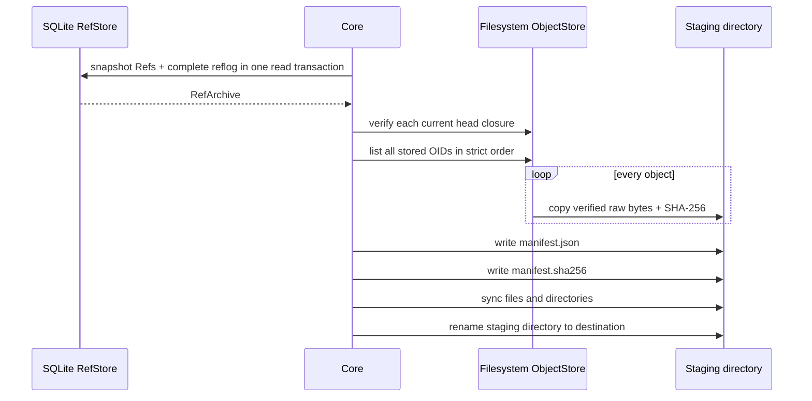
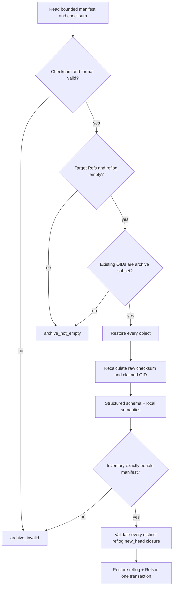

# SynapseGit Core local directory archive profile v0.1

Status: **Stage 0 normative draft for the current Rust local archive implementation**<br>
Format identifier: `synapsegit-core-archive-v0.1`

この profile は `synapse-core` が現在 export / restore する directory layout と validation rule を定義する。
service 間 transport、圧縮 package、署名 package、長期保存標準への mapping は対象外である。
protocol freeze 前の draft であり、互換実装は format identifier と repository release を記録すること。

## Goals and non-goals

Goals:

- immutable object bytes、Refs、complete reflog を一つの directory へ持ち出す。
- object checksum、manifest checksum、OID、schema、closure を offline で再検証する。
- object phase に失敗しても Ref を公開せず、同じ archive から安全に再開できる。
- database-internal identifier や filesystem ObjectStore layout に依存しない。

Non-goals:

- confidentiality、compression、sender authentication、digital signature
- partial clone、reachable-only export、cross-repository merge
- remote copy の erasure
- archive directory 自体の content-addressed identity

## Directory layout

```text
<archive>/
├── manifest.json
├── manifest.sha256
└── objects/
    ├── 00000000
    ├── 00000001
    └── ...
```

- object file は manifest の `objects` index と一致する `objects/<8桁以上の10進index>` である。
  現 writer は最低8桁へ zero-pad する。
- manifest validator は各 index に対して exact `format!("objects/{index:08}")` を要求する。
- manifest、checksum、object は regular file でなければならず、symlink は拒否する。
- verifier が参照しない追加 file の意味は未定義であり、互換性や security の根拠にしてはならない。

## Export ordering



object は current Ref から reachable なものだけでなく、ObjectStore にある全 object を export する。
Refs を object enumeration より先に snapshot するため、協調的な append-only ObjectStore では、
並行 Ref advance が archived head の必要 object を欠落させない。

destination は export 開始時に存在してはならない。final rename は portable no-replace primitive ではないため、
外部 process が同名 destination を同時作成しない運用を前提とする。

## Manifest data model

`manifest.json` は UTF-8 JSON object で、top-level field は次の四つだけである。unknown field は拒否する。

```json
{
  "format": "synapsegit-core-archive-v0.1",
  "objects": [
    {
      "oid": "record:sg-oid-v1:sha256:<64-lowercase-hex>",
      "path": "objects/00000000",
      "byte_length": 1234,
      "sha256": "<SHA-256 of the exact archived bytes>"
    }
  ],
  "refs": [
    {
      "name": "proposal/agent/demo",
      "head": "commit:sg-oid-v1:sha256:<64-lowercase-hex>",
      "updated_event_id": 1
    }
  ],
  "reflog": [
    {
      "id": 1,
      "ref_name": "proposal/agent/demo",
      "old_head": null,
      "new_head": "commit:sg-oid-v1:sha256:<64-lowercase-hex>",
      "occurred_at_unix_nanos": 1783750000000000000,
      "actor": "actor:demo",
      "message": "first proposal"
    }
  ]
}
```

current writer は pretty JSON を生成する。whitespace や object member order は archive identity ではないため、
reader は `manifest.sha256` が exact byte と一致する限り、data model を満たす他の valid JSON encoding も受理する。

### `objects` invariants

- `oid` は strict Core v0.1 OID。
- row は `oid` の bytewise strict ascending order。duplicate OID は禁止。
- `path` は array index から決まる exact sequential path。duplicate path は禁止。
- `byte_length` は archived file の exact byte length。
- `sha256` は file raw bytes の64文字 lowercase SHA-256。
- Blob では OID の digest 部分と `sha256` が一致する。
- structured object では `sha256` は raw canonical JSON checksum。domain-separated OID digest とは通常異なる。

### `refs` invariants

- `name` は Core Ref lexical profile を満たす。
- `head` は Commit OID。
- `updated_event_id` は正の signed 64-bit integer。
- Ref name は一意。
- Ref set は complete reflog が表す final Ref set と exact match する。
- `head` と `updated_event_id` は該当 reflog chain の最後の event と一致する。

current writer は Ref name 順に出力する。reader は validation 前に name 順へ sort するため、
manifest 上の `refs` array order 自体に意味はない。

### `reflog` invariants

- `id` は一意な正の signed 64-bit integer。
- `ref_name` は Core Ref lexical profile を満たす。
- `old_head` は null または Commit OID。
- `new_head` は Commit OID。
- `occurred_at_unix_nanos` は signed 64-bit Unix nanoseconds metadata。
- `actor` は null または最大1,024 UTF-8 bytes。
- `message` は null または最大16,384 UTF-8 bytes。
- Ref ごとの最初の event は `old_head = null`。
- 後続 event の `old_head` は、その Ref の直前 event の `new_head` と exact match する。

current writer は global event ID 順に出力する。reader は validation 前に ID 順へ sort する。

## Checksums

`manifest.sha256` は exact 65 bytes:

```text
<64 lowercase hexadecimal SHA-256 of exact manifest.json bytes>\n
```

uppercase、space、filename suffix、CRLF、trailing extra line は拒否する。
この checksum は accidental / local tampering detection であり、signature や sender authentication ではない。

## Restore algorithm



1. `manifest.json` を最大64 MiB、`manifest.sha256` を最大256 bytesで読む。
2. regular file identity、checksum、JSON、unknown fields、format、object rows を検査する。
3. target Ref / reflog が空であることを確認する。
4. 既存 ObjectStore の OID が manifest OID set の subset であることを確認する。
5. Blob は bounded streaming で claimed OID を再計算する。
6. structured object は raw checksum、concrete schema、local semantics、claimed OID、canonical exactness を検査する。
7. target inventory が manifest OID sequence と exact match することを確認する。
8. reflog の全 distinct `new_head` について typed closure を検査する。
9. complete reflog と current Refs を一つの SQLite transaction で復元する。

object phase は複数 object 全体の transaction ではない。途中失敗時には manifest subset が残り得るが、
Ref は0件のままである。同じ archive を修復して再実行できる。
unrelated object、既存 Ref、既存 reflog があれば再開として受理しない。

## Error mapping

| condition | code |
|---|---|
| existing destination、checksum / manifest / object / Ref archive invalid | `archive_invalid` |
| restore repository に unrelated object、Ref、reflog がある | `archive_not_empty` |
| structured object claimed OID mismatch | `oid_mismatch` |
| schema / local semantic rejection | 対応する stable Core code |
| closure missing | `closure_missing` |
| closure target type mismatch | `reference_type_mismatch` |
| resource limit | `resource_limit` |
| filesystem / SQLite failure | `storage_error` |

## Security and portability notes

- archive は restricted Blob、Record、reflog metadata を平文で複製する。
- checksum は confidentiality と authenticity を提供しない。
- restore は archive directory を信用できない input として扱う。
- current Unix implementation は open 前後の device / inode identity を照合する。
- non-Unix の directory sync は現在 no-op。
- ObjectStore と export は immutable / append-only な協調的 writer を前提とする。
- archive schema file、signature profile、standard package mapping は今後の conformance work である。

運用上の境界と既知制限は
[Security model](../../../docs/security_model.md) を参照する。
