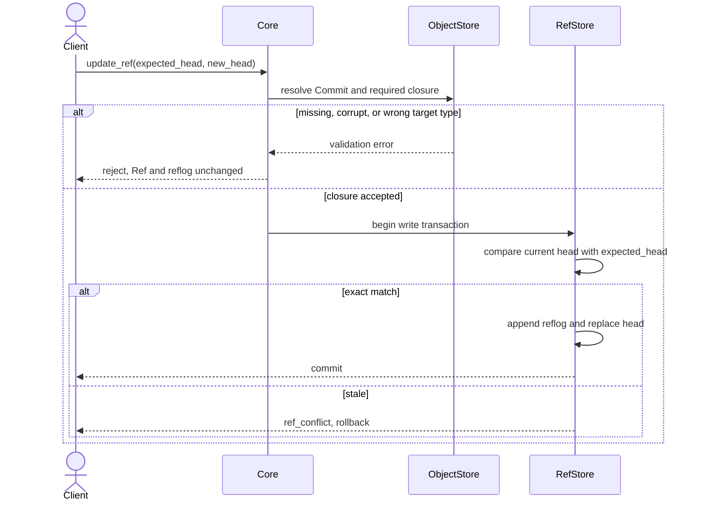

# Synapse Core operations and semantic validation v0.1

Status: Stage 0 draft

Protocol index: [SynapseGit Core Protocol v0.1](./README.md)

This document defines the behavior that JSON Schema alone cannot enforce.
Unless a section explicitly identifies a local implementation profile, the
rules apply independently of the database, transport, or programming language.

## 1. Object ingestion

### 1.1 Structured object

`put_object(claimed_oid, input_bytes)` is atomic and performs these steps in
order:

1. Strictly decode and parse the bytes using `oid-profile.md`.
2. Select the concrete schema from `object_type`; for a record, dispatch again
   by `record_type` through `schemas/record.schema.json`.
3. Apply local semantic checks that can be decided from this object alone.
4. Produce canonical bytes and calculate the domain-separated OID.
5. Reject an OID prefix/body mismatch or a digest mismatch.
6. Store the canonical bytes under the calculated OID with create-if-absent
   semantics. Existing bytes at that OID must be identical.

The API wrapper `{ "oid": ..., "body": ... }`, ACL, availability, receive time,
and database primary key are not hash input.

Object upload order is unrestricted. Checks that require resolving another OID
are repository graph checks and run before a Ref can publish the graph, not
before an otherwise valid individual object can be stored. Section 4 identifies
the required target-type checks.

### 1.2 Blob

`put_blob(claimed_oid, bytes)` hashes the original bytes without media
transcoding, metadata injection, Unicode handling, or newline conversion.
Filename, media type, privacy policy, and derived previews are separate records.

## 2. Ref update

A Ref is a mutable pointer, not a Commit property. An update request is transport
metadata:

```json
{
  "ref_name": "decision/main",
  "expected_head": "commit:sg-oid-v1:sha256:...",
  "new_head": "commit:sg-oid-v1:sha256:..."
}
```

`expected_head` is `null` only when creating a Ref. The store must:

1. verify that `new_head` is a valid stored Commit;
2. validate the required reference closure from `new_head`;
3. atomically compare the current head with `expected_head`;
4. if equal, append a reflog entry and replace the head in one transaction;
5. otherwise return `ref_conflict` without changing either Ref or reflog.



Servers do not use last-write-wins, implicit rebase, or automatic merge. A
conflict becomes a new proposal Ref or an explicit merge Commit.

`parents` is a sequence and must never be sorted. `parents[0]` is the mainline
or first parent; later entries are additional merge inputs. A root Commit has no
parents, a non-merge Commit has at most one, and a merge Commit has at least two.

## 3. Closure and deletion

Reference resolution returns exactly one availability state:

- `present`: the object is stored and its OID verifies;
- `tombstoned`: a valid Tombstone targets the unavailable OID;
- `missing`: neither object nor applicable Tombstone is available.

Historical closure remains traversable when a payload is `tombstoned`; a UI
must show that absence rather than substitute an empty object. `missing` fails a
Ref update. A newly produced Analysis or Activity may not present a tombstoned
or missing object as an execution input. It may cite the Tombstone using an
explicit redaction/missing-evidence role.

The Stage 0 local implementation MUST cap the cumulative dynamically sized
reference-role metadata retained by one closure report at 64 MiB. This fixed
hard ceiling includes coexisting copies of dynamic Tree paths, Record JSON
Pointers, and Record constraints. It MUST stop before an allocation would
exceed the ceiling, independently of caller-configured node, edge, and depth
limits. A diagnostic closure report represents this as a
truncated `ResourceLimit { resource: "reference_bytes" }` issue; an operation
that requires a complete closure maps it to the stable `resource_limit` code.

A Tombstone never makes the erased bytes reconstructable and never proves that
every copy was deleted. Derivative purge is an operation over the dependency
graph; `affected_derivative_refs` records what the actor reports having handled.

## 4. Record reference semantics

JSON Schema validates OID syntax, while graph validation resolves the target and
checks its semantic type.

| Source field | Required target |
|---|---|
| `Observation.capture_profile_ref` | `record_type=capture_profile` |
| `Activity.ai_run.context_pack_ref` | `record_type=context_pack` |
| `Activity.ai_run.delegation_grant_ref` | `record_type=delegation_grant` |
| `Claim.ai_run_ref` | `record_type=activity`, `activity_kind=ai_run` |
| `ContextPack.policy_snapshot_ref` | `record_type=policy` |
| `ContextPack.delegation_grant_ref` | `record_type=delegation_grant` |
| `ClaimReaction.claim_ref` | `record_type=claim` |
| `Assurance.target_ref` | the object whose bytes or event are attested |
| `Tombstone.target_ref` | unavailable target OID; self-targeting is invalid |
| `supersedes` | same `entity_id` and `record_type`; no cycle |

The `Claim.ai_run_ref` rule remains valid generally, but a Claim produced by the
current Stage 0 AI Activity MUST omit `payload.ai_run_ref`. Its authoritative
provenance edge is the current Activity's `output_refs` entry pointing to the
Claim. Pointing the Claim back to that same Activity would create a
content-addressed OID cycle; pointing it to an older run would misstate the
current production relation and is also rejected by AI proposal admission.

The validator also rejects a Manifest entry whose `entry_kind` conflicts with
the referenced OID prefix.

## 5. Claim and assurance projections

A Claim is immutable and is `proposed` by its existence. Acknowledgement,
endorsement, dispute, rejection, withdrawal, and moderation are independent
ClaimReaction records. A displayed status is a projection by actor, policy, and
time; reactions never rewrite the Claim. Withdrawal authority and moderation
authority are policy checks, not hash rules.

Integrity and review are likewise not mutable Envelope fields:

- byte integrity is recalculated from the OID;
- signature, server receive time, and external timestamp are detached Assurance
  records that target an existing OID;
- coverage belongs to Observation or Analysis data;
- review of a proposition is a Claim or ClaimReaction.

An Assurance proves only the statement and method it records. It does not by
itself prove truth, authorship, copyright, consent, or the physical capture time.

## 6. Time and fixed-point semantics

In addition to schema validation:

- timestamp dates must exist in the proleptic Gregorian calendar;
- `ValidTime.interval.from` must not be later than `to`;
- temporal precision/uncertainty values must be non-negative and use `ms` or
  `s`;
- an Observation's authoritative event time is `payload.capture_time`; the
  optional Envelope `valid_time` should be omitted for Observation v0.1 to
  avoid two competing values;
- an Activity requires Envelope `valid_time`;
- `DelegationGrant.expires_at` must not precede its `recorded_at`;
- probability confidence uses unit `ratio` and lies from 0 through 1;
- confidence interval bounds use the same unit and lower is not greater than
  upper;
- fixed-point mantissa length is bounded by the schema and its normalized form
  may not contain removable trailing zeroes.

Nine fractional timestamp digits are a lexical interchange rule, not a claim
of nanosecond clock precision. Known resolution or uncertainty belongs in the
typed `precision` value.

## 7. Creative AI execution boundary

An effective AI capability is the intersection of:

1. the Actor's declared capability;
2. the principal's unexpired DelegationGrant;
3. the immutable Policy snapshot in the ContextPack;
4. the runtime's actual sandbox and connector capability.

The most restrictive result wins. Before execution, the embedding service
selects the exact capability set authorized for that run. The Activity's
`requested_capabilities` MUST equal that pre-authorized set; publication then
revalidates every member against Actor, Grant, Policy, and actual runtime
capabilities. Core can derive requirements from typed Record outputs and output
roles, but it cannot infer the semantic meaning or intended use of an opaque
Blob. The embedding service is therefore responsible for classifying such work
and pre-authorizing its capabilities before model or tool execution.

### 7.1 Initial local authenticated application profile

The initial `synapse-application` profile is a synchronous, process-local route
for one Creative AI execution and proposal publication. It is narrower than a
network service. It MUST keep the untrusted request plane limited to a
credential, an exact project selector, and a server-issued opaque execution
handle or permit. A request MUST NOT select a repository path, Actor or
principal identifier, authority OID, ContextPack, capability set, base or
target Ref, clock, executor, or reflog identity.

The application profile MUST:

1. call its injected `Authenticator` before project, execution-handle, permit,
   or Repository lookup;
2. resolve the project selector only through an exact server-owned project map
   and MUST NOT derive a filesystem path by joining caller-controlled text;
3. evaluate a process-lifetime actor-to-project ACL after authentication;
4. return exactly the same public `project_access_denied` code and message for
   malformed, unknown, and forbidden project selectors. This is a semantic
   anti-oracle rule, not a constant-time, traffic-analysis, or storage-side-
   channel guarantee;
5. separate a reusable server-owned `AuthorityProfile` from a one-time
   `ExecutionRegistration`. The profile fixes reusable actor, project,
   principal, human-gated base Ref, immutable authority OIDs, ContextPack,
   exact capabilities, runtime capabilities, target Ref name, and side-effect
   class. The trusted registration seals that profile generation and the
   target Ref's exact current-head expectation for one execution, and may be
   exchanged for at most one permit;
6. under the project's FIFO fence, construct `AiExecutionAuthority` from live
   server state and call `CreativeAiRuntime::preflight_proposal` before starting
   the executor;
7. issue an opaque, non-cloneable, stateful permit bound to the authenticated
   actor and session, exact project and registration, Core preflight decision, and an
   exclusive expiry equal to the earlier of the application TTL deadline and
   the immutable Grant expiry. The permit is usable only while
   `now < not_after`;
8. on execution, authenticate before permit lookup. Credential rejection leaves
   a still-ready permit untouched; after successful authentication claims the
   matching permit registry entry, consume and irreversibly burn it before
   invoking the one trusted, injected `Executor`. Executor failure, clock failure or reversal, expiry,
   ACL/profile suspension, Core rejection, `stale_base`, and `ref_conflict`
   MUST NOT make that permit reusable; and
9. after execution, re-authenticate before entering the project's FIFO
   publication/ACL fence; once admitted to the fence, recheck the live ACL,
   reconstruct authority from the live unsuspended profile, and keep the fence through
   `CreativeAiRuntime::publish_preflighted` and its Core Ref transaction.
   Project ACL and profile mutations MUST use the same fence so a revocation or
   suspension cannot interleave ambiguously with publication.

Every `Authenticator` callback MUST run outside the project FIFO fence and
outside application-state and Repository locks. Its result is a point-in-time
session decision. The fence linearizes only process-local ACL and profile
mutations; it MUST NOT be described as instantaneously fencing an external
credential-store revocation while a request is queued. The permit deadline
bounds this residual window. Production authentication adapters and any
credential lease or revocation semantics remain a deployment responsibility.

`AuthorityProfile` is durable relative to one execution registration, but the
initial implementation stores project routes, ACLs, profiles, registrations,
and permits only for the lifetime of one process. Restart invalidates opaque
handles and permits. A production implementation requires durable authenticated
control-plane storage and an equivalent fair, linearizable fence across all
service processes.

The injected `Executor` is trusted application code and returns only generated
proposal identifiers represented by `AiGeneratedProposal`; its output cannot
replace the profile, target, or preflight authority. This initial route does
not implement HTTP, JWT or another concrete credential format, a Projection
query route, OS/process sandboxing, connector or egress
enforcement, a durable/distributed ACL or permit registry, or Grant revocation.
The narrow Human Decision route is defined separately in §8.1.

The Rust surface names the request operations `prepare_ai(credential, project,
execution_handle)` and `execute_and_publish_ai(credential, permit)`. Project
installation, ACL grant/revoke, authority-profile register/replace/suspend, and
`register_execution` are trusted control-plane operations and MUST NOT be
exposed as fields of either request.

### 7.2 Core preflight and proposal publication

The application selects a project-scoped Repository from its exact map and
constructs trusted execution authority. `AiPublicationTarget` fixes the exact
target Ref expectation and `none` or `project_internal` side-effect class.
`CreativeAiRuntime::preflight_proposal` performs candidate-independent Actor,
principal, ContextPack, Grant, Policy, base-snapshot, project, data/resource,
writable-prefix, exact-capability/runtime, and expiry checks, then reads the
live base and target expectations without changing a Ref or reflog. It returns
a sealed, non-cloneable `AiPreflightDecision`. That Core value is not by itself
an application credential, ACL decision, or execution permit.

After trusted execution, `CreativeAiRuntime::publish_preflighted` consumes the
Core decision with `AiGeneratedProposal`. It binds the current runtime to the
sealed authority/target/effect/capabilities, reconstructs and revalidates the
immutable authority and time constraints, rejects clock movement backwards
from preflight, performs all candidate/Activity/output checks below, and keeps
the transaction-time Grant guard, live base precondition, target CAS, and
reflog append authoritative. Preflight never reserves a Ref or weakens full
publication validation.

Before an AI proposal is published, the runtime verifies that:

- the candidate Commit has `commit_kind=checkpoint`, has exactly one parent and
  that parent is `ContextPack.base_commit`, is authored by the authenticated AI
  Actor, and directly binds the named `ai_run` Activity. Even when replacing an
  existing proposal Ref, the current proposal head is not used as the parent;
  chained proposal history and merge candidates are outside Stage 0;
- the Activity is `proposal_ready`, binds the same agent, responsible principal,
  ContextPack, and DelegationGrant, and has no external or physical side effect;
- the ContextPack and Activity bind the same Grant, while the ContextPack,
  Grant, Policy, agent Actor, responsible-principal Actor, authenticated actor,
  authorized principal, authorized project, and authorized base Ref agree;
- the ContextPack base Commit equals its expected Ref head and its selected
  context is present. The Tree rooted at the current base Commit's `snapshot`
  contains the exact immutable agent Actor, responsible-principal Actor, Grant,
  and Policy OIDs; presence only in a parent/ancestor Commit is insufficient.
  The principal Actor is self-asserted, has kind `human` or `organization`, and
  grants directly to the AI agent in Stage 0;
- both candidate and base closures are complete. Every new non-Tree object in
  the candidate snapshot delta, other than the separately cross-checked
  Activity and fixed ContextPack, is bound by an Activity output and its
  recursive closure. The generated output closure is the closure of explicit
  output roots minus the ContextPack selected-input closure, with explicit
  output roots then added back. Thus an input-only dependency is not charged or
  rechecked as an output Record, while an explicitly declared output root is.
  Except for the documented Tree-only restructure residual, placing a selected
  input that is outside the base snapshot into the candidate snapshot requires
  declaring it as an Activity output. Every Record remaining in or re-added to
  the generated output closure is asserted by the authenticated agent and is
  limited to `AnalysisResult` or `Claim`;
  Tombstone, authority/control Records, and nested Commit outputs are rejected.
  A produced Claim MUST omit `payload.ai_run_ref` and uses the current
  Activity-to-Claim output edge as provenance;
- every non-Tree object in the base snapshot remains reachable from the
  candidate snapshot. Trees may be replaced or rearranged, so this requirement
  does not require the base root or intermediate Tree OIDs to remain. It does
  prevent an AI proposal from omitting current project or authority objects
  while preserving the Stage 0 Tree-only restructure allowance;
- the Grant is active according to the trusted clock—at or after `recorded_at`
  and before `expires_at`—and covers the ContextPack data class, project
  resource, writable Ref prefix, and total output bytes. The byte total is the
  OID-deduplicated sum of each new object in the generated output closure plus
  each new Tree in the candidate snapshot delta; and
- Activity `requested_capabilities` exactly equals the trusted pre-authorized
  set, contains every capability required by typed outputs/roles, and contains
  `propose_branch`. Every requested member is then present in the Actor, Grant,
  runtime, and Policy evaluation.

Policy evaluation maps capability to action and resource as follows:

| Capability | Policy action | Policy resource |
|---|---|---|
| `read_context` | `read` | `project/{project_ref}` |
| `analyze` | `analyze` | `project/{project_ref}` |
| `propose_branch`, `request_review` | `propose` | target Ref name |
| `submit_claim`, `render_preview` | `derive` | `project/{project_ref}` |

A resource selector evaluated by this runtime is either an exact string or a
subtree selector ending in one terminal `/**`. Subtree and writable-prefix
matching occur only at path segment boundaries. A rule for the requested action
that uses any other wildcard form returns `authorization_denied` instead of
falling through. Multiple matching rules use the most restrictive result. A
matching conditional `allow` whose free-text condition cannot be evaluated also
returns `authorization_denied`. If no rule applies, the Policy's explicit
`default_effect` is honored; Stage 0 fixtures and deployment guidance use
`default_effect=deny`.

Core v0.1 allows AI output only under `proposal/*`. An AI may produce Blob
artifacts, AnalysisResults, and Claims under the admission rules above, but it
may not advance `decision/*` or `release/*`, alter policy, export restricted
data, erase content, or cause a physical effect without the named human gate.
Stage 0 deliberately permits a candidate to introduce only new Tree structure
without declaring that Tree as an Activity output. This residual permits a
proposal to restructure existing snapshot objects; it does not authorize
adoption, because a human must still adopt the proposal through a separate
decision/release workflow. `may_delegate` and `max_child_depth` apply
transitively at the protocol level.

After immutable admission checks and an initial trusted-clock validity check
pass, the service enters the Ref write transaction. Immediately after SQLite
`BEGIN IMMEDIATE` and before any Ref precondition or state read, it reads the
trusted clock again and rechecks the Grant's `recorded_at` not-before boundary
and exclusive `expires_at` boundary. Expiry while waiting for the writer lock
fails closed; a clock value earlier than the initial authorization time fails
closed as `storage_error` rather than extending authority.

The service then compares the live base Ref to the ContextPack's
`expected_ref_head` in the same transaction as the target proposal Ref
compare-and-swap and reflog append. A base mismatch returns `stale_base` without
changing either Ref or reflog; it does not silently rebase. The target Ref's own
mismatch remains `ref_conflict`. `generated_by`, `selected_by`, `modified_by`,
and `approved_by` remain distinct relations. DecisionFeedback is project-local
memory by default; external model training requires explicit opt-in outside
this Core protocol.

An authorization failure returns one stable code according to the rejected
boundary. `authorization_denied` means that the requested capability is absent
from the Actor, DelegationGrant, Policy, or runtime intersection; that an
identity, project, Activity, ContextPack, Grant, Policy, Commit, closure, data,
resource, prefix, expiry, or output-limit binding fails; or that AI output
targets a Ref outside `proposal/*`. An operation that requires a named human
gate, including every `decision/*` or `release/*` update, returns
`human_gate_required` until that gate is satisfied; this more specific code
takes precedence over `authorization_denied` for those Ref namespaces. A live
base precondition mismatch returns `stale_base` and never triggers an implicit
rebase.

Error precedence is deliberate:

1. validate the target Ref's lexical profile;
2. apply the namespace boundary: `decision/*` and `release/*` return
   `human_gate_required` without reading the candidate, while another
   non-proposal namespace returns `authorization_denied`;
3. validate the candidate Commit and required closure;
4. evaluate the remaining authority bindings, capabilities, Policy, Grant, and
   expiry;
5. immediately after `BEGIN IMMEDIATE`, run the trusted-clock guard; then
   evaluate the live base precondition and return `stale_base` on mismatch; and
6. compare the proposal target Ref and return `ref_conflict` on mismatch.

A proposal request that fails remaining authorization and also has a stale base
returns `authorization_denied`, so base state is not disclosed to an
unauthorized caller. A `decision/*` or `release/*` target remains the more
specific `human_gate_required` rejection and does not probe candidate state.

Implementation note: `synapse-core::CreativeAiRuntime` implements both the
candidate-independent `preflight_proposal` / consuming `publish_preflighted`
split and the complete AI proposal publication boundary, including the
capability intersection, cross-object and snapshot-delta checks,
checkpoint/single-base-parent rule, proposal-only namespace,
decision/release rejection, transaction-time Grant recheck, and atomic
`stale_base` comparison. The legacy direct `publish_proposal` method remains a
trusted embedding API; it is not exposed by the initial application request
plane. `synapse-application` implements the process-local authenticated,
one-shot AI route in §7.1 and the narrow Human Decision route in §8.1. It does
not implement a Projection route, HTTP/JWT transport, durable/distributed ACL or permit state,
multi-project CAS membership/classification, OS sandbox/egress enforcement,
Grant revocation, or transitive delegation. The separate narrow Human Decision
admission profile is defined below. The low-level `Repository::update_ref` API
and local `synapse update-ref` command are trusted-operator primitives and do
not perform Creative AI authorization. See the
[implementation conformance table](./README.md#implementation-conformance-status).

## 8. Human Decision admission boundary

Core v0.1 defines one narrow library-level Human Gate for recording a direct,
authenticated human's disposition of an AI proposal under a canonical
`decision/*` Ref. It is not a credential verifier, ACL, quorum system,
organization-representation mechanism, release publisher, or network endpoint.
The embedding application authenticates and authorizes one direct human, then
constructs trusted authority for [`HumanDecisionRuntime`](../../../docs/runtime_architecture.md#human-decision-admission境界).

### 8.1 Initial process-local authenticated Human Decision route

The initial `synapse-application` Human route is available only for a proposal
successfully published by the same application instance through §7.1. A
successful AI operation returns `AiPublicationReceipt`, which contains the Core
`AuthorizationDecision` and an opaque, non-cloneable
`AdmittedProposalHandle`. The handle is bound to its application instance,
project, proposal Ref, and admitted Commit head. It is process-local admission
evidence, not a portable signature or protocol object.

The trusted control plane MUST:

1. install a reusable `HumanAuthorityProfileConfig` that fixes the exact
   project, direct human ID, canonical decision Ref, Human Actor OID, and Policy
   OID, referenced by an opaque reusable `HumanAuthorityProfileHandle`;
2. construct a server-owned `HumanDecisionCandidate` containing only the new
   Decision Commit, DecisionFeedback OID, and bounded message; and
3. call `register_human_decision`, which requires and borrows the
   `AdmittedProposalHandle`, binds the candidate and live profile generation to
   that exact admitted proposal, seals the canonical decision Ref's current
   head while holding the project fence, and returns a non-cloneable, one-time
   `RegisteredHumanDecisionHandle`. An untrusted request cannot fabricate or
   select the proposal, authority, candidate, or Ref expectations.

The admitted-proposal handle itself is reusable process-local evidence. A
trusted control plane MAY borrow it again to register a corrected candidate
after a registration, permit, or Core denial. Registrations and permits are
one-shot; the canonical proposal lineage and decision Ref CAS defined below
still permit only one canonical disposition of that proposal.

The request surface consists only of
`prepare_human_decision(credential, project, registration_handle)` followed by
`publish_human_decision(credential, permit)`. It MUST use the same
authentication-first and semantic project anti-oracle principles as the AI
route:

- authenticate before project, registration, permit, or Repository lookup;
- resolve only the exact server-owned project map and process-lifetime ACL;
- return exactly `project_access_denied: project access denied` for malformed,
  unknown, or forbidden project selection;
- under the project's FIFO publication/ACL fence, verify the live ACL,
  unsuspended profile and registered admitted-proposal binding, then issue an
  opaque, non-cloneable, stateful `HumanDecisionPermit` with an exclusive
  application TTL (`now < not_after`);
- on publication, authenticate before permit lookup. Credential rejection
  leaves a still-ready permit untouched; after successful authentication
  claims the matching registry entry, remove and irreversibly burn it before
  remaining checks;
- perform no second authentication after publication begins: there is no
  external Human executor, and the application MUST NOT invoke the
  `Authenticator` while holding the project fence;
- enter the same project FIFO fence, reject expiry or backward clock movement,
  recheck live ACL and profile generation/suspension, reconstruct
  `HumanDecisionAuthority` from server state and the admitted handle binding,
  and hold the fence through `HumanDecisionRuntime::publish_decision` and its
  Core Ref transaction; and
- use the same fence for ACL and Human profile install/replace/suspend so a
  change cannot interleave ambiguously with publication.

As in §7.1, the authentication result is a point-in-time session decision and
the callback runs outside the fence and state/Repository locks. This fence
linearizes only the process-local ACL and Human profile mutations that use it;
it does not claim instantaneous fencing of an external credential-store
revocation while queued. The Human permit's application TTL bounds this window,
while production adapter/lease semantics remain a deployment responsibility.

There is no separate Human Core preflight and no Human executor. Preparation is
an application authorization/TTL step; publication performs the existing full
immutable Human/Policy/proposal/candidate/duplicate validation and atomic CAS
defined below. Once a matching permit is burned, Core semantic errors pass
through. An invalid, consumed, revoked, expired, cross-instance, or otherwise
mismatched Human permit uses the existing
`execution_permit_invalid: execution permit invalid` pair.

A Clock failure while preparing a Human permit is an operational
`service_unavailable`. After a matching permit is burned, an application-level
Clock failure, backward observation, or TTL expiry before entering Core is
`execution_permit_invalid`. A deadline or backward-Clock failure observed
inside final Core publication, including its initial trusted-Clock read after
static validation or its transaction guard, remains Core `storage_error` and
passes through like other final-publication Core errors.

Like the AI route, the Human route keeps profiles, registrations, permits,
admitted-handle evidence, ACLs and fences valid only for one process lifetime.
It does not
implement a concrete human credential mechanism, HTTP/JWT, durable or
distributed authorization state, organization representation, quorum/MFA,
release approval, modified/partial adoption, or a Projection route.

### 8.2 Trusted authority and untrusted update

For one decision operation, trusted authority fixes all of the following:

- the authenticated human entity ID, which is also the AI Activity's direct
  responsible principal, and exact Human Actor Record OID;
- the authorized project and exact immutable Policy snapshot OID;
- the canonical `decision/*` Ref and its exact current decision Commit head,
  which is also the proposal ContextPack's base Ref/head;
- the exact `proposal/*` Ref and proposal Commit head being reviewed;
- the proposal's AI Activity, ContextPack, DelegationGrant, and Context base
  chain resolved from that trusted proposal; and
- the trusted clock used for reflog time.

The untrusted update may supply only the new Decision Commit OID,
DecisionFeedback OID, and bounded reflog message. It MUST NOT select a human or
project, authority OID, decision/proposal/base expectation, Policy, clock, or
satisfied gate.

Before live Ref state is read, the runtime validates the immutable inputs and
requires all of these bindings:

- the Human Actor is `actor_kind=human`, describes the authenticated entity,
  is self-asserted, and its exact OID is in the Context base snapshot;
- the authenticated human equals the AI Activity's `responsible_principal_ref`,
  the ContextPack and DelegationGrant asserter, and the DelegationGrant's direct
  `principal_ref`;
- the exact Policy OID is the ContextPack's `policy_snapshot_ref`, is in that
  same base snapshot, was asserted by the authenticated human, and its
  `scope_refs` contains the authorized project;
- the proposal Ref is syntactically under `proposal/*`, and its trusted head is
  a complete `commit_kind=checkpoint` Commit;
- the proposal has exactly the ContextPack base Commit as its sole parent and
  has exactly one `transition_refs` entry: the trusted
  `activity_kind=ai_run` Activity;
- that Activity is `proposal_ready` and its ContextPack and DelegationGrant
  cross-links agree, has an explicit `none` or `project_internal` side effect,
  and requires `before_decision_ref`;
- the ContextPack base Ref/head, DelegationGrant project, Policy snapshot, and
  trusted Human Decision project agree, and the exact DelegationGrant OID is in
  the base snapshot; and
- the DelegationGrant also requires `before_decision_ref`.

This profile trusts the embedding application to establish the authenticated
human's project access. The immutable Actor and Policy checks prevent an
untrusted update from substituting different repository authority, but do not
implement membership or organization delegation.

### 8.3 Policy and satisfied gate

The runtime evaluates Policy action `publish` on the canonical decision Ref.
Selectors use the same exact or terminal `/**` profile as Creative AI Policy
evaluation. An unsupported selector or an unevaluable matching conditional
permission fails closed. For matching rules, `deny` takes precedence over both
a gate and an `allow`.

This runtime satisfies exactly `before_decision_ref` by virtue of executing the
trusted authenticated-human route. A matching `require_human_gate` rule naming
that gate is therefore a permission after authentication; a rule naming any
other gate remains unsatisfied and returns `human_gate_required`. A matching
`allow` is also a permission. If no matching rule permits the operation, the
Policy's explicit `default_effect` applies. In particular, a default-deny Policy
with no matching decision `allow` or `before_decision_ref` gate rejects the
operation with `authorization_denied`.

The committed golden Policy fixture has no decision publication rule and uses
`default_effect=deny`; it is deliberately not a Human Decision runtime
conformance fixture. Human Decision tests construct a separate immutable Policy
without changing any golden object or cascading its OID.

### 8.4 Decision Commit and disposition contract

The new Commit MUST have `commit_kind=decision`, be authored by the authenticated
human, and have exactly one `transition_refs` entry: the exact DecisionFeedback.
Its sole parent is the trusted current canonical decision head. When the trusted
authority is constructed, that head MUST already exist; this narrow
profile does not create a new canonical decision Ref. The Commit's
`bound_declaration_refs` MUST be empty so an update cannot bind Policy, Actor,
Grant, or another declaration outside the protected snapshot/control comparison.
The DecisionFeedback MUST be asserted by the authenticated human, have
`origin=self_declared`, and its `proposal_ref` MUST equal the trusted proposal
Commit head.

DecisionFeedback `source_refs` remain evidence citations and need not be empty.
They are not bound declarations and never select or modify effective authority:
even when a source cites a Policy, Actor, or Grant, the runtime uses only the
trusted exact Policy/Actor OIDs and the protected base snapshot. This differs
from `bound_declaration_refs`, whose direct Commit-level declaration binding is
forbidden in this narrow profile.

The DecisionFeedback disposition determines the only accepted snapshot:

| Disposition | Required Decision snapshot |
|---|---|
| `adopted_unchanged` | exactly the proposal Commit's snapshot Tree |
| `rejected` | exactly the ContextPack base Commit's snapshot Tree |
| `deferred` | exactly the ContextPack base Commit's snapshot Tree |
| `experiment_only` | exactly the ContextPack base Commit's snapshot Tree |

`adopted_modified` and `partially_adopted` are valid archival vocabulary but
are rejected by this Stage 0 runtime with `authorization_denied`. Their safe
admission requires a human modification Activity, output/provenance contract,
and snapshot-delta profile that v0.1 does not yet define. A change request can
instead cause a new AI proposal to be generated from the current canonical
decision base and later adopted unchanged, or wait for a future explicit human-
modification profile.

The Human Decision runtime does not treat a `proposal/*` name as sufficient
proof of prior Creative AI admission. It revalidates the adoption-critical
Commit, Activity, ContextPack, Grant, project, output, snapshot, and control
bindings described above. It rejects a proposal snapshot that omits any
non-Tree base snapshot object, and rejects newly introduced Actor, Policy,
DelegationGrant, Tombstone, or nested Commit control objects. It does not
reconstruct the original runtime capability set, execution sandbox, or Grant
state at execution time and therefore does not certify that the proposal was
originally published through `CreativeAiRuntime`. The authenticated human's
Policy-gated decision remains the canonical adoption boundary, including when a
local trusted operator previously used the low-level Ref primitive.
The embedding service MUST select only a proposal that it knows was admitted by
`CreativeAiRuntime` when constructing trusted Human Decision authority; these
defense-in-depth checks do not replace that service obligation.

### 8.5 One disposition per proposal

Before publication, the runtime traverses the bounded canonical decision
lineage and examines directly bound DecisionFeedback Records. If that lineage
already contains a DecisionFeedback whose `proposal_ref` is the trusted proposal
head, the runtime returns `authorization_denied` and changes neither Ref nor
reflog. A different disposition never overwrites the first canonical decision;
a new proposal OID is required for another decision.

The duplicate scan is bound to the trusted current decision head. The final
decision Ref compare-and-swap occurs in the write transaction, so two concurrent
decisions from the same parent cannot both commit: one wins and the other
returns `ref_conflict`. Retrying from the winner's head then detects the prior
canonical disposition.

### 8.6 Atomic publication and error precedence

After immutable authorization and Policy evaluation succeed, the runtime reads
the trusted clock for reflog time and enters one immediate Ref write transaction.
It rejects a backward clock value before Ref state is read, verifies the trusted
proposal Ref/head as a transaction precondition, then compares the canonical
decision Ref with the trusted current decision head, appends one authenticated
reflog event, and advances the decision Ref. Because the proposal ContextPack's
base Ref/head MUST equal that canonical decision Ref/head, the target CAS is also
the live Context-base check. Any mismatch or failure rolls back both the Ref
update and reflog event.

Error precedence is deliberate:

1. validate decision and proposal Ref lexical profiles and require a
   `decision/*` target;
2. validate the Decision Commit, DecisionFeedback, Human Actor, proposal AI
   Activity/ContextPack/Grant chain, project/base bindings, snapshot contract,
   duplicate lineage, and Policy without reading live Ref state;
3. after the write transaction begins, reject a backward trusted clock before
   reading any Ref state;
4. compare the trusted proposal Ref/head precondition and return `ref_conflict`
   on mismatch; and
5. compare the canonical decision target with the trusted decision/base head
   and return `ref_conflict` on mismatch.

An unauthorized request whose proposal or decision Ref has also moved returns
the authorization or unsatisfied-gate error and does not disclose live base,
proposal, or decision state. `HumanDecisionRuntime::publish_decision` returns a
`HumanDecisionReceipt` with the parsed `DecisionDisposition` and the immutable
Actor, Policy, proposal, feedback, and reflog bindings on success.

The process-local application route supplies injected authentication and exact
project ACL checks before invoking this library. It does not define the concrete
credential mechanism, persistent membership database, MFA, quorum approval,
organization representation, network or CLI exposure, release approval,
modified/partial adoption, AI executor OS/process sandbox or egress
enforcement, or Grant revocation.

## 9. Rebuildable query projection

A query projection is disposable derived state. It MUST NOT be used as the
authorization source, object source of truth, RefStore, required archive input,
or recovery prerequisite. Operations that authorize or publish a Ref, export
history, or restore a repository MUST read the verified ObjectStore and RefStore
instead.

The Stage 0 SQLite projection profile takes one caller-supplied consistent Ref
snapshot and a verified ObjectStore. A rebuild MUST:

1. normalize and validate the complete supplied snapshot before replacing rows;
2. start from every current Ref head in that snapshot and index only objects
   reachable from those heads, excluding orphan CAS objects;
3. deduplicate an object reached from multiple Refs while retaining its complete
   Ref reachability set;
4. preserve `present`, `tombstoned`, and `missing` as distinct availability or
   closure-diagnostic states;
5. validate present structured objects and typed edges before publication;
6. atomically replace all derived rows in one projection transaction; and
7. store a projection schema version and a deterministic source fingerprint
   over the supplied Refs, reachable object availability and length, and typed
   graph edges.

The rebuild assumes the same cooperative append-only ObjectStore boundary as
archive export. Concurrent object garbage collection or removal is not allowed.
If an object observed as present disappears before rebuild commit, the rebuild
MUST fail and preserve the prior projection; it MUST NOT downgrade that race to
a newly published `missing` diagnostic.

Valid CAS objects unrelated to a current closure or its Tombstone resolution
MUST be excluded from projection rows and the source fingerprint. The Core v0.1
filesystem profile resolves Tombstones with a store-wide Record scan. An
unreadable or digest-corrupt orphan Record encountered by that scan MUST fail
the rebuild closed even though that orphan is not projected.
For a non-empty rebuild, the SQLite profile MUST prepare one Tombstone resolver
snapshot and reuse it for every Ref closure. Duplicate head OIDs MUST reuse the
same closure report. The filesystem implementation MUST enumerate only Record
paths and MUST apply the inclusive `TombstoneScanLimits.max_record_objects`
bound before retaining more paths than allowed. It MUST also bound the
cumulative canonical stored byte length of digest-verified Records with
`max_record_bytes`; detecting cumulative overflow MAY finish reading the one
current Record, which remains individually bounded by `StoreLimits`. Exceeding
either bound MUST return `resource_limit` and preserve the prior projection.
An empty Ref snapshot MUST NOT require a Tombstone scan.

These limits bound one rebuild but are not a persistent or incremental cache.
Large-store scan latency and I/O therefore remain operational concerns. Orphan
exclusion from rows, queries, and the fingerprint does not imply that rebuild
never reads orphan Record paths.

Missing closure targets MAY produce an incomplete per-Ref summary and diagnostic
rows. Tombstoned targets MUST remain separately countable and MAY coexist with
a complete closure. Corrupt bytes, schema-invalid or type-invalid objects,
cycles, and resource-truncated traversal MUST reject the rebuild. A rejected
rebuild MUST leave the previously committed projection queryable. An unsupported
projection schema version MUST be rejected when the store is opened rather than
silently migrated.

The current SQLite profile uses projection schema version `2`. A schema version
`1` database MUST be rejected with `projection_schema_unsupported`; it is not
automatically migrated. Because the projection is disposable, the supported
upgrade path is to create a v2 store and rebuild it from the authoritative CAS
and a consistent Ref snapshot.

The implemented SQLite baseline provides projected-object lookup, Ref-scoped
Subject Observation/Activity timelines, Observation dependencies, and per-Ref
closure summaries/issues. Timeline results MUST report whether their ordering
time came from Observation capture time, Activity valid time, or a `recorded_at`
fallback. Observation dependencies cover CaptureProfile, Station and
StationDeployment, Calibration, Environment, and role/ordinal-qualified Media.

The baseline `analysis_lineage(analysis_oid, RefScope)` query MUST return one
indexed AnalysisResult's common Record identity, analysis and comparison kinds,
status, comparability, adapter id/version/determinism/optional seed,
implementation and configuration objects, ordered role-qualified inputs,
transform Records, derived Blobs, typed masks, each object's projected kind and
availability, and the selected Refs from which the AnalysisResult is reachable.

Replay readiness summarizes only the availability of ordered inputs, adapter
implementation/configuration objects, and transforms. It is `Ready` when all
such prerequisites are present; otherwise it distinguishes missing,
tombstoned, and combined missing-plus-tombstoned blockers. Derived Blobs and
masks are outputs of the stored result and MUST NOT block a replay attempt.
`Ready` does not assert that the adapter is executable in the current
environment or that replay is byte-identical or semantically equivalent, even
when the adapter declares `deterministic`.

`RefScope` is a query filter, not an ACL or tenant boundary. Scope validation
MUST occur before AnalysisResult lookup. The profile distinguishes an
AnalysisResult absent from the global projection from one indexed globally but
unreachable from the selected Refs. Since that distinction can disclose object
existence, an embedding service MUST authorize project and Ref access against
authoritative state before invoking the query or exposing either error.

Rebuild is explicit. The projection does not poll or subscribe to Ref updates,
so it MAY lag behind the RefStore. The caller is responsible for obtaining a
consistent Ref snapshot and deciding when freshness requires another rebuild.
The source fingerprint identifies the indexed input; it is not an authorization
proof or trusted timestamp. The SurrealDB adapter, complete eight-query parity,
and backend benchmark decision are outside the implemented baseline.
An embedding service SHOULD monitor failed rebuilds and projection
fingerprint/freshness. It MUST NOT use projection staleness as authorization or
publication authority.

## 10. Archive round trip

A Stage 0 export contains canonical object bytes, original Blob bytes, a Ref
snapshot, complete reflog, format version, and checksums. The exact current
directory layout is defined in [`archive-profile.md`](./archive-profile.md).
The local profile writer MUST bound complete object inventory work, cumulative
raw object bytes, cumulative closure nodes and edges visited across all distinct
current/reflog heads, the store-wide Tombstone Record scan, the Ref/reflog
snapshot, and generated manifest bytes. The default operation-wide head limits
are 1,000,000 nodes and 10,000,000 edges. An identical head OID is validated
once; when different heads re-traverse a shared closure, that work is charged
again. Before each head, the writer MUST use the lesser of the remaining
operation-wide budget and the repository graph limit so the configured totals
are inclusive strict work bounds. Zero values MUST return `resource_limit`.
Object, byte, head-validation, scan, and Ref/reflog values in the local profile
are caller-changeable defaults rather than protocol hard ceilings;
the generated manifest retains a fixed 64 MiB writer/reader ceiling. The writer
MUST return `resource_limit` without publishing the final destination when a
configured bound would be exceeded. Distinct current and reflog heads SHOULD
share one point-in-export Tombstone catalog. Final publication MUST use an
atomic no-replace operation or fail closed with `storage_error`; it MUST NOT
replace a destination created by a concurrent process. The local writer stages
each export in a unique sibling directory on the destination filesystem and
removes it on an ordinary error return. This profile does not yet claim
process-crash fault injection or startup recovery of orphan staging directories.
A conforming restore into a repository with no Refs or reflog, and with either
an empty ObjectStore or an exact subset left by the same failed restore, must:

1. recalculate every OID rather than trust filenames;
2. reject duplicate OIDs with different bytes;
3. restore objects before Refs;
4. re-run closure validation for every distinct reflog `new_head`, then restore
   the reflog and current Refs in one transaction;
5. reproduce the same Commit DAG and `present/tombstoned/missing` states.

Database indexes, search embeddings, previews, and graph projections may be
exported as caches but are never required to recover Core history.

## 11. Stable semantic error codes

Stage 0 fixtures reserve these codes: `invalid_utf8`, `bom_forbidden`,
`duplicate_key`, `number_token_forbidden`, `unsafe_integer`, `lone_surrogate`,
`key_not_nfc`, `identifier_not_nfc`, `set_not_sorted`, `set_duplicate`,
`timestamp_invalid`, `interval_invalid`, `fixed_point_not_normalized`,
`path_segment_invalid`, `schema_invalid`, `reference_type_mismatch`,
`oid_mismatch`, `closure_missing`, `authorization_denied`,
`human_gate_required`, `stale_base`, `ref_conflict`, `resource_limit`,
`projection_source_invalid`, `projection_schema_unsupported`,
`projection_ref_unknown`, `projection_observation_unknown`,
`projection_analysis_unknown`, `projection_analysis_not_reachable`,
`authentication_required`, `project_access_denied`,
`execution_permit_invalid`, `execution_failed`, `configuration_invalid`, and
`service_unavailable`.

The initial application layer uses the following stable code/message pairs:

| Code | Exact public message |
|---|---|
| `authentication_required` | `authentication required` |
| `project_access_denied` | `project access denied` |
| `execution_permit_invalid` | `execution permit invalid` |
| `execution_failed` | `execution failed` |
| `configuration_invalid` | `application configuration invalid` |
| `service_unavailable` | `application service unavailable` |

Malformed, unknown, and authenticated-but-forbidden project selectors MUST use
the exact `project_access_denied` pair. Authentication failure occurs before
project or permit lookup. The application exposes a Core semantic error such as
`authorization_denied`, `stale_base`, or `ref_conflict` only from a final
authorized AI or Human publication attempt, after the matching permit has been
irreversibly burned. Candidate-independent AI Core preflight rejections are
normalized to `configuration_invalid`, except operational storage/resource
failures, which become `service_unavailable`; the Human route has no separate
Core preflight. Before final publication the application does not pass through
Core or project state. This is response-semantic normalization, not a
constant-time or transport-side-channel guarantee.

Creative AI runtimes use `authorization_denied` for proposal namespace,
capability, Grant, Policy, or runtime-capability rejection;
`human_gate_required` when a required human gate, including a decision or
release gate, has not been satisfied; and `stale_base` when the live base Ref no
longer equals the ContextPack's expected head. Implementations return
`resource_limit` before allocation or recursion would exceed a configured
ingestion limit; this is an operational rejection and does not make the
object's canonical identity deployment-specific.

The projection layer returns `projection_source_invalid` for an invalid Ref
snapshot or invalid source graph, `projection_schema_unsupported` when opening
an incompatible projection database, `projection_ref_unknown` when a requested
Ref is outside the indexed snapshot, and `projection_observation_unknown` when
a dependency query target was not indexed as an Observation.
`projection_analysis_unknown` means the requested AnalysisResult is absent from
the global projection; `projection_analysis_not_reachable` means it is indexed
but outside the selected `RefScope`. SQLite,
ObjectStore, or corrupt derived-row failures use the operational `storage_error`
code. None of these errors changes canonical object identity or authoritative
Ref state.

The Human Decision runtime uses `authorization_denied` for identity, project,
immutable-chain, Policy, snapshot/disposition, control-delta, or duplicate-
decision rejection; `human_gate_required` when Policy names a gate other than
the satisfied `before_decision_ref`; and `ref_conflict` for a moved proposal or
canonical decision/base Ref. Human Decision admission does not emit
`stale_base`; that code remains the Creative AI Context-base precondition result.
