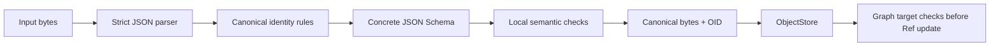

# Core v0.1 JSON Schemas

Status: **Stage 0 normative draft**

These Draft 2020-12 schemas define the accepted shape of SynapseGit Core v0.1
structured objects. They are embedded by `synapse-schema` for offline
validation.

## Entry points

| Object family | Required entry schema |
|---|---|
| Record | [`record.schema.json`](./record.schema.json) |
| ManifestTree | [`manifest-tree.schema.json`](./manifest-tree.schema.json) |
| Commit | [`commit.schema.json`](./commit.schema.json) |

A Record validator must enter through `record.schema.json` so `record_type` is
dispatched to one concrete schema. Validating only
[`record-envelope.schema.json`](./record-envelope.schema.json) is insufficient.

## Record types

| `record_type` | Schema |
|---|---|
| `actor` | [`actor.schema.json`](./actor.schema.json) |
| `subject` | [`subject.schema.json`](./subject.schema.json) |
| `activity` | [`activity.schema.json`](./activity.schema.json) |
| `observation` | [`observation.schema.json`](./observation.schema.json) |
| `claim` | [`claim.schema.json`](./claim.schema.json) |
| `claim_reaction` | [`claim-reaction.schema.json`](./claim-reaction.schema.json) |
| `capture_profile` | [`capture-profile.schema.json`](./capture-profile.schema.json) |
| `analysis_result` | [`analysis-result.schema.json`](./analysis-result.schema.json) |
| `context_pack` | [`context-pack.schema.json`](./context-pack.schema.json) |
| `delegation_grant` | [`delegation-grant.schema.json`](./delegation-grant.schema.json) |
| `decision_feedback` | [`decision-feedback.schema.json`](./decision-feedback.schema.json) |
| `policy` | [`policy.schema.json`](./policy.schema.json) |
| `assurance` | [`assurance.schema.json`](./assurance.schema.json) |
| `evidence_gap` | [`evidence-gap.schema.json`](./evidence-gap.schema.json) |
| `tombstone` | [`tombstone.schema.json`](./tombstone.schema.json) |

[`common.schema.json`](./common.schema.json) contains shared definitions and is
not a standalone object entry point.

## Validation stages



JSON Schema alone does not prove calendar validity, normalized ScaledInteger,
set ordering by canonical bytes, interval ordering, or cross-object target
types. The Rust validator applies local checks before storage; target resolution
belongs to repository closure validation.

## Synapse annotations

- `x-synapse-order: sequence` preserves array order as semantic order.
- `x-synapse-order: set` requires input items to already be in canonical-byte
  ascending order with no duplicates.
- `x-synapse-string: identifier-nfc` requires an identifier string to already
  be Unicode NFC.

Unannotated arrays are sequences. Free text is preserved exactly and is not
Unicode-normalized.

## Conformance

From the repository root:

```bash
node scripts/verify_core_fixtures.mjs
cargo test -p synapse-schema --locked
```

The archive manifest currently has no JSON Schema in this directory. Its exact
implementation profile is defined separately in
[`archive-profile.md`](../archive-profile.md); adding a schema and independent
archive test vector remains conformance work.

Return to the [Core Protocol index](../README.md).
